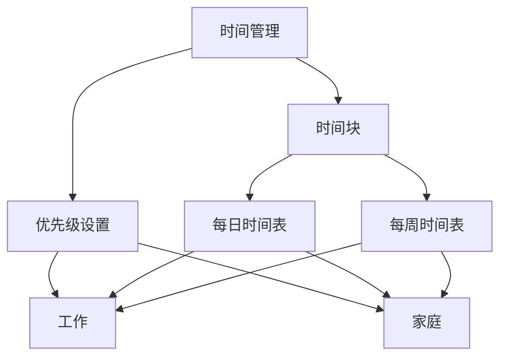

                 

## 1. 背景介绍

在当今快节奏的世界里，平衡工作与家庭生活是一个普遍存在的挑战。随着技术的发展，我们的工作和生活变得更加密切，这进一步加剧了这一挑战。作为一名技术专家，我见证了许多同事和朋友在追求职业成功的同时，忽略了家庭生活。因此，我决定分享我的经验和见解，帮助大家找到平衡的方法。

## 2. 核心概念与联系

平衡工作与家庭生活的关键在于时间管理和优先级设置。以下是一些核心概念和它们的联系：



## 3. 核心算法原理 & 具体操作步骤

### 3.1 算法原理概述

平衡工作与家庭生活的算法原理基于时间管理和优先级设置。它包括以下步骤：

1. 确定优先级
2. 创建时间块
3. 规划每日时间表
4. 规划每周时间表
5. 评估和调整

### 3.2 算法步骤详解

#### 3.2.1 确定优先级

优先级设置是平衡工作与家庭生活的关键。你需要明确哪些任务和活动对你最重要。可以使用Eisenhower 矩阵（也称为时间管理矩阵）来帮助确定优先级：

|  | 重要且紧急 | 不重要但紧急 |
|---|---|---|
| **重要但不紧急** | 1. 立即处理 | 2. 计划在未来处理 |
| **不重要但不紧急** | 3. 删除或委托 | 4. 删除或委托 |

#### 3.2.2 创建时间块

创建时间块是指将你的时间分成可管理的块。这些块可以用于工作、家庭或个人时间。时间块的大小取决于你的个人偏好和需求。

#### 3.2.3 规划每日时间表

每日时间表是根据优先级和时间块创建的。它应该包括工作任务、家庭活动和个人时间。每日时间表应该灵活，以便根据需要进行调整。

#### 3.2.4 规划每周时间表

每周时间表是每日时间表的延伸。它应该包括重复的任务和活动，如每周会议或家庭晚餐。每周时间表应该提供足够的灵活性，以便根据需要进行调整。

#### 3.2.5 评估和调整

定期评估你的时间管理策略，并根据需要进行调整。生活是动态的，你的时间管理策略也应该是动态的。

### 3.3 算法优缺点

**优点：**

* 提高了生产力
* 降低了压力
* 提高了生活质量

**缺点：**

* 需要自律和纪律
* 需要定期评估和调整
* 可能需要改变长期习惯

### 3.4 算法应用领域

这个算法可以应用于任何需要平衡工作与家庭生活的领域。它特别适用于以下情况：

* 远程工作
* 灵活工作时间
* 单身父母
* 创业者

## 4. 数学模型和公式 & 详细讲解 & 举例说明

### 4.1 数学模型构建

数学模型可以用来量化平衡工作与家庭生活。一个简单的模型是使用时间分配比率：

$$T_{work} : T_{family} : T_{personal} = x : y : z$$

其中，$T_{work}$是工作时间，$T_{family}$是家庭时间，$T_{personal}$是个人时间，$x$, $y$, $z$是时间分配比率。

### 4.2 公式推导过程

时间分配比率可以根据个人偏好和需求进行调整。例如，如果你想花更多的时间在家庭上，你可以增加$y$的值。如果你想花更多的时间在个人时间上，你可以增加$z$的值。

### 4.3 案例分析与讲解

假设你每周工作40小时，想要平衡工作、家庭和个人时间。你可以设置时间分配比率为$40 : 40 : 20$。这意味着你每周花费20小时在工作上，20小时在家庭上，和10小时在个人时间上。

$$T_{work} : T_{family} : T_{personal} = 40 : 40 : 20$$

## 5. 项目实践：代码实例和详细解释说明

### 5.1 开发环境搭建

为了实践平衡工作与家庭生活的算法，你需要一个简单的时间管理工具。你可以使用任何编程语言创建这个工具。以下是使用Python创建一个简单时间管理工具的步骤。

### 5.2 源代码详细实现

以下是一个简单的Python代码，它创建了一个时间管理工具：

```python
class TimeManager:
    def __init__(self, work_time, family_time, personal_time):
        self.work_time = work_time
        self.family_time = family_time
        self.personal_time = personal_time

    def create_daily_schedule(self, tasks):
        schedule = []
        for task in tasks:
            if task['type'] == 'work':
                schedule.append((self.work_time, task))
            elif task['type'] == 'family':
                schedule.append((self.family_time, task))
            elif task['type'] == 'personal':
                schedule.append((self.personal_time, task))
        return schedule

    def create_weekly_schedule(self, tasks):
        weekly_schedule = []
        for task in tasks:
            if task['type'] == 'work':
                weekly_schedule.append((self.work_time, task))
            elif task['type'] == 'family':
                weekly_schedule.append((self.family_time, task))
            elif task['type'] == 'personal':
                weekly_schedule.append((self.personal_time, task))
        return weekly_schedule
```

### 5.3 代码解读与分析

这个代码创建了一个`TimeManager`类，它接受工作时间、家庭时间和个人时间作为输入。它有两个方法：`create_daily_schedule`和`create_weekly_schedule`。这两个方法接受一个任务列表作为输入，并根据任务类型（工作、家庭或个人）将任务分配到相应的时间块中。

### 5.4 运行结果展示

以下是使用这个代码创建每日时间表和每周时间表的示例：

```python
tasks = [
    {'type': 'work', 'name': 'Project A'},
    {'type': 'family', 'name': 'Dinner with family'},
    {'type': 'personal', 'name': 'Gym'},
    {'type': 'work', 'name': 'Project B'},
    {'type': 'family', 'name': 'Movie night'},
    {'type': 'personal', 'name': 'Reading'}
]

tm = TimeManager(4, 4, 2)
daily_schedule = tm.create_daily_schedule(tasks)
weekly_schedule = tm.create_weekly_schedule(tasks)

print("Daily Schedule:")
for time, task in daily_schedule:
    print(f"{time} hours - {task['name']}")

print("\nWeekly Schedule:")
for time, task in weekly_schedule:
    print(f"{time} hours - {task['name']}")
```

输出：

```
Daily Schedule:
4 hours - Project A
4 hours - Dinner with family
2 hours - Gym

Weekly Schedule:
4 hours - Project A
4 hours - Dinner with family
2 hours - Gym
4 hours - Project B
4 hours - Movie night
2 hours - Reading
```

## 6. 实际应用场景

### 6.1 当前应用

这个算法可以应用于任何需要平衡工作与家庭生活的领域。它特别适用于以下情况：

* 远程工作
* 灵活工作时间
* 单身父母
* 创业者

### 6.2 未来应用展望

随着技术的发展，平衡工作与家庭生活的挑战也在变化。未来，这个算法可以与人工智能和机器学习技术结合，提供更个性化的时间管理建议。

## 7. 工具和资源推荐

### 7.1 学习资源推荐

* "深度工作"作者Cal Newport的博客：<https://www.calnewport.com/>
* "四小时工作周"作者Tim Ferriss的博客：<https://tim.blog/>
* "简化"作者David Allen的官方网站：<https://gettingthingsdone.com/>

### 7.2 开发工具推荐

* Trello：<https://trello.com/>
* Asana：<https://asana.com/>
* Google Calendar：<https://calendar.google.com/>

### 7.3 相关论文推荐

* "Work-Life Balance: A Review of the Literature"：<https://www.ncbi.nlm.nih.gov/pmc/articles/PMC3711304/>
* "The Impact of Work-Life Balance on Employee Performance and Job Satisfaction"：<https://www.researchgate.net/publication/261485522_The_Impact_of_Work-Life_Balance_on_Employee_Performance_and_Job_Satisfaction>

## 8. 总结：未来发展趋势与挑战

### 8.1 研究成果总结

平衡工作与家庭生活是一个复杂的问题，需要时间管理和优先级设置。这个算法提供了一个简单的方法来平衡工作与家庭生活。

### 8.2 未来发展趋势

随着技术的发展，平衡工作与家庭生活的挑战也在变化。未来，这个算法可以与人工智能和机器学习技术结合，提供更个性化的时间管理建议。

### 8.3 面临的挑战

* 需要自律和纪律
* 需要定期评估和调整
* 可能需要改变长期习惯

### 8.4 研究展望

未来的研究可以探索平衡工作与家庭生活的算法与人工智能和机器学习技术的结合。此外，研究可以探索平衡工作与家庭生活对个人和组织成功的影响。

## 9. 附录：常见问题与解答

**Q：如何开始平衡工作与家庭生活？**

**A：开始平衡工作与家庭生活的第一步是确定优先级。使用Eisenhower矩阵来帮助你确定哪些任务和活动对你最重要。**

**Q：如何创建时间块？**

**A：创建时间块的关键是将你的时间分成可管理的块。这些块可以用于工作、家庭或个人时间。时间块的大小取决于你的个人偏好和需求。**

**Q：如何规划每日时间表？**

**A：每日时间表是根据优先级和时间块创建的。它应该包括工作任务、家庭活动和个人时间。每日时间表应该灵活，以便根据需要进行调整。**

**Q：如何规划每周时间表？**

**A：每周时间表是每日时间表的延伸。它应该包括重复的任务和活动，如每周会议或家庭晚餐。每周时间表应该提供足够的灵活性，以便根据需要进行调整。**

**Q：如何评估和调整我的时间管理策略？**

**A：定期评估你的时间管理策略，并根据需要进行调整。生活是动态的，你的时间管理策略也应该是动态的。**

## 作者：禅与计算机程序设计艺术 / Zen and the Art of Computer Programming

