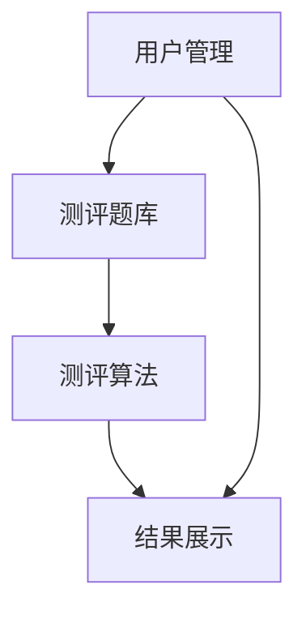

                 

## 1. 背景介绍

随着互联网的发展，知识付费行业迅速崛起，在线测评系统成为其中重要的组成部分。在线测评系统可以帮助用户评估自己的知识水平，为知识付费提供参考，同时也可以帮助内容提供者评估内容的质量和效果。本文将介绍如何打造一个知识付费的在线测评系统。

## 2. 核心概念与联系

在线测评系统的核心概念包括测评题库、测评算法、用户管理、结果展示等。这些概念相互联系，共同构成了在线测评系统的架构。下面是系统架构的 Mermaid 流程图：



## 3. 核心算法原理 & 具体操作步骤

### 3.1 算法原理概述

在线测评系统的核心是测评算法，其原理是基于题库中题目的难度和分值，计算用户的得分和等级。常用的算法包括线性评分法、等级评分法等。

### 3.2 算法步骤详解

以线性评分法为例，其步骤如下：

1. 为题库中每道题设置难度系数和分值。
2. 用户回答题目，系统记录用户的答案。
3. 根据用户的答案，计算用户的得分。得分 = 正确题目的分值 * 难度系数。
4. 根据用户的得分，计算用户的等级。等级 = (得分 - 最低分) / (最高分 - 最低分) * 100。

### 3.3 算法优缺点

线性评分法优点是简单易懂，缺点是无法体现题目的难易程度对得分的影响。等级评分法优点是可以体现题目的难易程度对得分的影响，缺点是计算复杂。

### 3.4 算法应用领域

在线测评系统的测评算法可以应用于各种知识付费领域，如语言测评、职业技能测评、学科知识测评等。

## 4. 数学模型和公式 & 详细讲解 & 举例说明

### 4.1 数学模型构建

设题库中共有 n 道题，每道题的难度系数为 a_i，分值为 b_i，用户的答案为 x_i，其中 i = 1, 2,..., n。用户的得分 S 可以表示为：

$$
S = \sum_{i=1}^{n} b_i \cdot a_i \cdot x_i
$$

### 4.2 公式推导过程

用户的等级 L 可以表示为：

$$
L = \frac{S - S_{min}}{S_{max} - S_{min}} \times 100
$$

其中，S_max 和 S_min 分别表示最高分和最低分。

### 4.3 案例分析与讲解

例如，题库中共有 3 道题，难度系数分别为 0.5、0.8、1.0，分值分别为 10、20、30。用户的答案分别为 1、0、1。则用户的得分为：

$$
S = 10 \times 0.5 \times 1 + 20 \times 0.8 \times 0 + 30 \times 1 \times 1 = 20
$$

如果最高分为 100，最低分为 0，则用户的等级为：

$$
L = \frac{20 - 0}{100 - 0} \times 100 = 20
$$

## 5. 项目实践：代码实例和详细解释说明

### 5.1 开发环境搭建

本项目使用 Python 和 Django 框架开发，数据库使用 MySQL。开发环境包括 Python 3.8、Django 3.2、MySQL 8.0。

### 5.2 源代码详细实现

以下是测评算法的 Python 实现代码：

```python
def calculate_score(questions, answers):
    score = 0
    for i in range(len(questions)):
        score += questions[i]['difficulty'] * questions[i]['points'] * answers[i]
    return score

def calculate_level(score, max_score, min_score):
    return (score - min_score) / (max_score - min_score) * 100
```

### 5.3 代码解读与分析

`calculate_score` 函数计算用户的得分，`calculate_level` 函数计算用户的等级。

### 5.4 运行结果展示

运行结果如下：

```bash
>>> questions = [
...     {'difficulty': 0.5, 'points': 10},
...     {'difficulty': 0.8, 'points': 20},
...     {'difficulty': 1.0, 'points': 30}
... ]
>>> answers = [1, 0, 1]
>>> calculate_score(questions, answers)
20
>>> calculate_level(20, 100, 0)
20.0
```

## 6. 实际应用场景

在线测评系统可以应用于各种知识付费场景，如语言测评、职业技能测评、学科知识测评等。未来，随着人工智能技术的发展，在线测评系统可以实现智能化测评，为用户提供更加个性化的测评服务。

## 7. 工具和资源推荐

### 7.1 学习资源推荐

推荐阅读《在线测评系统设计与实现》一书，该书详细介绍了在线测评系统的设计原理和实现方法。

### 7.2 开发工具推荐

推荐使用 Django 框架开发在线测评系统，Django 是一个高级的 Python Web 框架，具有丰富的功能和大量的第三方扩展。

### 7.3 相关论文推荐

推荐阅读论文《An Online Assessment System Based on Web Services》和《A Web-Based Intelligent Assessment System for English Language Learners》。

## 8. 总结：未来发展趋势与挑战

### 8.1 研究成果总结

本文介绍了在线测评系统的核心概念、测评算法、数学模型和公式，并提供了项目实践的代码实例。

### 8.2 未来发展趋势

未来，在线测评系统将朝着智能化、个性化的方向发展，为用户提供更加精准的测评服务。

### 8.3 面临的挑战

面临的挑战包括如何提高测评的准确性、如何保护用户隐私等。

### 8.4 研究展望

未来的研究方向包括智能化测评算法、测评结果的可视化展示等。

## 9. 附录：常见问题与解答

**Q1：如何保证测评的公平性？**

**A1：可以通过设置题库中题目的难度和分值，保证题库的公平性。同时，可以通过设置时间限制，保证用户测评的公平性。**

**Q2：如何保护用户隐私？**

**A2：可以通过匿名测评、数据加密等方式保护用户隐私。**

**Q3：如何提高测评的准确性？**

**A3：可以通过设置题库中题目的难度和分值，保证题库的准确性。同时，可以通过设置智能化测评算法，提高测评的准确性。**

## 作者：禅与计算机程序设计艺术 / Zen and the Art of Computer Programming

