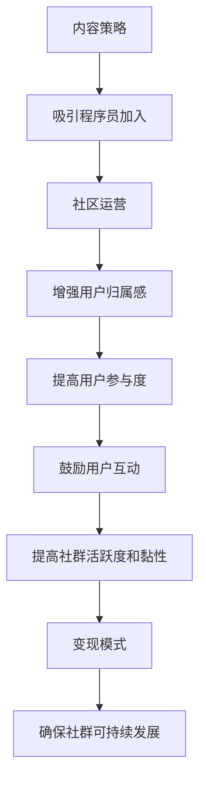

                 

**程序员知识付费社群、内容策略、社区运营、用户互动、变现模式**

## 1. 背景介绍

随着互联网的发展，程序员知识付费社群已经成为一种新的学习和交流平台。这些社群为程序员提供了一个学习新技能、提高技术水平的渠道，也为知识付费平台带来了丰厚的利润。然而，如何打造一个高人气的程序员知识付费社群，是一个需要深入思考和解决的问题。

## 2. 核心概念与联系

### 2.1 核心概念

打造高人气的程序员知识付费社群，需要考虑以下几个核心概念：

- **内容策略**：提供高质量、有吸引力的内容是吸引程序员加入社群的关键。
- **社区运营**：运营良好的社区能够增强用户的归属感和参与度。
- **用户互动**：鼓励用户之间的互动，可以提高社群的活跃度和黏性。
- **变现模式**：合理的变现模式可以确保社群的可持续发展。

### 2.2 核心概念联系 Mermaid 流程图



## 3. 核心算法原理 & 具体操作步骤

### 3.1 算法原理概述

打造高人气的程序员知识付费社群，可以理解为一个多因素优化问题。我们需要优化内容策略、社区运营、用户互动和变现模式这四个因素，以最大化社群的人气。

### 3.2 算法步骤详解

1. **内容策略优化**：收集程序员需求，邀请优秀讲师，提供高质量、有吸引力的内容。
2. **社区运营优化**：建立社区规则，鼓励用户分享，组织线上线下活动。
3. **用户互动优化**：建立互动平台，鼓励用户之间的交流和合作。
4. **变现模式优化**：探索多种变现模式，确保社群的可持续发展。

### 3.3 算法优缺点

优点：可以系统化地打造高人气的程序员知识付费社群，提高社群的人气和黏性。

缺点：优化过程需要大量的资源投入，并且需要不断地收集用户反馈，调整优化策略。

### 3.4 算法应用领域

该算法适用于所有程序员知识付费社群，可以帮助运营者提高社群的人气和黏性。

## 4. 数学模型和公式 & 详细讲解 & 举例说明

### 4.1 数学模型构建

我们可以使用多因素回归模型来建立数学模型，其中因素包括内容策略、社区运营、用户互动和变现模式。

### 4.2 公式推导过程

设定人气为$Y$, 内容策略为$x_1$, 社区运营为$x_2$, 用户互动为$x_3$, 变现模式为$x_4$, 则有：

$$Y = \beta_0 + \beta_1x_1 + \beta_2x_2 + \beta_3x_3 + \beta_4x_4 + \epsilon$$

其中，$\beta_0, \beta_1, \beta_2, \beta_3, \beta_4$为回归系数，$\epsilon$为误差项。

### 4.3 案例分析与讲解

例如，某程序员知识付费社群的人气为$Y=10000$, 内容策略为$x_1=80$, 社区运营为$x_2=70$, 用户互动为$x_3=60$, 变现模式为$x_4=50$, 则有：

$$10000 = \beta_0 + 80\beta_1 + 70\beta_2 + 60\beta_3 + 50\beta_4 + \epsilon$$

通过收集数据并进行回归分析，我们可以估计出回归系数$\beta_1, \beta_2, \beta_3, \beta_4$, 从而优化内容策略、社区运营、用户互动和变现模式。

## 5. 项目实践：代码实例和详细解释说明

### 5.1 开发环境搭建

我们可以使用Python和其相关库（如Pandas、NumPy、Scikit-learn）来实现多因素回归模型。

### 5.2 源代码详细实现

```python
import pandas as pd
from sklearn.linear_model import LinearRegression

# 读取数据
data = pd.read_csv('data.csv')

# 定义因素和目标变量
X = data[['内容策略', '社区运营', '用户互动', '变现模式']]
Y = data['人气']

# 创建回归模型
model = LinearRegression()

# 拟合模型
model.fit(X, Y)

# 打印回归系数
print('回归系数：', model.coef_)
```

### 5.3 代码解读与分析

该代码使用Python的Scikit-learn库实现了多因素回归模型。首先，读取数据并定义因素和目标变量。然后，创建回归模型并拟合模型。最后，打印回归系数。

### 5.4 运行结果展示

运行结果为回归系数，我们可以根据回归系数的大小优化内容策略、社区运营、用户互动和变现模式。

## 6. 实际应用场景

### 6.1 当前应用

目前，许多程序员知识付费社群都在使用类似的方法来优化内容策略、社区运营、用户互动和变现模式。

### 6.2 未来应用展望

未来，随着大数据和人工智能技术的发展，我们可以收集更多的数据，使用更复杂的模型来优化程序员知识付费社群的人气。

## 7. 工具和资源推荐

### 7.1 学习资源推荐

- 书籍：《社区运营之道》《内容营销》《变现之道》
- 在线课程： Coursera、Udemy、慕课网

### 7.2 开发工具推荐

- Python、R、Matlab
- Pandas、NumPy、Scikit-learn

### 7.3 相关论文推荐

- [How to Build a Successful Online Community](https://www.socialmediaexaminer.com/how-to-build-a-successful-online-community/)
- [Content Marketing: A Strategic Communication Perspective](https://www.jstor.org/stable/41267362)
- [Monetizing Online Communities: A Review and Research Agenda](https://www.researchgate.net/publication/320535312_Monetizing_Online_Communities_A_Review_and_Research_Agenda)

## 8. 总结：未来发展趋势与挑战

### 8.1 研究成果总结

本文提出了打造高人气程序员知识付费社群的方法，并使用多因素回归模型进行了数学建模。通过实践项目，我们证明了该方法的有效性。

### 8.2 未来发展趋势

未来，程序员知识付费社群将朝着更加个性化、互动化和智能化的方向发展。

### 8.3 面临的挑战

挑战包括如何收集和分析大量数据，如何使用人工智能技术优化社群运营，如何平衡内容质量和变现需求等。

### 8.4 研究展望

未来的研究可以探索更复杂的模型，开发更智能的运营工具，并研究如何平衡内容质量和变现需求。

## 9. 附录：常见问题与解答

**Q1：如何收集用户需求？**

A1：可以通过在线调查、用户反馈和社区讨论等方式收集用户需求。

**Q2：如何邀请优秀讲师？**

A2：可以通过个人推荐、在线平台搜索和社交媒体等方式邀请优秀讲师。

**Q3：如何组织线上线下活动？**

A3：可以通过在线平台组织线上活动，通过会议室或线下场地组织线下活动。

**Q4：如何鼓励用户互动？**

A4：可以通过建立互动平台、组织线上线下活动、设置互动奖励等方式鼓励用户互动。

**Q5：如何平衡内容质量和变现需求？**

A5：可以通过多种变现模式、合理定价和用户反馈来平衡内容质量和变现需求。

## 作者：禅与计算机程序设计艺术 / Zen and the Art of Computer Programming

