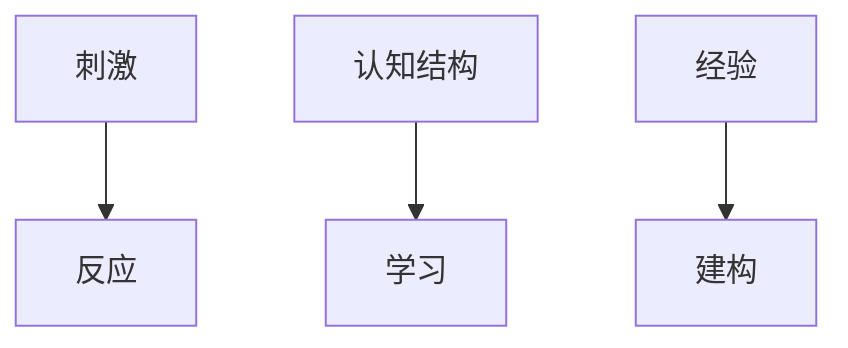

                 

## 1. 背景介绍

在当今快速变化的技术环境中，程序员需要不断学习新技能以保持竞争力。然而，学习新技能需要时间和精力，因此，有效地打造程序员知识课程至关重要。本文将提供一套框架，帮助您创建高收益的程序员知识课程。

## 2. 核心概念与联系

### 2.1 学习理论

构建高收益课程的关键是理解学习理论。本文将基于行为主义、认知主义和构造主义的学习理论。

### 2.2 成人学习理论

成人学习理论强调成年人具有丰富的经验和动机，需要自主学习。本文将应用马尔科姆·Knowles的成人学习理论，该理论包括六个原则：

1. 成年人是内在动机的。
2. 成年人有丰富的经验。
3. 成年人是主动的学习者。
4. 成年人需要立即应用新知识。
5. 成年人需要自主学习。
6. 成年人需要与他人合作学习。

## 3. 核心算法原理 & 具体操作步骤

### 3.1 算法原理概述

打造高收益课程的关键算法是“问题驱动学习”（PDL）。PDL是一种学习方法，它将学习者置于真实世界的问题情境中，鼓励他们运用新知识解决问题。

### 3.2 算法步骤详解

1. **问题选择**：选择一个真实世界的问题，该问题应该具有挑战性，但又可以在课程中解决。
2. **学习目标设定**：明确学习者需要学习什么知识来解决问题。
3. **学习资源提供**：提供学习者需要的资源，如文档、视频、教师指导等。
4. **问题解决**：学习者尝试解决问题，教师提供指导和反馈。
5. **反思与总结**：学习者反思解决问题的过程，总结学习到的知识。

### 3.3 算法优缺点

**优点**：

* 学习者动机高。
* 学习者能够立即应用新知识。
* 学习者能够理解知识在真实世界中的应用。

**缺点**：

* 需要大量教师指导。
* 可能需要更多时间。

### 3.4 算法应用领域

PDL适用于任何需要学习者理解知识在真实世界应用的领域，特别适用于技术领域。

## 4. 数学模型和公式 & 详细讲解 & 举例说明

### 4.1 数学模型构建

构建高收益课程的数学模型是“学习收益”模型。学习收益可以定义为：

$$学习收益 = \frac{学习者实际学习的知识}{学习者花费的时间}$$

### 4.2 公式推导过程

学习收益模型的推导过程如下：

1. 学习者实际学习的知识可以通过测试或项目评分获得。
2. 学习者花费的时间可以通过记录学习者花费在课程上的时间获得。
3. 学习收益可以通过上述两个值计算得出。

### 4.3 案例分析与讲解

假设一门课程的学习者实际学习的知识分数为80，学习者花费在课程上的时间为10小时。则学习收益为：

$$学习收益 = \frac{80}{10} = 8$$

## 5. 项目实践：代码实例和详细解释说明

### 5.1 开发环境搭建

要构建高收益的程序员知识课程，您需要一个支持在线学习和交互的开发环境。推荐使用Moodle，一个开源的学习管理系统。

### 5.2 源代码详细实现

以下是Moodle课程开发的步骤：

1. **课程设置**：设置课程名称、描述和格式。
2. **添加活动**：添加问题驱动学习活动，每个活动包含一个真实世界的问题和相关资源。
3. **设置评分**：设置每个活动的评分方式。
4. **添加用户**：添加学习者用户。
5. **设置权限**：设置学习者可以访问的活动和资源。

### 5.3 代码解读与分析

Moodle提供了丰富的功能，支持问题驱动学习。例如，您可以创建互动式问题，提供学习资源，设置评分方式，并提供反馈和指导。

### 5.4 运行结果展示

学习者可以登录Moodle课程，参与问题驱动学习活动，并获得评分和反馈。教师可以跟踪学习者的进度，提供指导和帮助。

## 6. 实际应用场景

### 6.1 当前应用

高收益的程序员知识课程可以应用于企业培训、在线学习平台和传统课堂。

### 6.2 未来应用展望

未来，虚拟现实和增强现实技术将使问题驱动学习更加真实和互动。此外，人工智能技术将使学习更加个性化和智能化。

## 7. 工具和资源推荐

### 7.1 学习资源推荐

* “问题驱动学习”网站（<https://www.pdlc.org/>）
* “成人学习理论”网站（<https://www.adultlearning.us/>）

### 7.2 开发工具推荐

* Moodle（<https://moodle.org/>）
* Articulate Storyline（<https://articulate.com/storyline/>）
* Adobe Captivate（<https://www.adobe.com/products/captivate.html>）

### 7.3 相关论文推荐

* “Problem-Based Learning: What and How Do Students Learn?”（<https://www.ncbi.nlm.nih.gov/pmc/articles/PMC1446597/>）
* “Andragogy in Action: Applying Malcolm Knowles' Principles of Adult Learning”（<https://www.researchgate.net/publication/237307537_Andragogy_in_Action_Applying_Malcolm_Knowles'Principles_of_Adult_Learning>）

## 8. 总结：未来发展趋势与挑战

### 8.1 研究成果总结

本文提供了构建高收益程序员知识课程的框架，包括学习理论、问题驱动学习算法、学习收益模型和Moodle课程开发实践。

### 8.2 未来发展趋势

未来，学习将更加个性化、互动化和智能化。虚拟现实和增强现实技术将使学习更加真实和互动。人工智能技术将使学习更加个性化和智能化。

### 8.3 面临的挑战

构建高收益课程的挑战包括教师指导需求高、时间需求高和学习者动机低。

### 8.4 研究展望

未来的研究将关注如何使用人工智能技术个性化学习、如何使用虚拟现实和增强现实技术互动化学习，以及如何提高学习者动机。

## 9. 附录：常见问题与解答

**Q1：问题驱动学习需要多长时间？**

**A1：问题驱动学习需要的时间取决于问题的复杂性。通常，每个问题需要1-2周的时间。**

**Q2：如何评估学习收益？**

**A2：学习收益可以通过测试或项目评分获得，并通过学习收益模型计算得出。**

**Q3：如何提高学习者动机？**

**A3：可以通过提供真实世界的问题、提供立即应用新知识的机会、提供自主学习的机会和提供与他人合作学习的机会来提高学习者动机。**

## 作者：禅与计算机程序设计艺术 / Zen and the Art of Computer Programming

