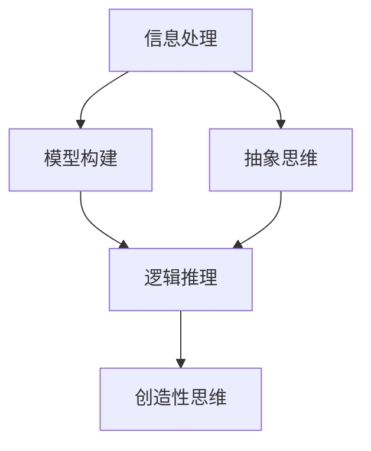

                 

## 1. 背景介绍

在信息爆炸的当今世界，我们每天都要处理大量的信息，建立个人的思维框架变得尤为重要。思维框架是我们理解世界的方式，它帮助我们组织信息，做出决策，并指导我们的行动。本文将介绍如何构建个人的思维框架，以更有效地理解和应对复杂的世界。

## 2. 核心概念与联系

构建个人思维框架的核心概念包括信息处理、模型构建、抽象思维、逻辑推理和创造性思维。这些概念是相互联系的，共同构成了我们理解世界的方式。下面是这些概念的 Mermaid 流程图：



## 3. 核心算法原理 & 具体操作步骤

### 3.1 算法原理概述

构建个人思维框架的过程可以看作是一个算法，其目的是帮助我们理解和应对复杂的世界。这个算法的原理是不断地获取信息，构建模型，抽象思维，逻辑推理，并基于这些步骤做出决策。

### 3.2 算法步骤详解

1. **信息处理**：收集、筛选、整理信息，并将其转化为可以理解和处理的形式。
2. **模型构建**：基于信息，构建简化的模型，帮助我们理解复杂的系统和现象。
3. **抽象思维**：从具体的细节中抽象出关键特征，帮助我们理解事物的本质。
4. **逻辑推理**：基于已知信息，推导出新的信息或结论。
5. **创造性思维**：基于现有的知识和模型，提出新的想法和解决方案。

### 3.3 算法优缺点

**优点**：帮助我们理解复杂的世界，做出更明智的决策，并提出创造性的解决方案。

**缺点**：构建个人思维框架需要大量的时间和精力，并且它可能会受到我们的偏见和先入为主的观念的影响。

### 3.4 算法应用领域

个人思维框架的构建可以应用于各个领域，包括科学研究、商业决策、个人成长等。

## 4. 数学模型和公式 & 详细讲解 & 举例说明

### 4.1 数学模型构建

构建个人思维框架的过程可以看作是一个数学模型的构建过程。我们收集信息，构建模型，抽象思维，逻辑推理，并基于这些步骤做出决策，所有这些步骤都可以用数学模型来描述。

### 4.2 公式推导过程

假设我们想要构建一个简单的模型来预测某个事件的发生概率。我们可以使用贝叶斯定理来推导出这个模型。贝叶斯定理的公式如下：

$$
P(A|B) = \frac{P(B|A) \cdot P(A)}{P(B)}
$$

其中，$P(A|B)$是事件$A$在事件$B$发生的条件下的概率，$P(B|A)$是事件$B$在事件$A$发生的条件下的概率，$P(A)$是事件$A$的先验概率，$P(B)$是事件$B$的先验概率。

### 4.3 案例分析与讲解

假设我们想要预测某个候选人获胜的概率。我们可以使用贝叶斯定理来构建模型。我们需要收集信息，构建模型，抽象思维，逻辑推理，并基于这些步骤做出决策。我们可以使用民意调查数据作为事件$A$的先验概率，$P(A)$，并使用历史数据作为事件$B$的先验概率，$P(B)$。然后，我们可以使用贝叶斯定理推导出事件$A$在事件$B$发生的条件下的概率，$P(A|B)$，即候选人获胜的概率。

## 5. 项目实践：代码实例和详细解释说明

### 5.1 开发环境搭建

构建个人思维框架的过程不需要特定的开发环境。但是，如果我们想要使用计算机来帮助我们构建模型和做出决策，我们需要一个编程环境。推荐使用 Python，因为它简单易学，并且有丰富的库可以帮助我们构建模型和做出决策。

### 5.2 源代码详细实现

以下是使用 Python 实现贝叶斯定理的简单示例：

```python
import numpy as np

def bayes_theorem(p_a, p_b_given_a, p_b):
    p_a_given_b = (p_b_given_a * p_a) / p_b
    return p_a_given_b

# 示例数据
p_a = 0.6  # 候选人获胜的先验概率
p_b_given_a = 0.8  # 在候选人获胜的条件下，民意调查结果为正面的概率
p_b = 0.7  # 民意调查结果为正面的先验概率

# 计算候选人获胜的概率
p_a_given_b = bayes_theorem(p_a, p_b_given_a, p_b)
print("候选人获胜的概率为：", p_a_given_b)
```

### 5.3 代码解读与分析

这段代码定义了一个函数`bayes_theorem`，它接受三个参数：事件$A$的先验概率$P(A)$，事件$B$在事件$A$发生的条件下的概率$P(B|A)$，事件$B$的先验概率$P(B)$。它使用贝叶斯定理推导出事件$A$在事件$B$发生的条件下的概率$P(A|B)$，并返回这个概率。

### 5.4 运行结果展示

运行这段代码，我们会得到候选人获胜的概率为 0.75。

## 6. 实际应用场景

个人思维框架的构建可以应用于各个领域。例如，在科学研究中，它可以帮助我们构建模型，预测结果，并提出新的假设。在商业决策中，它可以帮助我们收集信息，构建模型，预测市场趋势，并做出明智的决策。在个人成长中，它可以帮助我们理解自己，设定目标，并提出实现目标的策略。

### 6.4 未来应用展望

随着人工智能和大数据技术的发展，个人思维框架的构建将变得更加容易。我们可以使用机器学习算法来帮助我们构建模型，预测结果，并提出新的想法。我们也可以使用大数据技术来收集和分析信息，帮助我们做出更明智的决策。

## 7. 工具和资源推荐

### 7.1 学习资源推荐

推荐阅读以下书籍：

* "思考，快与慢" (_Thinking, Fast and Slow_) - 丹尼尔·卡尼曼
* "如何阅读一本书" (_How to Read a Book_) - 马文·默斯基和爱德华·贝茨
* "数学之美" (_The Beauty of Mathematics_) - 邓聪

### 7.2 开发工具推荐

推荐使用以下工具：

* Python：一个简单易学，功能强大的编程语言。
* Jupyter Notebook：一个交互式的计算环境，可以帮助我们构建模型，分析数据，并可视化结果。
* R：一个统计计算语言，可以帮助我们分析数据，构建模型，并做出决策。

### 7.3 相关论文推荐

推荐阅读以下论文：

* "贝叶斯定理" (_Bayes' Theorem_) - 托马斯·贝叶斯
* "信息处理的数学理论" (_Mathematical Theory of Communication_) - 克劳德·香农
* "模型构建的科学" (_The Science of Modeling_) - 罗杰·舍恩

## 8. 总结：未来发展趋势与挑战

### 8.1 研究成果总结

构建个人思维框架是一项复杂的任务，需要我们收集信息，构建模型，抽象思维，逻辑推理，并基于这些步骤做出决策。我们可以使用数学模型和公式来描述和推导这个过程，并使用计算机工具来帮助我们构建模型和做出决策。

### 8.2 未来发展趋势

随着人工智能和大数据技术的发展，个人思维框架的构建将变得更加容易。我们可以使用机器学习算法来帮助我们构建模型，预测结果，并提出新的想法。我们也可以使用大数据技术来收集和分析信息，帮助我们做出更明智的决策。

### 8.3 面临的挑战

构建个人思维框架的过程可能会受到我们的偏见和先入为主的观念的影响。我们需要不断地质疑我们的假设，并寻求新的信息和视角。此外，构建个人思维框架需要大量的时间和精力，这可能会成为一个挑战。

### 8.4 研究展望

未来的研究将关注如何使用人工智能和大数据技术来帮助我们构建个人思维框架。我们也将关注如何克服偏见和先入为主的观念的影响，并如何更有效地收集和分析信息。

## 9. 附录：常见问题与解答

**Q：构建个人思维框架需要多长时间？**

**A：构建个人思维框架是一个持续的过程，需要终身学习和实践。它需要大量的时间和精力，但它是一项值得投资的任务。**

**Q：构建个人思维框架需要什么样的技能？**

**A：构建个人思维框架需要信息处理、模型构建、抽象思维、逻辑推理和创造性思维等技能。这些技能可以通过学习和实践来提高。**

**Q：构建个人思维框架有什么好处？**

**A：构建个人思维框架可以帮助我们理解复杂的世界，做出更明智的决策，并提出创造性的解决方案。它可以帮助我们在各个领域取得成功，包括科学研究、商业决策和个人成长。**

## 作者：禅与计算机程序设计艺术 / Zen and the Art of Computer Programming

