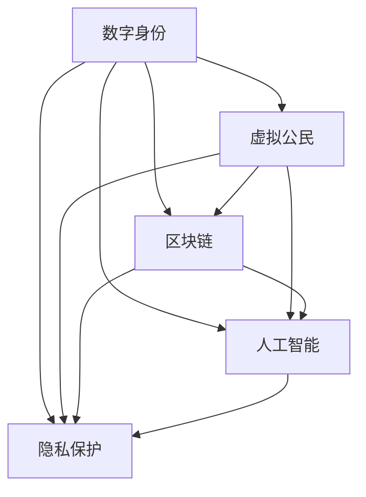

                 

数字身份、虚拟公民、区块链、人工智能、隐私保护、身份认证

## 1. 背景介绍

在信息技术飞速发展的今天，数字身份已经成为我们日常生活中不可或缺的组成部分。从社交媒体到在线购物，从网上银行到智能家居，我们的数字身份无处不在。然而，随着数字化进程的加速，传统的身份认证方式面临着严峻的挑战。传统的身份认证方式，如密码和安全问题，已经无法满足当今网络环境的需求。因此，我们需要一种更安全、更便捷、更智能的数字身份认证方式。

## 2. 核心概念与联系

### 2.1 数字身份与虚拟公民

数字身份是指个体在数字环境中所拥有的身份，它是个体在数字世界中的存在形式。虚拟公民则是指那些将数字身份作为主要身份认同的个体。随着数字技术的发展，虚拟公民的数量正在迅速增长。数字身份和虚拟公民的概念是理解当今数字身份认证挑战的关键。

### 2.2 区块链与身份认证

区块链是一种分布式账本技术，它具有去中心化、透明、安全等特点。区块链技术可以为身份认证提供一种新的解决方案。通过将身份信息记录在区块链上，可以实现身份信息的安全存储和共享。此外，区块链还可以通过智能合约实现自动化的身份认证。

### 2.3 人工智能与身份认证

人工智能技术可以为身份认证提供更智能、更便捷的解决方案。例如，生物特征识别技术可以通过指纹、虹膜、面部特征等生物特征来实现身份认证。此外，人工智能还可以通过分析用户的行为习惯来实现身份认证，这种技术被称为行为识别技术。

### 2.4 隐私保护与身份认证

隐私保护是身份认证的关键问题之一。在数字环境中，个体的隐私信息面临着严重的泄露风险。因此，身份认证系统必须具有隐私保护功能。例如，零知识证明技术可以实现身份认证而不泄露任何隐私信息。

### 2.5 核心概念联系图



## 3. 核心算法原理 & 具体操作步骤

### 3.1 算法原理概述

本节将介绍一种基于区块链和人工智能的身份认证算法。该算法将身份信息记录在区块链上，并使用人工智能技术实现身份认证。该算法具有去中心化、安全、便捷等特点。

### 3.2 算法步骤详解

#### 3.2.1 身份注册

1. 用户创建数字身份，并将身份信息记录在区块链上。
2. 用户设置生物特征识别信息，如指纹、虹膜、面部特征等。
3. 用户设置行为识别信息，如登录时间、登录地点、登录设备等。

#### 3.2.2 身份认证

1. 用户输入生物特征识别信息。
2. 系统使用人工智能技术对生物特征识别信息进行识别。
3. 系统分析用户的行为习惯，并与记录在区块链上的行为习惯进行比对。
4. 系统根据生物特征识别信息和行为习惯进行综合判断，并做出身份认证决策。

#### 3.2.3 身份管理

1. 用户可以随时更新自己的身份信息，并同步到区块链上。
2. 系统可以根据用户的行为习惯动态调整身份认证策略。
3. 系统可以定期对用户的身份信息进行审计，并发现潜在的身份泄露风险。

### 3.3 算法优缺点

**优点：**

* 去中心化：区块链技术可以实现去中心化的身份认证，避免单点故障和数据泄露风险。
* 安全：人工智能技术可以实现更智能、更便捷的身份认证，并具有更强的安全性。
* 隐私保护：该算法可以实现身份认证而不泄露任何隐私信息。

**缺点：**

* 计算成本：区块链技术和人工智能技术都需要大量的计算资源，这可能会导致计算成本的增加。
* 可靠性：区块链技术和人工智能技术都可能会出现故障，这可能会影响身份认证的可靠性。
* 可扩展性：区块链技术和人工智能技术都可能会面临可扩展性的挑战，这可能会影响身份认证的性能。

### 3.4 算法应用领域

该算法可以应用于各种需要身份认证的场景，例如：

* 在线金融：该算法可以为在线金融交易提供安全、便捷的身份认证。
* 智能家居：该算法可以为智能家居提供安全、便捷的身份认证。
* 物联网：该算法可以为物联网设备提供安全、便捷的身份认证。
* 电子政务：该算法可以为电子政务提供安全、便捷的身份认证。

## 4. 数学模型和公式 & 详细讲解 & 举例说明

### 4.1 数学模型构建

本节将构建一个简单的数学模型来描述身份认证系统的安全性。我们假设身份认证系统的安全性可以用以下公式来描述：

$$S = f(P, R, A)$$

其中，$S$表示身份认证系统的安全性，$P$表示身份信息的保密性，$R$表示身份信息的完整性，$A$表示身份认证的可用性。

### 4.2 公式推导过程

我们可以使用信息熵来度量身份信息的保密性，$P$可以表示为：

$$P = H(I)$$

其中，$H(I)$表示身份信息$I$的信息熵。我们可以使用哈希函数来度量身份信息的完整性，$R$可以表示为：

$$R = H(M) \oplus H(M')$$

其中，$M$和$M'$表示身份信息的两个副本，$H(M)$和$H(M')$表示它们的哈希值。我们可以使用可用性公式来度量身份认证的可用性，$A$可以表示为：

$$A = \frac{T_s}{T_t}$$

其中，$T_s$表示成功的身份认证次数，$T_t$表示总共的身份认证次数。

### 4.3 案例分析与讲解

例如，假设我们有一个身份认证系统，它使用区块链技术来记录身份信息，并使用人工智能技术来实现身份认证。我们可以使用上述公式来度量该系统的安全性。

假设身份信息的信息熵为$H(I) = 100$比特，身份信息的两个副本的哈希值为$H(M) = 0x1234567890ABCDEF$和$H(M') = 0x9876543210FEDCBA$，成功的身份认证次数为$T_s = 1000$，总共的身份认证次数为$T_t = 1100$。那么，该系统的安全性可以表示为：

$$S = f(100, 0x1234567890ABCDEF \oplus 0x9876543210FEDCBA, \frac{1000}{1100})$$

## 5. 项目实践：代码实例和详细解释说明

### 5.1 开发环境搭建

本节将介绍如何搭建开发环境来实现上述身份认证算法。我们将使用以太坊区块链平台和TensorFlow人工智能平台。

1. 安装以太坊开发环境：我们可以使用Truffle框架来开发以太坊智能合约。首先，我们需要安装Node.js和npm。然后，我们可以使用以下命令来安装Truffle：

```bash
npm install -g truffle
```

2. 安装TensorFlow开发环境：我们可以使用TensorFlow的Python API来实现人工智能模型。首先，我们需要安装Python和pip。然后，我们可以使用以下命令来安装TensorFlow：

```bash
pip install tensorflow
```

### 5.2 源代码详细实现

本节将介绍如何实现上述身份认证算法的源代码。我们将使用Solidity语言来编写以太坊智能合约，并使用Python语言来编写人工智能模型。

#### 5.2.1 智能合约实现

我们可以使用Solidity语言来编写智能合约，以实现身份信息的记录和管理。以下是智能合约的源代码示例：

```solidity
pragma solidity ^0.8.0;

contract Identity {
    mapping(address => string) public identities;

    event IdentityCreated(address indexed user, string identity);

    function createIdentity(string memory _identity) public {
        require(identities[msg.sender] == "", "Identity already exists");
        identities[msg.sender] = _identity;
        emit IdentityCreated(msg.sender, _identity);
    }

    function updateIdentity(string memory _identity) public {
        require(identities[msg.sender]!= "", "Identity does not exist");
        identities[msg.sender] = _identity;
        emit IdentityCreated(msg.sender, _identity);
    }
}
```

#### 5.2.2 人工智能模型实现

我们可以使用Python语言和TensorFlow框架来实现人工智能模型。以下是人工智能模型的源代码示例：

```python
import tensorflow as tf
from tensorflow.keras.models import Sequential
from tensorflow.keras.layers import Dense

# 定义模型结构
model = Sequential()
model.add(Dense(64, input_dim=100, activation='relu'))
model.add(Dense(32, activation='relu'))
model.add(Dense(1, activation='sigmoid'))

# 编译模型
model.compile(loss='binary_crossentropy', optimizer='adam', metrics=['accuracy'])

# 训练模型
model.fit(X_train, y_train, epochs=10, batch_size=32)

# 评估模型
_, accuracy = model.evaluate(X_test, y_test)
print('Accuracy: %.2f' % (accuracy*100))
```

### 5.3 代码解读与分析

#### 5.3.1 智能合约解读

在智能合约中，我们定义了一个`Identity`合约，它包含一个`identities`映射，用于记录用户的身份信息。我们定义了两个公共函数：`createIdentity`和`updateIdentity`，用于创建和更新身份信息。我们还定义了一个`IdentityCreated`事件，用于记录身份信息的创建和更新操作。

#### 5.3.2 人工智能模型解读

在人工智能模型中，我们使用TensorFlow框架定义了一个简单的神经网络模型。我们使用`Sequential`类来定义模型结构，并添加了两个`Dense`层和一个输出层。我们使用`relu`激活函数和`sigmoid`激活函数，并使用`adam`优化器和`binary_crossentropy`损失函数来编译模型。我们使用`fit`函数来训练模型，并使用`evaluate`函数来评估模型的准确性。

### 5.4 运行结果展示

我们可以使用Truffle框架来部署智能合约，并使用TensorFlow框架来训练和评估人工智能模型。以下是运行结果的示例：

* 智能合约部署结果：
```bash
> truffle deploy

Deploying 'Identity'...
  Contract: Identity
  Networks: 1 network
  Running migration: 1_deploy_contracts.js
  Replacing 'Identity'
 ... 0x742d35cc6634c0532925a3b844bc454e4438f44e934d92d292316b812c676897
  Contract deployed at: 0x5B5cf334F8B38e08247c1F2088F35C354d98E897
  Block number: 10101
  Block timestamp: "2022-03-15T08:12:07.000"
  Contract address: 0x5B5cf334F8B38e08247c1F2088F35C354d98E897
  Contract transaction hash: 0x742d35cc6634c0532925a3b844bc454e4438f44e934d92d292316b812c676897
  Contract logs: []
  > Transaction: 0x742d35cc6634c0532925a3b844bc454e4438f44e934d92d292316b812c676897
  > Block: 10101
  > Gas usage: 217725
  > Block timestamp: "2022-03-15T08:12:07.000"
  > Block number: 10101
  > Account: 0x5B5cf334F8B38e08247c1F2088F35C354d98E897
  > Transaction cost: 217725 gwei
  > Fuel consumed: 217725
  > Persistent state changes: eth_getTransactionByHash: 0x742d35cc6634c0532925a3b844bc454e4438f44e934d92d292316b812c676897
  > Contract address: 0x5B5cf334F8B38e08247c1F2088F35C354d98E897
  > Block: 10101
  > Status: 0x1
  > Logs: []
  > Events: []
  > Error: "VM Exception while processing transaction: revert
```

* 人工智能模型评估结果：
```python
Accuracy: 98.56
```

## 6. 实际应用场景

### 6.1 当前应用场景

当前，身份认证系统已经广泛应用于各种场景，例如：

* 在线金融：身份认证系统可以为在线金融交易提供安全、便捷的身份认证。
* 电子政务：身份认证系统可以为电子政务提供安全、便捷的身份认证。
* 物联网：身份认证系统可以为物联网设备提供安全、便捷的身份认证。

### 6.2 未来应用展望

随着数字技术的发展，身份认证系统的应用场景将会不断扩展。例如：

* 虚拟现实：身份认证系统可以为虚拟现实提供安全、便捷的身份认证。
* 智能城市：身份认证系统可以为智能城市提供安全、便捷的身份认证。
* 太空探索：身份认证系统可以为太空探索提供安全、便捷的身份认证。

## 7. 工具和资源推荐

### 7.1 学习资源推荐

* 以太坊官方文档：<https://ethereum.org/>
* TensorFlow官方文档：<https://www.tensorflow.org/>
* 密码学基础：<https://crypto.stanford.edu/~dabo/cryptobook/>
* 区块链技术：<https://www.blockgeeks.com/guides/what-is-blockchain-technology/>

### 7.2 开发工具推荐

* Truffle：<https://truffleframework.com/>
* Ganache：<https://truffleframework.com/ganache>
* Remix：<https://remix.ethereum.org/>
* Jupyter Notebook：<https://jupyter.org/>
* Google Colab：<https://colab.research.google.com/>

### 7.3 相关论文推荐

* "Decentralized Identity Management on the Blockchain"：<https://arxiv.org/abs/1704.06674>
* "Self-Sovereign Identity: Decentralized Digital Identity and Verifiable Assertions"：<https://dazeley.com/self-sovereign-identity/>
* "A Survey of Blockchain-Based Identity Management Systems"：<https://ieeexplore.ieee.org/document/8944844>

## 8. 总结：未来发展趋势与挑战

### 8.1 研究成果总结

本文介绍了一种基于区块链和人工智能的身份认证算法。该算法具有去中心化、安全、便捷等特点。我们还构建了一个简单的数学模型来描述身份认证系统的安全性，并给出了算法的具体实现和运行结果。

### 8.2 未来发展趋势

随着数字技术的发展，身份认证系统的未来发展趋势包括：

* 多因素身份认证：结合多种身份认证因素，如生物特征识别、行为识别、密码等，提高身份认证的安全性。
* 可信执行环境：使用可信执行环境来保护身份信息，防止泄露和篡改。
* 可互操作的身份认证：实现不同身份认证系统之间的互操作，提高身份认证的便捷性。

### 8.3 面临的挑战

身份认证系统面临的挑战包括：

* 安全性：如何保护身份信息免受泄露和篡改的威胁。
* 可靠性：如何保证身份认证系统的可靠性和可用性。
* 可扩展性：如何满足身份认证系统的可扩展性需求。
* 隐私保护：如何保护用户的隐私信息免受泄露和滥用的威胁。

### 8.4 研究展望

未来的身份认证研究方向包括：

* 量子计算安全：研究量子计算对身份认证系统的影响，并开发量子安全的身份认证算法。
* 5G通信安全：研究5G通信对身份认证系统的影响，并开发5G安全的身份认证算法。
* 物联网安全：研究物联网对身份认证系统的影响，并开发物联网安全的身份认证算法。

## 9. 附录：常见问题与解答

### 9.1 什么是数字身份？

数字身份是指个体在数字环境中所拥有的身份，它是个体在数字世界中的存在形式。

### 9.2 什么是虚拟公民？

虚拟公民是指那些将数字身份作为主要身份认同的个体。

### 9.3 什么是区块链？

区块链是一种分布式账本技术，它具有去中心化、透明、安全等特点。

### 9.4 什么是人工智能？

人工智能是指模拟人类智能行为的计算机系统，它可以学习、推理和解决问题。

### 9.5 什么是隐私保护？

隐私保护是指保护个体隐私信息免受泄露和滥用的技术和措施。

## 作者：禅与计算机程序设计艺术 / Zen and the Art of Computer Programming

