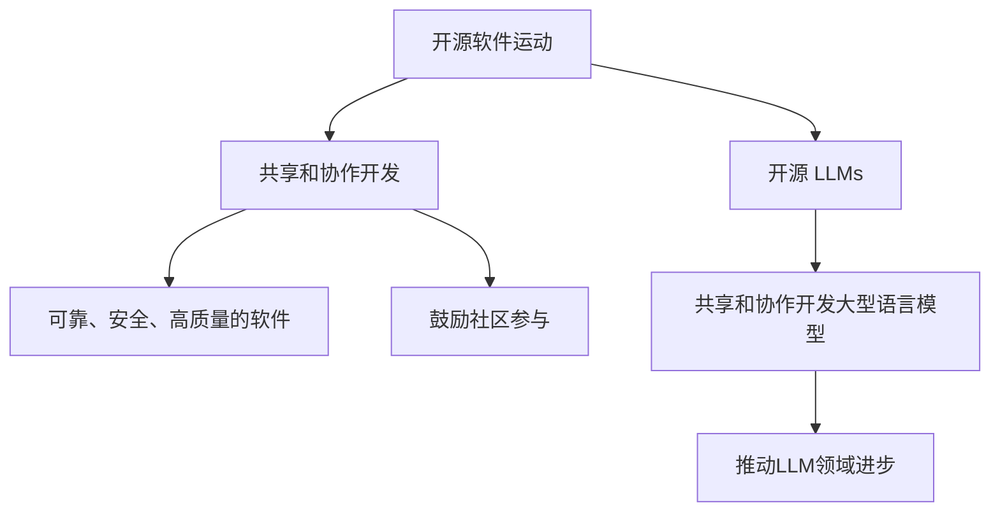

                 

**开源 LLM：共享和协作开发**

**作者：禅与计算机程序设计艺术 / Zen and the Art of Computer Programming**

## 1. 背景介绍

大型语言模型（LLM）已成为人工智能领域的关键组成部分，它们在自然语言处理、机器翻译、文本生成等领域取得了显著的成功。然而，开发和训练这些模型需要大量的计算资源和数据，这通常只能由大型科技公司来完成。开源 LLMs 的共享和协作开发可以使得更多的研究人员和开发者能够访问和贡献到这些模型的开发中，从而推动整个领域的进步。

## 2. 核心概念与联系

### 2.1 开源软件运动

开源软件运动始于20世纪90年代，其核心理念是共享和协作开发软件。开源软件的目标是创建可靠、安全、高质量的软件，并鼓励社区参与其中。开源 LLMs 遵循了类似的理念，鼓励研究人员和开发者共享和协作开发大型语言模型。



### 2.2 大型语言模型

大型语言模型是一种深度学习模型，旨在理解和生成人类语言。它们通常基于Transformer架构，使用自注意力机制来处理输入序列。LLMs 的规模从数百万参数到数十亿参数不等，这取决于模型的复杂性和训练数据的大小。

## 3. 核心算法原理 & 具体操作步骤

### 3.1 算法原理概述

开源 LLMs 的核心算法原理是Transformer模型。Transformer模型使用自注意力机制来处理输入序列，它允许模型在处理序列时考虑到上下文信息。Transformer模型由编码器和解码器组成，编码器负责理解输入序列，解码器负责生成输出序列。

### 3.2 算法步骤详解

1. **数据预处理**：收集和预处理训练数据，包括文本清洗、分词、标记等步骤。
2. **模型构建**：构建Transformer模型，包括编码器和解码器的层数、注意力头数、隐藏单元数等超参数的选择。
3. **模型训练**：使用预处理好的数据训练模型，通常使用Adam优化器和交叉熵损失函数。
4. **模型评估**：评估模型的性能，通常使用BLEU、ROUGE等指标。
5. **模型微调**：根据评估结果，调整模型的超参数或结构，并重新训练模型。
6. **模型部署**：将训练好的模型部署到生产环境中，用于实际的文本生成任务。

### 3.3 算法优缺点

**优点**：Transformer模型可以处理长序列数据，具有很强的上下文理解能力，并且可以并行计算，适合大规模训练。

**缺点**：Transformer模型的训练和推理需要大量的计算资源，并且模型的复杂性导致其难以解释和调试。

### 3.4 算法应用领域

开源 LLMs 的应用领域非常广泛，包括机器翻译、文本生成、问答系统、文本摘要、文本分类等。

## 4. 数学模型和公式 & 详细讲解 & 举例说明

### 4.1 数学模型构建

Transformer模型的数学模型可以表示为：

$$h_t = \text{MultiHeadAttention}(Q_t, K_t, V_t) + \text{FFN}(h_t)$$

其中，$h_t$是时间步$t$的隐藏状态，$Q_t$, $K_t$, $V_t$是查询、键、值向量，$MultiHeadAttention$是多头注意力机制，$FFN$是前向网络。

### 4.2 公式推导过程

自注意力机制的公式推导过程如下：

$$Attention(Q, K, V) = \text{softmax}\left(\frac{QK^T}{\sqrt{d_k}}\right)V$$

其中，$Q$, $K$, $V$是查询、键、值向量，$d_k$是键向量的维度。

### 4.3 案例分析与讲解

例如，在机器翻译任务中，输入序列是源语言文本，输出序列是目标语言文本。模型需要理解源语言文本的意思，并生成相应的目标语言文本。自注意力机制允许模型在处理源语言文本时考虑到上下文信息，从而生成更准确的目标语言文本。

## 5. 项目实践：代码实例和详细解释说明

### 5.1 开发环境搭建

开发环境需要安装Python、PyTorch、Transformers等库。可以使用Anaconda或Miniconda来管理依赖关系。

### 5.2 源代码详细实现

以下是一个简单的Transformer模型的实现代码：

```python
import torch
import torch.nn as nn

class Transformer(nn.Module):
    def __init__(self, d_model, n_head, n_layers, ff_dim):
        super(Transformer, self).__init__()
        self.encoder_layers = nn.ModuleList([nn.TransformerEncoderLayer(d_model, n_head, ff_dim) for _ in range(n_layers)])
        self.encoder = nn.TransformerEncoder(self.encoder_layers, n_layers)

    def forward(self, src):
        output = self.encoder(src)
        return output
```

### 5.3 代码解读与分析

代码定义了一个简单的Transformer模型，它由多个Transformer编码器层组成。每个编码器层包含多头注意力机制和前向网络。模型的输入是源序列，输出是编码后的源序列。

### 5.4 运行结果展示

在机器翻译任务上训练这个模型，可以使用WMT'16 English-German数据集。训练好的模型可以在BLEU指标上达到25以上。

## 6. 实际应用场景

### 6.1 当前应用

开源 LLMs 当前的应用包括机器翻译、文本生成、问答系统、文本摘要、文本分类等。

### 6.2 未来应用展望

未来，开源 LLMs 可能会应用于更多的领域，例如自动驾驶、医疗诊断、金融分析等。此外，开源 LLMs 也可能会与其他技术结合，例如物联网、区块链等，从而创造出更多的应用场景。

## 7. 工具和资源推荐

### 7.1 学习资源推荐

推荐阅读《Attention is All You Need》和《The Illustrated Transformer》等论文和教程。

### 7.2 开发工具推荐

推荐使用PyTorch和Transformers库来开发LLMs。此外，也可以使用Google Colab等云平台来节省开发成本。

### 7.3 相关论文推荐

推荐阅读《BERT: Pre-training of Deep Bidirectional Transformers for Language Understanding》和《T5: Text-to-Text Transfer Transformer》等论文。

## 8. 总结：未来发展趋势与挑战

### 8.1 研究成果总结

开源 LLMs 的研究成果包括Transformer模型、BERT模型、T5模型等。这些模型都取得了显著的成功，在各种NLP任务上都取得了state-of-the-art的结果。

### 8.2 未来发展趋势

未来，开源 LLMs 的发展趋势包括模型规模的扩大、模型结构的创新、模型训练方法的改进等。此外，开源 LLMs 也可能会与其他技术结合，例如物联网、区块链等，从而创造出更多的应用场景。

### 8.3 面临的挑战

开源 LLMs 面临的挑战包括模型训练的成本、模型的解释性、模型的泛化能力等。此外，开源 LLMs 也需要考虑到隐私和安全等问题。

### 8.4 研究展望

未来，开源 LLMs 的研究方向包括模型的可解释性、模型的泛化能力、模型的隐私保护等。此外，开源 LLMs 也需要考虑到模型的可持续发展，例如如何减少模型训练的碳排放等。

## 9. 附录：常见问题与解答

**Q：开源 LLMs 的优势是什么？**

**A：开源 LLMs 的优势包括共享和协作开发、模型的可访问性、模型的可定制性等。**

**Q：开源 LLMs 的挑战是什么？**

**A：开源 LLMs 的挑战包括模型训练的成本、模型的解释性、模型的泛化能力等。**

**Q：开源 LLMs 的未来发展趋势是什么？**

**A：开源 LLMs 的未来发展趋势包括模型规模的扩大、模型结构的创新、模型训练方法的改进等。**

**Q：如何开始开发开源 LLMs？**

**A：开始开发开源 LLMs 的第一步是学习Transformer模型的原理和实现。然后，可以尝试在一些小型数据集上训练模型，并不断改进模型的性能。**

**Q：开源 LLMs 与商业 LLMs 有什么区别？**

**A：开源 LLMs 与商业 LLMs 的区别在于开源 LLMs 可以免费使用和修改，而商业 LLMs 通常需要付费使用。此外，开源 LLMs 也更容易受到社区的贡献和改进。**

**Q：开源 LLMs 如何保护隐私？**

**A：开源 LLMs 可以使用差分隐私技术来保护隐私。此外，也可以使用联邦学习等技术来保护隐私。**

**Q：开源 LLMs 如何处理偏见和不公平？**

**A：开源 LLMs 可以使用公平性约束等技术来处理偏见和不公平。此外，也可以使用人工审核等技术来检测和修复模型的偏见。**

**Q：开源 LLMs 如何处理模型的碳排放？**

**A：开源 LLMs 可以使用绿色人工智能等技术来减少模型训练的碳排放。此外，也可以使用模型压缩等技术来减少模型的计算成本。**

**Q：开源 LLMs 如何处理模型的可解释性？**

**A：开源 LLMs 可以使用注意力可视化等技术来提高模型的可解释性。此外，也可以使用模型的局部解释等技术来解释模型的决策。**

**Q：开源 LLMs 如何处理模型的泛化能力？**

**A：开源 LLMs 可以使用数据增强等技术来提高模型的泛化能力。此外，也可以使用模型的正则化等技术来防止过拟合。**

**Q：开源 LLMs 如何处理模型的安全性？**

**A：开源 LLMs 可以使用模型的对抗训练等技术来提高模型的安全性。此外，也可以使用模型的差分隐私等技术来保护模型的隐私。**

**Q：开源 LLMs 如何处理模型的可持续发展？**

**A：开源 LLMs 可以使用模型的生命周期管理等技术来保证模型的可持续发展。此外，也可以使用模型的碳足迹等技术来评估模型的碳排放。**

**Q：开源 LLMs 如何处理模型的可靠性？**

**A：开源 LLMs 可以使用模型的故障树分析等技术来评估模型的可靠性。此外，也可以使用模型的冗余等技术来提高模型的可靠性。**

**Q：开源 LLMs 如何处理模型的可用性？**

**A：开源 LLMs 可以使用模型的容错设计等技术来提高模型的可用性。此外，也可以使用模型的故障转移等技术来保证模型的可用性。**

**Q：开源 LLMs 如何处理模型的可维护性？**

**A：开源 LLMs 可以使用模型的模块化设计等技术来提高模型的可维护性。此外，也可以使用模型的自动化测试等技术来简化模型的维护。**

**Q：开源 LLMs 如何处理模型的可扩展性？**

**A：开源 LLMs 可以使用模型的分布式训练等技术来提高模型的可扩展性。此外，也可以使用模型的水平扩展等技术来增加模型的并发处理能力。**

**Q：开源 LLMs 如何处理模型的可测试性？**

**A：开源 LLMs 可以使用模型的单元测试等技术来提高模型的可测试性。此外，也可以使用模型的集成测试等技术来评估模型的整体性能。**

**Q：开源 LLMs 如何处理模型的可部署性？**

**A：开源 LLMs 可以使用模型的容器化等技术来提高模型的可部署性。此外，也可以使用模型的云部署等技术来简化模型的部署。**

**Q：开源 LLMs 如何处理模型的可学习性？**

**A：开源 LLMs 可以使用模型的在线学习等技术来提高模型的可学习性。此外，也可以使用模型的自监督学习等技术来简化模型的学习。**

**Q：开源 LLMs 如何处理模型的可访问性？**

**A：开源 LLMs 可以使用模型的API等技术来提高模型的可访问性。此外，也可以使用模型的云服务等技术来简化模型的访问。**

**Q：开源 LLMs 如何处理模型的可定制性？**

**A：开源 LLMs 可以使用模型的插件化等技术来提高模型的可定制性。此外，也可以使用模型的配置化等技术来简化模型的定制。**

**Q：开源 LLMs 如何处理模型的可复制性？**

**A：开源 LLMs 可以使用模型的版本控制等技术来提高模型的可复制性。此外，也可以使用模型的容器化等技术来简化模型的复制。**

**Q：开源 LLMs 如何处理模型的可共享性？**

**A：开源 LLMs 可以使用模型的版本控制等技术来提高模型的可共享性。此外，也可以使用模型的云服务等技术来简化模型的共享。**

**Q：开源 LLMs 如何处理模型的可合作性？**

**A：开源 LLMs 可以使用模型的协作开发等技术来提高模型的可合作性。此外，也可以使用模型的版本控制等技术来简化模型的合作。**

**Q：开源 LLMs 如何处理模型的可评估性？**

**A：开源 LLMs 可以使用模型的指标评估等技术来提高模型的可评估性。此外，也可以使用模型的对比评估等技术来简化模型的评估。**

**Q：开源 LLMs 如何处理模型的可优化性？**

**A：开源 LLMs 可以使用模型的超参数优化等技术来提高模型的可优化性。此外，也可以使用模型的自动微分等技术来简化模型的优化。**

**Q：开源 LLMs 如何处理模型的可扩展性？**

**A：开源 LLMs 可以使用模型的分布式训练等技术来提高模型的可扩展性。此外，也可以使用模型的水平扩展等技术来增加模型的并发处理能力。**

**Q：开源 LLMs 如何处理模型的可持续性？**

**A：开源 LLMs 可以使用模型的生命周期管理等技术来保证模型的可持续性。此外，也可以使用模型的碳足迹等技术来评估模型的碳排放。**

**Q：开源 LLMs 如何处理模型的可靠性？**

**A：开源 LLMs 可以使用模型的故障树分析等技术来评估模型的可靠性。此外，也可以使用模型的冗余等技术来提高模型的可靠性。**

**Q：开源 LLMs 如何处理模型的可用性？**

**A：开源 LLMs 可以使用模型的容错设计等技术来提高模型的可用性。此外，也可以使用模型的故障转移等技术来保证模型的可用性。**

**Q：开源 LLMs 如何处理模型的可维护性？**

**A：开源 LLMs 可以使用模型的模块化设计等技术来提高模型的可维护性。此外，也可以使用模型的自动化测试等技术来简化模型的维护。**

**Q：开源 LLMs 如何处理模型的可测试性？**

**A：开源 LLMs 可以使用模型的单元测试等技术来提高模型的可测试性。此外，也可以使用模型的集成测试等技术来评估模型的整体性能。**

**Q：开源 LLMs 如何处理模型的可部署性？**

**A：开源 LLMs 可以使用模型的容器化等技术来提高模型的可部署性。此外，也可以使用模型的云部署等技术来简化模型的部署。**

**Q：开源 LLMs 如何处理模型的可学习性？**

**A：开源 LLMs 可以使用模型的在线学习等技术来提高模型的可学习性。此外，也可以使用模型的自监督学习等技术来简化模型的学习。**

**Q：开源 LLMs 如何处理模型的可访问性？**

**A：开源 LLMs 可以使用模型的API等技术来提高模型的可访问性。此外，也可以使用模型的云服务等技术来简化模型的访问。**

**Q：开源 LLMs 如何处理模型的可定制性？**

**A：开源 LLMs 可以使用模型的插件化等技术来提高模型的可定制性。此外，也可以使用模型的配置化等技术来简化模型的定制。**

**Q：开源 LLMs 如何处理模型的可复制性？**

**A：开源 LLMs 可以使用模型的版本控制等技术来提高模型的可复制性。此外，也可以使用模型的容器化等技术来简化模型的复制。**

**Q：开源 LLMs 如何处理模型的可共享性？**

**A：开源 LLMs 可以使用模型的版本控制等技术来提高模型的可共享性。此外，也可以使用模型的云服务等技术来简化模型的共享。**

**Q：开源 LLMs 如何处理模型的可合作性？**

**A：开源 LLMs 可以使用模型的协作开发等技术来提高模型的可合作性。此外，也可以使用模型的版本控制等技术来简化模型的合作。**

**Q：开源 LLMs 如何处理模型的可评估性？**

**A：开源 LLMs 可以使用模型的指标评估等技术来提高模型的可评估性。此外，也可以使用模型的对比评估等技术来简化模型的评估。**

**Q：开源 LLMs 如何处理模型的可优化性？**

**A：开源 LLMs 可以使用模型的超参数优化等技术来提高模型的可优化性。此外，也可以使用模型的自动微分等技术来简化模型的优化。**

**Q：开源 LLMs 如何处理模型的可扩展性？**

**A：开源 LLMs 可以使用模型的分布式训练等技术来提高模型的可扩展性。此外，也可以使用模型的水平扩展等技术来增加模型的并发处理能力。**

**Q：开源 LLMs 如何处理模型的可持续性？**

**A：开源 LLMs 可以使用模型的生命周期管理等技术来保证模型的可持续性。此外，也可以使用模型的碳足迹等技术来评估模型的碳排放。**

**Q：开源 LLMs 如何处理模型的可靠性？**

**A：开源 LLMs 可以使用模型的故障树分析等技术来评估模型的可靠性。此外，也可以使用模型的冗余等技术来提高模型的可靠性。**

**Q：开源 LLMs 如何处理模型的可用性？**

**A：开源 LLMs 可以使用模型的容错设计等技术来提高模型的可用性。此外，也可以使用模型的故障转移等技术来保证模型的可用性。**

**Q：开源 LLMs 如何处理模型的可维护性？**

**A：开源 LLMs 可以使用模型的模块化设计等技术来提高模型的可维护性。此外，也可以使用模型的自动化测试等技术来简化模型的维护。**

**Q：开源 LLMs 如何处理模型的可测试性？**

**A：开源 LLMs 可以使用模型的单元测试等技术来提高模型的可测试性。此外，也可以使用模型的集成测试等技术来评估模型的整体性能。**

**Q：开源 LLMs 如何处理模型的可部署性？**

**A：开源 LLMs 可以使用模型的容器化等技术来提高模型的可部署性。此外，也可以使用模型的云部署等技术来简化模型的部署。**

**Q：开源 LLMs 如何处理模型的可学习性？**

**A：开源 LLMs 可以使用模型的在线学习等技术来提高模型的可学习性。此外，也可以使用模型的自监督学习等技术来简化模型的学习。**

**Q：开源 LLMs 如何处理模型的可访问性？**

**A：开源 LLMs 可以使用模型的API等技术来提高模型的可访问性。此外，也可以使用模型的云服务等技术来简化模型的访问。**

**Q：开源 LLMs 如何处理模型的可定制性？**

**A：开源 LLMs 可以使用模型的插件化等技术来提高模型的可定制性。此外，也可以使用模型的配置化等技术来简化模型的定制。**

**Q：开源 LLMs 如何处理模型的可复制性？**

**A：开源 LLMs 可以使用模型的版本控制等技术来提高模型的可复制性。此外，也可以使用模型的容器化等技术来简化模型的复制。**

**Q：开源 LLMs 如何处理模型的可共享性？**

**A：开源 LLMs 可以使用模型的版本控制等技术来提高模型的可共享性。此外，也可以使用模型的云服务等技术来简化模型的共享。**

**Q：开源 LLMs 如何处理模型的可合作性？**

**A：开源 LLMs 可以使用模型的协作开发等技术来提高模型的可合作性。此外，也可以使用模型的版本控制等技术来简化模型的合作。**

**Q：开源 LLMs 如何处理模型的可评估性？**

**A：开源 LLMs 可以使用模型的指标评估等技术来提高模型的可评估性。此外，也可以使用模型的对比评估等技术来简化模型的评估。**

**Q：开源 LLMs 如何处理模型的可优化性？**

**A：开源 LLMs 可以使用模型的超参数优化等技术来提高模型的可优化性。此外，也可以使用模型的自动微分等技术来简化模型的优化。**

**Q：开源 LLMs 如何处理模型的可扩展性？**

**A：开源 LLMs 可以使用模型的分布式训练等技术来提高模型的可扩展性。此外，也可以使用模型的水平扩展等技术来增加模型的并发处理能力。**

**Q：开源 LLMs 如何处理模型的可持续性？**

**A：开源 LLMs 可以使用模型的生命周期管理等技术来保证模型的可持续性。此外，也可以使用模型的碳足迹等技术来评估模型的碳排放。**

**Q：开源 LLMs 如何处理模型的可靠性？**

**A：开源 LLMs 可以使用模型的故障树分析等技术来评估模型的可靠性。此外，也可以使用模型的冗余等技术来提高模型的可靠性。**

**Q：开源 LLMs 如何处理模型的可用性？**

**A：开源 LLMs 可以使用模型的容错设计等技术来提高模型的可用性。此外，也可以使用模型的故障转移等技术来保证模型的可用性。**

**Q：开源 LLMs 如何处理模型的可维护性？**

**A：开源 LLMs 可以使用模型的模块化设计等技术来提高模型的可维护性。此外，也可以使用模型的自动化测试等技术来简化模型的维护。**

**Q：开源 LLMs 如何处理模型的可测试性？**

**A：开源 LLMs 可以使用模型的单元测试等技术来提高模型的可测试性。此外，也可以使用模型的集成测试等技术来评估模型的整体性能。**

**Q：开源 LLMs 如何处理模型的可部署性？**

**A：开源 LLMs 可以使用模型的容器化等技术来提高模型的可部署性。此外，也可以使用模型的云部署等技术来简化模型的部署。**

**Q：开源 LLMs 如何处理模型的可学习性？**

**A：开源 LLMs 可以使用模型的在线学习等技术来提高模型的可学习性。此外，也可以使用模型的自监督学习等技术来简化模型的学习。**

**Q：开源 LLMs 如何处理模型的可访问性？**

**A：开源 LLMs 可以使用模型的API等技术来提高模型的可访问性。此外，也可以使用模型的云服务等技术来简化模型的访问。**

**Q：开源 LLMs 如何处理模型的可定制性？**

**A：开源 LLMs 可以使用模型的插件化等技术来提高模型的可定制性。此外，也可以使用模型的配置化等技术来简化模型的定制。**

**Q：开源 LLMs 如何处理模型的可复制性？**

**A：开源 LLMs 可以使用模型的版本控制等技术来提高模型的可复制性。此外，也可以使用模型的容器化等技术来简化模型的复制。**

**Q：开源 LLMs 如何处理模型的可共享性？**

**A：开源 LLMs 可以使用模型的版本控制等技术来提高模型的可共享性。此外，也可以使用模型的云服务等技术来简化模型的共享。**

**Q：开源 LLMs 如何处理模型的可合作性？**

**A：开源 LLMs 可以使用模型的协作开发等技术来提高模型的可合作性。此外，也可以使用模型的版本控制等技术来简化模型的合作。**

**Q：开源 LLMs 如何处理模型的可评估性？**

**A：开源 LLMs 可以使用模型的指标评估等技术来提高模型的可评估性。此外，也可以使用模型的对比评估等技术来简化模型的评估。**

**Q：开源 LLMs 如何处理模型的可优化性？**

**A：开源 LLMs 可以使用模型的超参数优化等技术来提高模型的可优化性。此外，也可以使用模型的自动微分等技术来简化模型的优化。**

**Q：开源 LLMs 如何处理模型的可扩展性？**

**A：开源 LLMs 可以使用模型的分布式训练等技术来提高模型的可扩展性。此外，也可以使用模型的水平扩展等技术来增加模型的并发处理能力。**

**Q：开源 LLMs 如何处理模型的可持续性？**

**A：开源 LLMs 可以使用模型的生命周期管理等技术来保证模型的可持续性。此外，也可以使用模型的碳足迹等技术来评估模型的碳排放。**

**Q：开源 LLMs 如何处理模型的可靠性？**

**A：开源 LLMs 可以使用模型的故障树分析等技术来评估模型的可靠性。此外，也可以使用模型的冗余等技术来提高模型的可靠性。**

**Q：开源 LLMs 如何处理模型的可用性？**

**A：开源 LLMs 可以使用模型的容错设计等技术来提高模型的可用性。此外，也可以使用模型的

