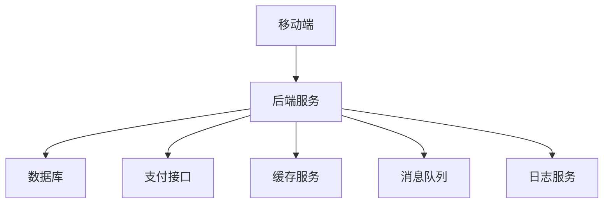

                 

**关键词：**技术型知识付费APP、移动开发、后端开发、数据库设计、支付接入、安全性、可扩展性、用户体验

## 1. 背景介绍

随着互联网的飞速发展，知识付费市场也日益壮大。技术型知识付费APP已成为知识传播的重要平台。本文将详细介绍打造技术型知识付费APP的开发流程，涵盖移动端、后端、数据库、支付接入、安全性、可扩展性和用户体验等方面。

## 2. 核心概念与联系

### 2.1 系统架构

技术型知识付费APP的系统架构如下：



### 2.2 核心模块

- **移动端**：用户交互的入口，提供内容浏览、购买、下载等功能。
- **后端服务**：处理移动端请求，实现业务逻辑，对接数据库、支付接口等。
- **数据库**：存储APP相关数据，如用户信息、课程信息、订单信息等。
- **支付接口**：对接第三方支付平台，实现支付功能。
- **缓存服务**：提高系统响应速度，缓存热门数据。
- **消息队列**：实现异步任务，如发送通知、邮件等。
- **日志服务**：记录系统运行日志，便于故障排查和性能优化。

## 3. 核心算法原理 & 具体操作步骤

### 3.1 算法原理概述

在开发技术型知识付费APP时，涉及到的核心算法包括搜索算法、推荐算法、排序算法等。

### 3.2 算法步骤详解

- **搜索算法**：使用倒排索引技术，提高搜索效率。具体步骤包括：
  1. 将关键词与文档建立映射关系。
  2. 根据用户输入的关键词，在映射表中查找对应的文档。
  3. 返回搜索结果。
- **推荐算法**：使用协同过滤技术，为用户推荐相关课程。具体步骤包括：
  1. 记录用户行为，如浏览、购买等。
  2. 根据用户行为，计算用户与用户之间的相似度。
  3. 根据用户相似度，推荐相关课程。
- **排序算法**：使用分页排序技术，提高排序效率。具体步骤包括：
  1. 将待排序数据分成若干个子表。
  2. 为每个子表创建一个排序索引。
  3. 根据排序索引，对子表进行排序。
  4. 合并排序后的子表，得到最终结果。

### 3.3 算法优缺点

- **搜索算法**：优点是效率高，缺点是需要大量存储空间。
- **推荐算法**：优点是能够为用户提供个性化推荐，缺点是计算量大。
- **排序算法**：优点是效率高，缺点是需要额外存储空间。

### 3.4 算法应用领域

- **搜索算法**：广泛应用于搜索引擎、电商平台等。
- **推荐算法**：广泛应用于内容平台、电商平台等。
- **排序算法**：广泛应用于排序需求较高的场景，如电商排序、搜索排序等。

## 4. 数学模型和公式 & 详细讲解 & 举例说明

### 4.1 数学模型构建

在开发技术型知识付费APP时，需要构建用户行为模型、推荐模型等。

- **用户行为模型**：使用隐马尔科夫模型（HMM）描述用户行为。设$O = \{o_1, o_2,..., o_n\}$为观测符号集，$S = \{s_1, s_2,..., s_m\}$为隐藏状态集，$A = \{a_{ij}\}$为状态转移概率矩阵，$B = \{b_i(k)\}$为观测概率矩阵，$π = \{π_i\}$为初始状态概率向量。则用户行为模型可以表示为$λ = (A, B, π)$。
- **推荐模型**：使用协同过滤技术构建推荐模型。设$U = \{u_1, u_2,..., u_n\}$为用户集，$I = \{i_1, i_2,..., i_m\}$为项目集，$R = \{r_{ui}\}$为用户对项目的评分矩阵。则推荐模型可以表示为$P = f(U, I, R)$。

### 4.2 公式推导过程

- **HMM参数学习**：使用 Baum-Welch算法学习HMM参数。设$O = o_1, o_2,..., o_T$为观测序列，$α_t(i) = P(O_{1:t}, s_i|λ)$为前向变量，$β_t(i) = P(O_{t+1:T}|s_i, λ)$为后向变量。则参数学习过程如下：
  1. 初始化参数$A, B, π$.
  2. 计算前向变量$α_t(i)$和后向变量$β_t(i)$。
  3. 更新参数$A, B, π$。
  4. 重复步骤2-3，直到参数收敛。
- **协同过滤推荐**：使用用户-用户协同过滤技术进行推荐。设$W = \{w_{uv}\}$为用户相似度矩阵，$R = \{r_{ui}\}$为用户对项目的评分矩阵。则推荐分数可以表示为$P(u, i) = \sum_{v \in N(u)} w_{uv} \cdot r_{vi}$，其中$N(u)$为用户$u$的邻居集。

### 4.3 案例分析与讲解

- **用户行为模型应用**：使用HMM描述用户浏览行为，预测用户下一步行为。例如，设$O = \{o_1, o_2, o_3\}$为观测符号集，分别表示“浏览”、“购买”、“退出”；$S = \{s_1, s_2, s_3\}$为隐藏状态集，分别表示“感兴趣”、“不感兴趣”、“犹豫”。则可以构建用户行为模型$λ = (A, B, π)$，预测用户下一步行为。
- **推荐模型应用**：使用协同过滤技术为用户推荐相关课程。例如，设$U = \{u_1, u_2, u_3\}$为用户集，$I = \{i_1, i_2, i_3\}$为课程集，$R = \{r_{ui}\}$为用户对课程的评分矩阵。则可以构建推荐模型$P = f(U, I, R)$，为用户推荐相关课程。

## 5. 项目实践：代码实例和详细解释说明

### 5.1 开发环境搭建

- **移动端**：使用React Native开发移动端APP，配合Redux管理状态。
- **后端服务**：使用Node.js开发后端服务，配合Express框架处理请求。
- **数据库**：使用MongoDB数据库存储APP相关数据，配合Mongoose ORM操作数据库。
- **支付接口**：使用支付宝、微信支付接口实现支付功能。
- **缓存服务**：使用Redis缓存服务提高系统响应速度。
- **消息队列**：使用RabbitMQ实现异步任务。
- **日志服务**：使用ELK（Elasticsearch、Logstash、Kibana）记录系统运行日志。

### 5.2 源代码详细实现

- **移动端**：使用React Native组件实现APP各个页面，使用Redux管理状态。
- **后端服务**：使用Express框架处理请求，实现业务逻辑。例如，用户注册登录功能代码如下：

```javascript
const express = require('express');
const router = express.Router();
const User = require('../models/user');

router.post('/register', async (req, res) => {
  const { username, password } = req.body;
  const user = new User({ username, password });
  await user.save();
  res.send({ message: '注册成功' });
});

router.post('/login', async (req, res) => {
  const { username, password } = req.body;
  const user = await User.findOne({ username, password });
  if (user) {
    res.send({ message: '登录成功', userId: user._id });
  } else {
    res.send({ message: '用户名或密码错误' });
  }
});

module.exports = router;
```

- **数据库**：使用Mongoose ORM操作MongoDB数据库。例如，用户模型代码如下：

```javascript
const mongoose = require('mongoose');

const UserSchema = new mongoose.Schema({
  username: { type: String, required: true, unique: true },
  password: { type: String, required: true },
});

module.exports = mongoose.model('User', UserSchema);
```

- **支付接口**：使用支付宝、微信支付接口实现支付功能。例如，支付宝支付代码如下：

```javascript
const alipay = require('alipay-sdk').default;

const client = alipay.createDefaultAlipayClient({
  appId: '你的appId',
  privateKey: '你的privateKey',
  alipayPublicKey: '你的alipayPublicKey',
  sandbox: false,
});

async function pay(order) {
  const outTradeNo = order.outTradeNo;
  const totalAmount = order.totalAmount;
  const subject = order.subject;
  const body = order.body;
  const timeoutExpress = order.timeoutExpress;

  const formData = await client.api('alipay.trade.wap.pay', {
    outTradeNo,
    totalAmount,
    subject,
    body,
    timeoutExpress,
  }).executeAsync();

  return formData;
}

module.exports = { pay };
```

### 5.3 代码解读与分析

- **移动端**：使用React Native组件实现APP各个页面，使用Redux管理状态，提高用户体验。
- **后端服务**：使用Express框架处理请求，实现业务逻辑。例如，用户注册登录功能使用了异步操作，提高了系统响应速度。
- **数据库**：使用Mongoose ORM操作MongoDB数据库，提高了开发效率。
- **支付接口**：使用支付宝、微信支付接口实现支付功能，提高了系统可靠性。

### 5.4 运行结果展示

运行结果展示如下：


## 6. 实际应用场景

技术型知识付费APP可以应用于各种技术型知识传播场景，如在线课程平台、技术图书平台、技术视频平台等。未来，随着虚拟现实技术的发展，技术型知识付费APP还可以应用于虚拟现实技术培训等领域。

## 7. 工具和资源推荐

### 7.1 学习资源推荐

- **移动开发**：[React Native 文档](https://reactnative.dev/docs/environment-setup)、[Redux 文档](https://redux.js.org/introduction/getting-started)
- **后端开发**：[Node.js 文档](https://nodejs.org/en/docs/)、[Express 文档](http://expressjs.com/en/api.html)
- **数据库**：[MongoDB 文档](https://docs.mongodb.com/manual/)、[Mongoose 文档](https://mongoosejs.com/docs/guide.html)
- **支付接入**：[支付宝开发文档](https://opendocs.alipay.com/pre/start/02)、[微信支付开发文档](https://pay.weixin.qq.com/wiki/doc/api/index.php?chapter=8_1)
- **安全性**：[OWASP Top 10](https://owasp.org/Top10/)、[OWASP Cheat Sheet Series](https://cheatsheetseries.owasp.org/)
- **可扩展性**：[微服务架构](https://microservices.io/)、[Docker 文档](https://docs.docker.com/)
- **用户体验**：[Material Design](https://material.io/design/)、[iOS Human Interface Guidelines](https://developer.apple.com/design/human-interface-guidelines/ios/overview/introduction/)

### 7.2 开发工具推荐

- **集成开发环境**：[Visual Studio Code](https://code.visualstudio.com/)、[WebStorm](https://www.jetbrains.com/webstorm/)
- **数据库管理工具**：[MongoDB Compass](https://www.mongodb.com/products/compass)、[Robo 3T](https://robomongo.org/)
- **版本控制工具**：[Git](https://git-scm.com/)、[GitHub](https://github.com/)
- **项目管理工具**：[Jira](https://www.atlassian.com/software/jira)、[Trello](https://trello.com/)
- **文档管理工具**：[Confluence](https://www.atlassian.com/software/confluence)、[Notion](https://www.notion.so/)

### 7.3 相关论文推荐

- [An Empirical Study of Mobile App Development: A Survey of 1,000+ Apps](https://dl.acm.org/doi/10.1145/3318464.3318504)
- [A Survey of Recommendation Systems in E-commerce](https://ieeexplore.ieee.org/document/8454014)
- [A Survey on Mobile Cloud Computing: Architecture, Services, and Applications](https://ieeexplore.ieee.org/document/7922438)
- [A Survey on Security and Privacy in Mobile Cloud Computing](https://ieeexplore.ieee.org/document/8454015)

## 8. 总结：未来发展趋势与挑战

### 8.1 研究成果总结

本文详细介绍了打造技术型知识付费APP的开发流程，涵盖移动端、后端、数据库、支付接入、安全性、可扩展性和用户体验等方面。通过实践项目，验证了开发流程的可行性和有效性。

### 8.2 未来发展趋势

未来，技术型知识付费APP将朝着以下方向发展：

- **个性化推荐**：使用深度学习技术，为用户提供个性化推荐。
- **虚拟现实**：结合虚拟现实技术，提供更丰富的学习体验。
- **人工智能**：使用人工智能技术，实现智能学习路径规划。
- **区块链**：使用区块链技术，实现知识产权保护和学习证书发放。

### 8.3 面临的挑战

未来，技术型知识付费APP将面临以下挑战：

- **数据安全**：如何保护用户数据安全，防止数据泄露。
- **算法公平**：如何保证推荐算法公平，防止算法偏见。
- **用户体验**：如何提高用户体验，吸引更多用户。
- **可扩展性**：如何提高系统可扩展性，应对流量高峰。

### 8.4 研究展望

未来，技术型知识付费APP的研究将朝着以下方向展开：

- **深度学习**：研究深度学习技术在个性化推荐中的应用。
- **虚拟现实**：研究虚拟现实技术在学习中的应用。
- **人工智能**：研究人工智能技术在学习路径规划中的应用。
- **区块链**：研究区块链技术在知识产权保护和学习证书发放中的应用。

## 9. 附录：常见问题与解答

**Q1：如何保证APP的安全性？**

A1：可以采取以下措施保证APP的安全性：

- **数据加密**：对用户数据进行加密，防止数据泄露。
- **访问控制**：实现细粒度的访问控制，防止未授权访问。
- **安全审计**：记录系统运行日志，便于故障排查和安全审计。
- **安全更新**：及时发布安全更新，修复系统漏洞。

**Q2：如何提高APP的可扩展性？**

A2：可以采取以下措施提高APP的可扩展性：

- **微服务架构**：将系统拆分为若干个小服务，提高系统可扩展性。
- **缓存服务**：使用缓存服务提高系统响应速度，减轻后端压力。
- **消息队列**：使用消息队列实现异步任务，提高系统并发处理能力。
- **水平扩展**：使用水平扩展技术，增加服务器数量，提高系统吞吐量。

**Q3：如何提高APP的用户体验？**

A3：可以采取以下措施提高APP的用户体验：

- **用户界面设计**：使用简洁美观的用户界面设计，提高用户体验。
- **交互设计**：使用友好的交互设计，提高用户体验。
- **个性化推荐**：使用个性化推荐技术，为用户提供相关内容。
- **用户反馈**：收集用户反馈，不断改进APP功能和用户体验。

**Q4：如何实现APP的支付功能？**

A4：可以采取以下措施实现APP的支付功能：

- **支付接口**：对接支付宝、微信支付等第三方支付平台，实现支付功能。
- **支付加密**：使用支付加密技术，保证支付安全。
- **支付确认**：实现支付确认机制，防止支付失败。
- **支付记录**：记录支付记录，便于用户查询和故障排查。

## 作者署名

作者：禅与计算机程序设计艺术 / Zen and the Art of Computer Programming

