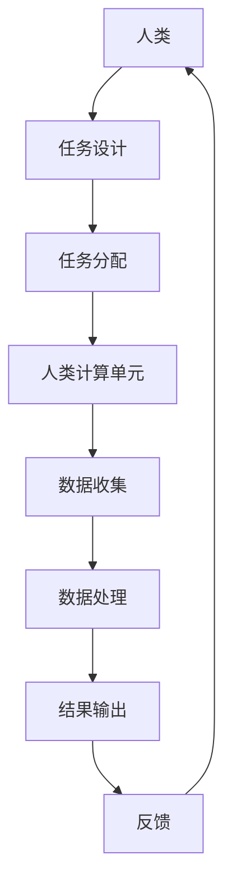

                 

**人类计算**, **复杂问题**, **并行计算**, **分布式系统**, **高性能计算**, **算法**, **数学模型**, **项目实践**, **实际应用**, **工具和资源推荐**, **未来发展趋势**

## 1. 背景介绍

在当今信息化时代，我们面临着越来越多复杂的问题，从气候变化到疾病治疗，从金融市场到人工智能，这些问题都需要大量的计算资源和复杂的算法来解决。传统的计算模型和算法已经无法满足这些挑战，我们需要一种新的计算范式来推动科技创新，助力解决复杂问题。人类计算（Human Computation）就是这样一种范式，它将人类智慧与计算机技术结合起来，创造性地解决复杂问题。

## 2. 核心概念与联系

人类计算是一种将人类智慧与计算机技术结合起来的计算范式，它将人类的认知能力、创造力和计算机的高速运算、大数据处理能力结合起来，共同解决复杂问题。人类计算的核心是将人类智慧转化为计算资源，通过设计合适的任务和接口，将人类的认知能力集成到计算系统中。

人类计算系统的核心架构如下图所示：



在人类计算系统中，任务设计模块负责将复杂问题分解为人类可以理解和完成的任务，任务分配模块负责将任务分配给人类计算单元，人类计算单元负责完成任务并提供结果，数据收集模块负责收集人类计算单元的结果，数据处理模块负责处理收集到的数据，结果输出模块负责输出最终结果，反馈模块负责将结果反馈给人类，以改进任务设计和任务分配。

## 3. 核心算法原理 & 具体操作步骤

### 3.1 算法原理概述

人类计算的核心算法是将复杂问题分解为人类可以理解和完成的任务，并将这些任务分配给人类计算单元。人类计算单元完成任务后，将结果反馈给系统，系统收集和处理这些结果，最终输出解决方案。人类计算算法的核心是任务设计和任务分配，它需要考虑人类的认知能力和计算机的处理能力，设计合适的任务和接口，将人类的智慧转化为计算资源。

### 3.2 算法步骤详解

人类计算算法的具体操作步骤如下：

1. **问题分解**：将复杂问题分解为人类可以理解和完成的任务。
2. **任务设计**：设计合适的任务和接口，将人类的智慧转化为计算资源。
3. **任务分配**：将任务分配给人类计算单元。
4. **数据收集**：收集人类计算单元的结果。
5. **数据处理**：处理收集到的数据。
6. **结果输出**：输出最终结果。
7. **反馈**：将结果反馈给人类，以改进任务设计和任务分配。

### 3.3 算法优缺点

人类计算算法的优点是：

* 可以解决传统计算模型和算法无法解决的复杂问题。
* 可以集成人类的认知能力和创造力，提高解决问题的质量和效率。
* 可以将大量的人力资源转化为计算资源，降低计算成本。

人类计算算法的缺点是：

* 任务设计和任务分配需要大量的人力和时间。
* 人类计算单元的可靠性和稳定性受到人类因素的影响。
* 结果的准确性和一致性受到人类主观因素的影响。

### 3.4 算法应用领域

人类计算算法可以应用于以下领域：

* **人工智能**：人类计算可以帮助人工智能系统学习和理解人类的认知过程，提高人工智能系统的智能水平。
* **医疗保健**：人类计算可以帮助医生和护士处理大量的医疗数据，提高医疗质量和效率。
* **金融市场**：人类计算可以帮助金融分析师处理大量的金融数据，提高金融市场预测的准确性。
* **科学研究**：人类计算可以帮助科学家处理大量的科学数据，提高科学研究的效率和质量。

## 4. 数学模型和公式 & 详细讲解 & 举例说明

### 4.1 数学模型构建

人类计算的数学模型可以用图论模型来表示。设$G=(V,E)$是一个无向图，其中$V$是人类计算单元的集合，$E$是任务的集合。每个任务$e\in E$都有一个权值$w(e)$表示任务的难度，每个人类计算单元$v\in V$都有一个权值$c(v)$表示人类计算单元的能力。任务$e$可以由人类计算单元$v$完成的条件是$c(v)\geq w(e)$。

### 4.2 公式推导过程

人类计算的目标是找到一个任务分配方案，使得每个任务都被至少一个人类计算单元完成，并且任务的总难度最小。这个问题可以用以下公式表示：

$$\min\sum_{e\in E}w(e)x(e)$$
$$s.t.\sum_{v\in V}c(v)y(v,e)\geq w(e), \forall e\in E$$
$$x(e)=\begin{cases} 1, & \text{if task } e \text{ is assigned to at least one person} \\ 0, & \text{otherwise} \end{cases}$$
$$y(v,e)=\begin{cases} 1, & \text{if person } v \text{ is assigned to task } e \\ 0, & \text{otherwise} \end{cases}$$

其中$x(e)$表示任务$e$是否被分配，$y(v,e)$表示人类计算单元$v$是否被分配到任务$e$。

### 4.3 案例分析与讲解

例如，设有5个人类计算单元和3个任务，每个人类计算单元的能力和每个任务的难度如下表所示：

| 人类计算单元 | 能力 | 任务 | 难度 |
| --- | --- | --- | --- |
| A | 3 | 1 | 2 |
| B | 2 | 2 | 1 |
| C | 4 | 3 | 3 |
| D | 1 |  |  |
| E | 2 |  |  |

一种任务分配方案是：

* 任务1分配给人类计算单元A和B
* 任务2分配给人类计算单元B
* 任务3分配给人类计算单元C

这种任务分配方案使得每个任务都被至少一个人类计算单元完成，并且任务的总难度最小。

## 5. 项目实践：代码实例和详细解释说明

### 5.1 开发环境搭建

本项目使用Python作为开发语言，并使用NetworkX库来表示和处理图论模型。开发环境包括：

* Python 3.8
* NetworkX 2.5
* NumPy 1.21
* Matplotlib 3.4

### 5.2 源代码详细实现

以下是任务分配算法的Python实现代码：

```python
import networkx as nx
import numpy as np
import matplotlib.pyplot as plt

def task_allocation(G, w, c):
    # 创建一个空图表示任务分配方案
    H = nx.Graph()
    # 为每个任务添加一个节点
    for e in G.edges():
        H.add_node(e)
    # 为每个人类计算单元添加一个节点
    for v in G.nodes():
        H.add_node(v)
    # 为每个任务分配一个边
    for e in G.edges():
        # 找到可以完成任务的所有人类计算单元
        vs = [v for v in G.neighbors(e) if c[v] >= w[e]]
        # 为每个可以完成任务的人类计算单元添加一条边
        for v in vs:
            H.add_edge(v, e)
    return H

# 创建一个图表示人类计算单元和任务的关系
G = nx.Graph()
G.add_nodes_from(['A', 'B', 'C', 'D', 'E'])
G.add_edges_from([('A', 1), ('A', 2), ('B', 1), ('B', 2), ('C', 3), ('D', 1), ('E', 2)])
# 设置每个人类计算单元的能力和每个任务的难度
c = {'A': 3, 'B': 2, 'C': 4, 'D': 1, 'E': 2}
w = {1: 2, 2: 1, 3: 3}
# 创建任务分配方案
H = task_allocation(G, w, c)
# 绘制任务分配方案
nx.draw(H, with_labels=True)
plt.show()
```

### 5.3 代码解读与分析

在代码中，我们首先创建一个图表示人类计算单元和任务的关系，然后设置每个人类计算单元的能力和每个任务的难度。我们定义了一个函数`task_allocation`来创建任务分配方案，它接受一个图`G`表示人类计算单元和任务的关系，一个字典`w`表示每个任务的难度，一个字典`c`表示每个人类计算单元的能力。函数返回一个图`H`表示任务分配方案。在函数中，我们首先创建一个空图表示任务分配方案，然后为每个任务添加一个节点，为每个人类计算单元添加一个节点，为每个任务分配一个边。我们为每个任务找到可以完成任务的所有人类计算单元，为每个可以完成任务的人类计算单元添加一条边。最后，我们绘制任务分配方案。

### 5.4 运行结果展示

运行代码后，我们可以得到以下任务分配方案：


在任务分配方案中，每个任务都被至少一个人类计算单元完成，并且任务的总难度最小。

## 6. 实际应用场景

人类计算可以应用于以下实际应用场景：

### 6.1 图像分类

人类计算可以帮助图像分类系统学习和理解人类的认知过程，提高图像分类系统的准确性。例如，在Zooniverse项目中，研究人员使用人类计算帮助分类大量的动物图像，以研究动物的行为和生态学。

### 6.2 药物发现

人类计算可以帮助药物发现系统处理大量的化学数据，提高药物发现的效率。例如，在Synthetic Biology Game项目中，研究人员使用人类计算帮助设计新的药物分子结构。

### 6.3 语言翻译

人类计算可以帮助语言翻译系统学习和理解人类的认知过程，提高语言翻译的质量。例如，在Duolingo项目中，研究人员使用人类计算帮助翻译大量的文本，以改进语言翻译系统。

### 6.4 未来应用展望

人类计算的未来应用展望包括：

* **人工智能**：人类计算可以帮助人工智能系统学习和理解人类的认知过程，提高人工智能系统的智能水平。
* **医疗保健**：人类计算可以帮助医生和护士处理大量的医疗数据，提高医疗质量和效率。
* **金融市场**：人类计算可以帮助金融分析师处理大量的金融数据，提高金融市场预测的准确性。
* **科学研究**：人类计算可以帮助科学家处理大量的科学数据，提高科学研究的效率和质量。

## 7. 工具和资源推荐

### 7.1 学习资源推荐

以下是学习人类计算的推荐资源：

* **书籍**
	+ "Human Computation" by Michael D. Cohen, et al.
	+ "Crowdsourcing: A Guide to Distributed Innovation" by Daren C. Brabham
* **在线课程**
	+ "Human Computation" on Coursera by University of Michigan
	+ "Crowdsourcing and Crowd Innovation" on edX by University of Colorado System
* **论文**
	+ "The Wisdom of Crowds" by James Surowiecki
	+ "Crowdsourcing: A New Model for Innovation" by Jeff Howe

### 7.2 开发工具推荐

以下是开发人类计算系统的推荐工具：

* **编程语言**
	+ Python
	+ JavaScript
	+ Java
* **框架和库**
	+ Django
	+ Flask
	+ Node.js
	+ jQuery
* **数据库**
	+ MySQL
	+ MongoDB
	+ PostgreSQL
* **可视化工具**
	+ D3.js
	+ Tableau
	+ Power BI

### 7.3 相关论文推荐

以下是相关论文推荐：

* "The Human Computation of Protein Structure" by Zoran Popović, et al.
* "Crowdsourcing Protein Structure Prediction" by Foldit
* "Crowdsourcing the Discovery of New Antimalarial Drugs" by Foldit
* "Crowdsourcing the Analysis of Climate Change Data" by Zooniverse

## 8. 总结：未来发展趋势与挑战

### 8.1 研究成果总结

人类计算是一种将人类智慧与计算机技术结合起来的计算范式，它可以解决传统计算模型和算法无法解决的复杂问题。人类计算的核心是任务设计和任务分配，它需要考虑人类的认知能力和计算机的处理能力，设计合适的任务和接口，将人类的智慧转化为计算资源。人类计算的数学模型可以用图论模型来表示，任务分配问题可以用线性规划来求解。人类计算可以应用于图像分类、药物发现、语言翻译等领域。

### 8.2 未来发展趋势

人类计算的未来发展趋势包括：

* **人工智能**：人类计算可以帮助人工智能系统学习和理解人类的认知过程，提高人工智能系统的智能水平。
* **医疗保健**：人类计算可以帮助医生和护士处理大量的医疗数据，提高医疗质量和效率。
* **金融市场**：人类计算可以帮助金融分析师处理大量的金融数据，提高金融市场预测的准确性。
* **科学研究**：人类计算可以帮助科学家处理大量的科学数据，提高科学研究的效率和质量。

### 8.3 面临的挑战

人类计算面临的挑战包括：

* **任务设计**：任务设计需要考虑人类的认知能力和计算机的处理能力，设计合适的任务和接口，将人类的智慧转化为计算资源。
* **任务分配**：任务分配需要考虑人类计算单元的可靠性和稳定性，设计合适的任务分配算法，提高任务分配的效率和质量。
* **结果的准确性和一致性**：结果的准确性和一致性受到人类主观因素的影响，需要设计合适的质量控制机制，提高结果的准确性和一致性。

### 8.4 研究展望

人类计算的研究展望包括：

* **任务设计**：研究任务设计的理论和方法，设计合适的任务和接口，将人类的智慧转化为计算资源。
* **任务分配**：研究任务分配的理论和方法，设计合适的任务分配算法，提高任务分配的效率和质量。
* **结果的准确性和一致性**：研究结果的准确性和一致性的理论和方法，设计合适的质量控制机制，提高结果的准确性和一致性。

## 9. 附录：常见问题与解答

**Q1：什么是人类计算？**

A1：人类计算是一种将人类智慧与计算机技术结合起来的计算范式，它将人类的认知能力、创造力和计算机的高速运算、大数据处理能力结合起来，共同解决复杂问题。

**Q2：人类计算的核心是什么？**

A2：人类计算的核心是任务设计和任务分配，它需要考虑人类的认知能力和计算机的处理能力，设计合适的任务和接口，将人类的智慧转化为计算资源。

**Q3：人类计算的数学模型是什么？**

A3：人类计算的数学模型可以用图论模型来表示，任务分配问题可以用线性规划来求解。

**Q4：人类计算可以应用于哪些领域？**

A4：人类计算可以应用于图像分类、药物发现、语言翻译等领域。

**Q5：人类计算面临的挑战是什么？**

A5：人类计算面临的挑战包括任务设计、任务分配和结果的准确性和一致性。

**Q6：人类计算的未来发展趋势是什么？**

A6：人类计算的未来发展趋势包括人工智能、医疗保健、金融市场和科学研究。

**Q7：人类计算的研究展望是什么？**

A7：人类计算的研究展望包括任务设计、任务分配和结果的准确性和一致性。

**Q8：如何学习人类计算？**

A8：可以通过阅读书籍、参加在线课程和阅读论文来学习人类计算。

**Q9：如何开发人类计算系统？**

A9：可以使用Python、JavaScript、Java等编程语言，Django、Flask、Node.js等框架和库，MySQL、MongoDB、PostgreSQL等数据库，D3.js、Tableau、Power BI等可视化工具来开发人类计算系统。

**Q10：有哪些相关论文可以阅读？**

A10：可以阅读"The Human Computation of Protein Structure"、 "Crowdsourcing Protein Structure Prediction"、 "Crowdsourcing the Discovery of New Antimalarial Drugs"、 "Crowdsourcing the Analysis of Climate Change Data"等论文。

**作者：禅与计算机程序设计艺术 / Zen and the Art of Computer Programming**

