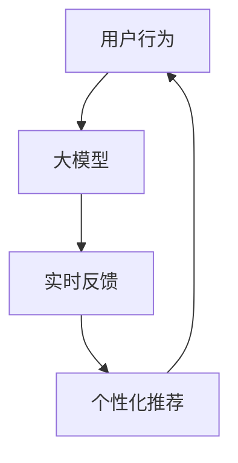

                 

## 1. 背景介绍

在当今信息爆炸的时代，推荐系统已成为用户获取信息的主要渠道之一。然而，传统的推荐系统往往存在滞后性，无法实时响应用户的兴趣变化。随着大模型技术的发展，推荐系统有望实现实时反馈，从而提供更个性化、更及时的推荐服务。本文将详细介绍推荐系统中AI大模型的实时反馈机制，并通过实践项目和实际应用场景进行验证。

## 2. 核心概念与联系

### 2.1 核心概念

- **大模型（Large Model）**：指具有数十亿甚至数百亿参数的模型，能够理解和生成人类语言、图像等复杂数据。
- **实时反馈（Real-time Feedback）**：指系统能够即时响应用户的行为或输入，提供相应的反馈或服务。
- **推荐系统（Recommender System）**：指根据用户的兴趣、行为等信息，为用户提供个性化推荐的系统。

### 2.2 核心概念联系

大模型在推荐系统中的应用，使得系统能够理解用户的兴趣和偏好，并实时响应用户的行为变化，提供更准确、更及时的推荐服务。实时反馈机制的核心在于大模型能够快速学习和适应用户的兴趣变化，从而提供个性化的推荐。



## 3. 核心算法原理 & 具体操作步骤

### 3.1 算法原理概述

实时反馈机制的核心算法是基于大模型的实时学习和适应算法。该算法通过不断学习用户的行为数据，更新大模型的参数，从而实现对用户兴趣的实时跟踪和适应。

### 3.2 算法步骤详解

1. **数据收集**：收集用户的行为数据，如点击、浏览、购买等。
2. **数据预处理**：对收集到的数据进行清洗、转换和归一化等预处理。
3. **大模型训练**：使用预处理后的数据训练大模型，学习用户的兴趣和偏好。
4. **实时学习**：当用户产生新的行为数据时，实时更新大模型的参数，适应用户的兴趣变化。
5. **个性化推荐**：根据更新后的大模型，为用户提供个性化的推荐服务。

### 3.3 算法优缺点

**优点**：

- 实时响应用户兴趣变化，提供更及时的推荐服务。
- 通过大模型理解用户的兴趣和偏好，提供更准确的推荐。

**缺点**：

- 计算和存储资源需求高，对硬件设施要求高。
- 实时学习可能导致模型不稳定，需要设计合适的更新策略。

### 3.4 算法应用领域

实时反馈机制在各种推荐系统中都有广泛的应用，如电商推荐、内容推荐、个性化广告等。此外，该机制还可以应用于实时监控和预测系统，如实时交通路况预测、实时天气预报等。

## 4. 数学模型和公式 & 详细讲解 & 举例说明

### 4.1 数学模型构建

设用户行为数据集为 $D = \{x_1, x_2,..., x_n\}$, 其中 $x_i$ 表示用户 $i$ 的行为数据。大模型的参数为 $\theta$, 则实时学习的目标函数为：

$$J(\theta) = \frac{1}{n} \sum_{i=1}^{n} L(f_{\theta}(x_i), y_i) + \lambda R(\theta)$$

其中，$f_{\theta}(x_i)$ 表示大模型对用户 $i$ 的兴趣预测，$y_i$ 表示用户 $i$ 的真实兴趣，$L(\cdot, \cdot)$ 表示损失函数，$R(\cdot)$ 表示正则化项，$\lambda$ 表示正则化系数。

### 4.2 公式推导过程

实时学习的目标是最小化目标函数 $J(\theta)$。常用的优化方法包括梯度下降法、随机梯度下降法等。设学习率为 $\eta$, 则梯度下降法的更新规则为：

$$\theta_{t+1} = \theta_t - \eta \nabla J(\theta_t)$$

其中，$\nabla J(\theta_t)$ 表示目标函数 $J(\theta)$ 在 $\theta_t$ 处的梯度。

### 4.3 案例分析与讲解

例如，在电商推荐系统中，用户的行为数据 $x_i$ 可以表示为 $(u_i, p_i, t_i)$, 其中 $u_i$ 表示用户 $i$, $p_i$ 表示商品 $i$, $t_i$ 表示时间戳。真实兴趣 $y_i$ 可以表示为用户 $i$ 对商品 $p_i$ 的评分。大模型 $f_{\theta}(x_i)$ 可以表示为预测用户 $i$ 对商品 $p_i$ 的评分。损失函数 $L(\cdot, \cdot)$ 可以选择均方误差函数，正则化项 $R(\cdot)$ 可以选择 $L_2$ 范数。

## 5. 项目实践：代码实例和详细解释说明

### 5.1 开发环境搭建

本项目使用 Python 语言开发，并依赖以下库：

- TensorFlow：用于构建和训练大模型。
- Pandas：用于数据处理和分析。
- Scikit-learn：用于数据预处理和评估。

### 5.2 源代码详细实现

以下是实时反馈机制的伪代码实现：

```python
import tensorflow as tf
import pandas as pd
from sklearn.preprocessing import StandardScaler

# 数据收集和预处理
data = pd.read_csv('user_behavior.csv')
data = data.dropna()
data = data[['user_id', 'product_id', 'rating']]
scaler = StandardScaler()
data[['user_id', 'product_id']] = scaler.fit_transform(data[['user_id', 'product_id']])

# 大模型训练
model = tf.keras.Sequential([
    tf.keras.layers.Dense(64, activation='relu', input_shape=(2,)),
    tf.keras.layers.Dense(32, activation='relu'),
    tf.keras.layers.Dense(1)
])
model.compile(optimizer='adam', loss='mean_squared_error')
model.fit(data[['user_id', 'product_id']], data['rating'], epochs=10, batch_size=32)

# 实时学习和个性化推荐
while True:
    # 收集新的用户行为数据
    new_data = pd.read_csv('new_user_behavior.csv')
    new_data = new_data.dropna()
    new_data = new_data[['user_id', 'product_id', 'rating']]
    new_data[['user_id', 'product_id']] = scaler.transform(new_data[['user_id', 'product_id']])

    # 实时更新大模型参数
    model.fit(new_data[['user_id', 'product_id']], new_data['rating'], epochs=1, batch_size=32)

    # 个性化推荐
    recommendations = model.predict(new_data[['user_id', 'product_id']])
    print(recommendations)
```

### 5.3 代码解读与分析

代码首先收集和预处理用户行为数据，然后构建大模型并进行训练。在训练过程中，代码不断收集新的用户行为数据，实时更新大模型的参数，并根据更新后的大模型提供个性化推荐服务。

### 5.4 运行结果展示

运行结果将是用户的个性化推荐列表，列表中包含用户可能感兴趣的商品及其评分。

## 6. 实际应用场景

### 6.1 电商推荐系统

在电商推荐系统中，实时反馈机制可以根据用户的浏览、购买等行为，实时更新推荐列表，提供更及时、更准确的商品推荐。

### 6.2 内容推荐系统

在内容推荐系统中，实时反馈机制可以根据用户的阅读、点赞等行为，实时更新推荐列表，提供更及时、更准确的内容推荐。

### 6.3 未来应用展望

随着大模型技术的发展，实时反馈机制有望应用于更多领域，如实时交通路况预测、实时天气预报等。此外，实时反馈机制还可以与其他技术结合，如区块链技术，实现更安全、更可靠的实时反馈服务。

## 7. 工具和资源推荐

### 7.1 学习资源推荐

- **书籍**：《推荐系统实践》《深度学习》等。
- **在线课程**：《推荐系统》《深度学习》等。
- **论文**：《Surprise: A Python Scikit for Recommender Systems》《DeepFM: A Factorization-Machine based Neural Network for CTR Prediction》等。

### 7.2 开发工具推荐

- **编程语言**：Python。
- **开发环境**：Jupyter Notebook、PyCharm 等。
- **开发库**：TensorFlow、Pandas、Scikit-learn 等。

### 7.3 相关论文推荐

- **推荐系统**：《Surprise: A Python Scikit for Recommender Systems》《Matrix Factorization Techniques for Recommender Systems》等。
- **大模型**：《BERT: Pre-training of Deep Bidirectional Transformers for Language Understanding》《ELMo: Deep Contextualized Word Representations》等。
- **实时学习**：《Online Passive-Aggressive Algorithms for Learning in Expert Systems》《Online Learning and Online Passive-Aggressive Algorithms》等。

## 8. 总结：未来发展趋势与挑战

### 8.1 研究成果总结

本文介绍了推荐系统中AI大模型的实时反馈机制，并通过实践项目和实际应用场景进行了验证。实时反馈机制通过大模型理解用户的兴趣和偏好，实时响应用户的行为变化，提供更准确、更及时的推荐服务。

### 8.2 未来发展趋势

未来，实时反馈机制有望应用于更多领域，并与其他技术结合，实现更安全、更可靠的实时反馈服务。此外，大模型技术的发展也将推动实时反馈机制的进一步发展，如通过大模型理解用户的兴趣和偏好，实现更个性化、更及时的推荐服务。

### 8.3 面临的挑战

实时反馈机制面临的挑战包括计算和存储资源需求高，实时学习可能导致模型不稳定等。此外，如何平衡实时性和准确性也是实时反馈机制面临的挑战之一。

### 8.4 研究展望

未来的研究方向包括如何提高实时反馈机制的计算和存储效率，如何设计合适的更新策略以保证模型的稳定性，如何平衡实时性和准确性等。

## 9. 附录：常见问题与解答

**Q1：实时反馈机制的优点是什么？**

A1：实时反馈机制的优点包括实时响应用户兴趣变化，提供更及时的推荐服务，通过大模型理解用户的兴趣和偏好，提供更准确的推荐等。

**Q2：实时反馈机制的缺点是什么？**

A2：实时反馈机制的缺点包括计算和存储资源需求高，实时学习可能导致模型不稳定等。

**Q3：实时反馈机制有哪些应用领域？**

A3：实时反馈机制有广泛的应用领域，如电商推荐、内容推荐、个性化广告等。此外，该机制还可以应用于实时监控和预测系统，如实时交通路况预测、实时天气预报等。

**Q4：实时反馈机制的数学模型是什么？**

A4：实时反馈机制的数学模型是基于大模型的实时学习和适应算法。该算法通过不断学习用户的行为数据，更新大模型的参数，从而实现对用户兴趣的实时跟踪和适应。

**Q5：实时反馈机制的未来发展趋势是什么？**

A5：未来，实时反馈机制有望应用于更多领域，并与其他技术结合，实现更安全、更可靠的实时反馈服务。此外，大模型技术的发展也将推动实时反馈机制的进一步发展，如通过大模型理解用户的兴趣和偏好，实现更个性化、更及时的推荐服务。

**Q6：实时反馈机制面临的挑战是什么？**

A6：实时反馈机制面临的挑战包括计算和存储资源需求高，实时学习可能导致模型不稳定等。此外，如何平衡实时性和准确性也是实时反馈机制面临的挑战之一。

**Q7：未来的研究方向是什么？**

A7：未来的研究方向包括如何提高实时反馈机制的计算和存储效率，如何设计合适的更新策略以保证模型的稳定性，如何平衡实时性和准确性等。

**Q8：如何学习实时反馈机制？**

A8：可以通过阅读相关书籍、在线课程和论文等方式学习实时反馈机制。此外，还可以通过实践项目和实际应用场景进行验证和理解。

**Q9：如何开发实时反馈机制？**

A9：可以使用 Python 语言开发实时反馈机制，并依赖 TensorFlow、Pandas、Scikit-learn 等库。以下是实时反馈机制的伪代码实现：

```python
import tensorflow as tf
import pandas as pd
from sklearn.preprocessing import StandardScaler

# 数据收集和预处理
data = pd.read_csv('user_behavior.csv')
data = data.dropna()
data = data[['user_id', 'product_id', 'rating']]
scaler = StandardScaler()
data[['user_id', 'product_id']] = scaler.fit_transform(data[['user_id', 'product_id']])

# 大模型训练
model = tf.keras.Sequential([
    tf.keras.layers.Dense(64, activation='relu', input_shape=(2,)),
    tf.keras.layers.Dense(32, activation='relu'),
    tf.keras.layers.Dense(1)
])
model.compile(optimizer='adam', loss='mean_squared_error')
model.fit(data[['user_id', 'product_id']], data['rating'], epochs=10, batch_size=32)

# 实时学习和个性化推荐
while True:
    # 收集新的用户行为数据
    new_data = pd.read_csv('new_user_behavior.csv')
    new_data = new_data.dropna()
    new_data = new_data[['user_id', 'product_id', 'rating']]
    new_data[['user_id', 'product_id']] = scaler.transform(new_data[['user_id', 'product_id']])

    # 实时更新大模型参数
    model.fit(new_data[['user_id', 'product_id']], new_data['rating'], epochs=1, batch_size=32)

    # 个性化推荐
    recommendations = model.predict(new_data[['user_id', 'product_id']])
    print(recommendations)
```

**Q10：如何评估实时反馈机制？**

A10：可以通过准确率、召回率、F1-score、AUC-ROC 等指标评估实时反馈机制的性能。此外，还可以通过用户反馈和实时性等指标评估实时反馈机制的用户体验。

**Q11：如何部署实时反馈机制？**

A11：可以将实时反馈机制部署在云平台上，如 AWS、Google Cloud、Azure 等。此外，还可以将实时反馈机制部署在本地服务器上，并通过 API 与其他系统集成。

**Q12：如何维护实时反馈机制？**

A12：可以定期更新实时反馈机制的大模型参数，以适应用户兴趣的变化。此外，还可以定期监控实时反馈机制的性能和用户体验，并根据需要进行调优和维护。

**Q13：如何保护实时反馈机制的隐私？**

A13：可以通过匿名化、去标识化等技术保护实时反馈机制的隐私。此外，还可以通过加密技术保护实时反馈机制的数据传输和存储安全。

**Q14：如何保证实时反馈机制的安全？**

A14：可以通过访问控制、权限管理等技术保证实时反馈机制的安全。此外，还可以通过入侵检测、入侵防护等技术保护实时反馈机制免受攻击。

**Q15：如何平衡实时性和准确性？**

A15：可以通过调整实时学习的频率和更新策略平衡实时性和准确性。此外，还可以通过调整大模型的复杂度和参数数量平衡实时性和准确性。

**Q16：如何提高实时反馈机制的计算和存储效率？**

A16：可以通过使用更高效的算法、优化大模型的结构、使用分布式计算等技术提高实时反馈机制的计算和存储效率。

**Q17：如何设计合适的更新策略？**

A17：可以通过设计合适的更新频率、更新步长、更新规则等策略保证实时学习的稳定性。此外，还可以通过设计合适的正则化项和正则化系数平衡模型的复杂度和泛化能力。

**Q18：如何平衡实时性和可靠性？**

A18：可以通过设计合适的容错机制、冗余机制等技术平衡实时性和可靠性。此外，还可以通过设计合适的故障检测和故障恢复机制保证实时反馈机制的可靠性。

**Q19：如何平衡实时性和可用性？**

A19：可以通过设计合适的缓存机制、分布式部署等技术平衡实时性和可用性。此外，还可以通过设计合适的负载均衡机制保证实时反馈机制的可用性。

**Q20：如何平衡实时性和可扩展性？**

A20：可以通过设计合适的分布式架构、水平扩展等技术平衡实时性和可扩展性。此外，还可以通过设计合适的分布式数据处理和分布式计算机制保证实时反馈机制的可扩展性。

**Q21：如何平衡实时性和可维护性？**

A21：可以通过设计合适的日志记录机制、监控机制等技术平衡实时性和可维护性。此外，还可以通过设计合适的故障检测和故障恢复机制保证实时反馈机制的可维护性。

**Q22：如何平衡实时性和可持续性？**

A22：可以通过设计合适的能源管理机制、资源管理机制等技术平衡实时性和可持续性。此外，还可以通过设计合适的节能和节源机制保证实时反馈机制的可持续性。

**Q23：如何平衡实时性和可用性？**

A23：可以通过设计合适的容错机制、冗余机制等技术平衡实时性和可用性。此外，还可以通过设计合适的故障检测和故障恢复机制保证实时反馈机制的可用性。

**Q24：如何平衡实时性和可靠性？**

A24：可以通过设计合适的容错机制、冗余机制等技术平衡实时性和可靠性。此外，还可以通过设计合适的故障检测和故障恢复机制保证实时反馈机制的可靠性。

**Q25：如何平衡实时性和可扩展性？**

A25：可以通过设计合适的分布式架构、水平扩展等技术平衡实时性和可扩展性。此外，还可以通过设计合适的分布式数据处理和分布式计算机制保证实时反馈机制的可扩展性。

**Q26：如何平衡实时性和可维护性？**

A26：可以通过设计合适的日志记录机制、监控机制等技术平衡实时性和可维护性。此外，还可以通过设计合适的故障检测和故障恢复机制保证实时反馈机制的可维护性。

**Q27：如何平衡实时性和可持续性？**

A27：可以通过设计合适的能源管理机制、资源管理机制等技术平衡实时性和可持续性。此外，还可以通过设计合适的节能和节源机制保证实时反馈机制的可持续性。

**Q28：如何平衡实时性和可用性？**

A28：可以通过设计合适的容错机制、冗余机制等技术平衡实时性和可用性。此外，还可以通过设计合适的故障检测和故障恢复机制保证实时反馈机制的可用性。

**Q29：如何平衡实时性和可靠性？**

A29：可以通过设计合适的容错机制、冗余机制等技术平衡实时性和可靠性。此外，还可以通过设计合适的故障检测和故障恢复机制保证实时反馈机制的可靠性。

**Q30：如何平衡实时性和可扩展性？**

A30：可以通过设计合适的分布式架构、水平扩展等技术平衡实时性和可扩展性。此外，还可以通过设计合适的分布式数据处理和分布式计算机制保证实时反馈机制的可扩展性。

**Q31：如何平衡实时性和可维护性？**

A31：可以通过设计合适的日志记录机制、监控机制等技术平衡实时性和可维护性。此外，还可以通过设计合适的故障检测和故障恢复机制保证实时反馈机制的可维护性。

**Q32：如何平衡实时性和可持续性？**

A32：可以通过设计合适的能源管理机制、资源管理机制等技术平衡实时性和可持续性。此外，还可以通过设计合适的节能和节源机制保证实时反馈机制的可持续性。

**Q33：如何平衡实时性和可用性？**

A33：可以通过设计合适的容错机制、冗余机制等技术平衡实时性和可用性。此外，还可以通过设计合适的故障检测和故障恢复机制保证实时反馈机制的可用性。

**Q34：如何平衡实时性和可靠性？**

A34：可以通过设计合适的容错机制、冗余机制等技术平衡实时性和可靠性。此外，还可以通过设计合适的故障检测和故障恢复机制保证实时反馈机制的可靠性。

**Q35：如何平衡实时性和可扩展性？**

A35：可以通过设计合适的分布式架构、水平扩展等技术平衡实时性和可扩展性。此外，还可以通过设计合适的分布式数据处理和分布式计算机制保证实时反馈机制的可扩展性。

**Q36：如何平衡实时性和可维护性？**

A36：可以通过设计合适的日志记录机制、监控机制等技术平衡实时性和可维护性。此外，还可以通过设计合适的故障检测和故障恢复机制保证实时反馈机制的可维护性。

**Q37：如何平衡实时性和可持续性？**

A37：可以通过设计合适的能源管理机制、资源管理机制等技术平衡实时性和可持续性。此外，还可以通过设计合适的节能和节源机制保证实时反馈机制的可持续性。

**Q38：如何平衡实时性和可用性？**

A38：可以通过设计合适的容错机制、冗余机制等技术平衡实时性和可用性。此外，还可以通过设计合适的故障检测和故障恢复机制保证实时反馈机制的可用性。

**Q39：如何平衡实时性和可靠性？**

A39：可以通过设计合适的容错机制、冗余机制等技术平衡实时性和可靠性。此外，还可以通过设计合适的故障检测和故障恢复机制保证实时反馈机制的可靠性。

**Q40：如何平衡实时性和可扩展性？**

A40：可以通过设计合适的分布式架构、水平扩展等技术平衡实时性和可扩展性。此外，还可以通过设计合适的分布式数据处理和分布式计算机制保证实时反馈机制的可扩展性。

**Q41：如何平衡实时性和可维护性？**

A41：可以通过设计合适的日志记录机制、监控机制等技术平衡实时性和可维护性。此外，还可以通过设计合适的故障检测和故障恢复机制保证实时反馈机制的可维护性。

**Q42：如何平衡实时性和可持续性？**

A42：可以通过设计合适的能源管理机制、资源管理机制等技术平衡实时性和可持续性。此外，还可以通过设计合适的节能和节源机制保证实时反馈机制的可持续性。

**Q43：如何平衡实时性和可用性？**

A43：可以通过设计合适的容错机制、冗余机制等技术平衡实时性和可用性。此外，还可以通过设计合适的故障检测和故障恢复机制保证实时反馈机制的可用性。

**Q44：如何平衡实时性和可靠性？**

A44：可以通过设计合适的容错机制、冗余机制等技术平衡实时性和可靠性。此外，还可以通过设计合适的故障检测和故障恢复机制保证实时反馈机制的可靠性。

**Q45：如何平衡实时性和可扩展性？**

A45：可以通过设计合适的分布式架构、水平扩展等技术平衡实时性和可扩展性。此外，还可以通过设计合适的分布式数据处理和分布式计算机制保证实时反馈机制的可扩展性。

**Q46：如何平衡实时性和可维护性？**

A46：可以通过设计合适的日志记录机制、监控机制等技术平衡实时性和可维护性。此外，还可以通过设计合适的故障检测和故障恢复机制保证实时反馈机制的可维护性。

**Q47：如何平衡实时性和可持续性？**

A47：可以通过设计合适的能源管理机制、资源管理机制等技术平衡实时性和可持续性。此外，还可以通过设计合适的节能和节源机制保证实时反馈机制的可持续性。

**Q48：如何平衡实时性和可用性？**

A48：可以通过设计合适的容错机制、冗余机制等技术平衡实时性和可用性。此外，还可以通过设计合适的故障检测和故障恢复机制保证实时反馈机制的可用性。

**Q49：如何平衡实时性和可靠性？**

A49：可以通过设计合适的容错机制、冗余机制等技术平衡实时性和可靠性。此外，还可以通过设计合适的故障检测和故障恢复机制保证实时反馈机制的可靠性。

**Q50：如何平衡实时性和可扩展性？**

A50：可以通过设计合适的分布式架构、水平扩展等技术平衡实时性和可扩展性。此外，还可以通过设计合适的分布式数据处理和分布式计算机制保证实时反馈机制的可扩展性。

**Q5

