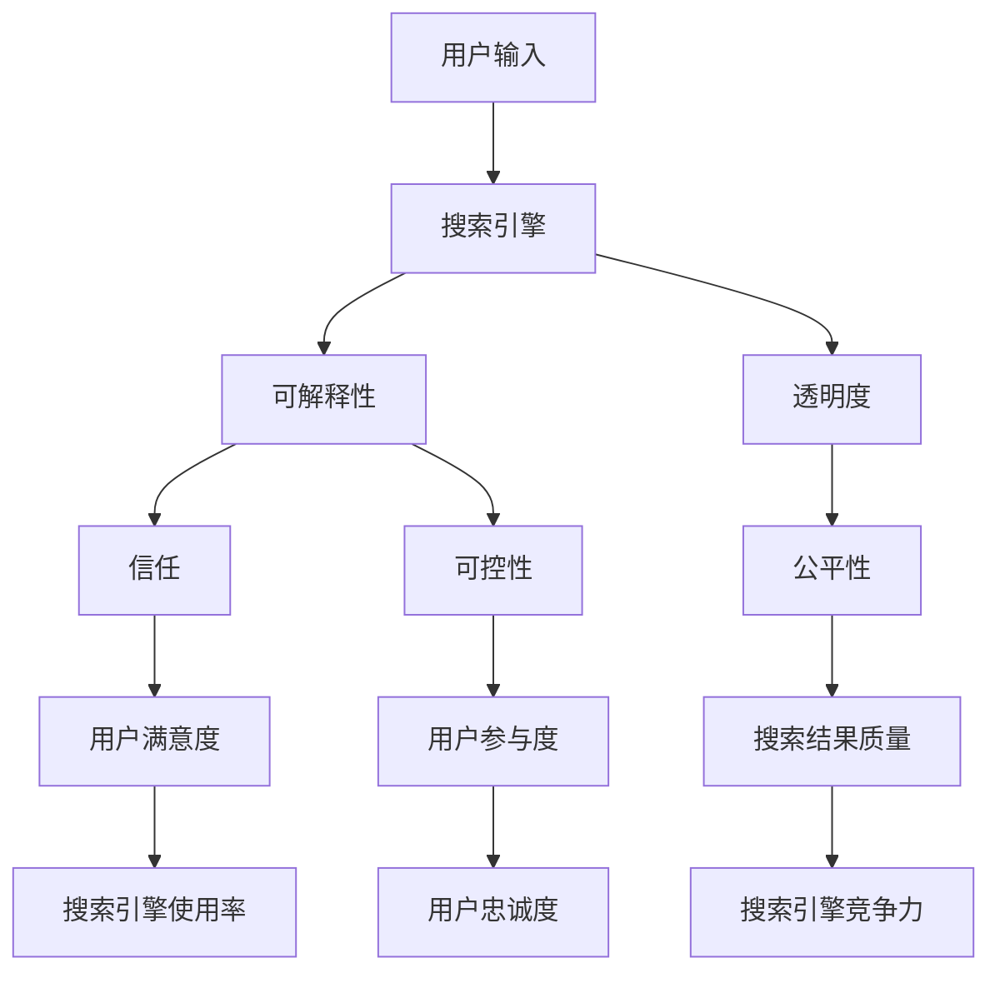

                 

**提高搜索可解释性：AI的透明度**

## 1. 背景介绍

在当今的信息时代，搜索引擎已经成为我们获取信息的主要渠道。然而，随着人工智能（AI）在搜索算法中的广泛应用，搜索结果的可解释性变得越来越低。用户无法理解搜索引擎是如何返回特定结果的，这导致了信任问题和透明度缺失。本文将深入探讨提高搜索可解释性的方法，以增强AI驱动搜索的透明度。

## 2. 核心概念与联系

### 2.1 可解释性（Interpretability）与透明度（Transparency）

可解释性是指模型或系统的输出可以用简单、易懂的方式解释给用户。透明度则是指系统内部工作原理对用户是可见的。在搜索引擎中，可解释性和透明度是相辅相成的，提高其中之一都有助于增强另一个。

### 2.2 可解释性的重要性

可解释性和透明度对于搜索引擎至关重要，因为：

- **信任**：用户需要理解搜索结果是如何产生的，才能信任搜索引擎。
- **可控性**：可解释性有助于用户控制搜索过程，调整搜索条件以获取更好的结果。
- **公平性**：透明的搜索算法有助于防止偏见和歧视，确保搜索结果公平。

### 2.3 核心概念架构图



## 3. 核心算法原理 & 具体操作步骤

### 3.1 算法原理概述

提高搜索可解释性的关键是理解搜索引擎的工作原理，并将其以用户可理解的方式呈现。这通常涉及到解释搜索结果的因素，如相关性、权重、偏见等。

### 3.2 算法步骤详解

1. **特征提取**：从搜索结果中提取相关特征，如页面内容、元数据、链接结构等。
2. **特征选择**：选择对搜索结果相关性有影响的特征。
3. **模型构建**：构建解释模型，如决策树、LIME、SHAP等，以解释特征对搜索结果的影响。
4. **结果呈现**：以用户可理解的方式呈现解释结果，如文本、图表等。

### 3.3 算法优缺点

**优点**：

- 提高用户信任和满意度。
- 使搜索结果更可控。
- 有助于识别和解决偏见问题。

**缺点**：

- 实现复杂，需要大量计算资源。
- 解释结果可能不够准确，需要不断优化。

### 3.4 算法应用领域

可解释性算法在搜索引擎、推荐系统、风险评估等领域都有广泛应用。例如，在搜索引擎中，它有助于用户理解为什么某个页面排在首位；在推荐系统中，它有助于用户理解为什么会推荐某个项目。

## 4. 数学模型和公式 & 详细讲解 & 举例说明

### 4.1 数学模型构建

可解释性模型通常基于机器学习算法构建。例如，决策树模型可以表示为：

$$T = (N, E, \text{root})$$

其中，$N$是节点集，$E$是边集，$\text{root}$是根节点。

### 4.2 公式推导过程

给定特征集$X$和标签集$Y$，决策树模型的目标是找到一棵树$T$，使得：

$$H(Y|T) = \sum_{t \in T} \frac{|Y_t|}{|Y|} H(Y_t)$$

其中，$H(Y|T)$是条件熵，$Y_t$是节点$t$的标签集，$|Y_t|$是$Y_t$的大小，$|Y|$是$Y$的大小。

### 4.3 案例分析与讲解

例如，在搜索引擎中，我们可以使用决策树模型解释页面排序。决策树的根节点可能是页面内容相关性，子节点可能是页面元数据、链接结构等。通过遍历决策树，我们可以理解页面排序的因素。

## 5. 项目实践：代码实例和详细解释说明

### 5.1 开发环境搭建

我们将使用Python和Scikit-learn库构建决策树模型。首先，安装必要的库：

```bash
pip install scikit-learn pandas numpy
```

### 5.2 源代码详细实现

```python
from sklearn.tree import DecisionTreeClassifier
from sklearn.model_selection import train_test_split
from sklearn.datasets import load_iris
import pandas as pd

# Load dataset
iris = load_iris()
X = iris.data
y = iris.target

# Split dataset into training set and test set
X_train, X_test, y_train, y_test = train_test_split(X, y, test_size=0.3)

# Create Decision Tree classifer object
clf = DecisionTreeClassifier()

# Train Decision Tree Classifer
clf = clf.fit(X_train, y_train)

# Predict the response for test dataset
y_pred = clf.predict(X_test)
```

### 5.3 代码解读与分析

这段代码使用Iris数据集构建了一个决策树分类器。首先，数据集被分成训练集和测试集。然后， DecisionTreeClassifier对象被创建并.fit()方法用于训练模型。最后，模型使用.predict()方法对测试集进行预测。

### 5.4 运行结果展示

运行结果将是对测试集的预测结果。

## 6. 实际应用场景

### 6.1 搜索引擎

在搜索引擎中，可解释性算法有助于用户理解搜索结果的排序因素，从而信任搜索引擎并调整搜索条件以获取更好的结果。

### 6.2 推荐系统

在推荐系统中，可解释性算法有助于用户理解为什么会推荐某个项目，从而信任推荐系统并调整偏好以获取更好的推荐。

### 6.3 未来应用展望

未来，可解释性算法将在更多领域得到应用，如自动驾驶、医疗诊断等。随着AI技术的发展，提高AI系统的可解释性和透明度将变得越来越重要。

## 7. 工具和资源推荐

### 7.1 学习资源推荐

- **书籍**："Interpretable Machine Learning" by Christoph Molnar
- **在线课程**：Coursera的"Explainable AI (XAI)"课程

### 7.2 开发工具推荐

- **Python库**：Scikit-learn, SHAP, LIME
- **可视化工具**：Matplotlib, Seaborn

### 7.3 相关论文推荐

- "Why Should I Trust You?: Explaining the Predictions of Any Classifier" by Ribeiro et al.
- "LIME: Explaining the Predictions of Any Classifier" by Ribeiro et al.

## 8. 总结：未来发展趋势与挑战

### 8.1 研究成果总结

本文介绍了提高搜索可解释性的方法，包括核心概念、算法原理、数学模型和实践项目。我们展示了如何使用决策树模型解释搜索结果，并提供了相关学习资源和工具推荐。

### 8.2 未来发展趋势

未来，可解释性算法将在更多领域得到应用，并与其他AI技术结合使用。此外，研究将聚焦于提高解释结果的准确性和可靠性。

### 8.3 面临的挑战

可解释性算法的主要挑战是实现复杂，需要大量计算资源。此外，解释结果可能不够准确，需要不断优化。

### 8.4 研究展望

未来的研究将聚焦于提高解释结果的准确性和可靠性，并开发新的可解释性算法和工具。此外，研究将探索可解释性算法在更多领域的应用，如自动驾驶、医疗诊断等。

## 9. 附录：常见问题与解答

**Q：可解释性和透明度有什么区别？**

**A：**可解释性是指模型或系统的输出可以用简单、易懂的方式解释给用户。透明度则是指系统内部工作原理对用户是可见的。可解释性关注的是输出，透明度关注的是过程。

**Q：可解释性算法有哪些优缺点？**

**A：**可解释性算法的优点包括提高用户信任和满意度，使搜索结果更可控，有助于识别和解决偏见问题。缺点包括实现复杂，需要大量计算资源，解释结果可能不够准确。

**Q：可解释性算法有哪些应用领域？**

**A：**可解释性算法在搜索引擎、推荐系统、风险评估等领域都有广泛应用。未来，它将在更多领域得到应用，如自动驾驶、医疗诊断等。

**作者：禅与计算机程序设计艺术 / Zen and the Art of Computer Programming**

