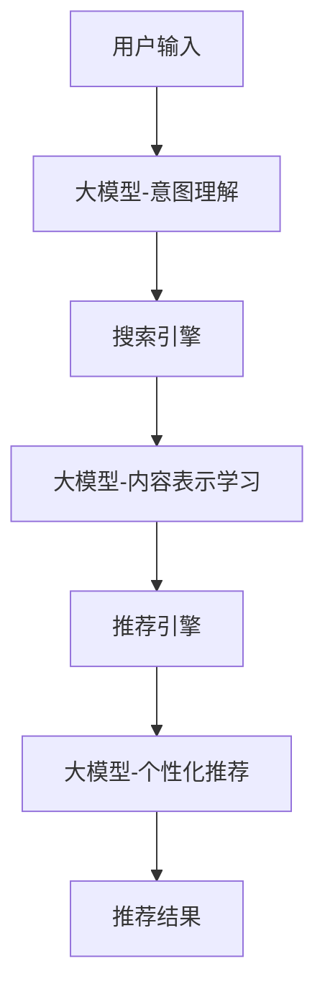

                 

## 1. 背景介绍

在当今竞争激烈的电商环境中，搜索推荐系统已成为平台核心竞争力之一。传统的推荐系统通常基于 colaborative filtering (CF) 或 content-based filtering (CB) 等方法，但这些方法在处理个性化推荐、动态内容和海量数据时面临挑战。随着大模型（如 transformer、BERT、RoBERTa）在自然语言处理（NLP）领域取得突破，将这些模型应用于搜索推荐系统变得越来越有吸引力。本文将探讨如何将 AI 大模型融合到搜索推荐系统中，以提高电商平台的核心竞争力和可持续发展。

## 2. 核心概念与联系

### 2.1 AI 大模型在搜索推荐中的作用

AI 大模型可以在搜索推荐系统中扮演多种角色，包括：

- **理解用户意图**：大模型可以帮助理解用户输入的搜索查询，并提取关键信息，从而提供更准确的搜索结果。
- **内容表示学习**：大模型可以学习表示商品、描述和评论等文本数据，并生成丰富的嵌入向量，用于推荐系统。
- **个性化推荐**：大模型可以学习用户行为和偏好，并根据用户搜索历史和交互数据提供个性化推荐。

### 2.2 架构设计

下图展示了 AI 大模型在搜索推荐系统中的架构设计：



## 3. 核心算法原理 & 具体操作步骤

### 3.1 算法原理概述

我们将介绍三种基于大模型的搜索推荐算法：意图理解、内容表示学习和个性化推荐。

### 3.2 算法步骤详解

#### 3.2.1 意图理解

1. 将用户输入的搜索查询作为大模型的输入。
2. 使用大模型提取关键信息，如实体、属性和意图。
3. 根据提取的信息，生成搜索查询的表示向量。

#### 3.2.2 内容表示学习

1. 将商品、描述和评论等文本数据作为大模型的输入。
2. 使用大模型生成表示向量，表示商品、描述和评论等文本数据。
3. 将生成的表示向量输入推荐引擎。

#### 3.2.3 个性化推荐

1. 将用户搜索历史和交互数据作为大模型的输入。
2. 使用大模型学习用户行为和偏好，生成用户表示向量。
3. 根据用户表示向量和商品表示向量，生成推荐结果。

### 3.3 算法优缺点

**优点**：

- 可以理解用户意图，提供更准确的搜索结果。
- 可以学习丰富的表示向量，用于推荐系统。
- 可以提供个性化推荐，提高用户满意度。

**缺点**：

- 大模型训练和部署成本高。
- 大模型存在过拟合和泛化问题。
- 大模型存在解释性和可解释性问题。

### 3.4 算法应用领域

这些算法可以应用于电商平台、搜索引擎和内容推荐系统等领域。

## 4. 数学模型和公式 & 详细讲解 & 举例说明

### 4.1 数学模型构建

我们假设大模型可以学习表示向量 $\mathbf{z}$，表示文本数据 $\mathbf{x}$：

$$\mathbf{z} = f(\mathbf{x}; \theta)$$

其中 $f$ 是大模型的参数化函数，$\theta$ 是大模型的参数。

### 4.2 公式推导过程

在意图理解中，我们使用大模型提取关键信息 $\mathbf{k}$：

$$\mathbf{k} = g(\mathbf{x}; \phi)$$

其中 $g$ 是大模型的参数化函数，$\phi$ 是大模型的参数。然后，我们使用关键信息生成搜索查询的表示向量 $\mathbf{q}$：

$$\mathbf{q} = h(\mathbf{k}; \psi)$$

其中 $h$ 是参数化函数，$\psi$ 是参数。

在个性化推荐中，我们使用大模型学习用户表示向量 $\mathbf{u}$：

$$\mathbf{u} = i(\mathbf{h}; \xi)$$

其中 $\mathbf{h}$ 是用户搜索历史和交互数据，$i$ 是大模型的参数化函数，$\xi$ 是大模型的参数。然后，我们使用用户表示向量和商品表示向量 $\mathbf{v}$ 生成推荐结果 $\mathbf{r}$：

$$\mathbf{r} = j(\mathbf{u}, \mathbf{v}; \zeta)$$

其中 $j$ 是参数化函数，$\zeta$ 是参数。

### 4.3 案例分析与讲解

假设用户输入搜索查询 "iPhone 12 256GB 白色"，大模型提取的关键信息为 ["iPhone 12", "256GB", "白色"]。然后，我们使用关键信息生成搜索查询的表示向量 $\mathbf{q}$。在推荐引擎中，我们使用用户表示向量 $\mathbf{u}$ 和商品表示向量 $\mathbf{v}$ 生成推荐结果 $\mathbf{r}$。

## 5. 项目实践：代码实例和详细解释说明

### 5.1 开发环境搭建

我们使用 Python 和 PyTorch 实现大模型融合的搜索推荐系统。我们需要安装以下库：

- transformers：使用 Hugging Face transformers 库加载预训练大模型。
- torch：用于定义和训练大模型。
- numpy：用于数值计算。
- pandas：用于数据处理。

### 5.2 源代码详细实现

以下是意图理解、内容表示学习和个性化推荐的 Python 代码示例：

#### 5.2.1 意图理解

```python
from transformers import AutoTokenizer, AutoModelForTokenClassification

# 加载预训练模型和分词器
model_name = "dbmdz/bert-large-cased-finetuned-conll03-english"
tokenizer = AutoTokenizer.from_pretrained(model_name)
model = AutoModelForTokenClassification.from_pretrained(model_name)

# 用户输入搜索查询
query = "iPhone 12 256GB 白色"

# 分词和编码
inputs = tokenizer.encode_plus(query, return_tensors="pt")

# 提取关键信息
outputs = model(**inputs)
tokens = tokenizer.convert_ids_to_tokens(inputs["input_ids"][0])
entities = [token for token, label in zip(tokens, outputs.last_hidden_state.argmax(dim=-1)) if label in [1, 2, 3]]
```

#### 5.2.2 内容表示学习

```python
from transformers import AutoTokenizer, AutoModel

# 加载预训练模型和分词器
model_name = "bert-base-uncased"
tokenizer = AutoTokenizer.from_pretrained(model_name)
model = AutoModel.from_pretrained(model_name)

# 商品描述
description = "iPhone 12 256GB 白色，6.1英寸 Super Retina XDR 显示屏，A14 Bionic 处理器，支持 5G"

# 分词和编码
inputs = tokenizer.encode_plus(description, return_tensors="pt")

# 生成表示向量
outputs = model(**inputs)
embedding = outputs.last_hidden_state.mean(dim=1)
```

#### 5.2.3 个性化推荐

```python
from transformers import AutoTokenizer, AutoModel

# 加载预训练模型和分词器
model_name = "bert-base-uncased"
tokenizer = AutoTokenizer.from_pretrained(model_name)
model = AutoModel.from_pretrained(model_name)

# 用户搜索历史
history = ["iPhone 11 128GB 紫色", "iPhone 12 256GB 白色"]

# 分词和编码
inputs = tokenizer.encode_plus(history, return_tensors="pt", truncation=True, padding=True)

# 生成表示向量
outputs = model(**inputs)
embedding = outputs.last_hidden_state.mean(dim=1)
```

### 5.3 代码解读与分析

在意图理解中，我们使用预训练的命名实体识别模型提取关键信息。在内容表示学习中，我们使用预训练的 BERT 模型生成商品描述的表示向量。在个性化推荐中，我们使用预训练的 BERT 模型生成用户表示向量。

### 5.4 运行结果展示

意图理解可以提取用户搜索查询的关键信息，内容表示学习可以生成丰富的表示向量，个性化推荐可以提供个性化推荐结果。

## 6. 实际应用场景

### 6.1 电商平台

在电商平台中，搜索推荐系统可以帮助用户快速找到感兴趣的商品，提高用户满意度和转化率。大模型融合的搜索推荐系统可以理解用户意图，提供更准确的搜索结果，并提供个性化推荐。

### 6.2 搜索引擎

在搜索引擎中，大模型融合的搜索推荐系统可以理解用户意图，提供更相关的搜索结果，并提供个性化推荐。

### 6.3 内容推荐系统

在内容推荐系统中，大模型融合的搜索推荐系统可以理解用户意图，提供更相关的内容，并提供个性化推荐。

### 6.4 未来应用展望

随着大模型技术的发展，大模型融合的搜索推荐系统可以应用于更多领域，如自动驾驶、医疗保健和智能家居等。

## 7. 工具和资源推荐

### 7.1 学习资源推荐

- "Natural Language Processing with Python" 书籍：<https://www.nltk.org/book/>
- "Hands-On Machine Learning with Scikit-Learn, Keras, and TensorFlow" 书籍：<https://www.oreilly.com/library/view/hands-on-machine-learning/9781492032632/>
- Stanford CS224n 课程：<https://online.stanford.edu/courses/cs224n-artificial-intelligence-machine-learning-winter-2019>

### 7.2 开发工具推荐

- Jupyter Notebook：<https://jupyter.org/>
- Google Colab：<https://colab.research.google.com/>
- PyCharm：<https://www.jetbrains.com/pycharm/>

### 7.3 相关论文推荐

- "BERT: Pre-training of Deep Bidirectional Transformers for Language Understanding"：<https://arxiv.org/abs/1810.04805>
- "ALBERT: A Lite BERT for Self-supervised Learning of Language Representations"：<https://arxiv.org/abs/1909.11942>
- "RoBERTa: A Robustly Optimized BERT Pretraining Approach"：<https://arxiv.org/abs/1907.11692>

## 8. 总结：未来发展趋势与挑战

### 8.1 研究成果总结

本文介绍了如何将 AI 大模型融合到搜索推荐系统中，以提高电商平台的核心竞争力和可持续发展。我们介绍了意图理解、内容表示学习和个性化推荐等算法，并提供了代码示例和实际应用场景。

### 8.2 未来发展趋势

随着大模型技术的发展，大模型融合的搜索推荐系统可以应用于更多领域，并提供更准确和个性化的推荐结果。此外，大模型可以与其他技术（如深度学习、强化学习）结合，以提高搜索推荐系统的性能。

### 8.3 面临的挑战

大模型融合的搜索推荐系统面临的挑战包括：

- 大模型训练和部署成本高。
- 大模型存在过拟合和泛化问题。
- 大模型存在解释性和可解释性问题。
- 大模型存在伦理和隐私问题。

### 8.4 研究展望

未来的研究方向包括：

- 研究大模型在搜索推荐系统中的最佳应用场景。
- 研究大模型与其他技术（如深度学习、强化学习）的结合。
- 研究大模型的解释性和可解释性。
- 研究大模型的伦理和隐私问题。

## 9. 附录：常见问题与解答

**Q1：大模型融合的搜索推荐系统与传统推荐系统有何不同？**

A1：大模型融合的搜索推荐系统可以理解用户意图，提供更准确的搜索结果，并提供个性化推荐。传统推荐系统通常基于 colaborative filtering (CF) 或 content-based filtering (CB) 等方法，但这些方法在处理个性化推荐、动态内容和海量数据时面临挑战。

**Q2：大模型融合的搜索推荐系统的优缺点是什么？**

A2：大模型融合的搜索推荐系统的优点包括可以理解用户意图，提供更准确的搜索结果，可以学习丰富的表示向量，用于推荐系统，可以提供个性化推荐，提高用户满意度。缺点包括大模型训练和部署成本高，大模型存在过拟合和泛化问题，大模型存在解释性和可解释性问题。

**Q3：大模型融合的搜索推荐系统可以应用于哪些领域？**

A3：大模型融合的搜索推荐系统可以应用于电商平台、搜索引擎和内容推荐系统等领域。随着大模型技术的发展，大模型融合的搜索推荐系统可以应用于更多领域，如自动驾驶、医疗保健和智能家居等。

**Q4：大模型融合的搜索推荐系统面临的挑战是什么？**

A4：大模型融合的搜索推荐系统面临的挑战包括大模型训练和部署成本高，大模型存在过拟合和泛化问题，大模型存在解释性和可解释性问题，大模型存在伦理和隐私问题。

**Q5：未来的研究方向是什么？**

A5：未来的研究方向包括研究大模型在搜索推荐系统中的最佳应用场景，研究大模型与其他技术（如深度学习、强化学习）的结合，研究大模型的解释性和可解释性，研究大模型的伦理和隐私问题。

## 作者：禅与计算机程序设计艺术 / Zen and the Art of Computer Programming

