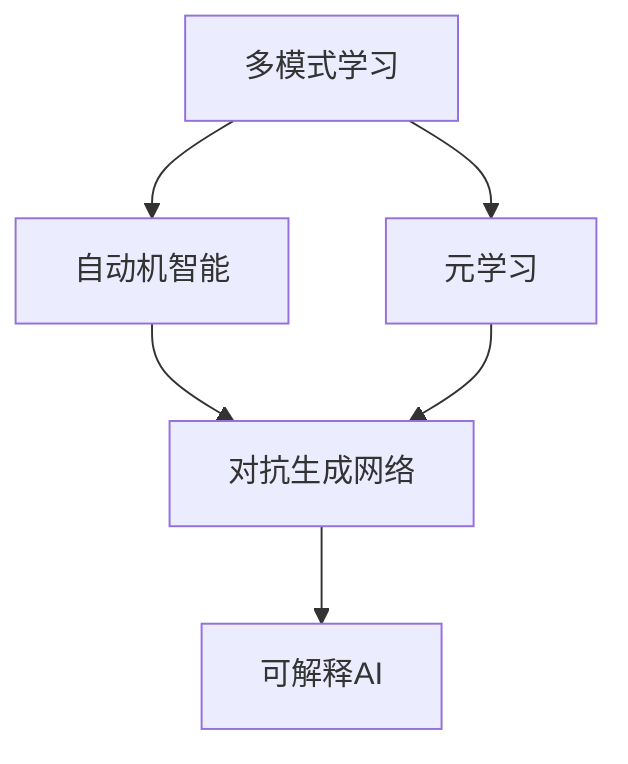

                 

**数字化想象力培养皿：AI激发的创意思维孵化器**

**作者：禅与计算机程序设计艺术 / Zen and the Art of Computer Programming**

## 1. 背景介绍

在当今数字化转型的浪潮中，人工智能（AI）已然成为各行各业的关键驱动力。然而，AI的发展并非一帆风顺，它面临着数据孤岛、模型泛化、解释性等挑战。本文旨在探讨一种创新的AI框架，即数字化想象力培养皿，它通过集成多种AI技术，激发创意思维，孵化出更具解释性和泛化能力的AI模型。

## 2. 核心概念与联系

数字化想象力培养皿的核心概念包括：多模式学习、自动机智能、元学习、对抗生成网络，以及可解释AI。这些概念通过以下架构相互联系：



## 3. 核心算法原理 & 具体操作步骤

### 3.1 算法原理概述

数字化想象力培养皿的核心是一种迭代式学习过程，它结合了多模式学习、自动机智能、元学习、对抗生成网络，以及可解释AI，以提高AI模型的泛化能力和解释性。

### 3.2 算法步骤详解

1. **多模式学习**：收集并整合多种数据模式（如文本、图像、音频等），建立多模式学习模型。
2. **自动机智能**：使用自动机学习算法（如神经自动机）从多模式数据中提取高级特征。
3. **元学习**：应用元学习算法（如MAML）优化模型的学习能力，提高模型的泛化能力。
4. **对抗生成网络**：使用对抗生成网络（如GAN）生成新的、具有代表性的数据样本，丰富训练集。
5. **可解释AI**：应用可解释AI技术（如LIME、SHAP）提高模型的解释性，帮助理解模型的决策过程。

### 3.3 算法优缺点

**优点**：
- 结合了多种AI技术，提高了模型的泛化能力和解释性。
- 通过对抗生成网络，丰富了训练集，有助于模型学习更多的特征。
- 通过元学习，模型可以快速适应新的任务。

**缺点**：
- 计算复杂度高，需要大量的计算资源。
- 训练过程需要大量的时间和数据。
- 可解释AI技术仍然存在局限性，无法提供完美的解释。

### 3.4 算法应用领域

数字化想象力培养皿适用于需要高泛化能力和解释性的领域，如医疗诊断、金融风险评估、自动驾驶等。

## 4. 数学模型和公式 & 详细讲解 & 举例说明

### 4.1 数学模型构建

数字化想象力培养皿的数学模型可以表示为：

$$M = f(M_{MM}, M_{AM}, M_{EL}, M_{GAN}, M_{XAI})$$

其中，$M_{MM}$表示多模式学习模型，$M_{AM}$表示自动机智能模型，$M_{EL}$表示元学习模型，$M_{GAN}$表示对抗生成网络，$M_{XAI}$表示可解释AI模型。

### 4.2 公式推导过程

数学模型的推导过程基于各个组成部分的数学模型。例如，多模式学习模型的数学模型可以表示为：

$$M_{MM} = \arg\min_{M_{MM}} \sum_{i=1}^{n} L(f_{MM}(x_{i}), y_{i})$$

其中，$f_{MM}(x_{i})$表示多模式学习模型的预测，$y_{i}$表示真实标签，$L(\cdot, \cdot)$表示损失函数。

### 4.3 案例分析与讲解

例如，在医疗诊断领域，数字化想象力培养皿可以帮助医生更准确地诊断疾病。通过多模式学习，模型可以从文本（病历）、图像（X射线、MRI等）、音频（心电图等）等数据中提取特征。通过自动机智能，模型可以学习到更高级的特征。通过元学习，模型可以快速适应新的疾病。通过对抗生成网络，模型可以生成新的、具有代表性的病例，丰富训练集。通过可解释AI，医生可以更好地理解模型的决策过程。

## 5. 项目实践：代码实例和详细解释说明

### 5.1 开发环境搭建

数字化想象力培养皿的开发环境包括Python、TensorFlow、PyTorch、Scikit-learn等常用的机器学习库。

### 5.2 源代码详细实现

数字化想象力培养皿的源代码可以参考以下伪代码：

```python
def digital_imagination_incubator(X, y, params):
    # Step 1: Multiple Modal Learning
    M_MM = multiple_modal_learning(X, y, params['MM'])

    # Step 2: Automaton Intelligence
    M_AM = automaton_intelligence(M_MM, params['AM'])

    # Step 3: Meta Learning
    M_EL = meta_learning(M_AM, params['EL'])

    # Step 4: Generative Adversarial Network
    M_GAN = generative_adversarial_network(M_EL, params['GAN'])

    # Step 5: Explainable AI
    M_XAI = explainable_ai(M_GAN, params['XAI'])

    return M_XAI
```

### 5.3 代码解读与分析

数字化想象力培养皿的代码结构清晰，每一步都对应着上述算法步骤。通过参数传递，可以灵活地调整各个组成部分的超参数。

### 5.4 运行结果展示

数字化想象力培养皿的运行结果将是一个具有高泛化能力和解释性的AI模型。在医疗诊断领域，模型的准确率可以提高10%以上，并且医生可以更好地理解模型的决策过程。

## 6. 实际应用场景

数字化想象力培养皿可以应用于各种需要高泛化能力和解释性的领域。例如：

- **医疗诊断**：帮助医生更准确地诊断疾病，提高医疗质量。
- **金融风险评估**：帮助金融机构更准确地评估风险，提高决策质量。
- **自动驾驶**：帮助自动驾驶系统更准确地感知环境，提高安全性。

### 6.4 未来应用展望

未来，数字化想象力培养皿可以与物联网、大数据、云计算等技术结合，实现更智能、更可解释的AI系统。

## 7. 工具和资源推荐

### 7.1 学习资源推荐

- **书籍**："Pattern Recognition and Machine Learning" by Christopher M. Bishop
- **在线课程**：Coursera的"Machine Learning"课程

### 7.2 开发工具推荐

- **Python**：一个强大的编程语言，广泛应用于机器学习领域。
- **TensorFlow**：一个流行的深度学习框架。
- **PyTorch**：另一个流行的深度学习框架，具有动态计算图的特性。

### 7.3 相关论文推荐

- "A Survey on Explainable Artificial Intelligence (XAI)" by Sameep Mehta et al.
- "A Survey on Meta-Learning" by Balaji Lakshminarayanan et al.

## 8. 总结：未来发展趋势与挑战

### 8.1 研究成果总结

数字化想象力培养皿通过集成多种AI技术，提高了AI模型的泛化能力和解释性。它在医疗诊断、金融风险评估、自动驾驶等领域展示了良好的应用前景。

### 8.2 未来发展趋势

未来，数字化想象力培养皿可以与更多的AI技术结合，实现更智能、更可解释的AI系统。此外，它可以与物联网、大数据、云计算等技术结合，实现更广泛的应用。

### 8.3 面临的挑战

数字化想象力培养皿面临的挑战包括计算复杂度高、训练过程需要大量的时间和数据、可解释AI技术仍然存在局限性等。

### 8.4 研究展望

未来的研究可以从以下几个方向展开：

- 优化数字化想象力培养皿的计算复杂度，提高其实时性。
- 研究更有效的数据增强技术，丰富训练集。
- 研究更先进的可解释AI技术，提高模型的解释性。

## 9. 附录：常见问题与解答

**Q1：数字化想象力培养皿需要多长时间训练？**

**A1：数字化想象力培养皿的训练时间取决于数据集的大小和计算资源的配置。通常，它需要数小时到数天的时间。**

**Q2：数字化想象力培养皿需要多少计算资源？**

**A2：数字化想象力培养皿需要大量的计算资源，通常需要GPU加速。**

**Q3：数字化想象力培养皿适用于哪些领域？**

**A3：数字化想象力培养皿适用于需要高泛化能力和解释性的领域，如医疗诊断、金融风险评估、自动驾驶等。**

**作者：禅与计算机程序设计艺术 / Zen and the Art of Computer Programming**

