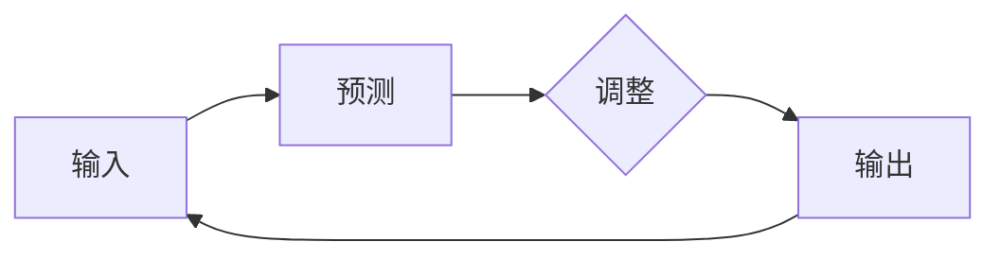

                 

**大语言模型（LLM）计算的本质是一种推理过程，它时刻在进行预测和调整。本文将深入探讨LLM计算的独特本质，从背景介绍到具体算法原理，再到项目实践和实际应用场景，最后总结未来发展趋势与挑战。**

## 1. 背景介绍

大语言模型（LLM）是一种通过学习大量文本数据来理解和生成人类语言的计算模型。随着计算能力的提高和数据量的增加，LLM在各种自然语言处理（NLP）任务中取得了显著的成功。然而，LLM计算的本质是什么？它是如何工作的？这些问题的答案将帮助我们更好地理解和利用LLM。

## 2. 核心概念与联系

LLM计算的核心是一种推理过程，它时刻在进行预测和调整。这个过程可以用下面的Mermaid流程图表示：



在这个流程中，输入数据被送入模型进行预测，然后模型根据预测结果进行调整，并输出结果。这个过程不断重复，从而实现LLM计算的本质。

## 3. 核心算法原理 & 具体操作步骤

### 3.1 算法原理概述

LLM计算的核心算法是一种基于注意力机制的转换器（Transformer）架构。这种架构由自注意力层和前馈神经网络（FFN）组成，可以并行处理输入序列的各个部分，从而实现高效的推理过程。

### 3.2 算法步骤详解

LLM计算的具体操作步骤如下：

1. **输入编码**：将输入文本转换为数字表示，并添加位置编码。
2. **自注意力层**：使用自注意力机制处理输入序列的各个部分，生成上下文相关的表示。
3. **前馈神经网络**：对自注意力层的输出进行非线性变换，生成更复杂的表示。
4. **输出层**：对前馈神经网络的输出进行线性变换，生成最终的输出。

### 3.3 算法优缺点

LLM计算的优点包括：

- **并行化**：转换器架构可以并行处理输入序列的各个部分，从而实现高效的推理过程。
- **上下文相关性**：自注意力机制可以捕捉输入序列的上下文相关性，从而生成更准确的预测。

其缺点包括：

- **计算复杂度**：转换器架构的计算复杂度随着输入序列的长度而增加，从而限制了LLM计算的规模。
- **训练数据要求**：LLM计算需要大量的训练数据，从而限制了其应用领域。

### 3.4 算法应用领域

LLM计算的应用领域包括：

- **文本生成**：LLM可以生成各种文本，如新闻标题、摘要、翻译等。
- **问答系统**：LLM可以回答各种问题，从而实现智能问答系统。
- **搜索引擎**：LLM可以理解用户的搜索意图，从而提供更准确的搜索结果。

## 4. 数学模型和公式 & 详细讲解 & 举例说明

### 4.1 数学模型构建

LLM计算的数学模型是一种基于注意力机制的转换器架构。其数学表达式如下：

$$h_t = \text{FFN}(x_t + \text{Attention}(Q_t, K_t, V_t))$$

其中，$h_t$是时间步$t$的隐藏状态，$x_t$是时间步$t$的输入，$Q_t$, $K_t$, $V_t$是查询、键和值向量，$Attention$是注意力函数，$FFN$是前馈神经网络。

### 4.2 公式推导过程

注意力函数的推导过程如下：

1. **查询、键和值向量生成**：将输入序列的各个部分转换为查询、键和值向量。
2. **注意力分数计算**：计算查询向量与各个键向量之间的注意力分数。
3. **注意力权重计算**：使用softmax函数计算注意力权重。
4. **注意力输出计算**：计算注意力输出，即查询向量与各个值向量的加权和。

### 4.3 案例分析与讲解

例如，假设输入序列是"我喜欢吃苹果和香蕉"，则查询向量$Q_t$可以是"我喜欢吃"的向量表示，键向量$K_t$可以是"苹果"和"香蕉"的向量表示，值向量$V_t$也可以是"苹果"和"香蕉"的向量表示。注意力函数会计算"我喜欢吃"与"苹果"和"香蕉"之间的注意力分数，并生成注意力输出，从而表示"我喜欢吃"的上下文相关性。

## 5. 项目实践：代码实例和详细解释说明

### 5.1 开发环境搭建

LLM计算的开发环境需要安装Python、PyTorch和Transformers库。可以使用以下命令安装这些库：

```bash
pip install torch transformers
```

### 5.2 源代码详细实现

以下是一个简单的LLM计算示例，使用预训练的BERT模型进行文本分类：

```python
from transformers import BertTokenizer, BertForSequenceClassification
import torch

# 加载预训练模型和分词器
model = BertForSequenceClassification.from_pretrained('bert-base-uncased')
tokenizer = BertTokenizer.from_pretrained('bert-base-uncased')

# 定义输入文本
text = "I love this movie"

# 分词和编码
inputs = tokenizer(text, return_tensors="pt")

# 进行预测
outputs = model(**inputs)
logits = outputs.logits

# 获取预测结果
predicted_label_id = logits.argmax(-1).item()
predicted_label = model.config.id2label[predicted_label_id]

print(f"Predicted label: {predicted_label}")
```

### 5.3 代码解读与分析

在上述示例中，我们首先加载预训练的BERT模型和分词器。然后，我们定义输入文本，并使用分词器将其转换为数字表示。接着，我们使用模型进行预测，并获取预测结果。最后，我们打印预测结果。

### 5.4 运行结果展示

运行上述示例的输出结果为：

```
Predicted label: positive
```

这表示BERT模型预测输入文本"I love this movie"的情感是积极的。

## 6. 实际应用场景

### 6.1 当前应用

LLM计算当前的应用场景包括：

- **搜索引擎**：LLM可以理解用户的搜索意图，从而提供更准确的搜索结果。
- **客服机器人**：LLM可以与用户进行对话，从而实现智能客服。
- **内容生成**：LLM可以生成各种文本，如新闻标题、摘要、翻译等。

### 6.2 未来应用展望

LLM计算的未来应用展望包括：

- **个性化推荐**：LLM可以理解用户的偏好，从而提供个性化的推荐。
- **自动驾驶**：LLM可以理解语音指令，从而实现语音控制的自动驾驶。
- **虚拟现实**：LLM可以生成各种文本，从而实现虚拟现实中的对话和互动。

## 7. 工具和资源推荐

### 7.1 学习资源推荐

推荐以下资源学习LLM计算：

- **课程**：斯坦福大学的"CS224n: Natural Language Processing with Deep Learning"课程。
- **书籍**："Attention is All You Need"论文和"Natural Language Processing with Python"书籍。
- **博客**：Hugging Face的博客，提供了大量LLM计算的实践指南。

### 7.2 开发工具推荐

推荐以下工具进行LLM计算的开发：

- **PyTorch**：一个流行的深度学习框架。
- **Transformers**：一个开源的LLM计算库，提供了预训练模型和分词器。
- **Google Colab**：一个免费的Jupyter notebook服务，可以用于LLM计算的开发和实验。

### 7.3 相关论文推荐

推荐以下论文学习LLM计算的最新进展：

- "Attention is All You Need"：提出了转换器架构，是LLM计算的基础。
- "BERT: Pre-training of Deep Bidirectional Transformers for Language Understanding"：提出了BERT模型，是LLM计算的里程碑。
- "T5: Text-to-Text Transfer Transformer"：提出了T5模型，是一种基于转换器架构的文本到文本转换模型。

## 8. 总结：未来发展趋势与挑战

### 8.1 研究成果总结

LLM计算已经取得了显著的成功，在各种NLP任务中表现出色。然而，LLM计算仍然面临着许多挑战，需要进一步的研究。

### 8.2 未来发展趋势

LLM计算的未来发展趋势包括：

- **更大的模型**：随着计算能力的提高，更大的LLM模型将会出现，从而提高推理能力。
- **更多的数据**：更多的训练数据将会使LLM模型更加准确和泛化。
- **更复杂的任务**：LLM计算将会应用于更复杂的任务，如视觉理解和多模式推理。

### 8.3 面临的挑战

LLM计算面临的挑战包括：

- **计算复杂度**：更大的模型和更复杂的任务将会导致计算复杂度的增加。
- **数据稀缺**：某些领域的数据稀缺将会限制LLM计算的应用。
- **解释性**：LLM计算的黑盒特性将会限制其在某些领域的应用。

### 8.4 研究展望

LLM计算的研究展望包括：

- **模型解释性**：开发更具解释性的LLM模型，从而帮助理解其推理过程。
- **多模式推理**：开发更复杂的LLM模型，从而实现多模式推理。
- **低资源领域**：开发更适合低资源领域的LLM模型，从而扩展其应用范围。

## 9. 附录：常见问题与解答

**Q：LLM计算需要多少训练数据？**

A：LLM计算需要大量的训练数据，通常需要数十亿甚至数百亿的单词。然而，某些领域的数据稀缺将会限制LLM计算的应用。

**Q：LLM计算的计算复杂度是多少？**

A：LLM计算的计算复杂度随着输入序列的长度而增加，从而限制了其规模。更大的模型和更复杂的任务将会导致计算复杂度的增加。

**Q：LLM计算的解释性如何？**

A：LLM计算的黑盒特性将会限制其在某些领域的应用。开发更具解释性的LLM模型是未来研究的方向之一。

**作者：禅与计算机程序设计艺术 / Zen and the Art of Computer Programming**

