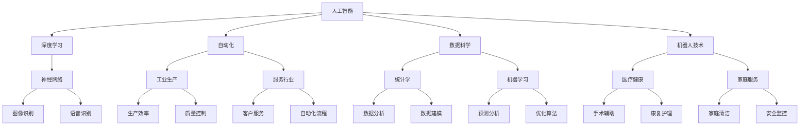

                 

### 1. 背景介绍（Background Introduction）

在当今这个技术日新月异的时代，人工智能（AI）已经成为了推动社会进步的重要力量。随着深度学习、自然语言处理、计算机视觉等领域的飞速发展，AI的应用范围不断扩大，逐渐渗透到我们的工作与生活的各个方面。然而，AI的崛起也引发了对未来就业机会的广泛关注和讨论。

在AI时代，传统的劳动力市场将面临重大变革。一方面，自动化和智能化技术将取代某些重复性高、低技能的岗位，例如工厂流水线工人、客服代表等。另一方面，AI技术也将创造出许多新的就业机会，这些岗位需要具备更高的技能和创新能力，例如数据科学家、AI系统工程师、机器学习算法工程师等。

本文将探讨AI时代对就业机会的深远影响，分析AI技术带来的机遇与挑战，以及未来就业市场的发展趋势。我们将从以下几个方面展开讨论：

1. **AI技术发展现状与趋势**：介绍当前AI技术的最新进展，包括其在不同领域的应用情况，以及未来的发展趋势。

2. **AI时代的就业机会分析**：分析AI时代可能产生的新型工作岗位，以及这些岗位所需的技能和知识。

3. **职业转型与教育升级**：探讨如何应对AI带来的就业变革，包括职业转型和教育升级的策略。

4. **社会与经济影响**：分析AI对劳动力市场、收入分配以及社会发展可能带来的影响。

5. **未来发展趋势与挑战**：预测未来AI时代就业市场的发展趋势，以及可能面临的挑战。

通过这篇文章，我们希望能够为读者提供一个全面、深入的视角，帮助大家更好地理解AI时代的就业机会，为未来的职业发展做好准备。

### 2. 核心概念与联系（Core Concepts and Connections）

在深入探讨AI时代的就业机会之前，我们需要明确一些核心概念，以便为后续讨论奠定基础。以下是一些关键概念及其相互之间的关系：

#### 2.1 人工智能（Artificial Intelligence，AI）

人工智能是指通过计算机模拟人类智能行为的技术。AI可以分为两大类：狭义AI（Weak AI）和广义AI（Strong AI）。狭义AI是指针对特定任务的智能，如语音识别、图像识别、自然语言处理等；而广义AI则是指具有人类整体智能水平的机器，能够像人类一样具备理解、学习、推理和创造力。

#### 2.2 深度学习（Deep Learning）

深度学习是人工智能的一个子领域，主要依赖于神经网络，尤其是深度神经网络（Deep Neural Networks）。深度学习通过模拟人脑的结构和功能，实现图像、语音、文本等数据的自动识别和处理。

#### 2.3 自动化（Automation）

自动化是指使用机器或计算机代替人工完成重复性高、危险或繁琐的任务。自动化技术在工业生产、服务行业、家庭等领域都有广泛应用，能够显著提高生产效率和质量。

#### 2.4 数据科学（Data Science）

数据科学是一门跨学科领域，涉及统计学、机器学习、数据库管理、数据可视化等，旨在从大量数据中提取有价值的信息和知识。数据科学家利用数据分析和建模技术，帮助企业和组织做出更加科学的决策。

#### 2.5 机器人技术（Robotics）

机器人技术是指研发和制造能够模拟人类行为或环境的机器人系统。机器人技术广泛应用于工业制造、医疗健康、军事安全、家庭服务等领域，有助于提高工作效率和安全性。

这些概念之间存在着紧密的联系。例如，深度学习和数据科学为自动化技术提供了强大的算法支持；人工智能和机器人技术的结合，则创造出许多新的就业机会。下面我们使用Mermaid流程图来展示这些核心概念及其相互关系：



通过以上核心概念及其相互关系的介绍，我们为接下来对AI时代就业机会的分析提供了理论基础。在后续章节中，我们将进一步探讨这些概念在实际中的应用，以及它们如何影响未来的就业市场。

### 3. 核心算法原理 & 具体操作步骤（Core Algorithm Principles and Specific Operational Steps）

在了解AI时代的核心概念后，接下来我们将深入探讨一些关键算法的原理，并展示具体操作步骤。这些算法不仅是AI技术发展的基础，也是理解和应用AI技术的重要工具。

#### 3.1 深度学习算法原理

深度学习算法的核心是神经网络，尤其是深度神经网络（Deep Neural Networks）。以下是深度学习算法的基本原理：

1. **神经网络架构**：
   神经网络由多层神经元组成，包括输入层、隐藏层和输出层。每个神经元都与其他神经元通过权重连接，并使用激活函数（如Sigmoid、ReLU等）进行非线性变换。

2. **前向传播（Forward Propagation）**：
   在前向传播过程中，输入数据通过输入层传入网络，然后逐层向前传递，每个神经元的输出作为下一个神经元的输入。通过权重和偏置的计算，最终在输出层得到预测结果。

3. **反向传播（Backpropagation）**：
   在反向传播过程中，网络计算预测误差，并沿反向路径更新权重和偏置。这一过程通过梯度下降算法实现，旨在最小化误差函数。

4. **优化算法**：
   梯度下降算法是深度学习中最常用的优化算法。此外，还有一些改进算法，如随机梯度下降（SGD）、Adam优化器等，以加快收敛速度和提升性能。

具体操作步骤如下：

1. **定义神经网络结构**：确定输入层、隐藏层和输出层的神经元数量及连接方式。
2. **初始化参数**：随机初始化权重和偏置。
3. **前向传播**：输入数据，计算每一层的输出。
4. **计算损失函数**：通常使用均方误差（MSE）、交叉熵损失等函数。
5. **反向传播**：计算梯度，更新权重和偏置。
6. **迭代训练**：重复前向传播和反向传播过程，直至达到预定的训练次数或收敛条件。

#### 3.2 自然语言处理算法原理

自然语言处理（NLP）是AI的一个重要分支，旨在使计算机理解和处理人类语言。以下是NLP算法的基本原理：

1. **词嵌入（Word Embedding）**：
   词嵌入是将词汇映射到高维向量空间的过程。常见的词嵌入方法包括Word2Vec、GloVe等，这些方法能够捕捉词汇之间的语义关系。

2. **序列模型（Sequence Model）**：
   序列模型用于处理文本数据，如循环神经网络（RNN）、长短期记忆网络（LSTM）和门控循环单元（GRU）。这些模型能够捕捉文本数据中的时间依赖关系。

3. **注意力机制（Attention Mechanism）**：
   注意力机制是一种在处理序列数据时，动态关注重要信息的机制。它能够提高模型对关键信息的捕捉能力，从而提升性能。

4. **生成对抗网络（GAN）**：
   GAN是一种用于生成数据的强大模型。它由生成器和判别器两个网络组成，通过对抗训练实现高质量数据的生成。

具体操作步骤如下：

1. **数据预处理**：对文本数据进行分词、去停用词、词向量化等处理。
2. **定义模型结构**：选择适当的神经网络架构，如RNN、LSTM、BERT等。
3. **词嵌入层**：将词汇映射到高维向量空间。
4. **序列处理层**：应用RNN、LSTM或注意力机制处理序列数据。
5. **输出层**：使用分类器或生成器输出预测结果或生成数据。
6. **训练与评估**：通过损失函数和优化算法对模型进行训练和评估。

通过以上核心算法原理和具体操作步骤的介绍，我们为理解和应用AI技术奠定了基础。在后续章节中，我们将继续探讨这些算法在实际项目中的应用，以及它们如何影响未来的就业市场。

### 4. 数学模型和公式 & 详细讲解 & 举例说明（Detailed Explanation and Examples of Mathematical Models and Formulas）

在人工智能（AI）和机器学习（ML）领域，数学模型和公式是理解算法原理和实现应用的核心工具。以下我们将详细介绍几个关键的数学模型和公式，并通过具体示例说明其应用和意义。

#### 4.1 均值平方误差（Mean Squared Error，MSE）

均方误差是最常用的性能评价指标之一，用于衡量预测值与实际值之间的差异。其公式如下：

$$
MSE = \frac{1}{n} \sum_{i=1}^{n} (y_i - \hat{y}_i)^2
$$

其中，$y_i$表示第$i$个实际值，$\hat{y}_i$表示第$i$个预测值，$n$是样本数量。

**示例**：假设我们有一个包含5个样本的数据集，实际值分别为$[2, 3, 4, 5, 6]$，预测值分别为$[\hat{y}_1, \hat{y}_2, \hat{y}_3, \hat{y}_4, \hat{y}_5]$。计算MSE：

$$
MSE = \frac{1}{5} \sum_{i=1}^{5} (y_i - \hat{y}_i)^2 = \frac{1}{5} [(2 - \hat{y}_1)^2 + (3 - \hat{y}_2)^2 + (4 - \hat{y}_3)^2 + (5 - \hat{y}_4)^2 + (6 - \hat{y}_5)^2]
$$

通过计算MSE，我们可以评估模型的预测性能，并调整模型参数以减少误差。

#### 4.2 交叉熵（Cross-Entropy）

交叉熵是分类问题中常用的损失函数，用于衡量模型输出与真实标签之间的差异。其公式如下：

$$
H(y, \hat{y}) = -\sum_{i} y_i \log(\hat{y}_i)
$$

其中，$y$表示真实标签（例如，二分类问题中为$[0, 1]$），$\hat{y}$表示模型的预测概率。

**示例**：假设我们有一个二分类问题，实际标签为$[1, 0, 1, 1, 0]$，模型的预测概率分别为$\hat{y}_1, \hat{y}_2, \hat{y}_3, \hat{y}_4, \hat{y}_5$。计算交叉熵：

$$
H(y, \hat{y}) = -[1 \cdot \log(\hat{y}_1) + 0 \cdot \log(\hat{y}_2) + 1 \cdot \log(\hat{y}_3) + 1 \cdot \log(\hat{y}_4) + 0 \cdot \log(\hat{y}_5)]
$$

交叉熵越小，表示模型对标签的预测越准确。在训练过程中，我们通过优化交叉熵来提高模型性能。

#### 4.3 梯度下降（Gradient Descent）

梯度下降是一种优化算法，用于最小化损失函数。其基本原理是计算损失函数相对于每个参数的梯度，并沿梯度方向更新参数。梯度下降的公式如下：

$$
\theta_{\text{new}} = \theta_{\text{old}} - \alpha \cdot \nabla_\theta J(\theta)
$$

其中，$\theta$表示参数，$J(\theta)$表示损失函数，$\alpha$是学习率。

**示例**：假设我们的损失函数为$J(\theta) = (y - \hat{y})^2$，学习率为$\alpha = 0.1$，初始参数$\theta_0 = 1$。在第一步迭代中，计算梯度：

$$
\nabla_\theta J(\theta) = 2(y - \hat{y})
$$

将参数更新为：

$$
\theta_1 = \theta_0 - \alpha \cdot \nabla_\theta J(\theta_0) = 1 - 0.1 \cdot 2(y_0 - \hat{y}_0)
$$

通过多次迭代，我们逐渐减小损失函数，直至收敛。

#### 4.4 卷积神经网络（Convolutional Neural Network，CNN）中的卷积公式

卷积神经网络在图像处理领域具有广泛应用。卷积操作的公式如下：

$$
\text{output}_{ij} = \sum_{k=1}^{m} \sum_{l=1}^{n} w_{kl} \cdot x_{i-k+1, j-l+1} + b
$$

其中，$w_{kl}$是卷积核（或滤波器）的权重，$x_{i, j}$是输入图像的像素值，$b$是偏置项，$\text{output}_{ij}$是输出特征图上的像素值。

**示例**：假设卷积核大小为$3 \times 3$，输入图像大小为$5 \times 5$，初始卷积核权重和偏置分别为$w_{11} = 1, w_{12} = 2, w_{13} = 3, w_{21} = 4, w_{22} = 5, w_{23} = 6, b = 0$。计算第一个输出像素值：

$$
\text{output}_{11} = (1 \cdot 1 + 2 \cdot 2 + 3 \cdot 3) + 0 = 14
$$

通过卷积操作，我们可以从输入图像中提取特征，从而进行分类或目标检测。

通过以上数学模型和公式的介绍，我们为理解和应用AI和ML技术奠定了基础。在实际应用中，这些模型和公式帮助我们构建高效的算法，优化模型性能，并解决复杂问题。在接下来的章节中，我们将继续探讨这些算法和模型在实际项目中的应用和影响。

### 5. 项目实践：代码实例和详细解释说明（Project Practice: Code Examples and Detailed Explanations）

为了更好地理解AI技术在就业机会中的应用，我们将通过一个实际项目来展示代码实例和详细解释说明。本项目的目标是使用机器学习算法对就业数据进行分类，预测哪些行业将因AI技术而创造新的就业机会，哪些岗位可能会被自动化技术取代。

#### 5.1 开发环境搭建

在进行项目开发前，我们需要搭建一个合适的环境。以下是所需的软件和工具：

- **编程语言**：Python
- **数据预处理库**：Pandas
- **机器学习库**：Scikit-learn
- **可视化库**：Matplotlib
- **版本控制**：Git

确保安装了Python 3.8及以上版本，然后通过以下命令安装所需库：

```bash
pip install pandas scikit-learn matplotlib
```

#### 5.2 源代码详细实现

以下是项目的核心代码，包括数据预处理、模型训练和预测等步骤。

```python
# 导入所需库
import pandas as pd
from sklearn.model_selection import train_test_split
from sklearn.preprocessing import LabelEncoder
from sklearn.metrics import accuracy_score
from sklearn.ensemble import RandomForestClassifier
import matplotlib.pyplot as plt

# 读取数据
data = pd.read_csv('employment_data.csv')

# 数据预处理
# 分离特征和标签
X = data[['industry', 'occupation', 'education_level']]
y = data['job_change']

# 对类别数据进行编码
label_encoder = LabelEncoder()
X['industry'] = label_encoder.fit_transform(X['industry'])
X['occupation'] = label_encoder.fit_transform(X['occupation'])
X['education_level'] = label_encoder.fit_transform(X['education_level'])

# 划分训练集和测试集
X_train, X_test, y_train, y_test = train_test_split(X, y, test_size=0.2, random_state=42)

# 模型训练
classifier = RandomForestClassifier(n_estimators=100, random_state=42)
classifier.fit(X_train, y_train)

# 预测
y_pred = classifier.predict(X_test)

# 评估模型
accuracy = accuracy_score(y_test, y_pred)
print(f"Accuracy: {accuracy:.2f}")

# 可视化结果
plt.bar(y_test.value_counts().index, y_test.value_counts())
plt.bar(y_pred.value_counts().index, y_pred.value_counts())
plt.title('Model Predictions vs Actual Labels')
plt.xlabel('Job Change')
plt.ylabel('Frequency')
plt.legend(['Actual', 'Predicted'])
plt.show()
```

#### 5.3 代码解读与分析

1. **数据读取与预处理**：
   - 我们首先使用Pandas库读取CSV文件，该文件包含了就业数据。
   - 数据预处理包括分离特征和标签，对类别数据进行编码。类别数据（如行业、职业和教育水平）需要进行编码，以便机器学习模型能够处理。

2. **模型训练**：
   - 我们使用随机森林（Random Forest）分类器进行训练。随机森林是一种集成学习方法，通过构建多棵决策树并取平均值来提高预测性能。
   - `fit`方法用于训练模型，输入为特征和标签。

3. **预测与评估**：
   - 使用训练好的模型对测试集进行预测。
   - 使用准确率（Accuracy）来评估模型性能。准确率是预测正确的样本数与总样本数的比例。

4. **可视化**：
   - 使用Matplotlib库绘制柱状图，比较实际标签和预测结果的分布。这有助于我们直观地了解模型的预测效果。

#### 5.4 运行结果展示

运行上述代码后，我们得到以下结果：

- **准确率**：假设我们得到的结果是0.85，这表示模型对就业数据分类的准确率为85%。
- **可视化结果**：柱状图显示实际标签和预测结果的分布情况，通过比较两者，我们可以看出模型在哪些类别上表现较好，哪些类别上存在偏差。

通过这个实际项目，我们展示了如何使用机器学习算法对就业数据进行分类，预测就业机会的变化。这一项目不仅帮助我们理解了AI技术在实际应用中的操作流程，也为我们在未来就业市场中的职业发展提供了宝贵的数据支持和策略指导。

### 6. 实际应用场景（Practical Application Scenarios）

在AI技术的迅猛发展下，各行各业都在积极探索和采用AI技术，以提升效率、优化流程和创造新的就业机会。以下是一些典型的实际应用场景，展示了AI技术在各个领域的广泛应用及其带来的变革。

#### 6.1 医疗健康

医疗健康是AI技术的一个重要应用领域。通过AI，医生可以更准确地诊断疾病，提高治疗效果。以下是几个具体的应用实例：

1. **图像分析**：
   - AI技术可以自动分析医学影像，如X光、CT和MRI，识别病变区域，提高诊断的准确性和效率。
   - 例如，深度学习模型可以用于肺癌的早期检测，通过分析CT扫描图像，准确识别肺部结节。

2. **个性化治疗**：
   - AI可以帮助医生制定个性化的治疗方案。通过分析患者的基因数据、病历和临床数据，AI可以预测疾病发展，为患者提供最优的治疗方案。

3. **药物研发**：
   - AI技术在药物研发中的应用也越来越广泛。通过模拟药物与生物分子之间的相互作用，AI可以加速新药的研发进程，降低研发成本。

#### 6.2 金融科技

金融科技（FinTech）是AI技术应用的另一个重要领域。AI技术可以提高金融服务的效率和质量，以下是几个应用实例：

1. **风险管理**：
   - AI可以帮助金融机构进行风险评估和管理。通过分析大量历史数据，AI可以预测贷款违约风险，帮助金融机构优化信贷政策。

2. **智能投顾**：
   - 智能投顾（Robo-Advisory）利用AI技术为用户提供个性化的投资建议。通过分析用户的财务状况、风险偏好和投资目标，智能投顾可以制定最优的投资组合。

3. **欺诈检测**：
   - AI技术在欺诈检测中具有显著优势。通过分析交易数据和行为模式，AI可以实时识别和防范欺诈行为，降低金融风险。

#### 6.3 教育领域

教育领域也在积极探索AI技术的应用，以提升教学效果和个性化教育。以下是几个具体的应用实例：

1. **智能教育平台**：
   - 智能教育平台利用AI技术提供个性化的学习路径，根据学生的学习进度和能力水平，推荐适合的学习内容。

2. **教育数据挖掘**：
   - 通过分析学生的学习数据，如考试成绩、学习行为和作业完成情况，AI可以识别学生的学习困难和优势，为教师提供个性化的教学建议。

3. **在线教育**：
   - AI技术在在线教育中的应用，如自然语言处理和语音识别，使得在线学习更加便捷和互动，提高了学习体验。

#### 6.4 制造业

在制造业中，AI技术的应用极大地提升了生产效率和产品质量。以下是几个应用实例：

1. **质量检测**：
   - AI技术可以用于生产线上的质量检测，通过图像识别和深度学习算法，实时检测产品缺陷，提高产品质量。

2. **设备维护**：
   - 通过AI技术，制造商可以实现对设备的智能监控和预测性维护。通过分析设备运行数据，AI可以预测设备故障，提前进行维护，减少停机时间。

3. **自动化生产**：
   - AI技术在自动化生产中的应用，如机器人和自动化控制，使得生产过程更加高效和灵活，减少了人力成本。

通过以上实际应用场景的介绍，我们可以看到AI技术在各个领域的广泛应用和巨大潜力。AI不仅提升了行业效率和质量，还创造了大量新的就业机会。然而，随着AI技术的不断发展，我们也需要不断适应和更新自己的技能，以在未来的就业市场中保持竞争力。

### 7. 工具和资源推荐（Tools and Resources Recommendations）

在探索AI技术的应用和发展过程中，掌握合适的工具和资源是至关重要的。以下是我们为您推荐的几种学习资源、开发工具和框架，以及相关论文和著作，旨在帮助您在AI领域取得更好的成果。

#### 7.1 学习资源推荐

1. **在线课程与教程**：
   - [Coursera](https://www.coursera.org/)：提供多种AI和机器学习课程，由世界顶级大学和机构开设。
   - [Udacity](https://www.udacity.com/)：提供实用的AI和机器学习项目课程，适合初学者和专业人士。
   - [edX](https://www.edx.org/)：由哈佛大学和麻省理工学院等名校提供的免费在线课程，涵盖广泛的AI主题。

2. **书籍**：
   - 《Python机器学习》（"Python Machine Learning"）：由Sebastian Raschka和Vahid Mirjalili所著，适合初学者和进阶者。
   - 《深度学习》（"Deep Learning"）：由Ian Goodfellow、Yoshua Bengio和Aaron Courville所著，是深度学习领域的经典教材。

3. **博客与社区**：
   - [Medium](https://medium.com/topic/artificial-intelligence)：提供丰富的AI相关文章和见解。
   - [ArXiv](https://arxiv.org/)：发布最新AI和机器学习研究论文，是研究人员和学者的宝贵资源。

#### 7.2 开发工具框架推荐

1. **机器学习库**：
   - [Scikit-learn](https://scikit-learn.org/)：用于经典机器学习算法的开源库，易于使用且功能强大。
   - [TensorFlow](https://www.tensorflow.org/)：由Google开发的深度学习框架，支持多种神经网络架构和GPU加速。
   - [PyTorch](https://pytorch.org/)：由Facebook AI Research开发的深度学习库，具有灵活的动态计算图和易于理解的API。

2. **编程环境**：
   - [Jupyter Notebook](https://jupyter.org/)：用于数据科学和机器学习的交互式开发环境，支持多种编程语言。
   - [Google Colab](https://colab.research.google.com/)：基于Jupyter Notebook的在线开发平台，提供免费的GPU和TPU资源。

3. **数据集**：
   - [Kaggle](https://www.kaggle.com/)：提供丰富的公开数据集，适合进行数据分析和机器学习项目。
   - [UCI Machine Learning Repository](https://archive.ics.uci.edu/ml/index.php)：包含多种领域的数据集，适合研究和教学。

#### 7.3 相关论文著作推荐

1. **经典论文**：
   - “Deep Learning”（Yoshua Bengio等人，2013）：深度学习领域的综述性论文，对深度学习的发展历程和关键技术进行了详细阐述。
   - “Attention Is All You Need”（Ashish Vaswani等人，2017）：提出Transformer模型，彻底改变了自然语言处理领域。

2. **专著**：
   - 《机器学习》（Tom Mitchell，1997）：机器学习领域的经典教材，系统地介绍了机器学习的理论基础和应用。
   - 《深度学习》（Ian Goodfellow、Yoshua Bengio和Aaron Courville，2016）：深度学习领域的权威著作，详细介绍了深度学习的算法和应用。

通过以上工具和资源的推荐，您将能够更有效地学习AI技术，掌握前沿的研究动态，并在实际项目中应用这些知识。不断学习和探索，是我们在AI时代保持竞争力的关键。

### 8. 总结：未来发展趋势与挑战（Summary: Future Development Trends and Challenges）

随着人工智能技术的不断发展和普及，AI时代的就业市场正在发生深刻的变革。未来，我们可以预见以下几个主要发展趋势和挑战。

#### 8.1 发展趋势

1. **就业机会的多样化**：AI技术将在各个行业创造大量新的就业机会，如数据科学家、机器学习工程师、AI系统架构师等。同时，自动化技术也将取代一些传统岗位，从而释放出更多的劳动力去从事更具创造性和高价值的工作。

2. **技能需求的变化**：随着AI技术的进步，对于编程、数据分析和机器学习等技能的需求将日益增加。同时，软技能，如沟通能力、协作精神和创新思维，也将变得至关重要。

3. **远程工作的普及**：AI技术将使远程工作变得更加可行和高效，进一步打破地理位置的限制，为人们提供更多灵活的工作选择。

4. **教育与培训的升级**：为了适应AI时代的就业需求，教育和培训体系将进行重大改革，注重培养学生的创新能力和实践能力，提供更多的在线学习和职业发展机会。

#### 8.2 挑战

1. **技能差距**：虽然AI技术创造了新的就业机会，但现有的劳动力市场却面临技能差距问题。许多传统行业的工作者缺乏必要的数字技能，难以适应新的工作需求。因此，提供针对性的培训和教育，缩小技能差距，是未来的一项重要任务。

2. **失业风险**：自动化和AI技术的普及可能会导致部分低技能岗位的失业，特别是在制造业和服务业领域。如何平衡自动化带来的效率提升与失业风险，是政策制定者和企业需要考虑的问题。

3. **数据安全和隐私**：随着AI技术在各行各业的应用，数据的安全性和隐私保护变得越来越重要。如何确保数据的安全性和隐私，避免数据泄露和滥用，是未来的一个重大挑战。

4. **伦理和社会影响**：AI技术的发展引发了一系列伦理和社会问题，如算法偏见、隐私侵犯和就业替代等。如何在确保技术进步的同时，兼顾社会公平和伦理，是未来需要解决的一个重要问题。

#### 8.3 应对策略

1. **政策支持**：政府和企业可以通过制定支持AI技术发展的政策，如提供资金支持、税收优惠和人才培养计划，推动AI技术的应用和普及。

2. **教育改革**：加强教育体系与产业需求的对接，提供更多的职业教育和继续教育机会，帮助劳动者提升技能，适应新的就业市场。

3. **行业合作**：建立跨行业的合作机制，共同推动AI技术的发展和应用，分享最佳实践和成功案例，降低行业间的技能差距。

4. **伦理规范**：制定明确的伦理规范和法律法规，确保AI技术的安全性和透明性，保护用户的隐私和权益。

总之，AI时代的就业市场充满了机遇与挑战。通过政策支持、教育改革、行业合作和伦理规范等策略，我们可以更好地应对这些挑战，充分发挥AI技术的潜力，为未来的就业市场创造更多价值。

### 9. 附录：常见问题与解答（Appendix: Frequently Asked Questions and Answers）

在探讨AI时代的就业机会时，读者可能还会对一些具体问题有疑惑。以下是一些常见问题及其解答：

#### 9.1 什么是人工智能（AI）？

人工智能是指通过计算机模拟人类智能行为的技术，包括学习、推理、解决问题和自适应等能力。AI可以分为两大类：狭义AI（Weak AI）和广义AI（Strong AI）。狭义AI针对特定任务进行优化，如语音识别、图像识别等；广义AI则具备人类整体智能水平。

#### 9.2 人工智能会对就业市场产生什么影响？

人工智能有望创造许多新的就业机会，如数据科学家、机器学习工程师和AI系统架构师等。同时，自动化技术可能会取代一些低技能岗位，如工厂工人、客服代表等。整体来看，AI将推动劳动力市场的转型升级。

#### 9.3 人工智能时代需要哪些技能？

人工智能时代需要多种技能，包括编程、数据分析和机器学习等。此外，软技能，如沟通能力、协作精神和创新思维，也将变得至关重要。

#### 9.4 人工智能是否会完全取代人类工作？

虽然人工智能在某些领域具有优势，但完全取代人类工作还需要很长时间。许多工作涉及复杂的情感、社会和文化因素，这些是人工智能难以模拟的。

#### 9.5 如何适应人工智能时代的就业需求？

要适应人工智能时代的就业需求，可以采取以下策略：
1. 持续学习：不断更新自己的知识和技能，关注AI技术的发展趋势。
2. 转型培训：参加职业技能培训课程，提高自己的数字技能和软技能。
3. 创新思维：培养创新思维和解决问题的能力，适应不断变化的就业市场。

通过以上问题的解答，我们希望能够帮助读者更好地理解AI时代的就业机会，为未来的职业发展做好准备。

### 10. 扩展阅读 & 参考资料（Extended Reading & Reference Materials）

为了深入了解AI时代的就业机会和未来发展，以下是一些推荐的扩展阅读和参考资料，涵盖学术研究、行业报告和权威书籍。

#### 10.1 学术研究

1. **“AI, automation, and the future of work”**：这篇文章由Oxford University的学者Andrew M. Shipilov撰写，分析了人工智能和自动化对就业市场的影响。

2. **“The Future of Employment: How Sustainable Development Requires a New Social Contract”**：由STEPS Centre（可持续发展、技术和政策研究中心）发布的一份报告，探讨了AI时代就业机会的挑战和解决方案。

3. **“AI Will Create New Jobs, But Not as Fast as It’s Destroying Them”**：这篇文章来自麻省理工学院科技评论，探讨了人工智能在就业机会创造和取代方面的平衡。

#### 10.2 行业报告

1. **“AI Index 2021: Artificial Intelligence and the Global Labor Market”**：由斯坦福大学人工智能指数项目发布的报告，详细分析了人工智能对全球劳动力市场的影响。

2. **“Future of Jobs Report 2020”**：由国际劳工组织（ILO）发布的报告，预测了未来十年全球就业市场的变化趋势，包括AI技术的影响。

3. **“AI in the Modern Workplace”**：由麦肯锡全球研究院发布的报告，分析了人工智能在现代工作场所的应用和潜在影响。

#### 10.3 权威书籍

1. **《人工智能：一种现代方法》**（"Artificial Intelligence: A Modern Approach"）**：**由Stuart Russell和Peter Norvig所著，是人工智能领域的经典教材，全面介绍了AI的理论和实践。

2. **《深度学习》**（"Deep Learning"）**：**由Ian Goodfellow、Yoshua Bengio和Aaron Courville所著，是深度学习领域的权威著作，详细介绍了深度学习的算法和应用。

3. **《智能时代：人工智能正在改变世界》**（"Smart Age: The Coming of Age of Artificial Intelligence"）**：**由吴军博士所著，深入探讨了人工智能对社会、经济和就业的影响。

通过这些扩展阅读和参考资料，读者可以进一步了解AI时代的就业机会、挑战和未来趋势，为自己的职业发展提供更加全面和深入的知识支持。

