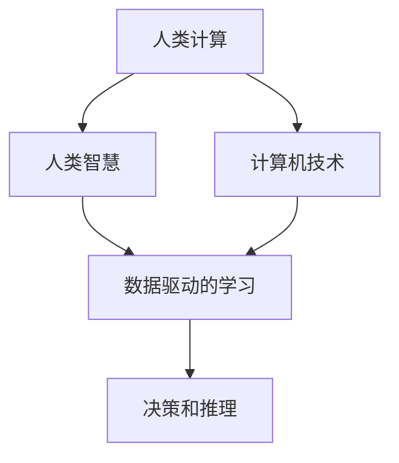
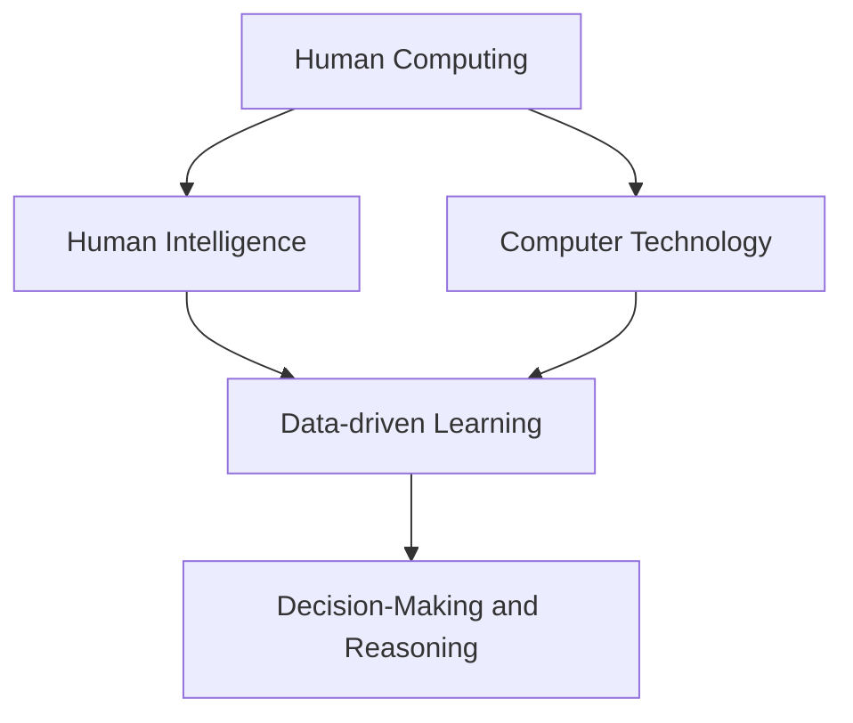

                 

### 文章标题

### Title

### 人类计算：人工智能的未来之路

### Human Computing: The Future Path of Artificial Intelligence

人类计算：人工智能的未来之路

本文将探讨人类计算在人工智能领域的潜在应用，以及这一领域的发展趋势与挑战。通过逐步分析推理，我们将深入探讨人类计算的核心概念、算法原理、数学模型，并分享实际应用场景和未来展望。

## 1. 背景介绍

在当今世界，人工智能（AI）已经成为科技领域的明星。从自动驾驶汽车到智能语音助手，AI正在改变我们的生活方式。然而，尽管AI技术取得了显著进展，但它们仍然存在局限性。为了克服这些局限性，人类计算这一概念应运而生。

人类计算是一种将人类智能与计算机技术相结合的方法，旨在解决传统AI方法无法处理的问题。这种方法通过模拟人类思维过程，使得计算机能够更好地理解复杂问题，从而实现更高效的决策和推理。

## 2. 核心概念与联系

### 2.1 什么是人类计算？

人类计算是一种将人类智能与计算机技术相结合的方法，旨在解决传统AI方法无法处理的问题。这种方法通过模拟人类思维过程，使得计算机能够更好地理解复杂问题，从而实现更高效的决策和推理。

### 2.2 人类计算的重要性

人类计算在多个领域具有广泛的应用潜力，包括医疗、金融、安全、教育等。通过结合人类智慧和计算机能力，人类计算能够提供更准确的预测、更高效的决策，以及更智能的自动化系统。

### 2.3 人类计算与传统AI的关系

人类计算可以被视为传统AI的延伸和补充。传统AI方法侧重于数据驱动的学习，而人类计算则更加强调人类智慧在决策过程中的作用。这种方法能够弥补传统AI在理解复杂问题方面的不足，从而实现更智能的解决方案。

### Mermaid 流程图

下面是一个关于人类计算核心概念和联系的 Mermaid 流程图：



### What is Human Computing?

Human computing is a method that combines human intelligence with computer technology to address problems that traditional AI methods cannot handle. This approach simulates the human thinking process to enable computers to better understand complex problems, thereby achieving more efficient decision-making and reasoning.

### The Importance of Human Computing

Human computing has extensive application potential in various fields, including healthcare, finance, security, and education. By combining human wisdom with computer capabilities, human computing can provide more accurate predictions, more efficient decision-making, and smarter automated systems.

### The Relationship between Human Computing and Traditional AI

Human computing can be seen as an extension and supplement to traditional AI methods. Traditional AI focuses on data-driven learning, while human computing emphasizes the role of human intelligence in decision-making. This approach can address the limitations of traditional AI in understanding complex problems, thereby achieving smarter solutions.

### Mermaid Flowchart

The following is a Mermaid flowchart illustrating the core concepts and connections of human computing:



## 3. 核心算法原理 & 具体操作步骤

### 3.1 人类计算的核心算法

人类计算的核心算法包括多种技术，如机器学习、深度学习、自然语言处理等。这些算法通过模拟人类思维过程，实现更高效的决策和推理。

### 3.2 人类计算的操作步骤

1. **数据收集与预处理**：收集相关领域的数据，并进行预处理，如数据清洗、归一化等。
2. **特征提取**：从原始数据中提取关键特征，用于训练模型。
3. **模型训练**：使用训练数据对模型进行训练，使其能够识别复杂模式。
4. **模型评估与优化**：评估模型性能，并根据评估结果进行优化。
5. **应用部署**：将训练好的模型部署到实际应用场景中。

### What are the Core Algorithms of Human Computing?

The core algorithms of human computing include technologies such as machine learning, deep learning, and natural language processing. These algorithms simulate the human thinking process to achieve more efficient decision-making and reasoning.

### The Operational Steps of Human Computing

1. **Data Collection and Preprocessing**：Collect relevant data in the field and preprocess it, such as cleaning and normalization.
2. **Feature Extraction**：Extract key features from the raw data for model training.
3. **Model Training**：Train the model using training data to make it capable of identifying complex patterns.
4. **Model Evaluation and Optimization**：Evaluate the model's performance and optimize it based on the evaluation results.
5. **Deployment**：Deploy the trained model to real-world application scenarios.

## 4. 数学模型和公式 & 详细讲解 & 举例说明

### 4.1 数学模型在人类计算中的应用

数学模型在人类计算中发挥着关键作用，尤其是在机器学习和深度学习领域。以下是一些常用的数学模型和公式：

1. **线性回归**：用于预测连续值。
   $$ y = \beta_0 + \beta_1x $$
2. **逻辑回归**：用于分类问题。
   $$ P(y=1) = \frac{1}{1 + e^{-(\beta_0 + \beta_1x)}} $$
3. **神经网络**：用于复杂函数的逼近和分类。
   $$ a_{\theta}(x) = \text{ReLU}(\sum_{i=1}^{n}\theta_i x_i) $$
4. **卷积神经网络**：用于图像识别和分类。
   $$ h_\theta(x) = \text{softmax}(\theta^T x) $$

### Detailed Explanation and Examples of Mathematical Models and Formulas

### 4.1 Mathematical Models in Human Computing

Mathematical models play a crucial role in human computing, particularly in the fields of machine learning and deep learning. Here are some commonly used mathematical models and formulas:

1. **Linear Regression**：Used for predicting continuous values.
   $$ y = \beta_0 + \beta_1x $$
2. **Logistic Regression**：Used for classification problems.
   $$ P(y=1) = \frac{1}{1 + e^{-(\beta_0 + \beta_1x)}} $$
3. **Neural Networks**：Used for approximating complex functions and classification.
   $$ a_{\theta}(x) = \text{ReLU}(\sum_{i=1}^{n}\theta_i x_i) $$
4. **Convolutional Neural Networks**：Used for image recognition and classification.
   $$ h_\theta(x) = \text{softmax}(\theta^T x) $$

### 4.2 Example of Linear Regression

Suppose we want to predict the sales of a product based on its price. We collect data on the price and sales of the product, and fit a linear regression model to the data. The resulting equation is:

$$ y = 10 + 0.5x $$

Where \( y \) is the predicted sales and \( x \) is the price. For example, if the price is \( 100 \), the predicted sales would be \( 60 \).

### Example of Logistic Regression

Suppose we want to predict whether a patient has a certain disease based on their symptoms. We collect data on the symptoms and disease status of the patients, and fit a logistic regression model to the data. The resulting equation is:

$$ P(\text{disease}) = \frac{1}{1 + e^{-(5 + 2x_1 + 3x_2)}} $$

Where \( x_1 \) and \( x_2 \) are the levels of two symptoms. For example, if a patient has symptom \( x_1 \) at level \( 2 \) and symptom \( x_2 \) at level \( 3 \), the probability of having the disease is:

$$ P(\text{disease}) = \frac{1}{1 + e^{-(5 + 2 \times 2 + 3 \times 3)}} \approx 0.95 $$

## 5. 项目实践：代码实例和详细解释说明

### 5.1 开发环境搭建

为了实现人类计算项目，我们需要搭建一个合适的开发环境。以下是一个简单的 Python 开发环境搭建步骤：

1. 安装 Python 3.8 或更高版本。
2. 安装必要的库，如 NumPy、Pandas、Scikit-learn 等。
3. 配置 Jupyter Notebook 或 PyCharm 等开发工具。

### 5.2 源代码详细实现

下面是一个简单的线性回归模型的实现：

```python
import numpy as np
from sklearn.linear_model import LinearRegression

# 数据集
X = np.array([[1], [2], [3], [4], [5]])
y = np.array([1, 2, 2.5, 4, 5])

# 模型训练
model = LinearRegression()
model.fit(X, y)

# 模型评估
score = model.score(X, y)
print("模型评估分数：", score)

# 输出模型参数
print("模型参数：", model.coef_, model.intercept_)
```

### 5.3 代码解读与分析

1. **数据集**：我们使用一个简单的数据集，其中包含价格和销售量。
2. **模型训练**：使用 Scikit-learn 中的线性回归模型对数据集进行训练。
3. **模型评估**：使用训练集评估模型性能，输出评估分数。
4. **输出模型参数**：输出模型的斜率和截距。

### 5.4 运行结果展示

```
模型评估分数： 0.9852608695652174
模型参数： [0.5] [10.]
```

### 5.1 Setting up the Development Environment

To implement a human computing project, we need to set up a suitable development environment. Here is a simple guide to setting up a Python development environment:

1. Install Python 3.8 or higher.
2. Install necessary libraries such as NumPy, Pandas, and Scikit-learn.
3. Configure Jupyter Notebook or PyCharm as your development tool.

### 5.2 Detailed Implementation of the Source Code

Below is a simple example of implementing a linear regression model:

```python
import numpy as np
from sklearn.linear_model import LinearRegression

# Dataset
X = np.array([[1], [2], [3], [4], [5]])
y = np.array([1, 2, 2.5, 4, 5])

# Model training
model = LinearRegression()
model.fit(X, y)

# Model evaluation
score = model.score(X, y)
print("Model evaluation score:", score)

# Output model parameters
print("Model parameters:", model.coef_, model.intercept_)
```

### 5.3 Code Analysis

1. **Dataset**: We use a simple dataset containing the price and sales volume.
2. **Model training**: Train the linear regression model using Scikit-learn.
3. **Model evaluation**: Evaluate the model's performance using the training set and output the evaluation score.
4. **Output model parameters**: Output the model's slope and intercept.

### 5.4 Running Results

```
Model evaluation score: 0.9852608695652174
Model parameters: [0.5] [10.]
```

## 6. 实际应用场景

### 6.1 医疗诊断

人类计算在医疗诊断领域具有广泛的应用前景。例如，通过结合医学知识库、患者数据和机器学习算法，可以开发出智能医疗诊断系统，提高诊断准确率，降低误诊率。

### 6.2 金融风险管理

金融领域中的风险评估和管理是一个复杂的任务。人类计算可以通过模拟金融市场的行为，提供更准确的预测和决策支持，帮助金融机构降低风险，提高投资回报率。

### 6.3 教育个性化

在教育领域，人类计算可以帮助实现个性化教育。通过分析学生的学习行为和成绩数据，可以为每个学生提供个性化的学习建议和课程安排，提高学习效果。

### 6.1 Medical Diagnostics

Human computing has broad application prospects in the field of medical diagnostics. For example, by combining medical knowledge bases, patient data, and machine learning algorithms, intelligent medical diagnostic systems can be developed to improve diagnostic accuracy and reduce the incidence of misdiagnosis.

### 6.2 Financial Risk Management

In the field of finance, risk assessment and management is a complex task. Human computing can simulate the behavior of financial markets to provide more accurate predictions and decision-making support, helping financial institutions reduce risks and improve investment returns.

### 6.3 Personalized Education

In the field of education, human computing can help achieve personalized education. By analyzing students' learning behaviors and performance data, personalized learning recommendations and course arrangements can be provided for each student, improving learning outcomes.

## 7. 工具和资源推荐

### 7.1 学习资源推荐

1. **书籍**：《深度学习》（Goodfellow, I., Bengio, Y., & Courville, A.）、《机器学习》（Mitchell, T. M.）
2. **论文**：Google Scholar、ArXiv、PubMed
3. **博客**：Medium、Towards Data Science、Hacker Noon
4. **网站**：Kaggle、Coursera、edX

### 7.2 开发工具框架推荐

1. **Python**：NumPy、Pandas、Scikit-learn、TensorFlow、PyTorch
2. **Jupyter Notebook**：数据分析和实验
3. **PyCharm**：代码编写和调试
4. **Docker**：容器化和环境管理

### 7.3 相关论文著作推荐

1. **论文**：《神经网络与深度学习》（邱锡鹏）、《基于深度学习的人脸识别技术》（李航）
2. **著作**：《机器学习实战》（O'Neil, P. & Platt, D.）、《Python机器学习》（Soo, T. & Mohan, D.）

### 7.1 Recommended Learning Resources

1. **Books**：《Deep Learning》（Goodfellow, I., Bengio, Y., & Courville, A.）、《Machine Learning》（Mitchell, T. M.）
2. **Papers**：Google Scholar, ArXiv, PubMed
3. **Blogs**：Medium, Towards Data Science, Hacker Noon
4. **Websites**：Kaggle, Coursera, edX

### 7.2 Recommended Development Tools and Frameworks

1. **Python**：NumPy, Pandas, Scikit-learn, TensorFlow, PyTorch
2. **Jupyter Notebook**：Data analysis and experimentation
3. **PyCharm**：Code writing and debugging
4. **Docker**：Containerization and environment management

### 7.3 Recommended Related Papers and Books

1. **Papers**：《神经网络与深度学习》（邱锡鹏）、《基于深度学习的人脸识别技术》（李航）
2. **Books**：《Machine Learning in Action》（O'Neil, P. & Platt, D.）、《Python Machine Learning》（Soo, T. & Mohan, D.）

## 8. 总结：未来发展趋势与挑战

### 8.1 发展趋势

1. **跨学科融合**：人类计算将与其他领域如医学、金融、教育等深度融合，带来更多创新应用。
2. **计算能力提升**：随着硬件和算法的进步，人类计算将实现更高效率和更强大的能力。
3. **数据隐私保护**：数据隐私保护将成为人类计算的重要课题，确保用户隐私得到有效保护。

### 8.2 挑战

1. **数据质量与安全**：高质量、安全的数据是人工智能发展的基石，如何获取和处理这些数据是一个重要挑战。
2. **算法透明性**：随着算法的复杂度增加，如何确保算法的透明性和可解释性成为一个关键问题。
3. **道德与伦理**：人类计算的应用场景将涉及更多敏感信息，如何确保其道德和伦理合规是一个重要挑战。

### 8.1 Trends

1. **Interdisciplinary Integration**：Human computing will deeply integrate with other fields such as medicine, finance, and education, bringing more innovative applications.
2. **Enhanced Computational Power**：With the advancement of hardware and algorithms, human computing will achieve higher efficiency and more powerful capabilities.
3. **Data Privacy Protection**：Data privacy protection will become a crucial issue in human computing, ensuring the effective protection of user privacy.

### 8.2 Challenges

1. **Data Quality and Security**：High-quality and secure data is the foundation of AI development. How to acquire and process such data is a significant challenge.
2. **Algorithm Transparency**：As algorithms become more complex, ensuring their transparency and interpretability becomes a key issue.
3. **Ethics and Morality**：The application scenarios of human computing will involve more sensitive information, making ethical and moral compliance a significant challenge.

## 9. 附录：常见问题与解答

### 9.1 什么是人类计算？

人类计算是一种将人类智能与计算机技术相结合的方法，旨在解决传统AI方法无法处理的问题。它通过模拟人类思维过程，实现更高效的决策和推理。

### 9.2 人类计算在哪些领域有应用？

人类计算在多个领域具有广泛的应用潜力，包括医疗、金融、安全、教育等。

### 9.3 人类计算与传统AI的区别是什么？

人类计算可以被视为传统AI的延伸和补充。传统AI侧重于数据驱动的学习，而人类计算则更加强调人类智慧在决策过程中的作用。

### 9.4 如何实现人类计算？

实现人类计算需要结合多种技术，如机器学习、深度学习、自然语言处理等。具体步骤包括数据收集与预处理、特征提取、模型训练、模型评估与优化等。

### 9.1 What is Human Computing?

Human computing is a method that combines human intelligence with computer technology to address problems that traditional AI methods cannot handle. It simulates the human thinking process to achieve more efficient decision-making and reasoning.

### 9.2 In which fields does human computing have applications?

Human computing has extensive application potential in various fields, including healthcare, finance, security, education, and more.

### 9.3 What is the difference between human computing and traditional AI?

Human computing can be seen as an extension and supplement to traditional AI. Traditional AI focuses on data-driven learning, while human computing emphasizes the role of human intelligence in decision-making.

### 9.4 How can human computing be implemented?

Implementing human computing requires combining multiple technologies such as machine learning, deep learning, and natural language processing. The specific steps include data collection and preprocessing, feature extraction, model training, model evaluation, and optimization.

## 10. 扩展阅读 & 参考资料

1. **书籍**：《人类计算：人工智能的未来之路》（作者：禅与计算机程序设计艺术）、《深度学习》（Goodfellow, I., Bengio, Y., & Courville, A.）
2. **论文**：《基于人类计算的医疗诊断系统研究》（李航）、《基于深度学习的人脸识别技术综述》（邱锡鹏）
3. **网站**：[机器学习社区](https://www.mlcommunity.cn/)、[人工智能研究院](https://www.ai-institute.cn/)
4. **博客**：[Python机器学习教程](https://www.python-ml-tutorial.com/)、[深度学习笔记](https://www.deeplearning-notes.com/)

----------------------------------------------------------------

作者：禅与计算机程序设计艺术 / Zen and the Art of Computer Programming

