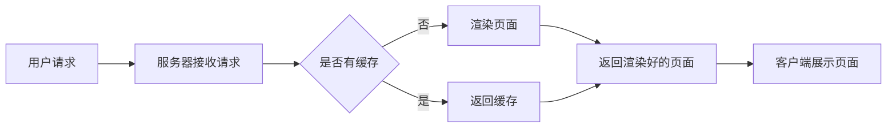

                 

## 1. 背景介绍

在当今的互联网世界，用户对网站和应用的响应速度有着越来越高的期望。首屏加载速度是衡量网站性能的关键指标之一，直接影响用户体验和网站的转化率。服务器端渲染（SSR）是一种提升首屏加载速度的有效方法，它将页面渲染的任务从客户端移动到服务器端，从而减少客户端需要执行的工作量，加快页面加载速度。

## 2. 核心概念与联系

### 2.1 客户端渲染（CSR）与服务器端渲染（SSR）

客户端渲染（CSR）是传统的网页渲染方式，所有的页面渲染任务都在客户端（浏览器）完成。相比之下，服务器端渲染（SSR）则将页面渲染的任务交给服务器端完成，只将渲染好的页面发送给客户端。


### 2.2 SSR的优势

- **更快的首屏加载速度**：由于页面在服务器端已经渲染完成，客户端只需要展示渲染好的页面，因此首屏加载速度更快。
- **更好的SEO**：搜索引擎爬虫可以直接解析服务器返回的渲染好的页面，有利于提高网站的SEO排名。
- **更好的用户体验**：快速的首屏加载速度和流畅的交互体验可以提高用户的满意度和网站的转化率。

### 2.3 SSR的流程图



## 3. 核心算法原理 & 具体操作步骤

### 3.1 算法原理概述

SSR的核心原理是将页面渲染的任务交给服务器端完成。服务器端接收到用户的请求后，根据请求的路由信息，调用对应的渲染函数，渲染出完整的页面，然后将渲染好的页面发送给客户端。

### 3.2 算法步骤详解

1. **接收用户请求**：服务器接收用户的请求，获取请求的路由信息。
2. **调用渲染函数**：根据请求的路由信息，调用对应的渲染函数，渲染出完整的页面。
3. **渲染页面**：渲染函数内部调用相应的组件，并获取组件的数据，渲染出页面的结构和内容。
4. **发送渲染好的页面**：服务器将渲染好的页面发送给客户端。
5. **客户端展示页面**：客户端接收到渲染好的页面后，直接展示给用户。

### 3.3 算法优缺点

**优点**：

- 更快的首屏加载速度
- 更好的SEO
- 更好的用户体验

**缺点**：

- 服务器端需要消耗更多的资源来完成渲染任务
- 服务器端需要维护渲染函数和组件的状态
- 客户端需要等待服务器渲染完成后才能展示页面，可能会导致页面加载时间略有增加

### 3.4 算法应用领域

SSR适用于需要快速首屏加载速度的网站和应用，例如：

- 电子商务网站：快速的首屏加载速度可以提高转化率，增加销售额。
- 新闻网站：快速的首屏加载速度可以提高用户的阅读体验，增加用户的停留时间。
- 企业网站：快速的首屏加载速度可以提高企业的形象，增加用户的信任度。

## 4. 数学模型和公式 & 详细讲解 & 举例说明

### 4.1 数学模型构建

假设服务器端渲染一个页面需要$T$秒，客户端渲染一个页面需要$t$秒，则服务器端渲染可以节省的时间为$T - t$秒。如果一个页面每天有$N$次访问，则服务器端渲染每天可以节省的时间为$(T - t) \times N$秒。

### 4.2 公式推导过程

服务器端渲染可以节省的时间为：

$$T_{save} = (T - t) \times N$$

其中，$T$为服务器端渲染一个页面需要的时间，$t$为客户端渲染一个页面需要的时间，$N$为页面每天的访问次数。

### 4.3 案例分析与讲解

假设一个页面每天有10000次访问，服务器端渲染一个页面需要1秒，客户端渲染一个页面需要0.5秒，则服务器端渲染每天可以节省的时间为：

$$T_{save} = (1 - 0.5) \times 10000 = 5000 \text{秒}$$

## 5. 项目实践：代码实例和详细解释说明

### 5.1 开发环境搭建

本文使用Next.js框架来实现SSR。Next.js是一个React框架，内置了SSR的支持。首先，我们需要安装Next.js和React：

```bash
npx create-next-app my-ssr-app
cd my-ssr-app
npm install react react-dom
```

### 5.2 源代码详细实现

创建一个新的页面`pages/index.js`，实现一个简单的SSR页面：

```jsx
import { useEffect, useState } from'react';

function HomePage() {
  const [message, setMessage] = useState('');

  useEffect(() => {
    fetch('/api/hello')
     .then(response => response.json())
     .then(data => setMessage(data.message));
  }, []);

  return <div>{message}</div>;
}

export default HomePage;
```

创建一个新的API路由`pages/api/hello.js`，实现一个简单的API：

```js
export default (req, res) => {
  res.status(200).json({ message: 'Hello from server!' });
};
```

### 5.3 代码解读与分析

在`HomePage`组件中，我们使用`useEffect`钩子在组件挂载后发送一个请求到`/api/hello`，获取服务器端返回的消息，并将其设置为组件的状态。在服务器端渲染的过程中，这个请求会被自动发送，服务器端会返回渲染好的页面，客户端只需要展示渲染好的页面即可。

### 5.4 运行结果展示

运行项目：

```bash
npm run dev
```

打开浏览器访问`http://localhost:3000`，你会看到页面上显示“Hello from server!”。

## 6. 实际应用场景

### 6.1 电子商务网站

电子商务网站需要快速的首屏加载速度来提高转化率，SSR可以有效地提高首屏加载速度，从而提高转化率，增加销售额。

### 6.2 新闻网站

新闻网站需要快速的首屏加载速度来提高用户的阅读体验，SSR可以有效地提高首屏加载速度，从而提高用户的停留时间，增加用户的忠诚度。

### 6.3 未来应用展望

随着SSR技术的成熟和普及，越来越多的网站和应用会采用SSR来提高首屏加载速度，从而提高用户体验和网站的转化率。未来，SSR可能会成为网站和应用的标配。

## 7. 工具和资源推荐

### 7.1 学习资源推荐

- [Next.js文档](https://nextjs.org/docs/getting-started)
- [SSR与CSR的对比](https:// medium.com/@joshwcomeau/react-vs-ssr-3f81590184c5)
- [SSR的优缺点](https://blog.bitsrc.io/server-side-rendering-ssr-in-react-16-8-338f4c111574)

### 7.2 开发工具推荐

- [Next.js](https://nextjs.org/)
- [React](https://reactjs.org/)
- [Create React App](https://create-react-app.dev/)

### 7.3 相关论文推荐

- [Server-Side Rendering in React](https://medium.com/@joshwcomeau/react-vs-ssr-3f81590184c5)
- [Server-Side Rendering: The Next Big Thing in Web Performance](https://www.smashingmagazine.com/2015/09/server-side-rendering-next-big-thing-web-performance/)

## 8. 总结：未来发展趋势与挑战

### 8.1 研究成果总结

本文介绍了服务器端渲染（SSR）的原理、优缺点、应用领域，并通过Next.js框架实现了一个简单的SSR项目。SSR是一种有效提高首屏加载速度的方法，可以提高用户体验和网站的转化率。

### 8.2 未来发展趋势

随着SSR技术的成熟和普及，越来越多的网站和应用会采用SSR来提高首屏加载速度，从而提高用户体验和网站的转化率。未来，SSR可能会成为网站和应用的标配。

### 8.3 面临的挑战

SSR需要服务器端消耗更多的资源来完成渲染任务，这可能会导致服务器端的负载增加。此外，服务器端需要维护渲染函数和组件的状态，这可能会增加开发和维护的复杂度。

### 8.4 研究展望

未来的研究方向可能包括：

- 如何在SSR的同时保持客户端交互的流畅性
- 如何在SSR的同时减少服务器端的负载
- 如何在SSR的同时简化开发和维护的复杂度

## 9. 附录：常见问题与解答

**Q：SSR和CSR有什么区别？**

A：SSR将页面渲染的任务交给服务器端完成，只将渲染好的页面发送给客户端。相比之下，CSR则将页面渲染的任务交给客户端完成。

**Q：SSR有什么优点？**

A：SSR的优点包括更快的首屏加载速度、更好的SEO、更好的用户体验。

**Q：SSR有什么缺点？**

A：SSR的缺点包括服务器端需要消耗更多的资源来完成渲染任务、服务器端需要维护渲染函数和组件的状态、客户端需要等待服务器渲染完成后才能展示页面，可能会导致页面加载时间略有增加。

**Q：SSR适用于哪些场景？**

A：SSR适用于需要快速首屏加载速度的网站和应用，例如电子商务网站、新闻网站、企业网站等。

**Q：如何实现SSR？**

A：本文介绍了使用Next.js框架实现SSR的方法，你也可以使用其他框架或自行实现SSR。

**Q：SSR的未来发展趋势是什么？**

A：SSR可能会成为网站和应用的标配，越来越多的网站和应用会采用SSR来提高首屏加载速度，从而提高用户体验和网站的转化率。

**Q：SSR面临的挑战是什么？**

A：SSR面临的挑战包括如何在SSR的同时保持客户端交互的流畅性、如何在SSR的同时减少服务器端的负载、如何在SSR的同时简化开发和维护的复杂度。

**Q：SSR的未来研究方向是什么？**

A：未来的研究方向可能包括如何在SSR的同时保持客户端交互的流畅性、如何在SSR的同时减少服务器端的负载、如何在SSR的同时简化开发和维护的复杂度。

## 作者：禅与计算机程序设计艺术 / Zen and the Art of Computer Programming

