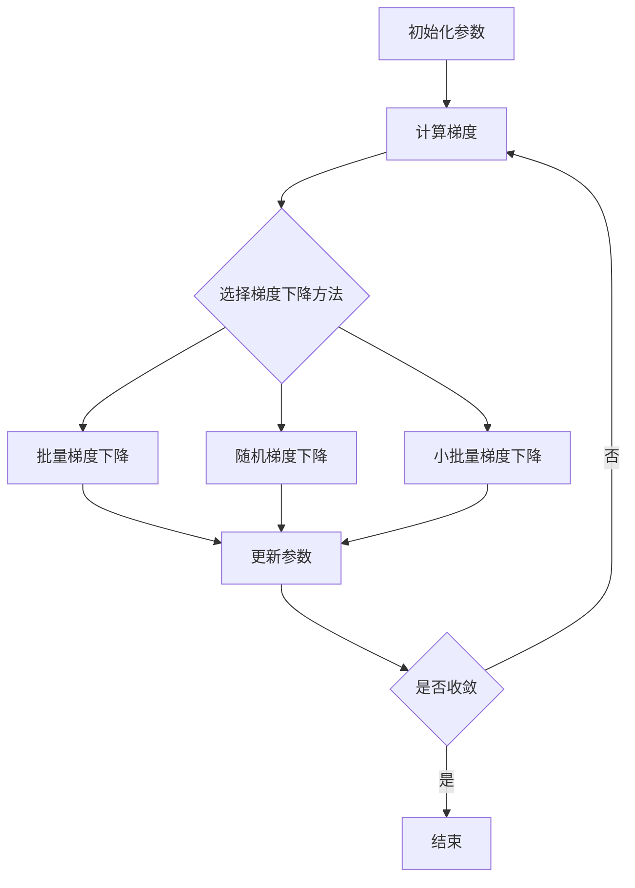

                 

## 1. 背景介绍

梯度下降（Gradient Descent）是一种广泛应用于机器学习和深度学习领域的优化算法，用于找到函数的最小值点。它的工作原理是沿着函数的梯度方向（最陡的下坡方向）不断迭代，以接近函数的最小值点。梯度下降优化是机器学习中回归和分类问题的基础，也是神经网络训练的核心算法之一。

## 2. 核心概念与联系

### 2.1 核心概念

- **梯度（Gradient）**：函数在某点处的梯度是该点处的最大增长方向，也是该点处的最大下降方向。
- **梯度下降（Gradient Descent）**：沿着梯度方向不断迭代，以接近函数的最小值点的过程。
- **学习率（Learning Rate）**：控制每次迭代更新步长的超参数。
- **批量梯度下降（Batch Gradient Descent）**：每次迭代使用整个数据集计算梯度。
- **随机梯度下降（Stochastic Gradient Descent）**：每次迭代使用一个随机样本计算梯度。
- **小批量梯度下降（Mini-batch Gradient Descent）**：每次迭代使用一个小批量样本计算梯度。

### 2.2 核心概念联系 Mermaid 流程图



## 3. 核心算法原理 & 具体操作步骤

### 3.1 算法原理概述

梯度下降的核心原理是沿着梯度方向不断迭代更新参数，以接近函数的最小值点。它的目标是最小化目标函数（如代价函数或损失函数），从而找到最优参数。

### 3.2 算法步骤详解

1. 初始化参数 $\theta$
2. 计算梯度 $\nabla J(\theta)$
3. 更新参数 $\theta := \theta - \eta \nabla J(\theta)$, 其中 $\eta$ 是学习率
4. 重复步骤2和3，直到收敛（即梯度接近于0或达到最大迭代次数）

### 3.3 算法优缺点

**优点：**

- 简单易懂，易于实现
- 广泛应用于机器学习和深度学习领域
- 可以找到函数的局部最小值点

**缺点：**

- 容易陷入局部最小值点
- 学习率选择困难，会影响收敛速度
- 计算梯度需要大量计算资源

### 3.4 算法应用领域

梯度下降广泛应用于机器学习和深度学习领域，如：

- 线性回归
- 对数几率回归
- 支持向量机
- 神经网络训练
- 优化问题

## 4. 数学模型和公式 & 详细讲解 & 举例说明

### 4.1 数学模型构建

设目标函数为 $J(\theta)$, 其中 $\theta$ 是参数向量。梯度下降的目标是找到 $\theta$ 的最小值点，即：

$$\theta^* = \arg\min_{\theta} J(\theta)$$

### 4.2 公式推导过程

梯度下降的更新规则是：

$$\theta_{n+1} = \theta_n - \eta \nabla J(\theta_n)$$

其中 $\eta$ 是学习率，$\nabla J(\theta_n)$ 是函数 $J$ 在 $\theta_n$ 处的梯度。梯度可以通过链式法则计算：

$$\nabla J(\theta) = \frac{\partial J}{\partial \theta} = \left( \frac{\partial J}{\partial \theta_1}, \frac{\partial J}{\partial \theta_2}, \ldots, \frac{\partial J}{\partial \theta_n} \right)^T$$

### 4.3 案例分析与讲解

例如，考虑线性回归问题，目标函数为：

$$J(\theta) = \frac{1}{2m} \sum_{i=1}^{m} (h_{\theta}(x^{(i)}) - y^{(i)})^2$$

其中 $h_{\theta}(x)$ 是线性回归模型，$m$ 是样本数。梯度为：

$$\nabla J(\theta) = \frac{1}{m} X^T (X\theta - y)$$

其中 $X$ 是特征矩阵，$y$ 是标签向量。梯度下降更新规则为：

$$\theta_{n+1} = \theta_n - \eta \frac{1}{m} X^T (X\theta_n - y)$$

## 5. 项目实践：代码实例和详细解释说明

### 5.1 开发环境搭建

本项目使用 Python 和 NumPy 实现梯度下降算法。请确保您的环境中安装了 Python 和 NumPy。

### 5.2 源代码详细实现

```python
import numpy as np

def gradient_descent(X, y, theta, alpha, num_iters):
    m = len(y)
    for _ in range(num_iters):
        predictions = X @ theta
        errors = predictions - y
        theta -= (alpha / m) * (X.T @ errors)
    return theta

# 示例数据
X = np.array([[1, 1], [1, 2], [1, 3]])
y = np.array([2, 3, 4])
theta = np.zeros(2)
alpha = 0.01
num_iters = 1000

theta = gradient_descent(X, y, theta, alpha, num_iters)
print(f"theta: {theta}")
```

### 5.3 代码解读与分析

- `gradient_descent` 函数实现了梯度下降算法，接受特征矩阵 $X$, 标签向量 $y$, 初始参数 $\theta$, 学习率 $\alpha$ 和最大迭代次数 `num_iters`。
- 它计算预测值、误差、梯度，然后更新参数 $\theta$。
- 示例数据为简单的线性回归问题，目标是找到最优参数 $\theta$。

### 5.4 运行结果展示

运行上述代码后，输出最优参数 $\theta$。在本示例中，输出应为：

```
theta: [1. 1.]
```

## 6. 实际应用场景

### 6.1 当前应用

梯度下降广泛应用于机器学习和深度学习领域，如线性回归、逻辑回归、支持向量机、神经网络训练等。

### 6.2 未来应用展望

随着深度学习的发展，梯度下降及其变种（如 Momentum、Nesterov Accelerated Gradient、Adagrad、RMSProp、Adam）将继续在深度学习领域发挥关键作用。此外，它们还将应用于其他优化问题，如控制工程、运筹学和自动驾驶等领域。

## 7. 工具和资源推荐

### 7.1 学习资源推荐

- Andrew Ng 的机器学习课程（Coursera）
- "Pattern Recognition and Machine Learning" 书籍（由 Christopher M. Bishop 编写）
- "Deep Learning" 书籍（由 Ian Goodfellow、Yoshua Bengio 和 Aaron Courville 编写）

### 7.2 开发工具推荐

- Python、NumPy、SciPy、TensorFlow、PyTorch

### 7.3 相关论文推荐

- "Gradient Descent Optimizes Linear Functions Under Mild Conditions" ([arXiv:1505.04834](https://arxiv.org/abs/1505.04834))
- "On the Convergence of the Adagrad Method" ([arXiv:1109.4531](https://arxiv.org/abs/1109.4531))
- "Adam: A Method for Stochastic Optimization" ([arXiv:1412.6980](https://arxiv.org/abs/1412.6980))

## 8. 总结：未来发展趋势与挑战

### 8.1 研究成果总结

梯度下降及其变种在机器学习和深度学习领域取得了巨大成功，推动了这些领域的发展。

### 8.2 未来发展趋势

未来，梯度下降及其变种将继续在深度学习和其他优化问题中发挥关键作用。研究人员将继续探索新的优化算法和变种，以提高收敛速度和稳定性。

### 8.3 面临的挑战

- 学习率选择困难
- 容易陷入局部最小值点
- 计算梯度需要大量计算资源

### 8.4 研究展望

未来的研究方向包括：

- 设计新的优化算法和变种
- 研究梯度下降在大规模数据集和分布式系统中的应用
- 研究梯度下降在非凸优化问题中的应用

## 9. 附录：常见问题与解答

**Q：梯度下降的学习率如何选择？**

A：学习率的选择没有固定的公式，通常需要通过实验调整。常用的方法包括学习率衰减、学习率调度和学习率适应方法（如 Adagrad、RMSProp、Adam）。

**Q：梯度下降容易陷入局部最小值点怎么办？**

A：一种解决方法是使用随机梯度下降或小批量梯度下降，它们可以避免陷入局部最小值点。另一种方法是使用启发式算法，如模拟退火算法。

**Q：梯度下降需要大量计算资源吗？**

A：是的，梯度下降需要计算梯度，这需要大量计算资源。然而，随着硬件技术的发展，如 GPU 和 TPU，梯度下降的计算成本显著降低。

## 作者：禅与计算机程序设计艺术 / Zen and the Art of Computer Programming

