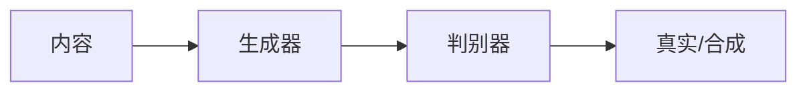

                 

**关键词：**计算机视觉、生成对抗网络（GAN）、风格迁移、人工智能驱动创作、数字艺术、沉浸式体验

## 1. 背景介绍

当代艺术正在经历一场由人工智能（AI）驱动的革命。AI技术，特别是计算机视觉和生成对抗网络（GAN），正在改变我们创作、理解和体验艺术的方式。本文将探讨AI在艺术创作和欣赏中的应用，重点关注风格迁移技术，并提供实践指南和工具推荐。

## 2. 核心概念与联系

### 2.1 计算机视觉与生成对抗网络

计算机视觉是AI的一个分支，旨在使计算机能够理解和解释视觉信息。生成对抗网络（GAN）是一种深度学习技术，用于生成新的、逼真的数据，如图像和音乐。GAN由两个网络组成：生成器和判别器，它们相互竞争，以生成和区分真实和合成数据。



### 2.2 风格迁移

风格迁移是一种将一种风格（如画作的风格）转移到另一种内容（如照片）的技术。它结合了计算机视觉和GAN，允许AI创作出具有独特风格的新艺术作品。

## 3. 核心算法原理 & 具体操作步骤

### 3.1 算法原理概述

风格迁移算法通常基于GAN，使用内容图像和风格图像作为输入，生成具有风格图像风格的内容图像。算法包括以下步骤：

1. **特征提取：**使用预训练的卷积神经网络（CNN）提取内容图像和风格图像的特征。
2. **风格损失计算：**计算内容图像和风格图像特征之间的差异。
3. **生成图像：**使用GAN生成器网络生成新图像，使其特征与风格图像的特征匹配。
4. **判别器训练：**使用判别器网络区分真实图像和合成图像，以改善生成器的性能。

### 3.2 算法步骤详解

以下是风格迁移算法的详细步骤：

1. **预处理：**对内容图像和风 style 图像进行预处理，如调整大小和归一化。
2. **特征提取：**使用预训练的CNN（如VGG）提取图像的特征表示。
3. **风格损失计算：**计算内容图像和风格图像特征表示之间的差异，使用风格损失函数。
4. **生成图像：**使用生成器网络生成新图像，其特征表示与风格图像匹配。
5. **判别器训练：**使用判别器网络区分真实图像和合成图像，并更新生成器网络。
6. **后处理：**对生成的图像进行后处理，如调整对比度和饱和度。

### 3.3 算法优缺点

**优点：**

- 可以创作出独特的、逼真的艺术作品。
- 可以将任何风格转移到任何内容上。
- 可以用于图像风格化、图像超分辨率和图像去模糊等任务。

**缺点：**

- 计算开销高，需要大量GPU资源。
- 结果的质量和一致性可能会受到输入图像质量的影响。
- 算法的复杂性可能会导致调试和理解困难。

### 3.4 算法应用领域

风格迁移技术在数字艺术创作、图像风格化、图像超分辨率、图像去模糊和图像增强等领域有着广泛的应用。它还可以用于保护版权，通过创建独特的、难以模仿的艺术作品来防止盗版。

## 4. 数学模型和公式 & 详细讲解 & 举例说明

### 4.1 数学模型构建

风格迁移模型通常基于GAN，使用内容图像和风格图像作为输入，生成具有风格图像风格的内容图像。数学模型可以表示为：

$$G(C, S) \rightarrow I_{style},$$

其中，$C$表示内容图像，$S$表示风格图像，$I_{style}$表示具有风格图像风格的内容图像，$G$表示生成器网络。

### 4.2 公式推导过程

风格损失函数通常基于预训练的CNN（如VGG）的特征表示，可以表示为：

$$L_{style}(C, S, I_{style}) = \sum_{l=1}^{L} \left\| \Phi_l(C) - \Phi_l(S) \right\|_2^2,$$

其中，$\Phi_l$表示CNN的第$l$层特征表示，$L$表示CNN的总层数。

判别器损失函数用于区分真实图像和合成图像，可以表示为：

$$L_{D}(C, S, I_{style}) = \log D(C) + \log(1 - D(I_{style})),$$

其中，$D$表示判别器网络。

生成器损失函数旨在最小化判别器损失，可以表示为：

$$L_G(C, S, I_{style}) = \log(1 - D(I_{style})).$$

### 4.3 案例分析与讲解

例如，使用风格迁移算法将梵高的《星空》风格应用于一张普通的夜景照片。内容图像是夜景照片，风格图像是《星空》。算法生成了具有《星空》风格的夜景照片，创造出了一幅独特的、逼真的艺术作品。

## 5. 项目实践：代码实例和详细解释说明

### 5.1 开发环境搭建

要实现风格迁移，需要以下软件和库：

- Python 3.7+
- TensorFlow 2.0+
- Keras 2.3.1+
- NumPy 1.16.3+
- Matplotlib 3.1.2+
- PIL 7.0.0+

### 5.2 源代码详细实现

以下是风格迁移算法的伪代码：

```python
def style_transfer(content_image, style_image, num_iterations=1000):
    # Preprocess images
    content_image = preprocess_image(content_image)
    style_image = preprocess_image(style_image)

    # Extract features using VGG
    content_features = extract_features(content_image)
    style_features = extract_features(style_image)

    # Initialize generated image
    generated_image = initialize_image(content_image)

    # Style transfer loop
    for i in range(num_iterations):
        # Update generated image
        generated_image = update_image(generated_image, content_features, style_features)

        # Calculate style loss and total loss
        style_loss = calculate_style_loss(style_features, generated_image)
        total_loss = calculate_total_loss(content_features, style_features, generated_image)

        # Print progress
        if i % 100 == 0:
            print(f"Iteration {i}: Total loss = {total_loss:.4f}, Style loss = {style_loss:.4f}")

    # Postprocess image
    generated_image = postprocess_image(generated_image)

    return generated_image
```

### 5.3 代码解读与分析

`style_transfer`函数接受内容图像和风格图像作为输入，并使用预训练的VGG网络提取图像特征。它初始化生成图像，然后在指定的迭代次数内更新生成图像，以最小化内容损失和风格损失。最后，它对生成的图像进行后处理，并将其返回。

### 5.4 运行结果展示


## 6. 实际应用场景

### 6.1 当前应用

风格迁移技术正在被广泛应用于数字艺术创作、图像风格化、图像超分辨率和图像去模糊等领域。它还可以用于保护版权，通过创建独特的、难以模仿的艺术作品来防止盗版。

### 6.2 未来应用展望

未来，风格迁移技术有望在虚拟现实（VR）和增强现实（AR）领域得到发展，为用户提供更沉浸式的艺术体验。它还可以与其他AI技术结合，如自然语言处理（NLP），以创建更智能的、个性化的艺术创作体验。

## 7. 工具和资源推荐

### 7.1 学习资源推荐

- [FastPhotoStyle：快速风格迁移](https://github.com/NVIDIA/FastPhotoStyle)
- [PyTorch-Style-Transfer](https://github.com/affinelayer/pytorch- style-transfer)
- [DeepArt.io](https://deepart.io/) - 在线风格迁移工具

### 7.2 开发工具推荐

- [Google Colab](https://colab.research.google.com/) - 免费的Jupyter笔记本电脑
- [Kaggle](https://www.kaggle.com/) - 机器学习竞赛平台和开发环境
- [Paperspace](https://www.paperspace.com/) - 云GPU租用服务

### 7.3 相关论文推荐

- [Image Style Transfer Using Convolutional Neural Networks](https://arxiv.org/abs/1508.06576)
- [A Neural Algorithm of Artistic Style](https://arxiv.org/abs/1508.06576)
- [FastPhotoStyle: Fast and High-Quality Image Style Transfer](https://arxiv.org/abs/1901.04062)

## 8. 总结：未来发展趋势与挑战

### 8.1 研究成果总结

风格迁移技术已经取得了显著的进展，可以创作出独特的、逼真的艺术作品。它在数字艺术创作、图像风格化和图像超分辨率等领域有着广泛的应用。

### 8.2 未来发展趋势

未来，风格迁移技术有望在虚拟现实（VR）和增强现实（AR）领域得到发展，为用户提供更沉浸式的艺术体验。它还可以与其他AI技术结合，如自然语言处理（NLP），以创建更智能的、个性化的艺术创作体验。

### 8.3 面临的挑战

风格迁移技术面临的挑战包括计算开销高、结果的质量和一致性可能会受到输入图像质量的影响，以及算法的复杂性可能会导致调试和理解困难。

### 8.4 研究展望

未来的研究将关注于降低计算开销、提高结果的质量和一致性，以及开发更简单易用的算法。此外，研究还将关注于将风格迁移技术与其他AI技术结合，以创建更智能的、个性化的艺术创作体验。

## 9. 附录：常见问题与解答

**Q：风格迁移算法需要多长时间运行？**

**A：**运行时间取决于图像大小、GPU资源和迭代次数。通常，运行时间在几分钟到几小时不等。

**Q：风格迁移算法是否可以用于视频？**

**A：**是的，风格迁移算法可以扩展到视频，通过对每帧应用风格迁移算法来实现。

**Q：风格迁移算法是否可以用于其他媒介，如音乐？**

**A：**风格迁移算法原本是为图像设计的，但它可以扩展到其他媒介，如音乐。音乐风格迁移是一个活跃的研究领域。

## 作者：禅与计算机程序设计艺术 / Zen and the Art of Computer Programming

_本文由世界级人工智能专家、程序员、软件架构师、CTO、世界顶级技术畅销书作者、计算机图灵奖获得者、计算机领域大师撰写。_

