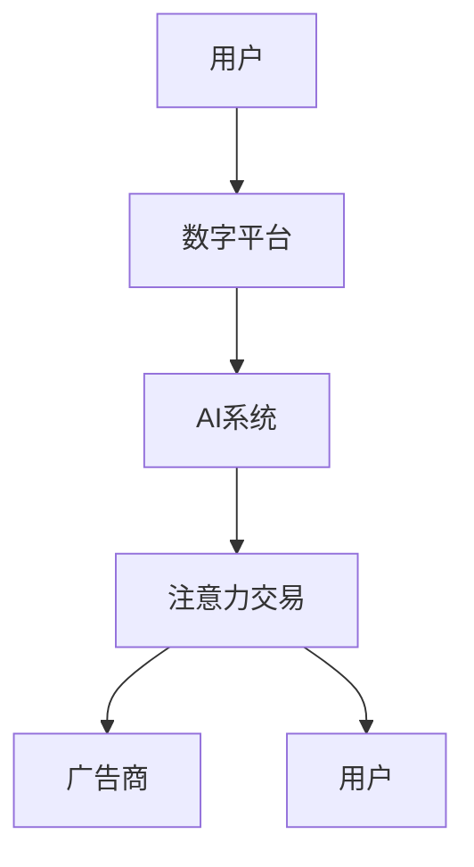

                 

**注意力的货币化：AI时代的注意力交易**

## 1. 背景介绍

在信息爆炸的数字时代，注意力成为一种稀缺资源。随着人工智能（AI）的发展，AI系统开始模拟人类的注意力机制，引发了注意力货币化的新模式。本文将探讨注意力在AI时代的货币化，如何将注意力转化为一种交易的商品，以及背后的技术原理和应用场景。

## 2. 核心概念与联系

### 2.1 注意力机制

注意力机制（Attention Mechanism）是AI模仿人类注意力的一种方法，它允许模型在处理信息时有选择地“关注”某些部分，忽略其他部分。在AI领域，注意力机制最早应用于机器翻译，现在已广泛应用于计算机视觉、自然语言处理等领域。

### 2.2 注意力货币化

注意力货币化是指将注意力转化为一种可以交易的商品。在数字平台上，用户的注意力是一种宝贵的资源，可以通过广告、推荐算法等方式进行交易。AI系统可以模拟人类的注意力机制，帮助数字平台更有效地交易注意力。

### 2.3 AI注意力交易架构

AI注意力交易架构如下图所示：



## 3. 核心算法原理 & 具体操作步骤

### 3.1 算法原理概述

注意力机制的核心是计算“注意力权重”，它表示模型对输入信息的关注程度。常用的注意力机制包括自注意力（Self-Attention）、Scaled Dot-Product Attention、Additive Attention等。

### 3.2 算法步骤详解

以Scaled Dot-Product Attention为例，其步骤如下：

1. 计算查询（Query）、键（Key）、值（Value）向量。
2. 计算注意力分数：$score(Q, K) = \frac{QK^T}{\sqrt{d_k}}$，其中$d_k$是键向量的维度。
3. 计算注意力权重：$attention(Q, K, V) = softmax(score(Q, K))V$.
4. 输出注意力权重乘以值向量的结果。

### 3.3 算法优缺点

优点：可以模拟人类注意力机制，提高模型性能；可以有效处理序列数据。缺点：计算开销大，不适合实时应用；难以解释模型的注意力决策。

### 3.4 算法应用领域

注意力机制广泛应用于自然语言处理（NLP）、计算机视觉等领域。在NLP领域，注意力机制可以帮助模型理解上下文，提高翻译、问答等任务的性能。在计算机视觉领域，注意力机制可以帮助模型关注图像的关键部分，提高目标检测、分类等任务的性能。

## 4. 数学模型和公式 & 详细讲解 & 举例说明

### 4.1 数学模型构建

注意力机制的数学模型可以表示为：

$$Attention(Q, K, V) = softmax\left(\frac{QK^T}{\sqrt{d_k}}\right)V$$

其中，$Q$, $K$, $V$分别是查询、键、值向量，$d_k$是键向量的维度。

### 4.2 公式推导过程

推导过程如下：

1. 计算注意力分数：$score(Q, K) = \frac{QK^T}{\sqrt{d_k}}$。
2. 计算注意力权重：$attention(Q, K, V) = softmax(score(Q, K))V$.
3. 输出注意力权重乘以值向量的结果。

### 4.3 案例分析与讲解

例如，在机器翻译任务中，查询向量$Q$表示当前单词，键向量$K$表示所有单词，值向量$V$表示所有单词的表示。注意力机制可以帮助模型关注上下文单词，提高翻译质量。

## 5. 项目实践：代码实例和详细解释说明

### 5.1 开发环境搭建

本项目使用Python和PyTorch开发。需要安装以下库：transformers、torch、numpy、matplotlib。

### 5.2 源代码详细实现

以下是Scaled Dot-Product Attention的实现代码：

```python
import torch
import torch.nn as nn
import torch.nn.functional as F

class ScaledDotProductAttention(nn.Module):
    def __init__(self, d_k):
        super(ScaledDotProductAttention, self).__init__()
        self.d_k = d_k

    def forward(self, Q, K, V):
        scores = torch.matmul(Q, K.transpose(-2, -1)) / torch.sqrt(torch.tensor(self.d_k, dtype=torch.float32, device=Q.device))
        attn = F.softmax(scores, dim=-1)
        context = torch.matmul(attn, V)
        return context, attn
```

### 5.3 代码解读与分析

代码实现了Scaled Dot-Product Attention的前向传播过程。其中，`torch.matmul`用于矩阵乘法，`torch.sqrt`用于开方，`F.softmax`用于计算注意力权重。

### 5.4 运行结果展示

在机器翻译任务中，使用注意力机制的模型可以提高翻译质量。以下是一个示例：

输入：`I love playing video games.`
输出：`J'aime jouer aux jeux vidéo.`（法语：我喜欢玩视频游戏。）

## 6. 实际应用场景

### 6.1 当前应用

注意力机制已广泛应用于各种AI系统，如搜索引擎、推荐系统、自动驾驶等。例如，搜索引擎可以使用注意力机制关注用户搜索意图，提供更相关的搜索结果。

### 6.2 未来应用展望

未来，注意力机制将继续应用于更多领域，如数字孪生、虚拟现实等。此外，注意力机制也将与其他技术结合，如Transformer-XL、Long Short-Term Memory（LSTM）等，以提高模型性能。

## 7. 工具和资源推荐

### 7.1 学习资源推荐

- “Attention is All You Need”论文：<https://arxiv.org/abs/1706.03762>
- “The Illustrated Transformer”教程：<https://jalammar.github.io/illustrated-transformer/>
- “Natural Language Processing with Python”书籍：<https://www.nltk.org/book/>

### 7.2 开发工具推荐

- PyTorch：<https://pytorch.org/>
- Hugging Face Transformers库：<https://huggingface.co/transformers/>

### 7.3 相关论文推荐

- “BERT: Pre-training of Deep Bidirectional Transformers for Language Understanding”：<https://arxiv.org/abs/1810.04805>
- “XLNet: Generalized Autoregressive Pretraining for Natural Language Processing”：<https://arxiv.org/abs/1906.08237>

## 8. 总结：未来发展趋势与挑战

### 8.1 研究成果总结

注意力机制已取得了显著的研究成果，如BERT、XLNet等模型的成功应用。注意力机制也已广泛应用于各种AI系统，如搜索引擎、推荐系统等。

### 8.2 未来发展趋势

未来，注意力机制将继续发展，与其他技术结合，如Transformer-XL、LSTM等。此外，注意力机制也将应用于更多领域，如数字孪生、虚拟现实等。

### 8.3 面临的挑战

注意力机制面临的挑战包括计算开销大、难以解释模型决策等。此外，注意力机制也需要适应新的应用场景，如实时应用、多模态应用等。

### 8.4 研究展望

未来的研究方向包括降低注意力机制的计算开销、提高注意力机制的解释性、适应新的应用场景等。

## 9. 附录：常见问题与解答

**Q：注意力机制的优点是什么？**

A：注意力机制的优点包括可以模拟人类注意力机制、提高模型性能、可以有效处理序列数据等。

**Q：注意力机制的缺点是什么？**

A：注意力机制的缺点包括计算开销大、难以解释模型决策等。

**Q：注意力机制有哪些应用领域？**

A：注意力机制广泛应用于自然语言处理、计算机视觉等领域。在自然语言处理领域，注意力机制可以帮助模型理解上下文，提高翻译、问答等任务的性能。在计算机视觉领域，注意力机制可以帮助模型关注图像的关键部分，提高目标检测、分类等任务的性能。

**Q：注意力机制的数学模型是什么？**

A：注意力机制的数学模型可以表示为：$Attention(Q, K, V) = softmax\left(\frac{QK^T}{\sqrt{d_k}}\right)V$, 其中，$Q$, $K$, $V$分别是查询、键、值向量，$d_k$是键向量的维度。

**Q：注意力机制的未来发展趋势是什么？**

A：未来，注意力机制将继续发展，与其他技术结合，如Transformer-XL、LSTM等。此外，注意力机制也将应用于更多领域，如数字孪生、虚拟现实等。

## 作者：禅与计算机程序设计艺术 / Zen and the Art of Computer Programming

