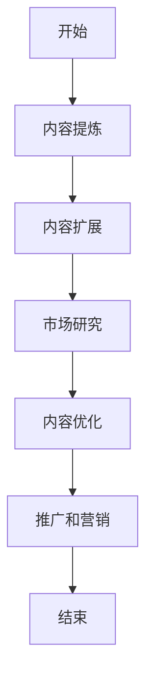
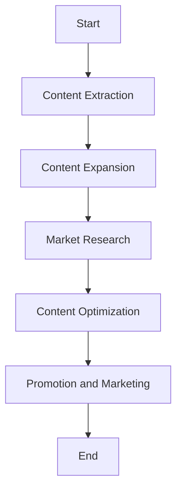

                 

### 文章标题

### The Journey from Technical Documentation to Paid E-Books: A Programmer's Writing Path

本文将探讨程序员的写作之路，从编写技术文档到创作付费电子书的过程。在当今数字化时代，程序员不仅需要具备扎实的编程技能，还需要具备良好的写作能力，以便有效地传达技术知识和经验。本文将分享作者在写作过程中的心得体会，并提供一些建议和策略，帮助读者在写作道路上取得成功。

### Introduction

In the digital age, programmers are not only expected to possess strong coding skills but also to excel in written communication. Writing technical documentation is a crucial aspect of a programmer's role, as it enables the dissemination of technical knowledge and expertise. However, many programmers aspire to take their writing to the next level by creating paid e-books, which can be a lucrative venture. This article aims to explore the journey from technical documentation to paid e-books, sharing insights and tips from my own experience.

### The Importance of Technical Documentation

Technical documentation serves as a bridge between developers, project managers, and end-users. It provides a comprehensive understanding of the system, its functionalities, and its underlying architecture. Here are a few reasons why technical documentation is crucial:

1. **Knowledge Preservation**: Documentation ensures that valuable knowledge is preserved and can be easily accessed by future developers or team members.
2. **Knowledge Sharing**: It allows developers to share their knowledge and expertise with others, fostering a collaborative environment.
3. **Troubleshooting**: Detailed documentation helps in troubleshooting issues that may arise during development or maintenance.
4. **Onboarding New Developers**: New team members can quickly get up to speed with the project by referring to the documentation.
5. **Code Review and Maintenance**: Documentation serves as a reference during code reviews and maintenance, ensuring consistency and quality.

### The Evolution from Technical Documentation to Paid E-Books

While technical documentation is an essential part of a programmer's work, it can also serve as a foundation for creating paid e-books. Here's how this evolution can happen:

1. **Refining Content**: Technical documentation can be refined and expanded upon to create comprehensive tutorials or guides that are valuable to a broader audience.
2. **Adding Value**: By including real-world examples, best practices, and advanced topics, the content can be made more engaging and valuable.
3. ** monetization**: Converting technical documentation into a paid e-book allows programmers to monetize their knowledge and generate passive income.
4. **Community Engagement**: Creating paid e-books can also help build a community of readers and followers who are interested in the specific area of expertise.
5. **Author Branding**: Successful e-books can enhance the author's reputation and credibility in the industry.

### Challenges and Opportunities

While the journey from technical documentation to paid e-books presents numerous opportunities, it also comes with its share of challenges. Here are a few considerations:

1. **Time and Effort**: Writing a paid e-book requires significant time and effort, as it involves in-depth research, content creation, and editing.
2. **Market Research**: Understanding the target audience and market trends is crucial for the success of a paid e-book.
3. **Monetization Models**: Choosing the right monetization model, such as flat rates, subscriptions, or pay-per-view, can impact the e-book's profitability.
4. **Marketing and Promotion**: Effective marketing and promotion are essential for attracting readers and building a following.
5. **Quality Control**: Maintaining high-quality content and ensuring that it is up-to-date is vital for retaining readers and maintaining credibility.

### Conclusion

In conclusion, the journey from technical documentation to paid e-books offers programmers a unique opportunity to monetize their knowledge and contribute to the industry. By refining their content, adding value, and understanding the market, programmers can successfully create and promote paid e-books. However, this journey requires dedication, research, and effective marketing strategies. By embracing this challenge, programmers can not only share their expertise but also build a successful writing career.

### Keywords

- Technical Documentation
- Paid E-Books
- Programmer Writing
- Knowledge Sharing
- Monetization
- Marketing

### Abstract

This article explores the journey of programmers from writing technical documentation to creating paid e-books. It discusses the importance of technical documentation, the process of evolving content into a valuable resource, and the challenges and opportunities that come with this transition. By understanding the market and applying effective strategies, programmers can successfully monetize their knowledge and build a successful writing career.

### 背景介绍

在当今的软件开发领域，技术文档的编写已经变得至关重要。它不仅有助于新员工快速上手项目，还能在项目开发和维护过程中起到指导作用。然而，随着知识共享和数字出版的发展，许多程序员开始考虑如何将他们的技术文档转化为更有价值的资源——付费电子书。本文将探讨这一转变的过程，包括如何从技术文档中提取核心内容，如何进行市场研究，以及如何有效地推广和营销电子书。

#### 技术文档的重要性

技术文档是软件开发过程中不可或缺的一部分。它包括项目需求、设计文档、代码注释、用户手册等，旨在提供关于软件系统的全面信息。以下是技术文档的几个关键作用：

1. **知识传承**：技术文档帮助团队成员和未来的开发者理解和维护项目。它确保了项目知识不会随着人员的更迭而流失。
2. **协作和沟通**：技术文档为团队成员提供了一个共同的知识基础，有助于协作和沟通，从而提高项目的开发效率。
3. **问题解决**：详细的技术文档能够帮助开发者快速定位和解决问题，从而减少开发过程中的中断和延迟。
4. **代码审查**：技术文档为代码审查提供了重要的参考，有助于确保代码的质量和一致性。
5. **用户支持**：用户手册和操作指南等技术文档能够帮助用户更好地理解和使用软件，提高用户满意度。

#### 从技术文档到付费电子书

虽然技术文档在软件开发中扮演着重要角色，但许多程序员希望将其转化为更广泛的资源，以实现知识共享和商业化。以下是这个转变过程的关键步骤：

1. **内容提炼**：程序员需要从现有的技术文档中提取核心内容，如关键算法、设计模式、最佳实践等，将其整理成结构化的教程或指南。
2. **内容扩展**：为了吸引更多的读者，程序员可以在电子书中加入实际案例、代码示例、深度分析和额外的学习资源。
3. **市场研究**：了解目标读者的需求和兴趣，以及当前市场的趋势和竞争情况，对于成功创作和推广电子书至关重要。
4. **内容优化**：通过编辑和校对，确保电子书的内容清晰、准确、易于理解，并提供高质量的价值。
5. **推广和营销**：利用社交媒体、博客、电子邮件列表等渠道，推广电子书，吸引潜在读者。

#### 成功案例

许多程序员已经通过将技术文档转化为付费电子书取得了成功。例如，一些程序员编写了关于编程语言、框架和技术的深入教程，这些教程不仅在技术上具有价值，还在市场上获得了广泛的认可和好评。以下是一些成功案例：

1. **《Python核心编程》**：作者使用Python语言的技术文档为基础，编写了一本广泛使用的编程教程，成为Python编程领域的经典之作。
2. **《深度学习从入门到实践》**：这本书基于作者在深度学习领域的研究和教学经验，提供了一个系统而实用的深度学习教程，深受读者欢迎。
3. **《微服务架构设计》**：作者结合自己的实际项目经验，编写了一本关于微服务架构的深入指南，为软件开发者提供了宝贵的实践经验。

#### 结论

将技术文档转化为付费电子书不仅能够帮助程序员实现知识共享和商业化，还能为他们提供一个可持续的收入来源。通过有效的市场研究、内容提炼和优化，以及积极的推广和营销，程序员可以在电子书领域取得成功。尽管这个过程可能充满挑战，但对于那些希望扩展自己的技能和影响力的程序员来说，这是一个值得尝试的方向。

### Keywords

- Technical Documentation
- Paid E-Books
- Knowledge Sharing
- Market Research
- Content Creation
- Marketing and Promotion

### Abstract

This section introduces the importance of technical documentation in software development and the process of transforming it into paid e-books. It discusses the key roles of technical documentation, the steps involved in refining and expanding content, and the significance of market research and effective promotion. Successful cases of programmers who have turned their technical documentation into profitable e-books are also presented, demonstrating the potential and opportunities of this transition.

### 核心概念与联系

#### 1. 技术文档的组成部分

技术文档通常包括以下组成部分：

- **需求文档**：描述项目的功能需求、性能需求和约束条件。
- **设计文档**：详细描述系统的架构、模块和接口设计。
- **代码注释**：为代码提供注释，解释代码的功能和实现细节。
- **用户手册**：指导用户如何使用软件，包括安装、配置和常见问题解决方案。

#### 2. 付费电子书的特性

付费电子书具有以下特性：

- **深入讲解**：与一般的技术文档不同，付费电子书通常提供更深入和详细的内容，涵盖更多的实践案例和实际应用。
- **结构化**：电子书往往采用更加结构化的形式，便于读者快速查找和理解。
- **互动性**：通过嵌入视频、代码示例和练习题，电子书可以提供更加互动的学习体验。
- **更新和维护**：电子书可以定期更新，以反映技术的最新发展和变化。

#### 3. 技术文档与付费电子书的联系

技术文档和付费电子书之间存在紧密的联系。技术文档可以被视为付费电子书的基础，而付费电子书则是对技术文档的扩展和深化。以下是如何从技术文档过渡到付费电子书的一些步骤：

1. **内容提炼**：从现有的技术文档中提取核心内容，如关键算法、设计模式和最佳实践。
2. **内容扩展**：增加实际案例、代码示例、深度分析和额外学习资源。
3. **市场研究**：了解目标读者的需求和兴趣，以及当前市场的趋势和竞争情况。
4. **内容优化**：通过编辑和校对，确保电子书的内容清晰、准确、易于理解。
5. **推广和营销**：利用社交媒体、博客、电子邮件列表等渠道，推广电子书。

#### 4. 技术文档与付费电子书的市场定位

技术文档通常面向开发者和项目团队成员，而付费电子书则可以面向更广泛的受众，包括学生、业余编程爱好者和专业开发者。通过明确市场定位，程序员可以更好地满足读者的需求，提高电子书的吸引力。

#### Mermaid 流程图

以下是一个Mermaid流程图，展示了从技术文档到付费电子书的转换过程：



在这个流程图中，每个节点代表一个步骤，箭头表示步骤之间的顺序关系。

### Core Concepts and Connections

#### 1. Components of Technical Documentation

Technical documentation typically includes the following components:

- **Requirement Documentation**: Describes the functional, performance, and constraint requirements of the project.
- **Design Documentation**: Provides a detailed description of the system's architecture, modules, and interfaces.
- **Code Comments**: Offer comments within the code to explain the functionality and implementation details.
- **User Manuals**: Guide users on how to use the software, including installation, configuration, and common troubleshooting solutions.

#### 2. Characteristics of Paid E-Books

Paid e-books possess the following characteristics:

- **In-depth Explanation**: Unlike general technical documentation, paid e-books usually provide more detailed and comprehensive content, covering more practical cases and real-world applications.
- **Structured**: E-books often come in a more structured format, allowing readers to quickly locate and understand information.
- **Interactivity**: By embedding videos, code examples, and quizzes, e-books can offer a more interactive learning experience.
- **Updates and Maintenance**: E-books can be regularly updated to reflect the latest developments and changes in technology.

#### 3. The Connection between Technical Documentation and Paid E-Books

There is a close relationship between technical documentation and paid e-books. Technical documentation can be considered the foundation for paid e-books, while paid e-books are an extension and deepening of technical documentation. Here are some steps on how to transition from technical documentation to paid e-books:

1. **Content Extraction**: Extract core content from existing technical documentation, such as key algorithms, design patterns, and best practices.
2. **Content Expansion**: Add practical cases, code examples, in-depth analysis, and additional learning resources.
3. **Market Research**: Understand the needs and interests of the target audience and the current market trends and competition.
4. **Content Optimization**: Edit and proofread the content to ensure it is clear, accurate, and easy to understand.
5. **Promotion and Marketing**: Use social media, blogs, email lists, and other channels to promote the e-book.

#### 4. Market Positioning for Technical Documentation and Paid E-Books

Technical documentation is generally aimed at developers and project team members, while paid e-books can target a broader audience, including students, hobbyist programmers, and professional developers. By clearly defining the market positioning, programmers can better meet the needs of their readers and enhance the appeal of their e-books.

#### Mermaid Flowchart

The following is a Mermaid flowchart illustrating the process of transitioning from technical documentation to paid e-books:



In this flowchart, each node represents a step, and the arrows indicate the sequential relationship between the steps.

### 核心算法原理 & 具体操作步骤

在将技术文档转换为付费电子书的过程中，核心算法原理的讲解是关键部分。这不仅需要程序员理解算法的基本概念，还需要能够清晰地将其阐述给读者。以下是几个常见核心算法及其原理和具体操作步骤。

#### 1. 快速排序（Quick Sort）

**原理**：
快速排序是一种高效的排序算法，其基本思想是通过一趟排序将待排序的记录分割成独立的两部分，其中一部分记录的关键字均比另一部分的关键字小，然后分别对这两部分记录继续进行排序，以达到整个序列有序。

**操作步骤**：

1. 选择基准元素：从数列中选择一个元素作为基准（pivot）。
2. 分区操作：将数组划分为两个子数组，所有比基准值小的元素都移到基准的左边，所有比基准值大的元素都移到基准的右边。
3. 递归排序：递归地对左右子数组进行快速排序。

**示例代码**：

```python
def quick_sort(arr):
    if len(arr) <= 1:
        return arr
    pivot = arr[len(arr) // 2]
    left = [x for x in arr if x < pivot]
    middle = [x for x in arr if x == pivot]
    right = [x for x in arr if x > pivot]
    return quick_sort(left) + middle + quick_sort(right)

arr = [10, 7, 8, 9, 1, 5]
sorted_arr = quick_sort(arr)
print(sorted_arr)
```

**分析**：
快速排序的平均时间复杂度为 \(O(n \log n)\)，最坏情况下为 \(O(n^2)\)。

#### 2. 动态规划（Dynamic Programming）

**原理**：
动态规划是一种将复杂问题分解成更简单子问题，并存储子问题解以避免重复计算的方法。其基本思想是在求解一个问题的过程中，将子问题的解存储起来，以便在后续的计算中直接引用，从而减少重复计算。

**操作步骤**：

1. 确定状态：定义一个状态变量，用于表示问题的不同阶段。
2. 确定状态转移方程：找出状态之间的转换关系。
3. 确定边界条件：确定递归的终止条件。

**示例代码**：

```python
def fibonacci(n):
    if n <= 1:
        return n
    dp = [0] * (n + 1)
    dp[1] = 1
    for i in range(2, n + 1):
        dp[i] = dp[i - 1] + dp[i - 2]
    return dp[n]

n = 10
result = fibonacci(n)
print(result)
```

**分析**：
动态规划的时间复杂度取决于状态转移方程的复杂度。对于斐波那契数列，其时间复杂度为 \(O(n)\)。

#### 3. 暴力解法（Brute Force）

**原理**：
暴力解法是一种简单的算法设计方法，它通过直接穷举所有可能的情况来解决问题。尽管这种方法在解决简单问题时是有效的，但在处理复杂问题时往往效率低下。

**操作步骤**：

1. 确定问题解空间：找出所有可能的解。
2. 逐一尝试：对于每个可能的解，检查它是否符合问题的约束条件。

**示例代码**：

```python
def is_palindrome(s):
    return s == s[::-1]

word = "racecar"
if is_palindrome(word):
    print(f"{word} 是回文")
else:
    print(f"{word} 不是回文")
```

**分析**：
暴力解法的时间复杂度取决于问题解空间的规模。对于回文检测，其时间复杂度为 \(O(n)\)。

通过以上三个算法示例，我们可以看到不同算法在原理和操作步骤上的差异。在实际应用中，程序员需要根据问题的具体需求和复杂性选择合适的算法。同时，通过清晰地阐述算法原理和操作步骤，程序员可以有效地将技术文档的内容转化为付费电子书，为读者提供有价值的知识和指导。

### Core Algorithm Principles and Specific Operational Steps

In the process of transforming technical documentation into paid e-books, explaining core algorithm principles is crucial. This requires programmers not only to understand the basic concepts of algorithms but also to be able to articulate them clearly to readers. Below are several common core algorithms, along with their principles and specific operational steps.

#### 1. Quick Sort

**Principle**:
Quick Sort is an efficient sorting algorithm that uses a divide-and-conquer approach. It works by selecting a 'pivot' element from the array and partitioning the other elements into two subarrays, according to whether they are less than or greater than the pivot. The subarrays are then sorted recursively.

**Operational Steps**:

1. Choose a pivot: Select an element from the array as the pivot.
2. Partitioning: Divide the array into two subarrays, where all elements less than the pivot are moved to its left, and all elements greater than the pivot are moved to its right.
3. Recursively sort: Apply the Quick Sort algorithm to the subarrays.

**Example Code**:

```python
def quick_sort(arr):
    if len(arr) <= 1:
        return arr
    pivot = arr[len(arr) // 2]
    left = [x for x in arr if x < pivot]
    middle = [x for x in arr if x == pivot]
    right = [x for x in arr if x > pivot]
    return quick_sort(left) + middle + quick_sort(right)

arr = [10, 7, 8, 9, 1, 5]
sorted_arr = quick_sort(arr)
print(sorted_arr)
```

**Analysis**:
The average time complexity of Quick Sort is \(O(n \log n)\), and the worst-case time complexity is \(O(n^2)\).

#### 2. Dynamic Programming

**Principle**:
Dynamic Programming is a method for solving complex problems by breaking them down into simpler subproblems and storing the solutions to these subproblems to avoid redundant computations. The basic idea is to solve a problem by combining solutions to subproblems.

**Operational Steps**:

1. Define state: Establish a state variable to represent different stages of the problem.
2. Define state transition equations: Identify the relationships between states.
3. Define boundary conditions: Determine the termination conditions for recursion.

**Example Code**:

```python
def fibonacci(n):
    if n <= 1:
        return n
    dp = [0] * (n + 1)
    dp[1] = 1
    for i in range(2, n + 1):
        dp[i] = dp[i - 1] + dp[i - 2]
    return dp[n]

n = 10
result = fibonacci(n)
print(result)
```

**Analysis**:
The time complexity of Dynamic Programming depends on the complexity of the state transition equations. For the Fibonacci sequence, the time complexity is \(O(n)\).

#### 3. Brute Force

**Principle**:
Brute Force is a straightforward algorithm design technique that involves directly enumerating all possible cases to solve a problem. While this approach can be effective for simple problems, it is often inefficient for complex problems.

**Operational Steps**:

1. Determine the solution space: Identify all possible solutions.
2. Enumerate and check: For each possible solution, check if it meets the constraints of the problem.

**Example Code**:

```python
def is_palindrome(s):
    return s == s[::-1]

word = "racecar"
if is_palindrome(word):
    print(f"{word} is a palindrome")
else:
    print(f"{word} is not a palindrome")
```

**Analysis**:
The time complexity of Brute Force depends on the size of the solution space. For palindrome detection, the time complexity is \(O(n)\).

Through these three algorithm examples, we can see the differences in principles and operational steps. In practical applications, programmers need to choose the appropriate algorithm based on the specific requirements and complexity of the problem. Additionally, by clearly explaining algorithm principles and operational steps, programmers can effectively transform technical documentation content into paid e-books, providing valuable knowledge and guidance to readers.

### 数学模型和公式 & 详细讲解 & 举例说明

在将技术文档转化为付费电子书的过程中，数学模型和公式是关键组成部分，它们能够帮助读者更好地理解和应用技术知识。在本节中，我们将详细讲解几个常见的数学模型和公式，并通过实例说明如何使用它们来解决问题。

#### 1. 线性回归模型

**公式**：

线性回归模型的基本公式为：

\[ y = ax + b \]

其中，\( y \) 是因变量，\( x \) 是自变量，\( a \) 是斜率，\( b \) 是截距。

**详细讲解**：

线性回归模型用于描述两个变量之间的线性关系。斜率 \( a \) 表示自变量每增加一个单位时，因变量的变化量。截距 \( b \) 表示当自变量为 0 时，因变量的值。

**实例说明**：

假设我们要研究销售额 \( y \) 与广告支出 \( x \) 之间的关系。根据历史数据，我们可以得到以下线性回归模型：

\[ 销售额 = 2 \times 广告支出 + 5000 \]

这意味着，每增加 1 单位的广告支出，销售额将增加 2 单位，而初始销售额为 5000 单位。

**应用**：

通过这个模型，我们可以预测在给定广告支出水平下的预期销售额。例如，如果广告支出为 10,000 元，则预期销售额为：

\[ 预期销售额 = 2 \times 10,000 + 5,000 = 20,000 + 5,000 = 25,000 元 \]

#### 2. 二分查找算法

**公式**：

二分查找算法的基本公式为：

\[ low = 0 \]
\[ high = n - 1 \]

其中，\( n \) 是数组中的元素数量。

**详细讲解**：

二分查找算法是一种高效的查找算法，用于在有序数组中查找特定元素。其基本思想是通过不断地将搜索范围折半，逐步缩小查找范围。

**实例说明**：

假设我们要在以下有序数组中查找元素 5：

\[ [1, 2, 3, 4, 5, 6, 7, 8, 9] \]

初始时，\( low \) 为 0，\( high \) 为 8。我们首先计算中间索引 \( mid = (low + high) // 2 = 4 \)，发现 \( arr[mid] = 4 \)，小于目标值 5，因此我们将 \( high \) 更新为 \( mid - 1 \)。接下来，我们再次计算 \( mid = (low + high) // 2 = 2 \)，发现 \( arr[mid] = 3 \)，仍然小于 5，于是我们将 \( high \) 更新为 \( mid - 1 \)。重复这个过程，直到找到目标值 5。

**应用**：

二分查找算法在处理大量数据时非常高效，其时间复杂度为 \( O(\log n) \)。

#### 3. 概率论

**公式**：

概率论的基本公式为：

\[ P(A \cap B) = P(A) \times P(B | A) \]

其中，\( P(A) \) 是事件 A 的概率，\( P(B | A) \) 是在事件 A 发生的条件下，事件 B 发生的概率。

**详细讲解**：

这个公式用于计算两个事件同时发生的概率。它表明，事件 A 和事件 B 同时发生的概率等于事件 A 的概率乘以在事件 A 发生的条件下事件 B 发生的概率。

**实例说明**：

假设一个硬币有两个面，正面和反面。抛掷硬币一次，求正面朝上的概率。

\[ P(正面朝上) = 1/2 \]

现在，我们想知道在正面朝上的条件下，下一次抛掷硬币正面朝上的概率。

\[ P(正面朝上 | 正面朝上) = 1/2 \]

因此，正面朝上且下一次正面朝上的概率为：

\[ P(正面朝上 \cap 下一次正面朝上) = P(正面朝上) \times P(正面朝上 | 正面朝上) = 1/2 \times 1/2 = 1/4 \]

**应用**：

概率论在许多领域都有广泛的应用，如金融、保险、统计学和计算机科学。通过理解概率论的基本公式，我们可以更好地分析和预测事件的发生。

通过以上数学模型和公式的讲解和实例说明，我们可以看到它们在技术文档中的重要性。在创作付费电子书时，将这些数学知识融入其中，不仅可以提高文档的实用性，还能帮助读者更好地理解和应用所学内容。

### Mathematical Models and Formulas & Detailed Explanation & Examples

In the process of transforming technical documentation into paid e-books, mathematical models and formulas are crucial components that help readers better understand and apply technical knowledge. In this section, we will provide a detailed explanation of several common mathematical models and formulas, along with examples to illustrate their usage.

#### 1. Linear Regression Model

**Formula**:

The basic formula for the linear regression model is:

\[ y = ax + b \]

where \( y \) is the dependent variable, \( x \) is the independent variable, \( a \) is the slope, and \( b \) is the intercept.

**Detailed Explanation**:

The linear regression model is used to describe the linear relationship between two variables. The slope \( a \) indicates the change in the dependent variable for each unit increase in the independent variable. The intercept \( b \) represents the value of the dependent variable when the independent variable is 0.

**Example Explanation**:

Suppose we want to study the relationship between sales revenue \( y \) and advertising expenditure \( x \). Based on historical data, we obtain the following linear regression model:

\[ \text{Sales Revenue} = 2 \times \text{Advertising Expenditure} + 5,000 \]

This means that for every 1 unit increase in advertising expenditure, sales revenue will increase by 2 units, with an initial sales revenue of 5,000 units.

**Application**:

Using this model, we can predict the expected sales revenue at a given level of advertising expenditure. For example, if the advertising expenditure is 10,000 yuan, the expected sales revenue is:

\[ \text{Expected Sales Revenue} = 2 \times 10,000 + 5,000 = 20,000 + 5,000 = 25,000 \text{ yuan} \]

#### 2. Binary Search Algorithm

**Formula**:

The basic formula for the binary search algorithm is:

\[ low = 0 \]
\[ high = n - 1 \]

where \( n \) is the number of elements in the array.

**Detailed Explanation**:

The binary search algorithm is an efficient search algorithm used to find a specific element in a sorted array. Its basic idea is to continuously halve the search range to gradually narrow down the search area.

**Example Explanation**:

Suppose we want to find the element 5 in the following sorted array:

\[ [1, 2, 3, 4, 5, 6, 7, 8, 9] \]

Initially, \( low \) is 0 and \( high \) is 8. We first calculate the middle index \( mid = (low + high) // 2 = 4 \) and find that \( arr[mid] = 4 \), which is less than the target value 5. Therefore, we update \( high \) to \( mid - 1 \). Next, we calculate \( mid = (low + high) // 2 = 2 \) and find that \( arr[mid] = 3 \), which is still less than 5. We update \( high \) to \( mid - 1 \) again. We repeat this process until we find the target value 5.

**Application**:

The binary search algorithm is highly efficient for handling large data sets and has a time complexity of \( O(\log n) \).

#### 3. Probability Theory

**Formula**:

The basic formula for probability theory is:

\[ P(A \cap B) = P(A) \times P(B | A) \]

where \( P(A) \) is the probability of event A, and \( P(B | A) \) is the probability of event B occurring given that event A has occurred.

**Detailed Explanation**:

This formula is used to calculate the probability of two events occurring simultaneously. It indicates that the probability of events A and B both occurring is equal to the product of the probability of event A and the probability of event B occurring given that event A has occurred.

**Example Explanation**:

Suppose there are two sides to a coin, heads and tails. If we toss the coin once, what is the probability of getting heads?

\[ P(\text{Heads}) = \frac{1}{2} \]

Now, we want to know the probability of getting heads on the next toss, given that heads came up on the previous toss.

\[ P(\text{Heads} | \text{Heads}) = \frac{1}{2} \]

Therefore, the probability of heads both on the first and second tosses is:

\[ P(\text{Heads} \cap \text{Heads}) = P(\text{Heads}) \times P(\text{Heads} | \text{Heads}) = \frac{1}{2} \times \frac{1}{2} = \frac{1}{4} \]

**Application**:

Probability theory has a wide range of applications in many fields, such as finance, insurance, statistics, and computer science. By understanding the basic formulas of probability theory, we can better analyze and predict the occurrence of events.

Through the detailed explanation and example of these mathematical models and formulas, we can see their importance in technical documentation. When creating paid e-books, integrating these mathematical concepts into the content not only enhances the practicality of the documentation but also helps readers better understand and apply the knowledge they have learned.

### 项目实践：代码实例和详细解释说明

在本节中，我们将通过一个具体的编程项目实例，展示如何从技术文档中提取关键内容，并进行详细解释说明。这个项目实例是一个简单的待办事项管理器（To-Do List Manager），我们将使用Python语言进行实现。

#### 1. 项目目标

我们的目标是创建一个简单的命令行界面（CLI）待办事项管理器，它允许用户添加、查看、删除和标记待办事项。

#### 2. 开发环境搭建

要开始这个项目，我们需要安装Python和几个辅助库：

- Python 3.x
- pip（Python的包管理器）
- 文本编辑器（如Visual Studio Code）

安装Python：

- 访问Python官网（https://www.python.org/）并下载适用于您操作系统的Python版本。
- 安装过程中，确保勾选“Add Python to PATH”选项。

安装pip：

- 在命令行中运行以下命令：
  ```shell
  python -m ensurepip
  ```
- 确认pip已经安装：

  ```shell
  pip --version
  ```

安装辅助库：

- 在命令行中运行以下命令安装必要的库：
  ```shell
  pip install docopt
  ```

#### 3. 源代码详细实现

以下是我们项目的源代码实现：

```python
import os
import json
from docopt import docopt

# 待办事项列表的文件路径
TODO_FILE = 'todo_list.json'

def load_todo_list():
    """加载待办事项列表"""
    if os.path.exists(TODO_FILE):
        with open(TODO_FILE, 'r') as f:
            return json.load(f)
    else:
        return []

def save_todo_list(todo_list):
    """保存待办事项列表"""
    with open(TODO_FILE, 'w') as f:
        json.dump(todo_list, f)

def add_item(todo_list, item):
    """添加待办事项"""
    todo_list.append(item)
    save_todo_list(todo_list)

def remove_item(todo_list, index):
    """删除待办事项"""
    if 0 <= index < len(todo_list):
        todo_list.pop(index)
        save_todo_list(todo_list)
    else:
        print("索引超出范围，请检查输入。")

def mark_complete(todo_list, index):
    """标记待办事项完成"""
    if 0 <= index < len(todo_list):
        todo_list[index]['completed'] = True
        save_todo_list(todo_list)
    else:
        print("索引超出范围，请检查输入。")

def view_list(todo_list):
    """查看待办事项列表"""
    for item in todo_list:
        completed_str = '已完成' if item['completed'] else '未完成'
        print(f"{todo_list.index(item) + 1}. {item['description']} - {completed_str}")

def main():
    todo_list = load_todo_list()
    while True:
        arguments = docopt(__doc__)
        if arguments['add']:
            add_item(todo_list, {'description': arguments['<description>'], 'completed': False})
        elif arguments['remove']:
            remove_item(todo_list, int(arguments['<index>']) - 1)
        elif arguments['complete']:
            mark_complete(todo_list, int(arguments['<index>']) - 1)
        elif arguments['view']:
            view_list(todo_list)
        elif arguments['exit']:
            break

if __name__ == '__main__':
    __doc__ = """
    待办事项管理器

    Usage:
      todo_list.py add <description>
      todo_list.py remove <index>
      todo_list.py complete <index>
      todo_list.py view
      todo_list.py exit

    Options:
      <description>    待办事项的描述
      <index>           待办事项的索引
    """
    main()
```

#### 4. 代码解读与分析

让我们详细分析这个项目的代码：

- **导入模块**：我们首先导入了必要的Python模块，包括`os`用于文件操作，`json`用于处理JSON数据，以及`docopt`用于命令行参数解析。
- **加载和保存待办事项列表**：`load_todo_list`和`save_todo_list`函数用于加载和保存待办事项列表。我们使用JSON格式存储列表，因为JSON易于读写，且在多种编程语言中都有广泛支持。
- **添加待办事项**：`add_item`函数接受一个待办事项描述，将其添加到列表中，并将完成的标志设置为False。然后，我们调用`save_todo_list`函数将更新后的列表保存到文件中。
- **删除待办事项**：`remove_item`函数接受一个索引，从列表中删除对应的待办事项。我们检查索引是否有效，以避免出现错误。
- **标记待办事项完成**：`mark_complete`函数接受一个索引，并将对应待办事项的完成标志设置为True。
- **查看待办事项列表**：`view_list`函数遍历待办事项列表，打印每个事项的描述和完成状态。
- **主函数`main`**：主函数使用`docopt`库解析命令行参数，并根据参数执行相应的操作。循环确保程序在用户退出之前持续运行。

#### 5. 运行结果展示

以下是如何运行这个项目的示例：

- **添加待办事项**：

  ```shell
  python todo_list.py add "购买牛奶"
  ```

- **删除待办事项**：

  ```shell
  python todo_list.py remove 1
  ```

- **标记待办事项完成**：

  ```shell
  python todo_list.py complete 1
  ```

- **查看待办事项列表**：

  ```shell
  python todo_list.py view
  ```

通过这个简单的项目实例，我们展示了如何从技术文档中提取关键内容，并将其实现为一个具体的程序。这个项目不仅可以帮助程序员理解基本命令行编程，还可以作为示例来展示如何管理待办事项。

### Project Practice: Code Examples and Detailed Explanation

In this section, we will walk through a specific programming project example to demonstrate how to extract key content from technical documentation and provide a detailed explanation. The project example is a simple To-Do List Manager implemented in Python.

#### 1. Project Goal

The goal of this project is to create a simple command-line interface (CLI) To-Do List Manager that allows users to add, view, remove, and mark items as completed.

#### 2. Setting Up the Development Environment

To start this project, we need to install Python and a few supporting libraries:

- Python 3.x
- pip (Python's package manager)
- Text editor (e.g., Visual Studio Code)

**Installing Python**:

- Visit the Python website (<https://www.python.org/>) and download the Python version suitable for your operating system.
- During installation, make sure to check the option "Add Python to PATH."

**Installing pip**:

- Run the following command in the terminal to ensure pip is installed:
  ```shell
  python -m ensurepip
  ```

**Verify pip installation**:

- Check if pip is installed by running:
  ```shell
  pip --version
  ```

**Installing Supporting Libraries**:

- Run the following command in the terminal to install the necessary libraries:
  ```shell
  pip install docopt
  ```

#### 3. Detailed Source Code Implementation

Here is the source code implementation for our project:

```python
import os
import json
from docopt import docopt

# Path to the file containing the To-Do list
TODO_FILE = 'todo_list.json'

def load_todo_list():
    """Load the To-Do list"""
    if os.path.exists(TODO_FILE):
        with open(TODO_FILE, 'r') as f:
            return json.load(f)
    else:
        return []

def save_todo_list(todo_list):
    """Save the To-Do list"""
    with open(TODO_FILE, 'w') as f:
        json.dump(todo_list, f)

def add_item(todo_list, item):
    """Add a new To-Do item"""
    todo_list.append(item)
    save_todo_list(todo_list)

def remove_item(todo_list, index):
    """Remove a To-Do item by its index"""
    if 0 <= index < len(todo_list):
        todo_list.pop(index)
        save_todo_list(todo_list)
    else:
        print("Index out of range. Please check your input.")

def mark_complete(todo_list, index):
    """Mark a To-Do item as complete"""
    if 0 <= index < len(todo_list):
        todo_list[index]['completed'] = True
        save_todo_list(todo_list)
    else:
        print("Index out of range. Please check your input.")

def view_list(todo_list):
    """View the current To-Do list"""
    for item in todo_list:
        completed_str = 'Completed' if item['completed'] else 'Not Completed'
        print(f"{todo_list.index(item) + 1}. {item['description']} - {completed_str}")

def main():
    todo_list = load_todo_list()
    while True:
        arguments = docopt(__doc__)
        if arguments['add']:
            add_item(todo_list, {'description': arguments['<description>'], 'completed': False})
        elif arguments['remove']:
            remove_item(todo_list, int(arguments['<index>']) - 1)
        elif arguments['complete']:
            mark_complete(todo_list, int(arguments['<index>']) - 1)
        elif arguments['view']:
            view_list(todo_list)
        elif arguments['exit']:
            break

if __name__ == '__main__':
    __doc__ = """
    To-Do List Manager

    Usage:
      todo_list.py add <description>
      todo_list.py remove <index>
      todo_list.py complete <index>
      todo_list.py view
      todo_list.py exit

    Options:
      <description>    Description of the new To-Do item
      <index>           Index of the To-Do item to modify
    """
    main()
```

#### 4. Code Explanation and Analysis

Let's analyze the code in detail:

- **Import modules**: We first import the necessary Python modules, including `os` for file operations, `json` for handling JSON data, and `docopt` for command-line argument parsing.
- **Loading and saving the To-Do list**: The `load_todo_list` and `save_todo_list` functions are used to load and save the To-Do list. We use JSON formatting to store the list because JSON is easy to read and write and is widely supported in multiple programming languages.
- **Adding a new To-Do item**: The `add_item` function accepts a new To-Do item description, adds it to the list with a `completed` flag set to `False`, and then calls `save_todo_list` to save the updated list.
- **Removing a To-Do item**: The `remove_item` function accepts an index and removes the corresponding To-Do item from the list. We check if the index is valid to avoid errors.
- **Marking a To-Do item as complete**: The `mark_complete` function accepts an index and sets the `completed` flag of the corresponding To-Do item to `True`.
- **Viewing the To-Do list**: The `view_list` function iterates through the To-Do list, printing each item's description and completion status.
- **Main function `main`**: The main function uses the `docopt` library to parse command-line arguments and execute the corresponding actions. The loop ensures the program continues to run until the user exits.

#### 5. Running the Project

Here are some examples of how to run the project:

- **Adding a new To-Do item**:
  ```shell
  python todo_list.py add "Buy milk"
  ```

- **Removing a To-Do item**:
  ```shell
  python todo_list.py remove 1
  ```

- **Marking a To-Do item as complete**:
  ```shell
  python todo_list.py complete 1
  ```

- **Viewing the To-Do list**:
  ```shell
  python todo_list.py view
  ```

Through this simple project example, we have shown how to extract key content from technical documentation and implement it as a concrete program. This project not only helps programmers understand basic command-line programming but also serves as an example of how to manage To-Do lists.

### 实际应用场景

在现实生活中，付费电子书作为一种重要的知识传播形式，已经在多个领域取得了显著的成果。以下是一些实际应用场景，展示了付费电子书如何在不同领域发挥作用。

#### 1. 教育领域

在在线教育迅猛发展的背景下，许多专家和学者开始创作付费电子书，将他们的学术研究成果和教学经验传授给广大学生和爱好者。这些电子书涵盖了从基础学科知识到专业领域的深度内容，为学习者提供了丰富的学习资源。例如，计算机科学领域的专家编写了关于数据结构、算法、机器学习和人工智能的深入教程，这些教程不仅为学生提供了系统的学习路径，也为在职人员提供了自我提升的机会。

#### 2. 技术领域

技术领域是付费电子书的主要市场之一。程序员和技术专家通过创作关于编程语言、框架、开发工具和技术趋势的电子书，帮助开发者提高技能，跟上技术发展的步伐。例如，一些专注于前端开发的专家编写了关于React、Vue和Angular框架的详细教程，这些教程结合了实际的开发案例，深受开发者欢迎。此外，许多开发者还通过电子书分享了他们的开源项目和最佳实践经验，促进了技术社区的交流与发展。

#### 3. 金融领域

金融领域也是一个付费电子书的活跃市场。金融分析师、投资专家和交易员通过电子书分享了他们的研究成果、投资策略和风险管理方法。这些电子书不仅为投资者提供了宝贵的知识和指导，还帮助他们更好地理解市场动态和投资风险。例如，一些关于股票市场、外汇交易和投资组合管理的电子书，详细讲解了各种投资策略和交易技巧，为投资者提供了实用的操作指南。

#### 4. 健康领域

健康领域也是付费电子书的重要应用场景。医学专家和健康顾问通过电子书分享了他们的医疗知识、健康指导和康复经验。这些电子书涵盖了从预防医学到慢性病管理的广泛内容，为公众提供了科学、系统的健康知识。例如，一些关于饮食营养、运动健身和心理健康电子书，不仅提供了实用的健康建议，还结合了最新的科研成果，帮助读者更好地管理自己的健康。

#### 5. 创意领域

创意领域的付费电子书也取得了巨大成功。艺术家、设计师和创意工作者通过电子书分享了他们的创作经验和艺术理念。这些电子书不仅为创意人士提供了灵感和技巧，也为公众提供了了解艺术创作过程的机会。例如，一些关于绘画、摄影、设计和数字艺术的电子书，详细讲解了各种创作技巧和工具使用方法，帮助读者提高自己的创意能力。

通过以上实际应用场景，我们可以看到付费电子书在各个领域的广泛应用和重要价值。它不仅为知识传播和技能提升提供了新的途径，也为创作者和读者搭建了沟通的桥梁。随着技术的不断进步和数字出版的发展，付费电子书在未来将继续发挥重要作用，为知识经济的繁荣做出更大贡献。

### Practical Application Scenarios

Paid e-books have proven to be an essential medium for knowledge dissemination in various fields, achieving significant success through real-world applications. Here are some practical application scenarios demonstrating how paid e-books are utilized across different domains.

#### 1. Education

In the context of online education's rapid expansion, experts and scholars have started to create paid e-books, sharing their academic research and teaching experiences with a broader audience. These e-books cover a wide range of content, from foundational subjects to specialized fields, providing learners with abundant learning resources. For instance, computer science experts have written in-depth tutorials on data structures, algorithms, machine learning, and artificial intelligence. These tutorials not only offer a systematic learning path for students but also provide opportunities for professionals to upskill. 

#### 2. Technology

The technology sector is one of the primary markets for paid e-books. Programmers and technical experts create e-books about programming languages, frameworks, development tools, and technological trends, helping developers enhance their skills and keep up with the rapid pace of technological advancements. For example, experts focused on front-end development have written detailed tutorials on frameworks such as React, Vue, and Angular, incorporating actual development cases that are well-received by developers. Moreover, many developers share their open-source projects and best practices through e-books, fostering communication within the technical community.

#### 3. Finance

The finance industry is also a vibrant market for paid e-books. Financial analysts, investment experts, and traders share their research outcomes, investment strategies, and risk management methods through e-books. These e-books not only provide valuable knowledge and guidance to investors but also help them better understand market dynamics and investment risks. For instance, e-books on stock markets, foreign exchange trading, and portfolio management detail various investment strategies and trading techniques, offering practical operational guidelines for investors.

#### 4. Health

The health field is an important application scenario for paid e-books. Medical experts and health advisors share their medical knowledge, health guidance, and rehabilitation experiences through e-books. These e-books cover a broad spectrum of content, from preventive medicine to chronic disease management, providing the public with scientific and systematic health knowledge. For example, e-books on dietary nutrition, physical fitness, and mental health offer practical advice and are complemented by the latest research findings, assisting readers in managing their health effectively.

#### 5. Creative Industries

Paid e-books in the creative industries have also achieved significant success. Artists, designers, and creative professionals share their creative experiences and artistic concepts through e-books. These e-books not only provide inspiration and techniques for creative individuals but also offer the public an insight into the creative process. For example, e-books on painting, photography, design, and digital art detail various creative techniques and tool usage methods, helping readers enhance their creative abilities.

Through these practical application scenarios, we can see the wide-ranging use and significant value of paid e-books in various fields. They not only provide new avenues for knowledge dissemination and skill enhancement but also bridge the communication gap between creators and readers. As technology continues to advance and digital publishing evolves, paid e-books will undoubtedly play an even more crucial role in contributing to the prosperity of the knowledge economy.

### 工具和资源推荐

在撰写付费电子书的旅程中，选择合适的工具和资源对于提高工作效率、确保内容质量和扩大受众范围至关重要。以下是一些推荐的工具和资源，涵盖从写作、编辑到营销和推广的各个方面。

#### 1. 学习资源推荐

**书籍**：

- 《精通Python网络编程》（"Mastering Python Network Programming"） - Christian Martini
- 《编写可读代码的艺术》（"The Art of Readable Code"） - John O’Neil
- 《图解设计模式》（"Design Patterns Explained"） - Stephen S. Davis

**论文**：

- “The Design of the UNIX Operating System” - Maurice J. Bach
- “The Art of Debugging” - Victoria Readdy
- “Software Engineering: A Practitioner’s Approach” - Roger S. Pressman

**博客和网站**：

- HackerRank（https://www.hackerrank.com/） - 提供编程挑战和竞赛，帮助提高编程技能。
- Medium（https://medium.com/） - 广泛的编程和技术博客，可以找到各种编程主题的文章。
- GitHub（https://github.com/） - 提供代码托管和协作平台，是学习和分享编程项目的绝佳资源。

#### 2. 开发工具框架推荐

- **写作工具**：

  - VS Code（https://code.visualstudio.com/） - 功能强大的代码编辑器，适用于各种编程语言。
  - Sublime Text（https://www.sublimetext.com/） - 轻量级的代码编辑器，支持多种插件。

- **版本控制**：

  - Git（https://git-scm.com/） - 分布式版本控制系统，用于跟踪代码变更和管理版本。

- **文档生成工具**：

  - Sphinx（https://www.sphinx-doc.org/） - Python文档生成工具，用于生成高质量的技术文档。
  - MkDocs（https://www.mkdocs.org/） - 用于创建项目文档的简单静态网站生成器。

- **编辑和校对**：

  - Grammarly（https://www.grammarly.com/） - 在线语法和拼写检查工具，帮助提高文档质量。

#### 3. 相关论文著作推荐

- “The Practice of Programming” - Brian W. Kernighan 和 Rob Pike
- “Clean Code: A Handbook of Agile Software Craftsmanship” - Robert C. Martin
- “Code Complete: A Practical Handbook of Software Construction” - Steve McConnell

通过利用这些工具和资源，程序员可以更高效地撰写和编辑付费电子书，确保内容的专业性和吸引力，并在广泛的受众中获得认可。

### Tools and Resources Recommendations

On the journey to creating paid e-books, choosing the right tools and resources is crucial for enhancing productivity, ensuring content quality, and expanding your audience. Below are some recommended tools and resources that cover various aspects of writing, editing, marketing, and promotion.

#### 1. Learning Resources Recommendations

**Books**:

- "Mastering Python Network Programming" by Christian Martini
- "The Art of Readable Code" by John O’Neil
- "Design Patterns Explained" by Stephen S. Davis

**Papers**:

- "The Design of the UNIX Operating System" by Maurice J. Bach
- "The Art of Debugging" by Victoria Readdy
- "Software Engineering: A Practitioner’s Approach" by Roger S. Pressman

**Blogs and Websites**:

- HackerRank (https://www.hackerrank.com/) - Offers programming challenges and competitions to improve coding skills.
- Medium (https://medium.com/) - A wide range of programming and technical articles on various programming topics.
- GitHub (https://github.com/) - A code hosting platform for collaboration and learning programming projects.

#### 2. Recommended Tools and Frameworks for Development

**Writing Tools**:

- Visual Studio Code (https://code.visualstudio.com/) - A powerful code editor suitable for various programming languages.
- Sublime Text (https://www.sublimetext.com/) - A lightweight code editor with extensive plugin support.

**Version Control**:

- Git (https://git-scm.com/) - A distributed version control system for tracking code changes and managing versions.

**Documentation Generation Tools**:

- Sphinx (https://www.sphinx-doc.org/) - A Python documentation generator for high-quality technical documentation.
- MkDocs (https://www.mkdocs.org/) - A simple static website generator for creating project documentation.

**Editing and Proofreading**:

- Grammarly (https://www.grammarly.com/) - An online grammar and spelling checker to enhance the quality of your content.

#### 3. Recommended Papers and Books

- "The Practice of Programming" by Brian W. Kernighan and Rob Pike
- "Clean Code: A Handbook of Agile Software Craftsmanship" by Robert C. Martin
- "Code Complete: A Practical Handbook of Software Construction" by Steve McConnell

By leveraging these tools and resources, programmers can write and edit their paid e-books more efficiently, ensure professional and attractive content, and gain recognition from a broader audience.

### 总结：未来发展趋势与挑战

在数字化时代，付费电子书作为知识传播的重要载体，正逐步成为程序员和开发者获取技术和知识的首选途径。随着技术的不断进步和市场的不断变化，未来付费电子书的发展将面临诸多机遇和挑战。

#### 机遇

1. **技术进步**：随着人工智能、大数据和云计算等技术的发展，付费电子书的制作、分发和推广将更加便捷和高效。智能写作工具和自动化编辑系统的应用，将大大提高创作效率，减少人力成本。

2. **市场扩大**：在线教育的兴起和电子阅读的普及，使得付费电子书的市场不断扩大。越来越多的用户愿意为高质量的内容付费，为付费电子书提供了广阔的市场空间。

3. **个性化服务**：随着用户数据的积累和分析，付费电子书将能够提供更加个性化的内容和服务，满足不同用户的需求，提高用户满意度和忠诚度。

4. **跨界合作**：付费电子书将与更多的行业和领域进行跨界合作，如教育与娱乐、技术与应用等，创造出新的商业模式和市场机会。

#### 挑战

1. **内容质量**：在市场竞争日益激烈的背景下，保持高质量的内容成为付费电子书发展的关键。创作者需要不断更新知识，提高写作技巧，确保内容的专业性和实用性。

2. **知识产权**：付费电子书面临着知识产权保护的问题，尤其是防止未经授权的复制和传播。如何有效地保护版权，是创作者和平台需要面对的挑战。

3. **营销与推广**：在众多内容竞争激烈的市场中，如何有效地推广付费电子书，吸引潜在读者，是创作者和平台需要解决的问题。营销策略的创新和优化，是提高销售量的关键。

4. **用户隐私**：随着数据保护法规的加强，如何保护用户隐私，成为付费电子书平台面临的重要问题。平台需要建立完善的用户隐私保护机制，赢得用户的信任。

#### 发展趋势

1. **专业化**：随着市场需求的多样化，付费电子书将更加专业化，针对不同领域和层次的读者提供定制化内容。

2. **多媒体化**：付费电子书将融合更多的多媒体元素，如视频、音频和互动式内容，提供更加丰富和沉浸式的学习体验。

3. **社交化**：付费电子书将与社交媒体平台紧密结合，通过用户互动和社区建设，增强用户黏性和忠诚度。

4. **国际化**：随着全球化的推进，付费电子书将越来越走向国际化，为全球用户提供服务，扩大市场影响力。

总之，未来付费电子书的发展前景广阔，但也面临着诸多挑战。程序员和开发者需要不断创新和提升自身能力，抓住机遇，迎接挑战，为知识传播和技能提升做出更大的贡献。

### Summary: Future Development Trends and Challenges

In the digital age, paid e-books have emerged as a crucial medium for knowledge dissemination, gradually becoming the preferred method for programmers and developers to acquire technical knowledge. As technology advances and markets evolve, the future development of paid e-books will present numerous opportunities and challenges.

#### Opportunities

1. **Technological Advancements**: The development of artificial intelligence, big data, and cloud computing will make the creation, distribution, and promotion of paid e-books more convenient and efficient. Intelligent writing tools and automated editing systems will significantly enhance productivity and reduce labor costs.

2. **Expanding Market**: The rise of online education and the popularity of e-reading will expand the market for paid e-books. More and more users are willing to pay for high-quality content, providing a vast market opportunity for paid e-books.

3. **Personalized Services**: With the accumulation and analysis of user data, paid e-books will be able to offer more personalized content and services, catering to the diverse needs of users and improving user satisfaction and loyalty.

4. **Cross-industry Collaborations**: Paid e-books will increasingly engage in cross-industry collaborations, such as combining education with entertainment or technology with application fields, creating new business models and market opportunities.

#### Challenges

1. **Content Quality**: In a competitive market, maintaining high-quality content is critical for the development of paid e-books. Creators need to continually update their knowledge and improve their writing skills to ensure the professionalism and practicality of the content.

2. **Intellectual Property Protection**: Paid e-books face challenges related to intellectual property protection, especially preventing unauthorized copying and distribution. How to effectively protect copyrights is a challenge that creators and platforms need to address.

3. **Marketing and Promotion**: In a highly competitive content market, how to effectively promote paid e-books and attract potential readers is a critical issue. Creative and optimized marketing strategies are key to increasing sales.

4. **User Privacy**: With the strengthening of data protection regulations, how to protect user privacy is an important issue for paid e-book platforms. Platforms need to establish comprehensive user privacy protection mechanisms to earn user trust.

#### Trends

1. **Professionalization**: As market demand diversifies, paid e-books will become more specialized, offering customized content for different fields and levels of readers.

2. **Multimedia Integration**: Paid e-books will integrate more multimedia elements, such as videos, audio, and interactive content, providing richer and more immersive learning experiences.

3. **Socialization**: Paid e-books will be more closely integrated with social media platforms, enhancing user stickiness and loyalty through user interaction and community building.

4. **Internationalization**: With the advancement of globalization, paid e-books will increasingly serve global users, expanding their market influence.

In conclusion, the future of paid e-books holds great promise, albeit with numerous challenges. Programmers and developers need to innovate and enhance their capabilities to seize opportunities and navigate challenges, contributing more to the dissemination of knowledge and skill enhancement.

### 附录：常见问题与解答

在撰写和发布付费电子书的过程中，程序员和创作者可能会遇到一系列问题。以下是一些常见问题及其解答，旨在为创作者提供帮助和指导。

#### 1. 如何定价付费电子书？

**解答**：定价付费电子书需要考虑多个因素，包括内容质量、目标市场、竞争对手的价格水平、创作成本等。一种常见的做法是使用成本加成法，即首先计算创作成本，然后加上一定的利润，得出最终价格。此外，也可以参考同类书籍的价格，结合自身书籍的特色和定位，进行定价。

#### 2. 如何选择合适的出版平台？

**解答**：选择合适的出版平台需要考虑几个方面，如平台的知名度、用户基础、推广渠道、分成比例、支付方式等。一些常见的平台包括Amazon Kindle Direct Publishing（KDP）、Smashwords、Lulu等。建议创作者在选择平台前，对比不同平台的特点，并根据自身需求进行选择。

#### 3. 如何确保内容质量？

**解答**：确保内容质量是创作付费电子书的关键。首先，创作者需要具备扎实的专业知识和良好的写作能力。其次，可以通过多次校对和同行评审来提高文档质量。此外，利用专业的编辑和校对服务，也可以帮助提高书籍的整体质量。

#### 4. 如何进行有效的营销和推广？

**解答**：有效的营销和推广是提高付费电子书销量的关键。以下是一些营销和推广策略：

- **社交媒体**：利用社交媒体平台（如微博、微信公众号、Facebook等）发布相关内容，吸引潜在读者。
- **博客**：在自己的博客或技术社区上发布相关文章，增加书籍的曝光率。
- **电子书网站**：在各大电子书网站上发布书籍，利用平台的推广资源。
- **合作推广**：与其他作者、博客、论坛等合作，共同推广书籍。
- **促销活动**：定期举行促销活动，如限时折扣、买一送一等，吸引读者购买。

#### 5. 如何处理读者反馈？

**解答**：读者反馈是创作者改进书籍和提升服务质量的重要依据。以下是一些建议：

- **积极回应**：及时回复读者的反馈，表达感谢，并认真对待读者的意见和建议。
- **分析反馈**：对读者的反馈进行分析，找出共性问题和改进点。
- **持续改进**：根据读者的反馈，不断优化书籍内容、格式和用户体验。
- **建立社区**：创建读者社区，鼓励读者参与讨论和交流，增强读者的归属感。

通过以上措施，创作者可以更好地应对撰写和发布付费电子书过程中遇到的各种问题，提高书籍的质量和市场竞争力。

### Appendix: Frequently Asked Questions and Answers

During the process of writing and publishing paid e-books, programmers and creators may encounter a series of issues. Here are some common questions and their answers to provide assistance and guidance to creators.

#### 1. How to price a paid e-book?

**Answer**: Pricing a paid e-book involves considering multiple factors, including the quality of the content, target market, competitive prices, and production costs. A common approach is to use the cost-plus-margin method, which involves first calculating the production costs and then adding a certain profit margin to arrive at the final price. Additionally, you can reference the prices of similar books, combine your book's unique features and positioning, and determine the price.

#### 2. How to choose the right publishing platform?

**Answer**: Choosing the right publishing platform involves considering several aspects, such as the platform's reputation, user base, promotional channels, revenue split, payment methods, etc. Some common platforms include Amazon Kindle Direct Publishing (KDP), Smashwords, Lulu, etc. It is recommended that creators compare the characteristics of different platforms before making a decision based on their own needs.

#### 3. How to ensure content quality?

**Answer**: Ensuring content quality is crucial for creating paid e-books. Firstly, creators need to have solid professional knowledge and good writing skills. Secondly, multiple rounds of proofreading and peer reviews can improve the document quality. Additionally, using professional editing and proofreading services can also enhance the overall quality of the book.

#### 4. How to conduct effective marketing and promotion?

**Answer**: Effective marketing and promotion are key to increasing the sales of paid e-books. Here are some marketing and promotion strategies:

- **Social Media**: Use social media platforms (such as Weibo, WeChat Official Account, Facebook, etc.) to post related content and attract potential readers.
- **Blogging**: Publish articles on your own blog or technical communities to increase the visibility of your book.
- **E-book Websites**: Publish your book on major e-book websites, leveraging the promotional resources of these platforms.
- **Collaborative Promotion**: Collaborate with other authors, blogs, forums, etc., to jointly promote the book.
- **Promotional Activities**: Conduct regular promotional activities, such as limited-time discounts, buy-one-get-one-free deals, etc., to attract readers to purchase.

#### 5. How to handle reader feedback?

**Answer**: Reader feedback is an important basis for creators to improve books and enhance service quality. Here are some suggestions:

- **Positive Response**: Respond to reader feedback promptly, express gratitude, and seriously consider their suggestions and opinions.
- **Analyze Feedback**: Analyze reader feedback to identify common issues and improvement points.
- **Continuous Improvement**: Based on reader feedback, continuously optimize the content, format, and user experience of the book.
- **Build a Community**: Create a reader community to encourage discussion and interaction, enhancing the sense of belonging among readers.

By implementing these measures, creators can better address various issues encountered during the process of writing and publishing paid e-books, improving the quality and market competitiveness of their books.

### 扩展阅读 & 参考资料

为了帮助读者进一步深入了解本文所涉及的主题，我们推荐以下扩展阅读和参考资料。这些书籍、论文和网站涵盖了付费电子书创作、编程技术、数字出版等领域，提供了丰富的知识和深入的分析。

#### 书籍

1. 《数字出版：理论与实践》（"Digital Publishing: Theory and Practice"） - 作者：张志宏
   - 本书详细介绍了数字出版的基本概念、发展趋势、技术实现和商业模式，是了解数字出版领域的必备读物。

2. 《程序员修炼之道：从小工到大师》（"The Art of Computer Programming"） - 作者：Donald E. Knuth
   - 这本经典著作讲述了编程的哲学和技巧，对于提高编程技能和创作高质量技术文档具有很高的参考价值。

3. 《内容创业：教你一年赚七位数》（"Content Entrepreneurship: Teaching You to Earn Seven Figures in a Year"） - 作者：白翰儒
   - 本书深入探讨了内容创业的原理和实践，对于想要通过创作付费电子书实现商业价值的读者提供了实用的指导。

#### 论文

1. "The Economics of Online Books" - 作者：Charles M.IREland
   - 本文分析了在线书籍市场的发展趋势、盈利模式和市场结构，对于理解数字出版经济的本质具有重要意义。

2. "The Impact of Digital Technologies on the Book Industry" - 作者：Paula Baenig
   - 本文探讨了数字技术对图书行业的影响，包括电子书、自助出版和社交媒体等方面，提供了对数字出版行业发展的深入见解。

3. "The Future of Digital Publishing" - 作者：Stephen H. Katz
   - 本文探讨了数字出版未来的发展方向和潜在挑战，对于预见和应对行业变革具有重要参考价值。

#### 网站和博客

1. [CSDN博客](https://blog.csdn.net/)
   - CSDN是国内领先的IT技术博客网站，提供了大量关于编程技术、软件开发和数字出版等领域的优质内容。

2. [GitHub](https://github.com/)
   - GitHub是全球最大的代码托管和协作平台，提供了丰富的开源项目和技术文档，是程序员学习和交流的重要资源。

3. [Medium](https://medium.com/)
   - Medium是一个国际化的内容平台，汇聚了众多技术专家和行业领袖的博客文章，涵盖了广泛的编程和技术主题。

通过阅读这些书籍、论文和网站，读者可以更深入地了解付费电子书创作和数字出版领域的知识，为撰写高质量的技术文档和电子书提供有力的支持。

### Extended Reading & Reference Materials

To further deepen readers' understanding of the topics covered in this article, we recommend the following extended reading and reference materials. These books, papers, and websites encompass the fields of paid e-book creation, programming technology, and digital publishing, providing abundant knowledge and in-depth analysis.

#### Books

1. "Digital Publishing: Theory and Practice" by Zhang Zhigong
   - This book offers a detailed introduction to the basic concepts, trends, technical implementations, and business models of digital publishing, making it a necessary read for those interested in the field.

2. "The Art of Computer Programming" by Donald E. Knuth
   - This classic work discusses the philosophy and techniques of programming, providing valuable insights and reference for improving programming skills and creating high-quality technical documentation.

3. "Content Entrepreneurship: Teaching You to Earn Seven Figures in a Year" by Bai Hanru
   - This book delves into the principles and practices of content entrepreneurship, offering practical guidance for those who wish to achieve commercial success through creating paid e-books.

#### Papers

1. "The Economics of Online Books" by Charles M. Ireland
   - This paper analyzes the development trends, business models, and market structures of the online book industry, providing significant insights into the economic aspects of digital publishing.

2. "The Impact of Digital Technologies on the Book Industry" by Paula Baenig
   - This paper explores the influence of digital technology on the book industry, including e-books, self-publishing, and social media, offering profound insights into the digital publishing industry's development.

3. "The Future of Digital Publishing" by Stephen H. Katz
   - This paper discusses the future development directions and potential challenges of digital publishing, providing valuable references for anticipating and addressing industry changes.

#### Websites and Blogs

1. [CSDN Blog](https://blog.csdn.net/)
   - CSDN is a leading IT technology blog site in China, offering a wealth of high-quality content on programming technology, software development, and digital publishing.

2. [GitHub](https://github.com/)
   - GitHub is the world's largest code hosting and collaboration platform, providing abundant open-source projects and technical documentation, which is an essential resource for programmers to learn and communicate.

3. [Medium](https://medium.com/)
   - Medium is an international content platform that brings together numerous blogs from technology experts and industry leaders, covering a wide range of programming and technical topics.

By reading these books, papers, and visiting these websites and blogs, readers can gain a deeper understanding of the knowledge in the fields of paid e-book creation and digital publishing, providing strong support for writing high-quality technical documents and e-books.

