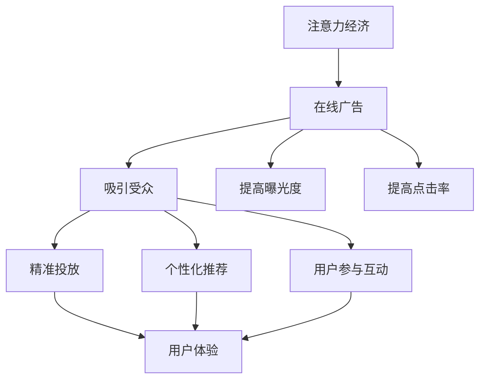

                 

**注意力经济**, **在线广告**, **用户体验**, **目标与策略**, **受众吸引**, **算法**, **数学模型**, **项目实践**, **实际应用**, **工具和资源推荐**, **未来发展趋势**

## 1. 背景介绍

互联网的发展带来了信息爆炸，用户的注意力成为稀缺资源。注意力经济的兴起，使得在线广告成为互联网商业模式的核心。然而，如何在不牺牲用户体验的情况下吸引受众，是当前在线广告面临的挑战。本文将深入探讨注意力经济与在线广告的目标与策略，并提供实践指南。

## 2. 核心概念与联系

### 2.1 注意力经济

注意力经济是指在信息过载的情况下，用户注意力成为稀缺资源，从而被商业化的经济形态。在线广告正是注意力经济的一种商业模式，它通过吸引用户注意力来实现盈利。

### 2.2 在线广告目标与策略

在线广告的目标是吸引受众，提高广告的曝光度和点击率。策略包括精准投放、个性化推荐、用户参与互动等。这些策略需要结合用户体验，避免对用户造成干扰。

### 2.3 核心概念联系

注意力经济、在线广告目标与策略是相辅相成的。注意力经济为在线广告提供了商业基础，在线广告目标与策略则是实现注意力经济的手段。二者的联系如下图所示：



## 3. 核心算法原理 & 具体操作步骤

### 3.1 算法原理概述

在线广告的目标与策略可以通过算法来实现。常用的算法包括推荐算法、目标优化算法等。本文将以推荐算法为例，介绍其原理和操作步骤。

### 3.2 算法步骤详解

推荐算法的步骤如下：

1. **数据收集**：收集用户行为数据，如点击、浏览、购买等。
2. **特征工程**：提取用户特征，如兴趣、偏好等。
3. **模型训练**：基于用户特征和行为数据，训练推荐模型。
4. **推荐生成**：根据模型，为用户生成个性化推荐列表。
5. **评估与优化**：评估推荐列表的效果，并优化模型。

### 3.3 算法优缺点

推荐算法的优点包括：

- **个性化**：根据用户特征和行为，提供个性化推荐。
- **精准**：提高广告曝光度和点击率。
- **自动化**：节省人力成本。

缺点包括：

- **数据依赖**：需要大量用户数据，且数据质量直接影响模型效果。
- **冷启动问题**：新用户缺乏行为数据，推荐效果较差。
- **过度个性化**：可能导致信息茧房效应。

### 3.4 算法应用领域

推荐算法广泛应用于在线广告、电子商务、内容推荐等领域。在在线广告中，推荐算法可以帮助精准投放广告，提高广告效果。

## 4. 数学模型和公式 & 详细讲解 & 举例说明

### 4.1 数学模型构建

推荐算法的数学模型可以表示为：

$$P(u, i) = f(s(u), s(i), r(u, i))$$

其中，$u$表示用户，$i$表示广告，$s(u)$表示用户特征，$s(i)$表示广告特征，$r(u, i)$表示用户对广告的行为反馈，$f(\cdot)$表示模型函数。

### 4.2 公式推导过程

模型函数$f(\cdot)$可以是任意形式，常用的形式包括线性回归、逻辑回归、神经网络等。以逻辑回归为例，模型函数可以表示为：

$$P(u, i) = \sigma(w^T \cdot [s(u), s(i), r(u, i)])$$

其中，$\sigma(\cdot)$表示sigmoid函数，$w$表示模型参数。

### 4.3 案例分析与讲解

假设我们要为用户$u_1$推荐广告。用户$u_1$的特征$s(u_1) = [1, 0, 1]$，广告$i_1$的特征$s(i_1) = [0, 1, 1]$，用户$u_1$对广告$i_1$的行为反馈$r(u_1, i_1) = 1$（表示点击）。如果模型参数$w = [1, 1, 1]$，则推荐概率为：

$$P(u_1, i_1) = \sigma(1 \cdot 1 + 1 \cdot 0 + 1 \cdot 1) = \sigma(2) \approx 0.88$$

这表示模型认为用户$u_1$点击广告$i_1$的概率为88%。

## 5. 项目实践：代码实例和详细解释说明

### 5.1 开发环境搭建

本项目使用Python开发，需要安装以下库：

- NumPy：数值计算库
- Pandas：数据处理库
- Scikit-learn：机器学习库
- Matplotlib：数据可视化库

### 5.2 源代码详细实现

以下是推荐算法的Python实现代码：

```python
import numpy as np
import pandas as pd
from sklearn.linear_model import LogisticRegression
from sklearn.model_selection import train_test_split
from sklearn.metrics import accuracy_score

# 数据加载
data = pd.read_csv('ad_data.csv')

# 特征工程
X = data[['user_feature1', 'user_feature2', 'ad_feature1', 'ad_feature2']]
y = data['click']

# 模型训练
X_train, X_test, y_train, y_test = train_test_split(X, y, test_size=0.2, random_state=42)
model = LogisticRegression()
model.fit(X_train, y_train)

# 推荐生成
def recommend(user, ads):
    user_features = user[['user_feature1', 'user_feature2']].values
    ad_features = ads[['ad_feature1', 'ad_feature2']].values
    clicks = np.dot(user_features, ad_features.T)
    probs = model.predict_proba(clicks)[:, 1]
    return ads.iloc[np.argsort(probs)[::-1]]

# 评估与优化
y_pred = model.predict(X_test)
print('Accuracy:', accuracy_score(y_test, y_pred))
```

### 5.3 代码解读与分析

代码首先加载用户和广告数据，然后进行特征工程，提取用户特征和广告特征。接着，代码训练逻辑回归模型，并使用模型为用户生成推荐列表。最后，代码评估模型效果，并打印准确率。

### 5.4 运行结果展示

运行代码后，可以得到推荐列表和模型准确率。推荐列表中包含用户可能点击的广告，列表越靠前，点击概率越高。模型准确率则表示模型预测用户点击行为的准确性。

## 6. 实际应用场景

### 6.1 在线广告平台

在线广告平台可以使用推荐算法精准投放广告，提高广告效果。例如，Google AdSense和Facebook Ads都使用推荐算法为用户提供个性化广告。

### 6.2 电子商务平台

电子商务平台可以使用推荐算法为用户推荐商品，提高购买转化率。例如，Amazon和eBay都使用推荐算法为用户提供个性化商品推荐。

### 6.3 未来应用展望

随着用户数据的丰富和算法技术的发展，推荐算法的应用将更加广泛。未来，推荐算法将不仅限于广告和商品推荐，还将应用于内容推荐、好友推荐等领域。

## 7. 工具和资源推荐

### 7.1 学习资源推荐

- **书籍**：《推荐系统实践》作者：项亮
- **课程**：[机器学习](https://www.coursera.org/learn/machine-learning) 课程，斯坦福大学Andrew Ng教授
- **博客**：[推荐系统的实现原理](https://www.jianshu.com/p/5665636e586d)

### 7.2 开发工具推荐

- **Python**：推荐算法的开发语言
- **TensorFlow**：深度学习框架，可以用于构建复杂的推荐模型
- **Apache Spark**：大数据处理框架，可以用于处理海量用户数据

### 7.3 相关论文推荐

- [The Wisdom of Crowds](https://www.jstor.org/stable/3877222) 詹姆斯·索罗维基
- [Efficient Collaborative Filtering for Online Advertising](https://dl.acm.org/doi/10.1145/1134271.1134273) 项亮等
- [DeepFM: A Factorization-Machine based Neural Network for CTR Prediction](https://arxiv.org/abs/1703.04247) 何正等

## 8. 总结：未来发展趋势与挑战

### 8.1 研究成果总结

本文介绍了注意力经济与在线广告的目标与策略，并以推荐算法为例，详细介绍了算法原理、操作步骤、数学模型和公式、项目实践等。通过实践项目，我们可以为用户提供个性化广告推荐，提高广告效果。

### 8.2 未来发展趋势

未来，推荐算法将朝着以下方向发展：

- **多模式学习**：结合用户行为、兴趣、偏好等多模式数据，构建更准确的推荐模型。
- **深度学习**：使用深度学习技术，构建更复杂的推荐模型。
- **实时推荐**：结合实时数据，为用户提供即时个性化推荐。

### 8.3 面临的挑战

推荐算法面临的挑战包括：

- **数据隐私**：如何在保护用户隐私的情况下，使用用户数据构建推荐模型。
- **信息茧房**：如何避免过度个性化导致的信息茧房效应。
- **冷启动问题**：如何为新用户提供个性化推荐。

### 8.4 研究展望

未来，推荐算法的研究将朝着以下方向展开：

- **跨平台推荐**：结合多个平台的用户数据，构建更准确的推荐模型。
- **动态推荐**：结合用户实时行为，为用户提供即时个性化推荐。
- **用户反馈**：结合用户反馈，优化推荐模型。

## 9. 附录：常见问题与解答

**Q1：推荐算法的优点是什么？**

A1：推荐算法的优点包括个性化、精准、自动化等。它可以为用户提供个性化推荐，提高广告曝光度和点击率，节省人力成本。

**Q2：推荐算法的缺点是什么？**

A2：推荐算法的缺点包括数据依赖、冷启动问题、过度个性化等。它需要大量用户数据，且数据质量直接影响模型效果。新用户缺乏行为数据，推荐效果较差。过度个性化可能导致信息茧房效应。

**Q3：推荐算法的应用领域有哪些？**

A3：推荐算法广泛应用于在线广告、电子商务、内容推荐等领域。在在线广告中，推荐算法可以帮助精准投放广告，提高广告效果。

**Q4：推荐算法的数学模型是什么？**

A4：推荐算法的数学模型可以表示为：$$P(u, i) = f(s(u), s(i), r(u, i))$$，其中，$u$表示用户，$i$表示广告，$s(u)$表示用户特征，$s(i)$表示广告特征，$r(u, i)$表示用户对广告的行为反馈，$f(\cdot)$表示模型函数。

**Q5：推荐算法的未来发展趋势是什么？**

A5：未来，推荐算法将朝着多模式学习、深度学习、实时推荐等方向发展。它将结合用户行为、兴趣、偏好等多模式数据，构建更准确的推荐模型。使用深度学习技术，构建更复杂的推荐模型。结合实时数据，为用户提供即时个性化推荐。

**Q6：推荐算法面临的挑战是什么？**

A6：推荐算法面临的挑战包括数据隐私、信息茧房、冷启动问题等。如何在保护用户隐私的情况下，使用用户数据构建推荐模型。如何避免过度个性化导致的信息茧房效应。如何为新用户提供个性化推荐。

**Q7：推荐算法的研究展望是什么？**

A7：未来，推荐算法的研究将朝着跨平台推荐、动态推荐、用户反馈等方向展开。它将结合多个平台的用户数据，构建更准确的推荐模型。结合用户实时行为，为用户提供即时个性化推荐。结合用户反馈，优化推荐模型。

**Q8：如何评估推荐算法的效果？**

A8：评估推荐算法的效果可以使用准确率、精确度、召回率等指标。准确率表示模型预测用户点击行为的准确性。精确度表示模型预测的正样本中，真正样本的比例。召回率表示真正样本中，被模型预测为正样本的比例。

**Q9：如何优化推荐算法的模型？**

A9：优化推荐算法的模型可以使用交叉验证、网格搜索、随机搜索等方法。交叉验证可以避免过拟合，提高模型泛化能力。网格搜索和随机搜索可以优化模型参数，提高模型效果。

**Q10：如何避免信息茧房效应？**

A10：避免信息茧房效应可以使用多样性推荐、反向推荐等方法。多样性推荐可以为用户推荐与其兴趣相关但不相同的内容。反向推荐可以为用户推荐与其兴趣相反的内容。此外，还可以结合用户反馈，动态调整推荐策略。

## 作者：禅与计算机程序设计艺术 / Zen and the Art of Computer Programming

