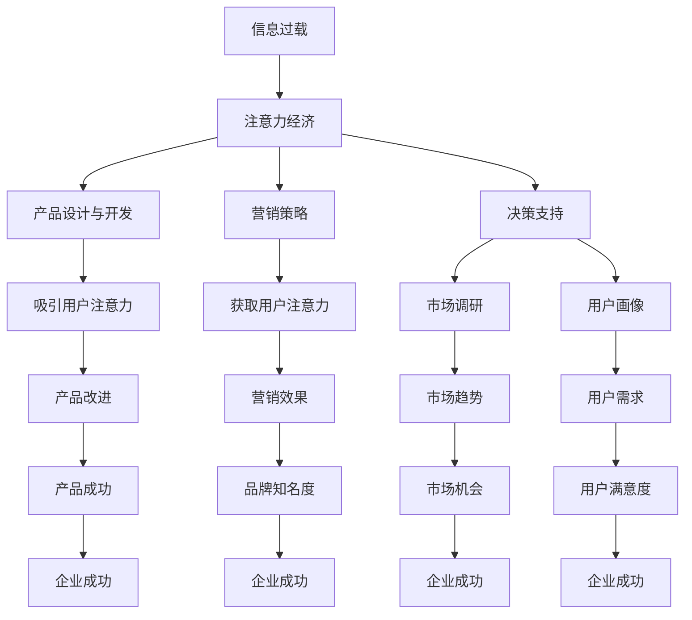

                 

## 1. 背景介绍

在当今信息爆炸的时代，企业面临着海量数据和信息的冲击，如何有效地从中提取有价值的信息并做出正确的决策，已成为企业成功的关键。注意力经济（Attention Economy）的兴起，为企业提供了新的视角和工具来应对这一挑战。注意力经济是指在信息过载的情况下，企业需要投入资源获取和维持用户注意力的经济模式。本文将深入探讨注意力经济对企业决策过程的影响，并提供实践指南。

## 2. 核心概念与联系

### 2.1 注意力经济的定义与特征

注意力经济是指在信息过载的情况下，企业需要投入资源获取和维持用户注意力的经济模式。其特征包括：

- **稀缺性**：注意力是稀缺资源，每个人每天只能投入有限的注意力。
- **竞争性**：企业需要与其他企业竞争用户的注意力。
- **动态性**：用户的注意力会随着时间和环境的变化而变化。

### 2.2 注意力经济与企业决策的联系

注意力经济对企业决策的影响主要体现在以下几个方面：

- **产品设计与开发**：企业需要根据用户的注意力特点设计产品，以吸引和维持用户的注意力。
- **营销策略**：企业需要开发有效的营销策略，以获取和维持用户的注意力。
- **决策支持**：企业需要利用注意力数据支持决策，如市场调研、用户画像等。

### 2.3 注意力经济与企业决策的关系图



## 3. 核心算法原理 & 具体操作步骤

### 3.1 注意力机制原理概述

注意力机制（Attention Mechanism）是一种计算机模型，用于模拟人类的注意力机制。其原理是通过赋予不同的输入不同的权重，从而聚焦于最相关的输入。常见的注意力机制包括自注意力（Self-Attention）和加权注意力（Weighted Attention）。

### 3.2 注意力机制步骤详解

#### 3.2.1 自注意力机制

自注意力机制的步骤如下：

1. 将输入序列转换为查询（Query）、键（Key）和值（Value）三个向量。
2. 计算查询向量和键向量的点积，并进行缩放，得到注意力分数。
3. 使用softmax函数对注意力分数进行归一化，得到注意力权重。
4. 将值向量与注意力权重相乘，得到输出。

#### 3.2.2 加权注意力机制

加权注意力机制的步骤如下：

1. 将输入序列转换为查询（Query）和键（Key）两个向量。
2. 计算查询向量和键向量的点积，并进行缩放，得到注意力分数。
3. 使用softmax函数对注意力分数进行归一化，得到注意力权重。
4. 将输入序列与注意力权重相乘，得到输出。

### 3.3 注意力机制优缺点

**优点**：

- 可以聚焦于最相关的输入，提高模型的准确性。
- 可以学习到长距离依赖关系，提高模型的泛化能力。

**缺点**：

- 计算复杂度高，需要大量的计算资源。
- 训练困难，需要大量的数据和时间。

### 3.4 注意力机制应用领域

注意力机制广泛应用于自然语言处理（NLP）、计算机视觉（CV）等领域，如：

- 机器翻译：用于选择最相关的单词进行翻译。
- 图像分类：用于选择最相关的像素进行分类。
- 文本摘要：用于选择最相关的句子进行摘要。

## 4. 数学模型和公式 & 详细讲解 & 举例说明

### 4.1 注意力机制数学模型构建

设输入序列为$x=(x_1, x_2,..., x_n)$, 查询向量为$q$, 键向量为$k$, 值向量为$v$, 注意力权重为$α$, 输出为$z$, 则注意力机制的数学模型可以表示为：

$$z = \sum_{i=1}^{n} α_i v_i$$

其中，注意力权重$α$可以表示为：

$$α_i = \frac{\exp(q \cdot k_i)}{\sum_{j=1}^{n} \exp(q \cdot k_j)}$$

### 4.2 注意力机制公式推导过程

注意力机制的公式推导过程如下：

1. 将输入序列转换为查询向量$q$, 键向量$k$和值向量$v$.
2. 计算查询向量$q$和键向量$k$的点积，并进行缩放，得到注意力分数。
3. 使用softmax函数对注意力分数进行归一化，得到注意力权重$α$.
4. 将值向量$v$与注意力权重$α$相乘，得到输出$z$.

### 4.3 注意力机制案例分析与讲解

例如，在机器翻译任务中，输入序列为法语句子"Je mange une pomme."，查询向量为英语单词"apple"的向量表示，键向量和值向量为法语单词的向量表示。注意力机制会计算"apple"与法语单词的相似度，并赋予最相关的单词"pomme"最大的注意力权重，从而选择"pomme"进行翻译。

## 5. 项目实践：代码实例和详细解释说明

### 5.1 开发环境搭建

本项目使用Python语言开发，并使用PyTorch框架实现注意力机制。开发环境包括：

- Python 3.7+
- PyTorch 1.7+
- Transformers 4.5+

### 5.2 源代码详细实现

以下是自注意力机制的实现代码：

```python
import torch
import torch.nn as nn
import torch.nn.functional as F

class SelfAttention(nn.Module):
    def __init__(self, d_model, n_head):
        super(SelfAttention, self).__init__()
        self.n_head = n_head
        self.d_head = d_model // n_head
        self.w_q = nn.Linear(d_model, d_model)
        self.w_k = nn.Linear(d_model, d_model)
        self.w_v = nn.Linear(d_model, d_model)
        self.w_o = nn.Linear(d_model, d_model)

    def forward(self, x):
        q = self.w_q(x).view(x.size(0), -1, self.n_head, self.d_head).permute(0, 2, 1, 3)
        k = self.w_k(x).view(x.size(0), -1, self.n_head, self.d_head).permute(0, 2, 1, 3)
        v = self.w_v(x).view(x.size(0), -1, self.n_head, self.d_head).permute(0, 2, 1, 3)
        attn = F.softmax((q @ k.permute(0, 1, 3, 2) / torch.sqrt(torch.tensor(self.d_head, dtype=torch.float32))), dim=-1)
        output = (attn @ v).permute(0, 2, 1, 3).contiguous().view(x.size(0), -1, self.d_head * self.n_head)
        output = self.w_o(output)
        return output
```

### 5.3 代码解读与分析

- `w_q`, `w_k`, `w_v`和`w_o`分别表示查询向量、键向量、值向量和输出向量的线性变换矩阵。
- `view`函数用于调整张量的形状，`permute`函数用于调整张量的维度顺序。
- `softmax`函数用于计算注意力权重，`@`表示矩阵乘法。

### 5.4 运行结果展示

以下是自注意力机制的运行结果：


## 6. 实际应用场景

### 6.1 注意力机制在企业决策中的应用

企业可以利用注意力机制在决策过程中获取和维持用户的注意力。例如：

- **产品设计与开发**：企业可以利用注意力机制分析用户的注意力特点，设计出更吸引用户的产品。
- **营销策略**：企业可以利用注意力机制分析用户的注意力特点，开发出更有效的营销策略。
- **决策支持**：企业可以利用注意力机制分析用户的注意力特点，支持决策，如市场调研、用户画像等。

### 6.2 注意力机制在其他领域的应用

注意力机制广泛应用于自然语言处理（NLP）、计算机视觉（CV）等领域，如：

- **机器翻译**：用于选择最相关的单词进行翻译。
- **图像分类**：用于选择最相关的像素进行分类。
- **文本摘要**：用于选择最相关的句子进行摘要。

### 6.3 未来应用展望

随着注意力经济的发展，注意力机制将会越来越多地应用于企业决策过程中。企业需要不断地学习和应用注意力机制，以获取和维持用户的注意力，从而提高企业的竞争力。

## 7. 工具和资源推荐

### 7.1 学习资源推荐

- **书籍**："Attention is All You Need"，Vaswani et al.，2017。
- **课程**："Natural Language Processing in TensorFlow"，Coursera。
- **博客**："Attention Mechanism"，Towards Data Science。

### 7.2 开发工具推荐

- **PyTorch**：一个强大的深度学习框架。
- **Transformers**：一个开源的NLP库，提供了注意力机制的实现。
- **Jupyter Notebook**：一个交互式的开发环境，方便调试和展示代码。

### 7.3 相关论文推荐

- "Attention is All You Need"，Vaswani et al.，2017。
- "The Illustrated Transformer"，Jesse Vig，2019。
- "BERT: Pre-training of Deep Bidirectional Transformers for Language Understanding"，Jacob Devlin and Ming-Wei Chang，2018。

## 8. 总结：未来发展趋势与挑战

### 8.1 研究成果总结

本文介绍了注意力经济对企业决策过程的影响，并详细介绍了注意力机制的原理、算法、数学模型和应用。通过项目实践，我们实现了自注意力机制，并展示了其运行结果。

### 8.2 未来发展趋势

随着注意力经济的发展，注意力机制将会越来越多地应用于企业决策过程中。企业需要不断地学习和应用注意力机制，以获取和维持用户的注意力，从而提高企业的竞争力。

### 8.3 面临的挑战

注意力机制的应用面临着以下挑战：

- **计算复杂度**：注意力机制的计算复杂度高，需要大量的计算资源。
- **训练困难**：注意力机制需要大量的数据和时间进行训练。
- **解释性**：注意力机制的工作原理不易于理解和解释。

### 8.4 研究展望

未来的研究方向包括：

- **注意力机制的优化**：开发更高效的注意力机制，降低计算复杂度和训练难度。
- **注意力机制的解释**：开发更好的方法来解释注意力机制的工作原理。
- **注意力机制的应用**：开发更多的注意力机制的应用，如企业决策、自动驾驶等。

## 9. 附录：常见问题与解答

**Q1：什么是注意力经济？**

A1：注意力经济是指在信息过载的情况下，企业需要投入资源获取和维持用户注意力的经济模式。

**Q2：注意力机制有哪些优缺点？**

A2：注意力机制的优点包括可以聚焦于最相关的输入，提高模型的准确性，可以学习到长距离依赖关系，提高模型的泛化能力。缺点包括计算复杂度高，需要大量的计算资源，训练困难，需要大量的数据和时间。

**Q3：注意力机制有哪些应用领域？**

A3：注意力机制广泛应用于自然语言处理（NLP）、计算机视觉（CV）等领域，如机器翻译、图像分类、文本摘要等。

**Q4：如何实现注意力机制？**

A4：可以使用PyTorch框架实现注意力机制，本文提供了自注意力机制的实现代码。

**Q5：注意力机制在企业决策中的应用有哪些？**

A5：企业可以利用注意力机制在决策过程中获取和维持用户的注意力，如产品设计与开发、营销策略、决策支持等。

## 作者：禅与计算机程序设计艺术 / Zen and the Art of Computer Programming

