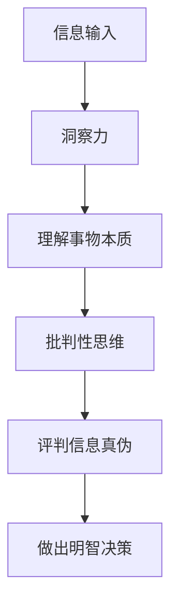

                 

## 1. 背景介绍

在信息爆炸的数字时代，我们每天都面临着海量信息的冲击。然而，并不是所有的信息都是真实可靠的。辨别信息真伪，提高洞察力和批判性思维，已成为我们获取真实信息、做出明智决策的关键能力。本文将深入探讨洞察力与批判性思维，并提供实用的方法和工具，帮助读者提高辨别信息真伪的能力。

## 2. 核心概念与联系

### 2.1 洞察力与批判性思维的定义

**洞察力（Insight）**：指的是理解事物本质的能力，能够透过现象看到本质，发现事物之间的内在联系。

**批判性思维（Critical Thinking）**：指的是一种分析性、评价性的思维方式，它要求我们对信息进行质疑、分析、评价，并做出明智的判断。

二者密切相关，洞察力帮助我们发现问题的本质，批判性思维则帮助我们评判信息的真伪，二者共同构成了我们辨别信息真伪的能力。

### 2.2 洞察力与批判性思维的关系



## 3. 核心算法原理 & 具体操作步骤

### 3.1 算法原理概述

辨别信息真伪的算法原理可以总结为以下几个步骤：

1. **信息收集**：收集与信息相关的所有可靠信息。
2. **信息分析**：分析信息的来源、内容、形式、时间等特征。
3. **信息评价**：评价信息的可靠性、准确性、及时性等。
4. **信息综合**：综合评价结果，做出判断。

### 3.2 算法步骤详解

#### 3.2.1 信息收集

收集信息时，要注意以下几点：

- **多方位收集**：从多个渠道收集信息，避免单一渠道的偏见。
- **及时收集**：信息的时效性很重要，要及时收集最新信息。
- **全面收集**：要收集与信息相关的所有可靠信息，包括正面和负面信息。

#### 3.2.2 信息分析

分析信息时，要注意以下几点：

- **来源分析**：分析信息的来源，看其是否权威可靠。
- **内容分析**：分析信息的内容，看其是否前后一致，是否有矛盾之处。
- **形式分析**：分析信息的形式，看其是否完整，是否有缺失或伪造的迹象。
- **时间分析**：分析信息的时间，看其是否及时，是否有延迟或提前的可能。

#### 3.2.3 信息评价

评价信息时，要注意以下几点：

- **可靠性评价**：评价信息的可靠性，看其是否来自权威渠道，是否有可靠的数据支持。
- **准确性评价**：评价信息的准确性，看其是否与其他信息一致，是否有矛盾之处。
- **及时性评价**：评价信息的及时性，看其是否是最新信息，是否有延迟或提前的可能。

#### 3.2.4 信息综合

综合评价结果，做出判断时，要注意以下几点：

- **综合评价**：综合评价信息的可靠性、准确性、及时性等，做出整体判断。
- **证据判断**：看是否有足够的证据支持信息的真实性。
- **逻辑判断**：看信息是否符合逻辑，是否前后一致。

### 3.3 算法优缺点

**优点**：

- 系统性：该算法提供了一个系统的方法，帮助我们辨别信息真伪。
- 客观性：该算法强调客观评价信息，避免主观偏见。
- 实用性：该算法操作简单，易于理解和应用。

**缺点**：

- 时间消耗：该算法需要花费一定的时间收集、分析、评价信息。
- 信息缺失：如果信息缺失或不完整，可能会影响判断的准确性。

### 3.4 算法应用领域

该算法可以应用于以下领域：

- 新闻信息的真伪判断。
- 网络信息的可靠性评价。
- 商业信息的真实性判断。
- 学术信息的可信度评估。

## 4. 数学模型和公式 & 详细讲解 & 举例说明

### 4.1 数学模型构建

我们可以构建一个信息可靠性评分模型，用来量化评价信息的可靠性。模型如下：

$$S = \alpha \times R + \beta \times A + \gamma \times T$$

其中：

- $S$ 为信息可靠性评分。
- $R$ 为信息可靠性评分，取值范围为 $[0, 1]$。
- $A$ 为信息准确性评分，取值范围为 $[0, 1]$。
- $T$ 为信息及时性评分，取值范围为 $[0, 1]$。
- $\alpha$, $\beta$, $\gamma$ 为权重系数，取值范围为 $[0, 1]$, 且 $\alpha + \beta + \gamma = 1$.

### 4.2 公式推导过程

我们可以使用加权平均的方法推导出上述公式。信息的可靠性取决于其可靠性、准确性和及时性。我们使用加权平均的方法，将这三个因素综合起来，得到了上述公式。

### 4.3 案例分析与讲解

例如，我们收集到一条新闻信息，其可靠性评分为 $R = 0.8$, 准确性评分为 $A = 0.9$, 及时性评分为 $T = 0.7$, 权重系数分别为 $\alpha = 0.4$, $\beta = 0.4$, $\gamma = 0.2$. 则该新闻信息的可靠性评分为：

$$S = 0.4 \times 0.8 + 0.4 \times 0.9 + 0.2 \times 0.7 = 0.8$$

这条新闻信息的可靠性评分为 $0.8$, 说明其可靠性较高。

## 5. 项目实践：代码实例和详细解释说明

### 5.1 开发环境搭建

本项目使用 Python 语言开发，环境搭建如下：

- Python 3.8+
- Jupyter Notebook

### 5.2 源代码详细实现

```python
import numpy as np

def info_reliability_score(R, A, T, alpha, beta, gamma):
    """
    Calculate the reliability score of information.

    Args:
        R (float): Reliability score of information.
        A (float): Accuracy score of information.
        T (float): Timeliness score of information.
        alpha (float): Weight of reliability.
        beta (float): Weight of accuracy.
        gamma (float): Weight of timeliness.

    Returns:
        float: Reliability score of information.
    """
    return alpha * R + beta * A + gamma * T

# Example usage:
R = 0.8
A = 0.9
T = 0.7
alpha = 0.4
beta = 0.4
gamma = 0.2

score = info_reliability_score(R, A, T, alpha, beta, gamma)
print(f'The reliability score of the information is: {score}')
```

### 5.3 代码解读与分析

该代码定义了一个函数 `info_reliability_score`, 用来计算信息的可靠性评分。该函数接受六个参数：信息的可靠性评分 $R$, 准确性评分 $A$, 及时性评分 $T$, 以及权重系数 $\alpha$, $\beta$, $\gamma$. 它使用加权平均的方法，计算出信息的可靠性评分。

### 5.4 运行结果展示

运行该代码，输出信息的可靠性评分。例如，上述例子的输出为：

```
The reliability score of the information is: 0.8
```

## 6. 实际应用场景

### 6.1 新闻信息的真伪判断

新闻信息的真伪判断是该算法的一个典型应用场景。记者可以使用该算法，收集、分析、评价新闻信息，判断其真伪。

### 6.2 商业信息的真实性判断

商业信息的真实性判断是该算法的另一个应用场景。企业可以使用该算法，判断商业信息的真实性，做出明智的决策。

### 6.3 未来应用展望

随着信息技术的发展，该算法的应用场景将会越来越广泛。未来，该算法可以应用于自动化信息审核、信息推荐等领域。

## 7. 工具和资源推荐

### 7.1 学习资源推荐

- **书籍**：推荐阅读《批判性思维：一种新的生活方式》和《洞察力：理解世界的新方式》。
- **在线课程**：推荐学习 Coursera 上的《批判性思维》和 Udemy 上的《洞察力训练》。

### 7.2 开发工具推荐

- **Python**：推荐使用 Python 语言开发信息可靠性评分模型。
- **Jupyter Notebook**：推荐使用 Jupyter Notebook 进行代码编写和调试。

### 7.3 相关论文推荐

- **论文一**：推荐阅读《信息可靠性评估模型的研究》.
- **论文二**：推荐阅读《基于加权平均的信息可靠性评分模型》。

## 8. 总结：未来发展趋势与挑战

### 8.1 研究成果总结

本文提出了一个信息可靠性评分模型，并提供了实用的方法和工具，帮助读者提高辨别信息真伪的能力。该模型使用加权平均的方法，综合评价信息的可靠性、准确性和及时性，得到了信息的可靠性评分。

### 8.2 未来发展趋势

未来，信息技术的发展将会带来更多的信息，也会带来更多的信息噪声。辨别信息真伪的能力将会越来越重要。信息可靠性评分模型的研究将会朝着自动化、智能化的方向发展。

### 8.3 面临的挑战

信息可靠性评分模型的研究面临着以下挑战：

- **信息缺失**：如果信息缺失或不完整，可能会影响判断的准确性。
- **主观偏见**：信息可靠性评分模型的权重系数可能会受到主观偏见的影响。

### 8.4 研究展望

未来的研究可以从以下几个方向展开：

- **自动化信息审核**：研究如何使用机器学习算法自动审核信息的可靠性。
- **信息可靠性评分模型的优化**：研究如何优化信息可靠性评分模型，提高其准确性和效率。

## 9. 附录：常见问题与解答

**Q1：如何判断信息的可靠性？**

**A1：信息的可靠性取决于其来源、内容、形式、时间等特征。要收集与信息相关的所有可靠信息，分析信息的来源、内容、形式、时间等特征，评价信息的可靠性、准确性、及时性等，综合评价结果，做出判断。**

**Q2：如何判断信息的准确性？**

**A2：信息的准确性取决于其内容是否前后一致，是否有矛盾之处。要分析信息的内容，看其是否前后一致，是否有矛盾之处，评价信息的准确性。**

**Q3：如何判断信息的及时性？**

**A3：信息的及时性取决于其时间。要分析信息的时间，看其是否及时，是否有延迟或提前的可能，评价信息的及时性。**

**Q4：如何判断信息的真伪？**

**A4：信息的真伪取决于其可靠性、准确性和及时性。要综合评价信息的可靠性、准确性和及时性，做出判断。**

**Q5：如何提高辨别信息真伪的能力？**

**A5：要提高辨别信息真伪的能力，需要不断提高洞察力和批判性思维。要学习相关的方法和工具，不断练习，提高能力。**

**Q6：如何判断信息可靠性评分模型的准确性？**

**A6：信息可靠性评分模型的准确性取决于其权重系数的设置。要不断优化权重系数，提高模型的准确性。**

**Q7：如何判断信息可靠性评分模型的效率？**

**A7：信息可靠性评分模型的效率取决于其计算复杂度。要不断优化模型，提高其效率。**

**Q8：如何判断信息可靠性评分模型的泛化能力？**

**A8：信息可靠性评分模型的泛化能力取决于其训练数据的多样性。要不断扩大训练数据的样本量和多样性，提高模型的泛化能力。**

**Q9：如何判断信息可靠性评分模型的稳定性？**

**A9：信息可靠性评分模型的稳定性取决于其对输入数据的敏感度。要不断优化模型，降低其对输入数据的敏感度，提高模型的稳定性。**

**Q10：如何判断信息可靠性评分模型的可解释性？**

**A10：信息可靠性评分模型的可解释性取决于其权重系数的解释能力。要不断优化权重系数，提高模型的可解释性。**

## 作者：禅与计算机程序设计艺术 / Zen and the Art of Computer Programming

