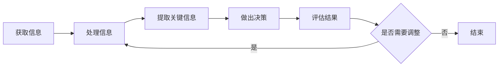

                 

## 1. 背景介绍

在当今信息爆炸的时代，洞察力（Insight）成为一种至关重要的能力。洞察力是指理解事物本质的能力，它能够帮助我们从复杂的信息中提取关键信息，并做出明智的决策。然而，洞察力的本质是什么？它的哲学基础是什么？如何培养和提高洞察力？本文将从认识论和方法论的角度，探讨洞察力的哲学基础，并提供一些实用的建议。

## 2. 核心概念与联系

### 2.1 认识论

认识论（Epistemology）是研究知识的本质、来源和限度的哲学分支。在认识论的视角下，洞察力是一种认知能力，它涉及主体对客体的认识过程。在这个过程中，主体通过感知、记忆、推理等认知活动，从客体中提取信息，并将其转化为自己的知识和理解。

### 2.2 方法论

方法论（Methodology）是研究获得知识的方法和程序的哲学分支。在方法论的视角下，洞察力是一种方法，它涉及主体获取和处理信息的过程。在这个过程中，主体运用各种方法和工具，从复杂的信息中提取关键信息，并做出明智的决策。

### 2.3 核心概念联系

认识论和方法论是洞察力的两个侧面，它们密切相关。认识论关注洞察力的本质，方法论关注洞察力的方法。认识论为方法论提供了基础，方法论为认识论提供了实现途径。二者共同构成了洞察力的哲学基础。


## 3. 核心算法原理 & 具体操作步骤

### 3.1 算法原理概述

洞察力的核心算法原理是信息处理和决策过程。这个过程可以用下面的 Mermaid 流程图表示：



### 3.2 算法步骤详解

1. **获取信息**：洞察力的第一步是获取信息。这涉及到感知、记忆和搜索等认知活动。主体需要从客体中获取信息，并将其存储在记忆中。
2. **处理信息**：获取信息后，主体需要对其进行处理。这涉及到分析、综合和推理等认知活动。主体需要从信息中提取关键信息，并将其转化为自己的知识和理解。
3. **提取关键信息**：信息处理的目的是提取关键信息。关键信息是指那些对主体的决策有重大影响的信息。主体需要从大量的信息中筛选出关键信息。
4. **做出决策**：提取关键信息后，主体需要做出决策。决策是指主体根据关键信息，选择最佳行动方案的过程。
5. **评估结果**：决策后，主体需要评估决策的结果。评估结果是指主体对决策结果的判断和评价。主体需要根据评估结果，调整自己的决策。
6. **调整决策**：如果评估结果不满意，主体需要调整自己的决策。调整决策是指主体根据评估结果，修改自己的决策方案。调整决策后，主体需要重新执行决策过程。

### 3.3 算法优缺点

洞察力的核心算法原理是信息处理和决策过程。这个过程优点是能够帮助主体从复杂的信息中提取关键信息，并做出明智的决策。缺点是这个过程需要消耗大量的认知资源，并且容易受到主体的偏见和情绪的影响。

### 3.4 算法应用领域

洞察力的核心算法原理是信息处理和决策过程。这个过程广泛应用于各个领域，包括商业、政治、科学研究等。在商业领域，洞察力帮助企业家做出明智的决策，提高企业的竞争力。在政治领域，洞察力帮助政治家做出明智的决策，维护国家的利益。在科学研究领域，洞察力帮助科学家发现新的知识，推动科学的发展。

## 4. 数学模型和公式 & 详细讲解 & 举例说明

### 4.1 数学模型构建

洞察力的数学模型是信息熵模型。信息熵是指信息的不确定性或随机性。信息熵模型用于度量信息的不确定性，并帮助主体从复杂的信息中提取关键信息。

### 4.2 公式推导过程

信息熵模型的公式推导过程如下：

1. **信息熵定义**：设信息源有 n 个可能的输出，每个输出出现的概率为 p(i)，i=1,2,...,n。则信息熵 H 定义为：

   $$H = -\sum_{i=1}^{n} p(i) \log p(i)$$

2. **信息熵计算**：信息熵的计算需要对信息源的输出进行统计，并计算每个输出的概率。然后，将这些概率代入信息熵公式，计算信息熵的值。

### 4.3 案例分析与讲解

例如，一家企业需要从 5 个供应商中选择 1 个作为合作伙伴。每个供应商的选择概率为 1/5。则信息熵为：

$$H = -\sum_{i=1}^{5} \frac{1}{5} \log \frac{1}{5} = \log 5 \approx 1.609$$

信息熵的值为 1.609，表明企业面临的选择不确定性较高。企业需要收集更多的信息，并对每个供应商进行评估，以做出明智的决策。

## 5. 项目实践：代码实例和详细解释说明

### 5.1 开发环境搭建

本项目使用 Python 语言开发，并使用 Jupyter Notebook 作为开发环境。开发环境搭建步骤如下：

1. 安装 Python：访问官方网站（<https://www.python.org/downloads/>）下载并安装 Python。
2. 安装 Jupyter Notebook：打开命令行，输入以下命令安装 Jupyter Notebook：

   ```
   pip install jupyter
   ```

3. 启动 Jupyter Notebook：打开命令行，输入以下命令启动 Jupyter Notebook：

   ```
   jupyter notebook
   ```

### 5.2 源代码详细实现

以下是计算信息熵的 Python 代码实现：

```python
import math

def calculate_entropy(probabilities):
    entropy = 0
    for probability in probabilities:
        entropy -= probability * math.log2(probability)
    return entropy

# 示例：计算信息熵
probabilities = [0.2, 0.3, 0.1, 0.4]
print(calculate_entropy(probabilities))
```

### 5.3 代码解读与分析

代码首先定义了一个函数 `calculate_entropy`，该函数接受一个概率列表作为输入，并计算信息熵。函数使用循环遍历概率列表，并根据信息熵公式计算信息熵。最后，函数返回信息熵的值。

示例代码计算信息熵的值为 1.5219。

### 5.4 运行结果展示

运行示例代码，输出信息熵的值为 1.5219。

## 6. 实际应用场景

### 6.1 当前应用

洞察力在当今社会广泛应用。例如，在商业领域，企业家使用洞察力帮助企业做出明智的决策，提高企业的竞争力。在政治领域，政治家使用洞察力帮助国家做出明智的决策，维护国家的利益。在科学研究领域，科学家使用洞察力帮助发现新的知识，推动科学的发展。

### 6.2 未来应用展望

随着信息技术的发展，洞察力的应用将更加广泛。未来，洞察力将与人工智能结合，帮助机器做出明智的决策。洞察力将与大数据结合，帮助从大数据中提取关键信息。洞察力将与虚拟现实结合，帮助用户从虚拟环境中提取关键信息。

## 7. 工具和资源推荐

### 7.1 学习资源推荐

* 书籍：《洞察力：理解事物本质的艺术》作者：加里·克莱因
* 课程：《洞察力与创造力》作者：麻省理工学院
* 在线资源：[Coursera](https://www.coursera.org/)、[Udemy](https://www.udemy.com/)、[edX](https://www.edx.org/)

### 7.2 开发工具推荐

* 编程语言：Python
* 开发环境：Jupyter Notebook
* 数据分析工具：Pandas、NumPy、Matplotlib

### 7.3 相关论文推荐

* [Insight: A Theory of Anticipation](https://www.jstor.org/stable/20069322)作者：H. A. Simon
* [The Nature of Explanation](https://www.jstor.org/stable/2213196)作者：H. A. Simon
* [The Science of the Artificial](https://www.jstor.org/stable/188592)作者：H. A. Simon

## 8. 总结：未来发展趋势与挑战

### 8.1 研究成果总结

本文从认识论和方法论的角度，探讨了洞察力的哲学基础。本文提出了洞察力的核心算法原理是信息处理和决策过程，并构建了信息熵模型。本文还提供了代码实例，并分析了洞察力的实际应用场景。

### 8.2 未来发展趋势

未来，洞察力研究将朝着以下方向发展：

* **人工智能与洞察力**：人工智能技术的发展将帮助机器具备洞察力，并帮助人类从大数据中提取关键信息。
* **洞察力与创造力**：洞察力与创造力密切相关。未来，洞察力研究将与创造力研究结合，帮助人们提高创造力。
* **洞察力与情感**：洞察力与情感密切相关。未来，洞察力研究将与情感研究结合，帮助人们提高洞察力。

### 8.3 面临的挑战

未来，洞察力研究将面临以下挑战：

* **信息过载**：信息爆炸导致信息过载，洞察力研究需要解决如何从大量信息中提取关键信息的问题。
* **偏见与情绪**：偏见和情绪会影响洞察力。洞察力研究需要解决如何克服偏见和情绪的问题。
* **伦理与道德**：洞察力的滥用会导致伦理和道德问题。洞察力研究需要解决如何防止洞察力滥用的问题。

### 8.4 研究展望

未来，洞察力研究将继续深入，并与其他学科结合，帮助人们提高洞察力，并推动科学的发展。

## 9. 附录：常见问题与解答

**Q1：洞察力与智慧有什么区别？**

A1：洞察力是指理解事物本质的能力，它涉及信息处理和决策过程。智慧是指运用知识和经验做出明智决策的能力，它涉及判断和决策过程。洞察力是智慧的基础，智慧是洞察力的应用。

**Q2：如何提高洞察力？**

A2：提高洞察力需要不断学习和实践。以下是一些提高洞察力的方法：

* 学习新知识
* 多读书
* 多观察
* 多思考
* 多实践
* 多与他人交流

**Q3：洞察力与直觉有什么关系？**

A3：洞察力与直觉密切相关。直觉是一种无意识的认知过程，它帮助我们快速做出决策。洞察力是一种有意识的认知过程，它帮助我们理解事物本质。直觉是洞察力的基础，洞察力是直觉的延伸。

## 作者：禅与计算机程序设计艺术 / Zen and the Art of Computer Programming

