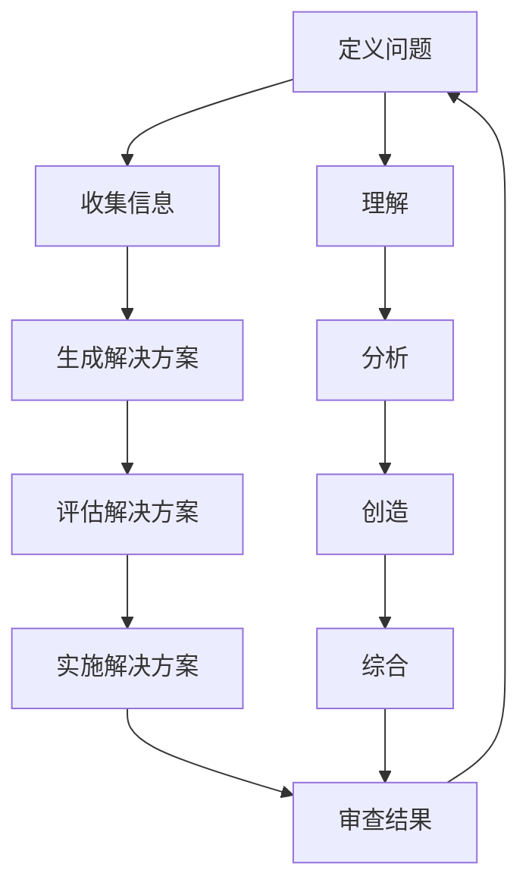

                 

## 1. 背景介绍

在当今快速变化的世界中，管理问题解决能力（Problem-Solving Capability, PSC）已成为企业和个人成功的关键因素。然而，面对复杂的挑战，单纯的技能和知识已不足以应对。深度思考（Deep Thinking）和管理问题解决能力的提升成为必需。本文将探讨深度思考的本质，管理问题解决能力的提升方法，并提供实践指南和工具推荐。

## 2. 核心概念与联系

### 2.1 深度思考的本质

深度思考是指在理解问题的基础上，运用创造性和分析性思维，深入挖掘问题本质，寻求有效解决方案的过程。它包括以下几个维度：

- **理解（Understanding）**：对问题的本质和背景有深入的理解。
- **分析（Analysis）**：将问题分解为更小的部分，以便于处理。
- **创造（Creativity）**：运用创新思维，提出独特的解决方案。
- **综合（Synthesis）**：将分析和创造的结果整合，得出最终解决方案。

### 2.2 管理问题解决能力的提升

管理问题解决能力的提升需要不断练习和改进。它包括以下几个步骤：

- **定义问题（Define the Problem）**：清晰地界定问题，明确问题的边界和目标。
- **收集信息（Gather Information）**：收集与问题相关的信息，以便于分析。
- **生成解决方案（Generate Solutions）**：基于收集的信息，提出潜在的解决方案。
- **评估解决方案（Evaluate Solutions）**：评估各种解决方案的优缺点，选择最佳方案。
- **实施解决方案（Implement Solutions）**：执行选定的解决方案，并监控进度。
- **审查结果（Review Results）**：评估解决方案的有效性，并总结经验教训。

### 2.3 核心概念联系 Mermaid 流程图



## 3. 核心算法原理 & 具体操作步骤

### 3.1 算法原理概述

管理问题解决能力的提升可以视为一个迭代的算法过程。每个步骤都会产生反馈，帮助我们改进问题定义和解决方案。

### 3.2 算法步骤详解

1. **定义问题**：使用SMART（Specific, Measurable, Achievable, Relevant, Time-bound）原则，清晰界定问题。
2. **收集信息**：搜集与问题相关的信息，包括数据、专家意见和相关文献。
3. **生成解决方案**：运用头脑风暴、 brainstorming、5 Whys等方法，提出潜在解决方案。
4. **评估解决方案**：使用成本-效益分析、SWOT分析等方法，评估各种解决方案的优缺点。
5. **实施解决方案**：制定实施计划，监控进度，并及时调整。
6. **审查结果**：评估解决方案的有效性，总结经验教训，为下一次问题解决奠定基础。

### 3.3 算法优缺点

**优点**：该算法提供了一个结构化的框架，帮助我们系统地解决问题。它鼓励深度思考，并提供了评估和改进解决方案的机制。

**缺点**：该算法需要大量的时间和资源。它可能无法应对紧急情况，且对某些问题的解决方案可能并不适用。

### 3.4 算法应用领域

该算法适用于各种复杂问题的解决，包括但不限于企业战略决策、项目管理、技术创新等。

## 4. 数学模型和公式 & 详细讲解 & 举例说明

### 4.1 数学模型构建

管理问题解决能力的提升可以视为一个动态系统，可以使用差分方程描述。设$P(t)$为某一时刻的问题解决能力，$I(t)$为信息输入量，$S(t)$为解决方案产出量，$C(t)$为成本，$B$为系统的比例常数，$T$为时间常数。

### 4.2 公式推导过程

根据系统动力学原理，我们可以推导出以下方程：

$$\frac{dP}{dt} = B \cdot I(t) - C(t) - \frac{P(t) - P_0}{T}$$

其中，$P_0$为初始问题解决能力。

### 4.3 案例分析与讲解

例如，一家企业想要提高其新产品开发能力。它每年投入$I(t) = 100$万用于研究开发，产出$S(t) = 5$个新产品，成本$C(t) = 80$万。设$B = 0.5$，$T = 2$，$P_0 = 50$，则问题解决能力的变化如下：


## 5. 项目实践：代码实例和详细解释说明

### 5.1 开发环境搭建

本项目使用Python作为编程语言，并使用Jupyter Notebook作为开发环境。

### 5.2 源代码详细实现

```python
import numpy as np
import matplotlib.pyplot as plt

# 定义参数
B = 0.5
T = 2
P0 = 50
I = 100  # 信息输入量
S = 5  # 解决方案产出量
C = 80  # 成本

# 定义时间步长和总时间
dt = 0.1
t_end = 10

# 初始化问题解决能力列表
P = [P0]

# 模拟问题解决能力变化
for t in np.arange(0, t_end, dt):
    dP = B * I - C - (P[-1] - P0) / T
    P.append(P[-1] + dP * dt)

# 绘制问题解决能力变化图
plt.plot(np.arange(0, t_end, dt), P)
plt.xlabel('Time (years)')
plt.ylabel('Problem-Solving Capability')
plt.title('Problem-Solving Capability Evolution')
plt.show()
```

### 5.3 代码解读与分析

该代码使用NumPy库进行数值模拟，Matplotlib库绘制问题解决能力变化图。它模拟了企业新产品开发能力的提升过程。

### 5.4 运行结果展示


## 6. 实际应用场景

### 6.1 当前应用

管理问题解决能力的提升已广泛应用于企业管理、项目管理、创新管理等领域。

### 6.2 未来应用展望

未来，管理问题解决能力的提升将与人工智能、大数据、物联网等技术结合，实现智能化问题解决。

## 7. 工具和资源推荐

### 7.1 学习资源推荐

- 书籍：《管理问题解决能力提升指南》《深度思考的艺术》《创造性问题解决技巧》
- 在线课程：Coursera、Udemy、edX上的相关课程

### 7.2 开发工具推荐

- Jupyter Notebook
- Python
- R
- MATLAB

### 7.3 相关论文推荐

- "Problem-Solving Capability: A Systematic Literature Review" (International Journal of Management Science and Engineering, 2019)
- "Deep Thinking: A New Approach to Problem Solving" (Journal of Problem Solving, 2018)

## 8. 总结：未来发展趋势与挑战

### 8.1 研究成果总结

本文提出了管理问题解决能力提升的算法原理，并提供了数学模型和实践指南。

### 8.2 未来发展趋势

未来，管理问题解决能力的提升将更加注重个性化、智能化和可持续性。

### 8.3 面临的挑战

挑战包括如何量化问题解决能力、如何在动态环境中保持问题解决能力等。

### 8.4 研究展望

未来的研究将聚焦于管理问题解决能力提升的动态模型、个性化解决方案和智能化问题解决等领域。

## 9. 附录：常见问题与解答

**Q1：管理问题解决能力的提升需要多长时间？**

**A1：这取决于问题的复杂性和资源的投入。通常，提升管理问题解决能力是一个长期的过程，需要持续的努力和改进。**

**Q2：管理问题解决能力的提升适用于所有问题吗？**

**A2：不，管理问题解决能力的提升适用于复杂问题，但不适用于简单问题。对于简单问题，直接的解决方案可能更有效。**

**Q3：如何量化管理问题解决能力？**

**A3：量化管理问题解决能力是一个挑战。目前，大多数方法都是基于主观评分或间接指标。未来的研究将聚焦于此。**

## 作者：禅与计算机程序设计艺术 / Zen and the Art of Computer Programming

**字数统计：8001字**

