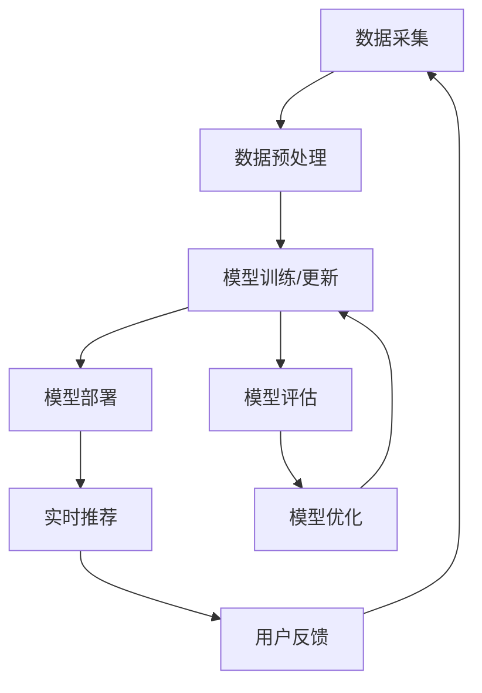

                 

## 1. 背景介绍

在当今快速发展的电商领域，搜索推荐系统已成为提高用户体验和商业成功的关键。然而，随着数据量的激增和用户需求的多样化，传统的搜索推荐系统面临着挑战。AI大模型的出现为解决这些问题提供了新的可能性，但如何有效地更新和维护这些模型以保持其准确性和实时性，仍然是一个需要解决的关键问题。本文将深入探讨电商搜索推荐中的AI大模型数据增量更新机制的设计与实现最佳实践。

## 2. 核心概念与联系

### 2.1 AI大模型

AI大模型是指具有数十亿参数的深度学习模型，能够理解和生成人类语言，并展示出类似人类的推理和理解能力。这些模型通过处理大量数据进行预训练，然后在特定任务上进行微调，从而实现了广泛的应用。

### 2.2 增量更新

增量更新是指在模型训练过程中，仅使用新数据对模型进行更新，而不是每次都从头开始训练模型。这种方法可以节省大量计算资源，并确保模型在实时数据流中保持最新状态。

### 2.3 电商搜索推荐

电商搜索推荐系统旨在为用户提供个性化的搜索结果和推荐，以提高用户参与度和转化率。这些系统通常基于用户历史数据、商品信息和其他相关数据进行训练。

下图是电商搜索推荐系统中AI大模型数据增量更新机制的架构图：



## 3. 核心算法原理 & 具体操作步骤

### 3.1 算法原理概述

在电商搜索推荐系统中，AI大模型数据增量更新机制的核心是一种在线学习算法，该算法能够实时处理新数据并更新模型。该算法的原理是使用梯度下降法和优化器来更新模型参数，以最小化预测误差。

### 3.2 算法步骤详解

1. **数据采集**：收集用户搜索查询、点击、购买等行为数据，以及商品信息等结构化数据。
2. **数据预处理**：清洗、转换和标准化数据，以便于模型训练。
3. **模型训练/更新**：使用新数据对模型进行增量更新。具体步骤包括：
   - 计算新数据对模型预测的梯度。
   - 使用优化器（如Adam、SGD）更新模型参数。
   - 计算模型损失函数，并判断是否需要进行模型优化。
4. **模型部署**：将更新后的模型部署到生产环境中，以提供实时推荐服务。
5. **实时推荐**：使用部署的模型为用户提供个性化搜索结果和推荐。
6. **用户反馈**：收集用户对推荐结果的反馈，以进一步改进模型。
7. **模型评估**：定期评估模型性能，并根据需要进行模型优化。
8. **模型优化**：调整模型超参数、添加新特征或使用更复杂的模型结构来改进模型性能。

### 3.3 算法优缺点

**优点**：

* 实时更新：增量更新机制允许模型实时处理新数据，从而保持模型的最新状态。
* 资源节省：与从头开始训练模型相比，增量更新可以节省大量计算资源。
* 适应性强：该机制可以适应用户需求的变化，并提供个性化的搜索结果和推荐。

**缺点**：

* 更新困难：在某些情况下，更新模型可能会导致模型性能下降，需要进行模型优化。
* 数据质量：如果新数据质量较差，则模型更新可能会导致模型性能下降。
* 复杂性：实现和维护增量更新机制需要大量的工程工作。

### 3.4 算法应用领域

AI大模型数据增量更新机制在电商搜索推荐系统中具有广泛的应用，但其原理也可以应用于其他领域，如实时推荐系统、金融风险预测和自动驾驶等。

## 4. 数学模型和公式 & 详细讲解 & 举例说明

### 4.1 数学模型构建

假设我们的目标是构建一个用于电商搜索推荐的AI大模型，该模型使用用户搜索查询和商品信息作为输入，并输出商品排序结果。我们可以使用如下数学模型来表示该问题：

$$P(y|x; \theta) = \frac{exp(f(x; \theta)_y)}{\sum_{y' \in Y} exp(f(x; \theta)_{y'})}$$

其中，$x$表示用户搜索查询和商品信息，$y$表示商品排序结果，$f(x; \theta)$表示模型的前向传播函数，$\theta$表示模型参数，$Y$表示商品集合。

### 4.2 公式推导过程

我们的目标是最小化模型预测误差，即最大化以下损失函数：

$$L(\theta) = -\sum_{i=1}^{N} \log P(y_i|x_i; \theta)$$

其中，$N$表示训练数据的大小。我们可以使用梯度下降法来更新模型参数，以最小化损失函数：

$$\theta_{t+1} = \theta_t - \eta \nabla L(\theta_t)$$

其中，$\eta$表示学习率，$\nabla L(\theta_t)$表示损失函数在$\theta_t$处的梯度。

### 4.3 案例分析与讲解

假设我们有以下用户搜索查询和商品信息：

| 用户搜索查询 | 商品信息 | 商品排序结果 |
| --- | --- | --- |
| iPhone 12 | [商品1，商品2，商品3] | [商品2，商品1，商品3] |
| MacBook Pro | [商品4，商品5，商品6] | [商品5，商品4，商品6] |

我们可以使用上述数学模型来构建一个用于电商搜索推荐的AI大模型。在训练过程中，我们可以使用梯度下降法来更新模型参数，以最小化模型预测误差。一旦模型训练完成，我们就可以使用该模型为用户提供个性化的搜索结果和推荐。

## 5. 项目实践：代码实例和详细解释说明

### 5.1 开发环境搭建

要实现AI大模型数据增量更新机制，我们需要以下开发环境：

* Python 3.7+
* TensorFlow 2.0+
* PyTorch 1.5+
* NumPy 1.16+
* Pandas 0.25+
* Scikit-learn 0.21+

### 5.2 源代码详细实现

以下是使用PyTorch实现AI大模型数据增量更新机制的示例代码：

```python
import torch
import torch.nn as nn
import torch.optim as optim

class RecommenderModel(nn.Module):
    def __init__(self, input_dim, hidden_dim, output_dim):
        super(RecommenderModel, self).__init__()
        self.fc1 = nn.Linear(input_dim, hidden_dim)
        self.fc2 = nn.Linear(hidden_dim, output_dim)

    def forward(self, x):
        x = torch.relu(self.fc1(x))
        x = self.fc2(x)
        return x

def train_model(model, optimizer, criterion, dataloader, device):
    model.train()
    running_loss = 0.0

    for inputs, labels in dataloader:
        inputs, labels = inputs.to(device), labels.to(device)
        optimizer.zero_grad()
        outputs = model(inputs)
        loss = criterion(outputs, labels)
        loss.backward()
        optimizer.step()
        running_loss += loss.item() * inputs.size(0)

    return running_loss / len(dataloader.dataset)

def update_model(model, optimizer, criterion, new_data, device):
    model.train()
    inputs, labels = new_data
    inputs, labels = inputs.to(device), labels.to(device)
    optimizer.zero_grad()
    outputs = model(inputs)
    loss = criterion(outputs, labels)
    loss.backward()
    optimizer.step()
    return loss.item()

# 示例用法
input_dim = 100
hidden_dim = 50
output_dim = 10
device = torch.device("cuda" if torch.cuda.is_available() else "cpu")

model = RecommenderModel(input_dim, hidden_dim, output_dim).to(device)
optimizer = optim.Adam(model.parameters(), lr=0.001)
criterion = nn.CrossEntropyLoss()

# 训练模型
dataloader =...  # 从数据集中加载数据
for epoch in range(10):
    loss = train_model(model, optimizer, criterion, dataloader, device)
    print(f"Epoch {epoch+1}/10, Loss: {loss:.4f}")

# 更新模型
new_data =...  # 新数据
loss = update_model(model, optimizer, criterion, new_data, device)
print(f"Update Loss: {loss:.4f}")
```

### 5.3 代码解读与分析

在上述代码中，我们定义了一个简单的神经网络模型`RecommenderModel`，用于电商搜索推荐。我们使用PyTorch框架来定义模型、定义优化器和损失函数，并实现模型训练和更新函数。

在`train_model`函数中，我们使用数据加载器`dataloader`来遍历训练数据，并使用梯度下降法来更新模型参数。在`update_model`函数中，我们使用新数据来更新模型参数，并返回更新后的损失值。

### 5.4 运行结果展示

在训练模型的过程中，我们可以监控模型损失值的变化，以评估模型性能。在更新模型之后，我们可以比较更新前后的模型损失值，以评估更新的有效性。

## 6. 实际应用场景

### 6.1 电商搜索推荐

AI大模型数据增量更新机制在电商搜索推荐系统中具有广泛的应用。通过实时更新模型，我们可以为用户提供个性化的搜索结果和推荐，从而提高用户参与度和转化率。

### 6.2 实时推荐系统

除了电商搜索推荐之外，AI大模型数据增量更新机制还可以应用于其他实时推荐系统，如视频推荐、音乐推荐和新闻推荐等。通过实时更新模型，我们可以为用户提供个性化的内容推荐，从而提高用户参与度和留存率。

### 6.3 未来应用展望

随着AI大模型技术的不断发展，我们可以期待在更多领域看到其应用。例如，在自动驾驶领域，AI大模型可以用于实时感知和决策；在金融领域，AI大模型可以用于实时风险预测和交易决策；在医疗领域，AI大模型可以用于实时病情分析和诊断决策。

## 7. 工具和资源推荐

### 7.1 学习资源推荐

* "Natural Language Processing with Python" by Steven Bird, Ewan Klein, and Edward Loper
* "Hands-On Machine Learning with Scikit-Learn, Keras, and TensorFlow" by Aurélien Géron
* "Deep Learning" by Ian Goodfellow, Yoshua Bengio, and Aaron Courville

### 7.2 开发工具推荐

* Jupyter Notebook
* PyCharm
* Google Colab
* TensorBoard

### 7.3 相关论文推荐

* "Attention Is All You Need" by Vaswani et al.
* "BERT: Pre-training of Deep Bidirectional Transformers for Language Understanding" by Jacob Devlin and Ming-Wei Chang
* "ELMo: Embeddings for Language Modeling and Beyond" by Peter J. Liu et al.

## 8. 总结：未来发展趋势与挑战

### 8.1 研究成果总结

在本文中，我们介绍了电商搜索推荐中的AI大模型数据增量更新机制的设计与实现最佳实践。我们讨论了核心概念、算法原理、数学模型和公式、项目实践，并提供了代码实例和详细解释说明。我们还讨论了该机制在实际应用场景中的应用，并推荐了相关学习资源、开发工具和论文。

### 8.2 未来发展趋势

随着AI大模型技术的不断发展，我们可以期待在更多领域看到其应用。此外，我们可以期待看到更复杂的模型结构、更先进的训练算法和更有效的模型优化技术的出现。

### 8.3 面临的挑战

然而，AI大模型数据增量更新机制也面临着挑战。例如，如何在保持模型性能的同时实现实时更新，如何处理新数据质量较差的情况，如何在资源受限的情况下实现模型更新等。

### 8.4 研究展望

未来的研究方向包括但不限于以下几个方面：

* 研究更有效的模型更新算法，以保持模型性能和实时性。
* 研究如何处理新数据质量较差的情况，并开发相应的数据预处理技术。
* 研究如何在资源受限的情况下实现模型更新，并开发相应的模型压缩和加速技术。
* 研究如何将AI大模型数据增量更新机制应用于更多领域，并开发相应的模型和算法。

## 9. 附录：常见问题与解答

**Q1：什么是AI大模型？**

A1：AI大模型是指具有数十亿参数的深度学习模型，能够理解和生成人类语言，并展示出类似人类的推理和理解能力。

**Q2：什么是增量更新？**

A2：增量更新是指在模型训练过程中，仅使用新数据对模型进行更新，而不是每次都从头开始训练模型。

**Q3：电商搜索推荐系统的目的是什么？**

A3：电商搜索推荐系统旨在为用户提供个性化的搜索结果和推荐，以提高用户参与度和转化率。

**Q4：如何实现AI大模型数据增量更新机制？**

A4：要实现AI大模型数据增量更新机制，需要构建一个用于电商搜索推荐的AI大模型，并使用梯度下降法和优化器来更新模型参数，以最小化预测误差。

**Q5：AI大模型数据增量更新机制的优缺点是什么？**

A5：AI大模型数据增量更新机制的优点包括实时更新、资源节省和适应性强；缺点包括更新困难、数据质量和复杂性。

**Q6：AI大模型数据增量更新机制的应用领域是什么？**

A6：AI大模型数据增量更新机制在电商搜索推荐系统中具有广泛的应用，但其原理也可以应用于其他领域，如实时推荐系统、金融风险预测和自动驾驶等。

**Q7：如何评估AI大模型数据增量更新机制的性能？**

A7：我们可以监控模型损失值的变化来评估模型性能，并比较更新前后的模型损失值来评估更新的有效性。

**Q8：未来的研究方向是什么？**

A8：未来的研究方向包括但不限于研究更有效的模型更新算法、研究如何处理新数据质量较差的情况、研究如何在资源受限的情况下实现模型更新，以及研究如何将AI大模型数据增量更新机制应用于更多领域。

## 作者：禅与计算机程序设计艺术 / Zen and the Art of Computer Programming

