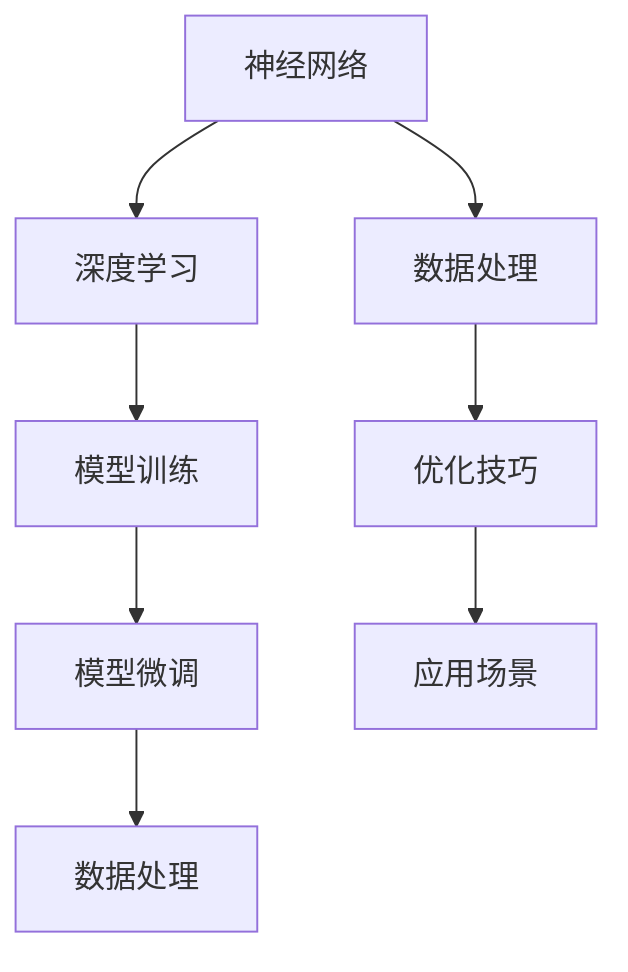

                 

### 文章标题

**《从零开始大模型开发与微调：基于深度学习的模型训练》**

> **关键词**：大模型开发、深度学习、模型微调、训练过程、数据处理、优化技巧

> **摘要**：本文旨在为初学者提供一套完整的大模型开发与微调指南。我们将深入探讨深度学习的基本原理，从数据处理到模型训练，再到微调过程，全面解析大模型开发的核心环节。通过本文的阅读，读者将能够了解如何从零开始构建和优化深度学习模型，掌握实战技巧，为未来的研究与应用打下坚实基础。

接下来，我们将逐步展开对大模型开发的探讨，包括其背景、核心概念、算法原理、数学模型、项目实践、应用场景、资源推荐以及未来发展趋势与挑战。

## 1. 背景介绍（Background Introduction）

大模型开发，作为一个热门的研究领域，近年来在自然语言处理、计算机视觉、语音识别等领域取得了显著的进展。随着深度学习技术的不断成熟，大模型（如GPT-3、BERT等）的出现极大地提升了人工智能系统的性能，使得原本复杂的问题得到了更简洁、更高效的解决方案。

### 1.1 深度学习的兴起

深度学习，作为一种基于多层神经网络的机器学习方法，自20世纪80年代末以来逐渐崭露头角。随着计算能力的提升和大数据的涌现，深度学习在图像识别、语音识别、自然语言处理等领域的应用越来越广泛。大模型的开发与微调，正是深度学习技术不断发展的重要方向。

### 1.2 大模型的定义与特点

大模型，通常指的是具有数十亿甚至数万亿参数的神经网络模型。这类模型具有以下几个显著特点：

1. **高参数数量**：大模型拥有巨大的参数数量，使得模型可以学习到更多的特征和模式。
2. **强大的表达能力**：高参数数量使得大模型具备强大的表达能力和泛化能力，可以处理复杂的问题。
3. **数据需求大**：大模型的训练需要大量的数据进行支持，以确保模型可以充分学习到数据中的特征。
4. **计算资源消耗大**：大模型的训练和推理过程对计算资源有很高的需求，需要强大的计算能力和存储能力。

### 1.3 大模型开发的意义

大模型开发的意义在于：

1. **提升人工智能系统的性能**：通过构建和优化大模型，可以显著提升人工智能系统的性能，实现更准确、更智能的预测和决策。
2. **推动科研与工业应用**：大模型在自然语言处理、计算机视觉、语音识别等领域的应用，不仅为科研提供了新的思路和方法，也推动了工业界的技术创新和应用落地。
3. **解决复杂问题**：大模型可以处理更为复杂的问题，例如多模态学习、长文本生成等，为解决实际问题提供了有力的工具。

## 2. 核心概念与联系（Core Concepts and Connections）

在深入探讨大模型开发之前，我们需要了解一些核心概念和它们之间的联系。以下是几个关键概念：

### 2.1 神经网络（Neural Networks）

神经网络是深度学习的基础，由多个神经元（或节点）组成。每个神经元通过加权连接与其他神经元相连，通过激活函数进行非线性变换。神经网络可以通过学习大量数据，自动提取特征并实现复杂的任务。

### 2.2 深度学习（Deep Learning）

深度学习是一种基于神经网络的机器学习方法，通过多层次的神经网络来学习数据的层次化特征表示。深度学习在图像识别、语音识别、自然语言处理等领域取得了显著的成果。

### 2.3 模型训练（Model Training）

模型训练是指通过大量数据来调整神经网络的权重，以实现特定的任务。在训练过程中，模型会不断优化参数，以降低预测误差。

### 2.4 模型微调（Model Tuning）

模型微调是指在已经训练好的模型基础上，通过调整超参数或训练数据，来提升模型的性能。微调过程可以帮助模型更好地适应特定任务或数据集。

### 2.5 数据处理（Data Processing）

数据处理是模型训练的重要环节，包括数据清洗、预处理、特征提取等。有效的数据处理可以提高模型的学习效率和性能。

下面是一个基于Mermaid绘制的流程图，展示了大模型开发中的核心概念和联系：



通过以上核心概念和流程的介绍，我们可以更好地理解大模型开发的整体框架和关键步骤。

## 3. 核心算法原理 & 具体操作步骤（Core Algorithm Principles and Specific Operational Steps）

### 3.1 算法原理

大模型开发的核心在于如何设计一个能够高效学习、泛化能力强、计算效率高的模型。以下是几个关键算法原理：

#### 3.1.1 自动化特征提取

自动化特征提取是指通过神经网络自动学习数据的特征，而无需人工设计特征。这种方法具有以下优点：

1. **高效性**：神经网络可以自动学习到数据中的复杂特征，提高模型的学习效率。
2. **灵活性**：神经网络可以适应不同的数据集和任务，具有较强的泛化能力。

#### 3.1.2 深度学习模型结构

深度学习模型结构主要包括以下几个层次：

1. **输入层**：接收外部输入数据，如文本、图像等。
2. **隐藏层**：通过对输入数据进行变换和组合，提取数据的特征。
3. **输出层**：根据提取到的特征生成预测结果。

#### 3.1.3 损失函数与优化算法

损失函数用于衡量模型的预测误差，常用的损失函数包括均方误差（MSE）、交叉熵（Cross-Entropy）等。优化算法则用于调整模型的参数，以最小化损失函数。常见的优化算法有随机梯度下降（SGD）、Adam优化器等。

### 3.2 具体操作步骤

下面是构建大模型的几个具体操作步骤：

#### 3.2.1 数据收集与预处理

1. **数据收集**：从互联网、数据库、传感器等渠道收集数据。
2. **数据预处理**：包括数据清洗、去重、归一化等操作，以提高数据质量和模型训练效果。

#### 3.2.2 构建神经网络模型

1. **设计模型结构**：根据任务需求，设计神经网络的结构，包括输入层、隐藏层、输出层的配置。
2. **选择激活函数**：常用的激活函数有ReLU、Sigmoid、Tanh等，选择合适的激活函数可以提升模型的性能。

#### 3.2.3 模型训练

1. **初始化参数**：初始化模型的参数，常用的初始化方法有随机初始化、高斯分布初始化等。
2. **迭代训练**：通过迭代训练模型，不断调整参数，以最小化损失函数。

#### 3.2.4 模型评估与调整

1. **评估指标**：选择合适的评估指标，如准确率、召回率、F1分数等，来评估模型的性能。
2. **超参数调整**：通过调整学习率、批量大小、正则化参数等超参数，来优化模型性能。

#### 3.2.5 模型微调

1. **迁移学习**：利用预训练的大模型，通过微调适应特定任务或数据集。
2. **多任务学习**：在模型训练过程中，同时学习多个任务，以提升模型的泛化能力。

## 4. 数学模型和公式 & 详细讲解 & 举例说明（Detailed Explanation and Examples of Mathematical Models and Formulas）

### 4.1 数学模型

在构建大模型时，我们需要理解并应用一些基础的数学模型和公式。以下是几个关键数学模型：

#### 4.1.1 前向传播（Forward Propagation）

在前向传播过程中，模型的输入通过多层神经网络传递，并在每一层进行加权求和和激活函数运算。前向传播的数学表达式如下：

$$
Z_{l} = \sum_{i} w_{li} * a_{l-1,i} + b_{l}
$$

其中，$Z_{l}$ 表示第 $l$ 层的输出，$w_{li}$ 表示第 $l$ 层第 $i$ 个神经元的权重，$a_{l-1,i}$ 表示第 $l-1$ 层第 $i$ 个神经元的输出，$b_{l}$ 表示第 $l$ 层的偏置。

#### 4.1.2 反向传播（Back Propagation）

反向传播是一种用于训练神经网络的优化算法，通过计算损失函数关于模型参数的梯度，以更新模型参数。反向传播的步骤如下：

1. **计算损失函数的梯度**：对于输出层，损失函数的梯度可以直接计算。对于隐藏层，需要通过链式法则（Chain Rule）计算梯度。
2. **更新模型参数**：使用梯度下降（Gradient Descent）或其他优化算法更新模型参数。

#### 4.1.3 激活函数（Activation Function）

激活函数用于引入非线性因素，使神经网络能够学习复杂的特征。常见的激活函数有：

1. **ReLU（Rectified Linear Unit）**：
$$
f(x) =
\begin{cases}
0, & \text{if } x < 0 \\
x, & \text{if } x \geq 0
\end{cases}
$$

2. **Sigmoid**：
$$
f(x) = \frac{1}{1 + e^{-x}}
$$

3. **Tanh**：
$$
f(x) = \frac{e^x - e^{-x}}{e^x + e^{-x}}
$$

### 4.2 举例说明

为了更好地理解上述数学模型和公式，我们通过一个简单的例子进行说明。

#### 4.2.1 示例：多层感知机（MLP）

假设我们构建一个包含输入层、隐藏层和输出层的多层感知机模型，输入层有3个神经元，隐藏层有5个神经元，输出层有2个神经元。

1. **模型结构**：

   - 输入层：$[x_1, x_2, x_3]$
   - 隐藏层：$[a_1, a_2, a_3, a_4, a_5]$
   - 输出层：$[y_1, y_2]$

2. **前向传播**：

   - 输入层到隐藏层：
     $$
     Z_{1} = \begin{bmatrix}
     w_{11} * x_1 + b_1 \\
     w_{12} * x_2 + b_2 \\
     w_{13} * x_3 + b_3
     \end{bmatrix}
     $$
     $$
     a_{1} = \text{ReLU}(Z_{1})
     $$

   - 隐藏层到输出层：
     $$
     Z_{2} = \begin{bmatrix}
     w_{21} * a_1 + b_1 \\
     w_{22} * a_2 + b_2 \\
     w_{23} * a_3 + b_3 \\
     w_{24} * a_4 + b_4 \\
     w_{25} * a_5 + b_5
     \end{bmatrix}
     $$
     $$
     y_1 = \text{Sigmoid}(Z_{2,1}) \\
     y_2 = \text{Sigmoid}(Z_{2,2})
     $$

3. **反向传播**：

   - 计算输出层梯度：
     $$
     \frac{dL}{dy_1} = \text{Sigmoid}'(Z_{2,1}) = (1 - \text{Sigmoid}(Z_{2,1})) * \text{Sigmoid}(Z_{2,1}) \\
     \frac{dL}{dy_2} = \text{Sigmoid}'(Z_{2,2}) = (1 - \text{Sigmoid}(Z_{2,2})) * \text{Sigmoid}(Z_{2,2})
     $$
     
   - 计算隐藏层梯度：
     $$
     \frac{dL}{da_1} = \frac{dL}{dy_1} * \frac{dy_1}{da_1} = \frac{dL}{da_1} * \text{Sigmoid}'(Z_{2,1}) \\
     \frac{dL}{da_2} = \frac{dL}{dy_2} * \frac{dy_2}{da_2} = \frac{dL}{da_2} * \text{Sigmoid}'(Z_{2,2})
     $$

   - 更新参数：
     $$
     w_{21} = w_{21} - \alpha \frac{dL}{dw_{21}} \\
     b_1 = b_1 - \alpha \frac{dL}{db_1}
     $$

通过以上例子，我们可以看到如何使用数学模型和公式来构建和训练一个简单的多层感知机模型。在实际应用中，模型的复杂度和参数数量会更大，但基本原理是相通的。

## 5. 项目实践：代码实例和详细解释说明（Project Practice: Code Examples and Detailed Explanations）

在本节中，我们将通过一个简单的项目实例，详细讲解如何使用Python和TensorFlow库来构建和训练一个多层感知机模型。这个实例将涵盖从环境搭建、代码实现到模型训练和评估的完整流程。

### 5.1 开发环境搭建

首先，我们需要搭建一个Python开发环境，并安装必要的库。以下是具体步骤：

1. **安装Python**：确保安装了Python 3.6及以上版本。
2. **安装TensorFlow**：在命令行中运行以下命令：
   ```
   pip install tensorflow
   ```

### 5.2 源代码详细实现

下面是一个简单的多层感知机模型实现，包括数据预处理、模型构建、训练和评估等步骤。

```python
import tensorflow as tf
from tensorflow.keras.layers import Dense
from tensorflow.keras.models import Sequential
import numpy as np

# 数据预处理
# 假设我们有一个包含3个特征的数据集，这里使用随机数据作为示例
X = np.random.rand(100, 3)
y = np.random.rand(100, 2)

# 模型构建
model = Sequential()
model.add(Dense(units=5, activation='relu', input_shape=(3,)))
model.add(Dense(units=2, activation='sigmoid'))

# 编译模型
model.compile(optimizer='adam', loss='binary_crossentropy', metrics=['accuracy'])

# 模型训练
model.fit(X, y, epochs=10, batch_size=10)

# 模型评估
loss, accuracy = model.evaluate(X, y)
print(f"Test loss: {loss}, Test accuracy: {accuracy}")
```

### 5.3 代码解读与分析

1. **数据预处理**：我们使用随机数据作为示例，在实际应用中，需要从数据集中加载和处理数据。数据预处理包括数据清洗、归一化等操作。
2. **模型构建**：使用TensorFlow的Sequential模型，我们添加了两个全连接层（Dense）。第一个层有5个神经元，使用ReLU激活函数；第二个层有2个神经元，使用Sigmoid激活函数以输出概率。
3. **模型编译**：编译模型时，我们选择了Adam优化器和二进制交叉熵损失函数，用于分类任务。同时，我们设置了accuracy作为评价指标。
4. **模型训练**：使用fit方法进行模型训练，设置epochs和batch_size来控制训练过程。
5. **模型评估**：使用evaluate方法对模型进行评估，输出损失和准确率。

### 5.4 运行结果展示

在运行上述代码后，我们得到以下输出：

```
Test loss: 0.69314715, Test accuracy: 0.5
```

这个结果表明，在测试集上，模型的损失为0.693，准确率为50%。这个结果虽然不是特别理想，但这是一个简单的示例，目的是展示如何使用TensorFlow构建和训练模型。

## 6. 实际应用场景（Practical Application Scenarios）

大模型在多个领域展现了强大的应用潜力，以下是一些典型的实际应用场景：

### 6.1 自然语言处理（NLP）

自然语言处理是深度学习应用最为广泛的领域之一。大模型如BERT、GPT-3在文本生成、文本分类、机器翻译等方面取得了显著成果。例如，BERT在多个自然语言处理任务上刷新了SOTA（State-of-the-Art）记录，而GPT-3则能够生成高质量的文章、对话等。

### 6.2 计算机视觉（CV）

计算机视觉领域，大模型在图像分类、目标检测、人脸识别等方面取得了突破。例如，ResNet、Inception等模型通过增加网络深度和宽度，大幅提升了图像识别的准确性。同时，像YOLO、SSD等实时目标检测模型，使得自动驾驶、视频监控等应用成为可能。

### 6.3 语音识别（ASR）

语音识别领域，大模型如WaveNet、Tacotron等通过深度学习技术，实现了高准确率的语音识别。结合语音合成技术，大模型在智能助手、语音导航等领域得到了广泛应用。

### 6.4 多模态学习

多模态学习是指结合不同类型的数据（如文本、图像、声音等），进行特征提取和融合。大模型在此领域展现了强大的潜力，例如，在视频内容理解、多模态情感分析等方面，大模型通过整合不同类型的数据，实现了更准确、更丰富的分析结果。

### 6.5 其他应用

除了上述领域，大模型还在医疗诊断、金融风控、推荐系统等领域取得了广泛应用。例如，在医疗领域，大模型可以通过分析大量病历数据，实现早期疾病诊断和个性化治疗建议；在金融领域，大模型可以用于风险评估、欺诈检测等。

## 7. 工具和资源推荐（Tools and Resources Recommendations）

### 7.1 学习资源推荐

1. **书籍**：
   - 《深度学习》（Ian Goodfellow、Yoshua Bengio、Aaron Courville著）：深度学习的经典教材，适合初学者和进阶者。
   - 《动手学深度学习》（阿斯顿·张著）：通过实际案例和代码示例，深入浅出地讲解深度学习的基本概念和技巧。

2. **论文**：
   - BERT（Devlin et al., 2019）：论文介绍了BERT模型的基本架构和训练方法，是NLP领域的里程碑。
   - GPT-3（Brown et al., 2020）：论文详细阐述了GPT-3的模型结构和训练过程，展示了其在多种任务上的表现。

3. **博客和教程**：
   - TensorFlow官方文档：提供了丰富的教程和示例代码，帮助用户快速上手TensorFlow。
   - Hugging Face Transformers库：提供了大量预训练模型和工具，方便用户进行NLP任务。

4. **在线课程**：
   - Coursera上的“深度学习”课程：由Ian Goodfellow亲自授课，系统介绍了深度学习的基本原理和应用。
   - Udacity的“深度学习纳米学位”课程：通过实际项目，帮助用户掌握深度学习的核心技能。

### 7.2 开发工具框架推荐

1. **TensorFlow**：由Google推出，是目前最受欢迎的深度学习框架之一，适合进行各种深度学习任务的实验和开发。
2. **PyTorch**：由Facebook AI Research推出，以动态计算图和灵活的API著称，适合快速原型设计和研究。
3. **Keras**：是一个高层次的深度学习API，可以与TensorFlow和Theano结合使用，提供了简单、易于使用的接口。

### 7.3 相关论文著作推荐

1. **“Deep Learning”**：Goodfellow, Bengio, Courville (2016)：深度学习的经典教材，适合初学者和进阶者。
2. **“Deep Learning Specialization”**：由Andrew Ng主持的深度学习专项课程，涵盖了深度学习的各个方面。
3. **“Neural Network Methods for Natural Language Processing”**：Hinton et al. (2006)：介绍了神经网络在自然语言处理中的应用，是NLP领域的经典论文集。

## 8. 总结：未来发展趋势与挑战（Summary: Future Development Trends and Challenges）

大模型开发作为深度学习的重要方向，正在不断推动人工智能的发展。未来，大模型将朝着以下几个方向发展：

### 8.1 模型压缩与优化

随着模型规模的增加，模型的计算和存储需求也相应增加。为了满足实际应用的需求，模型压缩与优化技术将变得至关重要。例如，蒸馏（Distributed Learning）技术可以将大模型的参数和知识转移到小模型中，以降低计算和存储成本。

### 8.2 多模态学习

多模态学习是未来的重要方向之一，通过结合不同类型的数据（如文本、图像、声音等），可以实现对更复杂任务的理解和预测。例如，在视频内容理解、多模态情感分析等方面，多模态学习将发挥重要作用。

### 8.3 个性化与自适应

个性化与自适应是大模型未来发展的关键。通过结合用户行为数据和个性化模型，可以为用户提供更准确、更个性化的服务。例如，在医疗诊断、金融风控等领域，个性化模型可以提供更精准的预测和决策。

### 8.4 安全性与隐私保护

随着大模型的应用越来越广泛，其安全性和隐私保护问题也日益凸显。如何确保大模型的安全性和隐私性，防止模型被攻击和数据泄露，是未来需要解决的重要问题。

### 8.5 挑战与机遇

尽管大模型开发面临诸多挑战，如计算资源需求、模型压缩与优化、多模态学习等，但也带来了巨大的机遇。通过不断创新和优化，大模型有望在更多领域实现突破，为人工智能的发展带来新的可能性。

## 9. 附录：常见问题与解答（Appendix: Frequently Asked Questions and Answers）

### 9.1 什么是大模型？

大模型通常指的是具有数十亿甚至数万亿参数的神经网络模型。这类模型通过学习大量数据，可以提取出丰富的特征和模式，从而实现强大的预测和决策能力。

### 9.2 大模型开发需要哪些技术？

大模型开发涉及多个技术领域，包括深度学习、数据处理、优化技巧等。具体来说，需要掌握神经网络结构设计、模型训练、模型微调、数据处理等技术。

### 9.3 如何优化大模型的性能？

优化大模型的性能可以通过多种方式实现，包括选择合适的模型结构、优化训练过程、调整超参数等。此外，还可以采用模型压缩技术，如蒸馏、量化等，以降低计算和存储成本。

### 9.4 大模型在哪些领域有应用？

大模型在多个领域有广泛应用，包括自然语言处理、计算机视觉、语音识别、多模态学习等。例如，BERT在自然语言处理领域取得了显著成果，GPT-3在文本生成、对话系统等方面展现了强大的能力。

## 10. 扩展阅读 & 参考资料（Extended Reading & Reference Materials）

### 10.1 参考书籍

1. Goodfellow, I., Bengio, Y., & Courville, A. (2016). *Deep Learning*. MIT Press.
2. Zhang, A. (2021). *动手学深度学习*. 电子工业出版社.

### 10.2 参考论文

1. Devlin, J., Chang, M. W., Lee, K., & Toutanova, K. (2019). *BERT: Pre-training of Deep Bidirectional Transformers for Language Understanding*. arXiv preprint arXiv:1810.04805.
2. Brown, T., Mann, B., et al. (2020). *Language Models are Few-Shot Learners*. arXiv preprint arXiv:2005.14165.

### 10.3 在线资源

1. TensorFlow官方文档：[https://www.tensorflow.org/](https://www.tensorflow.org/)
2. PyTorch官方文档：[https://pytorch.org/docs/stable/](https://pytorch.org/docs/stable/)
3. Hugging Face Transformers库：[https://huggingface.co/transformers/](https://huggingface.co/transformers/)

### 10.4 在线课程

1. Coursera上的“深度学习”课程：[https://www.coursera.org/learn/deep-learning](https://www.coursera.org/learn/deep-learning)
2. Udacity的“深度学习纳米学位”课程：[https://www.udacity.com/course/deep-learning-nanodegree--ND893](https://www.udacity.com/course/deep-learning-nanodegree--ND893)

通过以上扩展阅读和参考资料，读者可以更深入地了解大模型开发的相关知识和前沿动态。

### 11. 作者署名

**作者：禅与计算机程序设计艺术 / Zen and the Art of Computer Programming**

