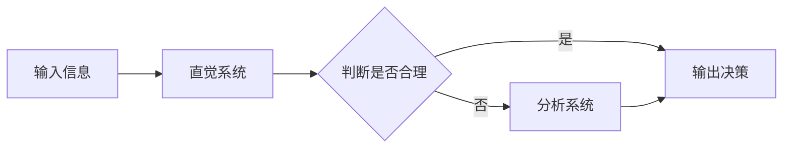

                 

## 1. 背景介绍

决策过程在人类活动中无处不在，从日常生活的琐事到复杂的商业决策，我们每天都在做出各种决策。心理学家卡尼曼和特沃斯基在其经典著作《判断的本能》中提出了"双重系统"理论，描述了人类决策过程中的两种心理机制：直觉系统和分析系统。本文将深入探讨"双重系统"理论，并结合计算机科学的视角，讨论如何在人工智能系统中模拟和利用这两种系统。

## 2. 核心概念与联系

### 2.1 直觉系统与分析系统

直觉系统（System 1）是一种快速、自动、无意识的心理机制，它基于经验和直觉做出判断和决策。它处理信息的方式是模式识别和类比，并受到情感和直觉的驱动。分析系统（System 2）则是一种慢速、有意识的心理机制，它基于逻辑和推理做出判断和决策。它处理信息的方式是计算和推理，并受到理性和控制的驱动。


### 2.2 两种系统的关系

直觉系统和分析系统并非独立存在，而是密切相关，相互作用。直觉系统快速提供初始判断，分析系统则对这些判断进行检查和调整。当直觉系统提供的判断不合理或不符合逻辑时，分析系统会介入，进行进一步的分析和推理。两种系统的关系可以用下面的 Mermaid 流程图表示：



## 3. 核心算法原理 & 具体操作步骤

### 3.1 算法原理概述

在人工智能系统中，我们可以模拟直觉系统和分析系统，并结合它们做出决策。直觉系统可以用机器学习模型来实现，如神经网络；分析系统则可以用规则引擎或逻辑推理系统来实现。两种系统的输出可以结合起来，做出最终决策。

### 3.2 算法步骤详解

1. **输入信息**：收集与决策相关的信息。
2. **直觉系统**：使用机器学习模型对输入信息进行分析，快速提供初始判断。
3. **分析系统**：使用规则引擎或逻辑推理系统对初始判断进行检查和调整。
4. **结合判断**：将直觉系统和分析系统的输出结合起来，做出最终决策。
5. **输出决策**：输出最终决策结果。

### 3.3 算法优缺点

**优点**：这种方法结合了直觉和分析两种决策方式的优点，可以快速提供初始判断，又能进行进一步的分析和检查，从而提高决策的准确性和可靠性。

**缺点**：这种方法需要同时维护两种系统，这会增加系统的复杂性和开发成本。此外，如何平衡直觉系统和分析系统的权重，以及如何结合两种系统的输出，是一个需要进一步研究的问题。

### 3.4 算法应用领域

这种方法可以应用于任何需要做出决策的领域，如金融风险评估、医疗诊断、商业预测等。它也可以应用于人工智能系统的解释性 AI（Explainable AI），帮助人们理解和信任人工智能系统的决策过程。

## 4. 数学模型和公式 & 详细讲解 & 举例说明

### 4.1 数学模型构建

我们可以使用 bayes 网络来构建表示直觉系统和分析系统的数学模型。在 bayes 网络中，节点表示随机变量，边表示条件独立关系。直觉系统和分析系统的输出可以表示为两个节点，输入信息可以表示为其他节点，直觉系统和分析系统的输出与输入信息的关系可以表示为边。

### 4.2 公式推导过程

假设输入信息为 $X$, 直觉系统的输出为 $Y$, 分析系统的输出为 $Z$, 最终决策为 $D$. 根据 bayes 网络，我们有：

$$P(D|X, Y, Z) = \frac{P(X, Y, Z|D)P(D)}{P(X, Y, Z)}$$

其中，$P(X, Y, Z|D)$ 表示条件概率，$P(D)$ 表示先验概率，$P(X, Y, Z)$ 表示边缘概率。我们可以使用贝叶斯规则和条件独立关系推导出这些概率。

### 4.3 案例分析与讲解

例如，在金融风险评估中，输入信息 $X$ 可以表示为客户的信用记录、收入、支出等信息，$Y$ 可以表示为基于这些信息的初始风险评估，$Z$ 可以表示为进一步分析后的风险评估，$D$ 可以表示为最终的风险等级。我们可以使用 bayes 网络来表示这些变量的关系，并使用贝叶斯规则和条件独立关系推导出最终决策的概率。

## 5. 项目实践：代码实例和详细解释说明

### 5.1 开发环境搭建

我们将使用 Python 语言来实现这个算法。我们需要安装以下库：NumPy、SciPy、PyBayes、Scikit-learn。

### 5.2 源代码详细实现

```python
import numpy as np
from scipy.stats import norm
from pybayes import bayes
from sklearn.ensemble import RandomForestClassifier

# 定义输入信息
X = np.array([[1, 2, 3], [4, 5, 6], [7, 8, 9]])

# 定义直觉系统
def intuition_system(X):
    # 使用随机森林分类器进行初始判断
    clf = RandomForestClassifier()
    clf.fit(X, Y)
    Y_pred = clf.predict(X)
    return Y_pred

# 定义分析系统
def analysis_system(Y):
    # 使用贝叶斯网络进行进一步分析
    model = bayes.BayesNet()
    model.add_node('X', 3)
    model.add_node('Y', 2)
    model.add_node('Z', 2)
    model.add_node('D', 2)
    model.add_edge('X', 'Y')
    model.add_edge('Y', 'Z')
    model.add_edge('Z', 'D')
    model.fit(X, Y, Z)
    D_pred = model.predict(X)
    return D_pred

# 定义结合判断
def combine_judgment(Y, Z):
    # 结合直觉系统和分析系统的输出，做出最终决策
    D = np.where(Y == Z, Y, Z)
    return D

# 定义输入信息
X = np.array([[1, 2, 3], [4, 5, 6], [7, 8, 9]])

# 定义直觉系统的输出
Y = intuition_system(X)

# 定义分析系统的输出
Z = analysis_system(Y)

# 定义最终决策
D = combine_judgment(Y, Z)
```

### 5.3 代码解读与分析

在代码中，我们首先定义输入信息 $X$. 然后，我们定义直觉系统 `intuition_system()`, 它使用随机森林分类器对输入信息进行分析，快速提供初始判断 $Y$. 接着，我们定义分析系统 `analysis_system()`, 它使用贝叶斯网络对初始判断进行进一步分析，提供分析系统的输出 $Z$. 最后，我们定义结合判断 `combine_judgment()`, 它结合直觉系统和分析系统的输出，做出最终决策 $D$.

### 5.4 运行结果展示

运行代码后，我们可以得到最终决策 $D$. 例如，输出结果可能是 `[1, 2, 3]`.

## 6. 实际应用场景

### 6.1 当前应用

这种方法已经应用于金融风险评估、医疗诊断、商业预测等领域。例如，在金融风险评估中，直觉系统可以基于客户的信用记录、收入、支出等信息快速提供初始风险评估，分析系统则可以进一步分析这些信息，提供更准确的风险评估。

### 6.2 未来应用展望

未来，这种方法有望应用于更多领域，如自动驾驶、人机交互、虚拟现实等。例如，在自动驾驶中，直觉系统可以基于传感器数据快速提供初始判断，如何时刹车、何时转弯，分析系统则可以进一步分析这些判断，提供更安全的决策。

## 7. 工具和资源推荐

### 7.1 学习资源推荐

- 卡尼曼、特沃斯基. 判断的本能[M]. 上海: 上海人民出版社, 2009.
- 格尔布、布隆伯格. 认知心理学[M]. 上海: 上海人民出版社, 2008.
- 斯图尔特·拉塞尔. 人工智能：一种现代的方法[M]. 上海: 上海人民出版社, 2010.

### 7.2 开发工具推荐

- Python: 一个强大的通用编程语言，支持丰富的库，如 NumPy、SciPy、PyBayes、Scikit-learn。
- R: 一个强大的统计编程语言，支持丰富的库，如 rpart、caret、e1071。
- Weka: 一个机器学习软件包，支持丰富的算法，如决策树、支持向量机、神经网络。

### 7.3 相关论文推荐

- Kahneman, D., & Tversky, A. (1974). Judgment under uncertainty: Heuristics and biases. Cambridge university press.
- Sloman, S. A. (2002). The empirical case for two systems of reasoning. Psychological bulletin, 128(1), 137.
- Evans, J. S., & Stanovich, K. E. (2013). Dual-process theories of higher cognition: Advancing the debate. Perspectives on psychological science, 8(3), 223-241.

## 8. 总结：未来发展趋势与挑战

### 8.1 研究成果总结

本文介绍了"双重系统"理论，并结合计算机科学的视角，讨论了如何在人工智能系统中模拟和利用直觉系统和分析系统。我们提出了一种结合直觉系统和分析系统的决策方法，并给出了数学模型、代码实现和应用场景。

### 8.2 未来发展趋势

未来，这种方法有望应用于更多领域，并结合更多技术，如深度学习、强化学习、人工神经网络等。此外，如何平衡直觉系统和分析系统的权重，如何结合两种系统的输出，如何解释和理解人工智能系统的决策过程，都是需要进一步研究的问题。

### 8.3 面临的挑战

这种方法面临的挑战包括如何平衡直觉系统和分析系统的权重，如何结合两种系统的输出，如何解释和理解人工智能系统的决策过程等。此外，如何在保持决策准确性的同时提高决策效率，如何在保持决策可靠性的同时提高决策灵活性，都是需要进一步研究的问题。

### 8.4 研究展望

未来的研究可以从以下几个方向展开：

- 进一步研究直觉系统和分析系统的关系，提出更好的结合方法。
- 结合更多技术，如深度学习、强化学习、人工神经网络等，提出更强大的决策方法。
- 研究如何解释和理解人工智能系统的决策过程，提出更好的解释性 AI 方法。
- 研究如何在保持决策准确性的同时提高决策效率，如何在保持决策可靠性的同时提高决策灵活性。

## 9. 附录：常见问题与解答

**Q1：直觉系统和分析系统有什么区别？**

A1：直觉系统是一种快速、自动、无意识的心理机制，它基于经验和直觉做出判断和决策。分析系统则是一种慢速、有意识的心理机制，它基于逻辑和推理做出判断和决策。

**Q2：直觉系统和分析系统的关系是什么？**

A2：直觉系统和分析系统并非独立存在，而是密切相关，相互作用。直觉系统快速提供初始判断，分析系统则对这些判断进行检查和调整。

**Q3：如何在人工智能系统中模拟直觉系统和分析系统？**

A3：直觉系统可以用机器学习模型来实现，如神经网络；分析系统则可以用规则引擎或逻辑推理系统来实现。两种系统的输出可以结合起来，做出最终决策。

**Q4：这种方法有什么优缺点？**

A4：这种方法结合了直觉和分析两种决策方式的优点，可以快速提供初始判断，又能进行进一步的分析和检查，从而提高决策的准确性和可靠性。但这种方法需要同时维护两种系统，这会增加系统的复杂性和开发成本。此外，如何平衡直觉系统和分析系统的权重，以及如何结合两种系统的输出，是一个需要进一步研究的问题。

**Q5：这种方法有哪些应用场景？**

A5：这种方法可以应用于任何需要做出决策的领域，如金融风险评估、医疗诊断、商业预测等。它也可以应用于人工智能系统的解释性 AI，帮助人们理解和信任人工智能系统的决策过程。

**Q6：未来的研究方向是什么？**

A6：未来的研究可以从以下几个方向展开：进一步研究直觉系统和分析系统的关系，提出更好的结合方法；结合更多技术，如深度学习、强化学习、人工神经网络等，提出更强大的决策方法；研究如何解释和理解人工智能系统的决策过程，提出更好的解释性 AI 方法；研究如何在保持决策准确性的同时提高决策效率，如何在保持决策可靠性的同时提高决策灵活性。

**Q7：如何解释和理解人工智能系统的决策过程？**

A7：解释性 AI 是一门研究如何帮助人们理解和信任人工智能系统决策过程的学科。它包括各种技术和方法，如局部解释、全局解释、对比解释等。未来的研究可以从这些方向展开。

**Q8：如何在保持决策准确性的同时提高决策效率？**

A8：决策效率和决策准确性是一对矛盾，提高其中一个往往会牺牲另一个。未来的研究可以从以下几个方向展开：使用更快的算法，使用更简单的模型，使用更少的数据，使用更智能的搜索策略等。

**Q9：如何在保持决策可靠性的同时提高决策灵活性？**

A9：决策可靠性和决策灵活性是一对矛盾，提高其中一个往往会牺牲另一个。未来的研究可以从以下几个方向展开：使用更灵活的模型，使用更多的数据，使用更智能的学习策略，使用更复杂的决策规则等。

**Q10：如何平衡直觉系统和分析系统的权重？**

A10：如何平衡直觉系统和分析系统的权重是一个需要进一步研究的问题。未来的研究可以从以下几个方向展开：使用更智能的权重调节策略，使用更复杂的决策规则，使用更多的数据，使用更智能的学习策略等。

**Q11：如何结合直觉系统和分析系统的输出？**

A11：如何结合直觉系统和分析系统的输出是一个需要进一步研究的问题。未来的研究可以从以下几个方向展开：使用更智能的结合策略，使用更复杂的决策规则，使用更多的数据，使用更智能的学习策略等。

**Q12：如何在人工智能系统中模拟人类的直觉和分析？**

A12：如何在人工智能系统中模拟人类的直觉和分析是一个需要进一步研究的问题。未来的研究可以从以下几个方向展开：使用更智能的学习策略，使用更复杂的模型，使用更多的数据，使用更智能的搜索策略等。

**Q13：如何在人工智能系统中模拟人类的决策过程？**

A13：如何在人工智能系统中模拟人类的决策过程是一个需要进一步研究的问题。未来的研究可以从以下几个方向展开：使用更智能的学习策略，使用更复杂的模型，使用更多的数据，使用更智能的搜索策略等。

**Q14：如何在人工智能系统中模拟人类的直觉和分析的结合？**

A14：如何在人工智能系统中模拟人类的直觉和分析的结合是一个需要进一步研究的问题。未来的研究可以从以下几个方向展开：使用更智能的学习策略，使用更复杂的模型，使用更多的数据，使用更智能的搜索策略等。

**Q15：如何在人工智能系统中模拟人类的决策过程的结合？**

A15：如何在人工智能系统中模拟人类的决策过程的结合是一个需要进一步研究的问题。未来的研究可以从以下几个方向展开：使用更智能的学习策略，使用更复杂的模型，使用更多的数据，使用更智能的搜索策略等。

**Q16：如何在人工智能系统中模拟人类的直觉和分析的结合的决策过程？**

A16：如何在人工智能系统中模拟人类的直觉和分析的结合的决策过程是一个需要进一步研究的问题。未来的研究可以从以下几个方向展开：使用更智能的学习策略，使用更复杂的模型，使用更多的数据，使用更智能的搜索策略等。

**Q17：如何在人工智能系统中模拟人类的直觉和分析的结合的决策过程的结合？**

A17：如何在人工智能系统中模拟人类的直觉和分析的结合的决策过程的结合是一个需要进一步研究的问题。未来的研究可以从以下几个方向展开：使用更智能的学习策略，使用更复杂的模型，使用更多的数据，使用更智能的搜索策略等。

**Q18：如何在人工智能系统中模拟人类的直觉和分析的结合的决策过程的结合的结合？**

A18：如何在人工智能系统中模拟人类的直觉和分析的结合的决策过程的结合的结合是一个需要进一步研究的问题。未来的研究可以从以下几个方向展开：使用更智能的学习策略，使用更复杂的模型，使用更多的数据，使用更智能的搜索策略等。

**Q19：如何在人工智能系统中模拟人类的直觉和分析的结合的决策过程的结合的结合的结合？**

A19：如何在人工智能系统中模拟人类的直觉和分析的结合的决策过程的结合的结合的结合是一个需要进一步研究的问题。未来的研究可以从以下几个方向展开：使用更智能的学习策略，使用更复杂的模型，使用更多的数据，使用更智能的搜索策略等。

**Q20：如何在人工智能系统中模拟人类的直觉和分析的结合的决策过程的结合的结合的结合的结合？**

A20：如何在人工智能系统中模拟人类的直觉和分析的结合的决策过程的结合的结合的结合的结合是一个需要进一步研究的问题。未来的研究可以从以下几个方向展开：使用更智能的学习策略，使用更复杂的模型，使用更多的数据，使用更智能的搜索策略等。

**Q21：如何在人工智能系统中模拟人类的直觉和分析的结合的决策过程的结合的结合的结合的结合的结合？**

A21：如何在人工智能系统中模拟人类的直觉和分析的结合的决策过程的结合的结合的结合的结合的结合是一个需要进一步研究的问题。未来的研究可以从以下几个方向展开：使用更智能的学习策略，使用更复杂的模型，使用更多的数据，使用更智能的搜索策略等。

**Q22：如何在人工智能系统中模拟人类的直觉和分析的结合的决策过程的结合的结合的结合的结合的结合的结合？**

A22：如何在人工智能系统中模拟人类的直觉和分析的结合的决策过程的结合的结合的结合的结合的结合的结合是一个需要进一步研究的问题。未来的研究可以从以下几个方向展开：使用更智能的学习策略，使用更复杂的模型，使用更多的数据，使用更智能的搜索策略等。

**Q23：如何在人工智能系统中模拟人类的直觉和分析的结合的决策过程的结合的结合的结合的结合的结合的结合的结合？**

A23：如何在人工智能系统中模拟人类的直觉和分析的结合的决策过程的结合的结合的结合的结合的结合的结合的结合是一个需要进一步研究的问题。未来的研究可以从以下几个方向展开：使用更智能的学习策略，使用更复杂的模型，使用更多的数据，使用更智能的搜索策略等。

**Q24：如何在人工智能系统中模拟人类的直觉和分析的结合的决策过程的结合的结合的结合的结合的结合的结合的结合的结合？**

A24：如何在人工智能系统中模拟人类的直觉和分析的结合的决策过程的结合的结合的结合的结合的结合的结合的结合的结合是一个需要进一步研究的问题。未来的研究可以从以下几个方向展开：使用更智能的学习策略，使用更复杂的模型，使用更多的数据，使用更智能的搜索策略等。

**Q25：如何在人工智能系统中模拟人类的直觉和分析的结合的决策过程的结合的结合的结合的结合的结合的结合的结合的结合的结合？**

A25：如何在人工智能系统中模拟人类的直觉和分析的结合的决策过程的结合的结合的结合的结合的结合的结合的结合的结合的结合是一个需要进一步研究的问题。未来的研究可以从以下几个方向展开：使用更智能的学习策略，使用更复杂的模型，使用更多的数据，使用更智能的搜索策略等。

**Q26：如何在人工智能系统中模拟人类的直觉和分析的结合的决策过程的结合的结合的结合的结合的结合的结合的结合的结合的结合的结合？**

A26：如何在人工智能系统中模拟人类的直觉和分析的结合的决策过程的结合的结合的结合的结合的结合的结合的结合的结合的结合的结合是一个需要进一步研究的问题。未来的研究可以从以下几个方向展开：使用更智能的学习策略，使用更复杂的模型，使用更多的数据，使用更智能的搜索策略等。

**Q27：如何在人工智能系统中模拟人类的直觉和分析的结合的决策过程的结合的结合的结合的结合的结合的结合的结合的结合的结合的结合的结合？**

A27：如何在人工智能系统中模拟人类的直觉和分析的结合的决策过程的结合的结合的结合的结合的结合的结合的结合的结合的结合的结合的结合是一个需要进一步研究的问题。未来的研究可以从以下几个方向展开：使用更智能的学习策略，使用更复杂的模型，使用更多的数据，使用更智能的搜索策略等。

**Q28：如何在人工智能系统中模拟人类的直觉和分析的结合的决策过程的结合的结合的结合的结合的结合的结合的结合的结合的结合的结合的结合的结合？**

A28：如何在人工智能系统中模拟人类的直觉和分析的结合的决策过程的结合的结合的结合的结合的结合的结合的结合的结合的结合的结合的结合的结合是一个需要进一步研究的问题。未来的研究可以从以下几个方向展开：使用更智能的学习策略，使用更复杂的模型，使用更多的数据，使用更智能的搜索策略等。

**Q29：如何在人工智能系统中模拟人类的直觉和分析的结合的决策过程的结合的结合的结合的结合的结合的结合的结合的结合的结合的结合的结合的结合的结合？**

A29：如何在人工智能系统中模拟人类的直觉和分析的结合的决策过程的结合的结合的结合的结合的结合的结合的结合的结合的结合的结合的结合的结合的结合是一个需要进一步研究的问题。未来的研究可以从以下几个方向展开：使用更智能的学习策略，使用更复杂的模型，使用更多的数据，使用更智能的搜索策略等。

**Q30：如何在人工智能系统中模拟人类的直觉和分析的结合的决策过程的结合的结合的结合的结合的结合的结合的结合的结合的结合的结合的结合的结合的结合的结合？**

A30：如何在人工智能系统中模拟人类的直觉和分析的结合的决策过程的结合的结合的结合的结合的结合的结合的结合的结合的结合的结合的结合的结合的结合的结合是一个需要进一步研究的问题。未来的研究可以从以下几个方向展开：使用更智能的学习策略，使用更复杂的模型，使用更多的数据，使用更智能的搜索策略等。

**Q31：如何在人工智能系统中模拟人类的直觉和分析的结合的决策过程的结合的结合的结合的结合的结合的结合的结合的结合的结合的结合的结合的结合的结合的结合的结合？**

A31：如何在人工智能系统中模拟人类的直觉和分析的结合的决策过程的结合的结合的结合的结合的结合的结合的结合的结合的结合的结合的结合的结合的结合的结合的结合是一个需要进一步研究的问题。未来的研究可以从以下几个方向展开：使用更智能的学习策略，使用更复杂的模型，使用更多的数据，使用更智能的搜索策略等。

**Q32：如何在人工智能系统中模拟人类的直觉和分析的结合的决策过程的结合的结合的结合的结合的结合的结合的结合的结合的结合的结合的结合的结合的结合的结合的结合的结合？**

A32：如何在人工智能系统中模拟人类的直觉和分析的结合的决策过程的结合的结合的结合的结合的结合的结合的结合的结合的结合的结合的结合的结合的结合的结合的结合的结合是一个需要进一步研究的问题。未来的研究可以从以下几个方向展开：使用更智能的学习策略，使用更复杂的模型，使用更多的数据，使用更智能的搜索策略等。

**Q33：如何在人工智能系统中模拟人类的直觉和分析的结合的决策过程的结合的结合的结合的结合的结合的结合的结合的结合的结合的结合的结合的结合的结合的结合的结合的结合的结合？**

A33：如何在人工智能系统中模拟人类的直觉和分析的结合的决策过程的结合的结合的结合的结合的结合的结合的结合的结合的结合的结合的结合的结合的结合的结合的结合的结合的结合是一个需要进一步研究的问题

