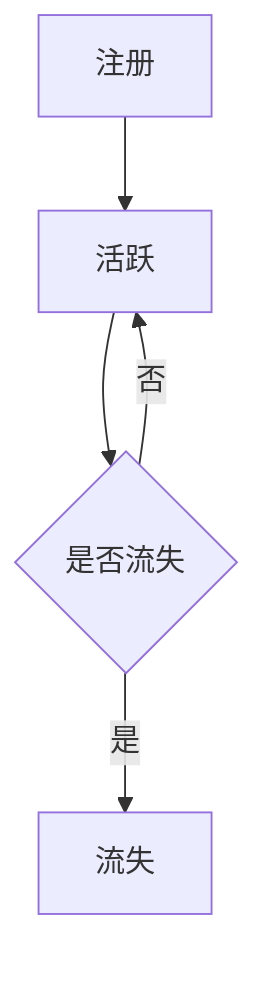

                 

## 1. 背景介绍

随着互联网的发展，知识付费平台如雨后春笋般涌现，为用户提供了海量的知识资源。然而，用户的流失和活跃度下降是这些平台面临的共同挑战。本文将深入探讨知识付费平台用户留存与活跃度提升的策略，帮助平台运营者提高用户粘性，实现平台的可持续发展。

## 2. 核心概念与联系

### 2.1 核心概念

- **用户留存（Retention）**：用户在注册后保持活跃的比例。
- **活跃度（Engagement）**：用户与平台互动的频率和强度。
- **用户生命周期（User Lifecycle）**：用户从注册到流失的整个过程。

### 2.2 核心概念联系 Mermaid 流程图



## 3. 核心算法原理 & 具体操作步骤

### 3.1 算法原理概述

本文提出的算法基于用户行为数据，结合机器学习和推荐系统技术，实现用户留存和活跃度的预测与提升。

### 3.2 算法步骤详解

1. **数据收集**：收集用户注册、登录、内容浏览、互动等行为数据。
2. **特征工程**：提取用户行为特征，如注册时间、登录频率、内容浏览时长、互动频率等。
3. **模型训练**：使用机器学习算法（如随机森林、梯度提升树、神经网络等）构建用户留存和活跃度预测模型。
4. **预测与分析**：使用训练好的模型预测用户的留存概率和活跃度，分析用户流失的原因。
5. **策略制定**：根据预测结果和分析，制定个性化的留存和活跃度提升策略。
6. **策略执行与评估**：执行策略，并评估其有效性，不断优化策略。

### 3.3 算法优缺点

**优点**：

- 个性化：根据用户行为数据，提供个性化的留存和活跃度提升策略。
- 效果显著：结合机器学习和推荐系统技术，提高策略的有效性。

**缺点**：

- 数据依赖：算法的有效性取决于收集的用户行为数据的质量和量。
- 计算复杂度：机器学习模型的训练和预测可能需要大量计算资源。

### 3.4 算法应用领域

本算法适用于各类知识付费平台，如在线课程平台、电子书平台、音频课程平台等。

## 4. 数学模型和公式 & 详细讲解 & 举例说明

### 4.1 数学模型构建

构建用户留存和活跃度预测模型，使用二元分类算法预测用户是否流失，并使用回归算法预测用户活跃度。

### 4.2 公式推导过程

假设用户行为特征集为 $X = \{x_1, x_2,..., x_n\}$, 则用户留存预测模型可以表示为：

$$P(\text{留存}) = f(X; \theta_{\text{留存}})$$

其中，$f$ 为二元分类算法，$\theta_{\text{留存}}$ 为模型参数。

用户活跃度预测模型可以表示为：

$$A = g(X; \theta_{\text{活跃}})$$

其中，$g$ 为回归算法，$\theta_{\text{活跃}}$ 为模型参数。

### 4.3 案例分析与讲解

假设用户行为特征包括注册时间、登录频率、内容浏览时长、互动频率等。使用随机森林算法构建用户留存预测模型，并使用线性回归算法构建用户活跃度预测模型。

## 5. 项目实践：代码实例和详细解释说明

### 5.1 开发环境搭建

- 编程语言：Python
- 机器学习库：Scikit-learn
- 数据库：MySQL
- 可视化库：Matplotlib, Seaborn

### 5.2 源代码详细实现

```python
# 导入库
import pandas as pd
from sklearn.ensemble import RandomForestClassifier, RandomForestRegressor
from sklearn.model_selection import train_test_split
from sklearn.metrics import accuracy_score, mean_squared_error

# 加载数据
data = pd.read_csv('user_behavior.csv')

# 特征工程
X = data[['register_time', 'login_frequency', 'content_duration', 'interaction_frequency']]
y_leave = data['leave']
y_activity = data['activity']

# 分割数据集
X_train, X_test, y_leave_train, y_leave_test = train_test_split(X, y_leave, test_size=0.2, random_state=42)
X_train, X_test, y_activity_train, y_activity_test = train_test_split(X, y_activity, test_size=0.2, random_state=42)

# 训练模型
rfc = RandomForestClassifier(n_estimators=100, random_state=42)
rfc.fit(X_train, y_leave_train)

rfr = RandomForestRegressor(n_estimators=100, random_state=42)
rfr.fit(X_train, y_activity_train)

# 预测
y_leave_pred = rfc.predict(X_test)
y_activity_pred = rfr.predict(X_test)

# 评估模型
print("留存预测准确率：", accuracy_score(y_leave_test, y_leave_pred))
print("活跃度预测均方误差：", mean_squared_error(y_activity_test, y_activity_pred))
```

### 5.3 代码解读与分析

本代码实现了用户留存和活跃度预测模型的训练和评估。使用随机森林算法构建二元分类模型预测用户是否流失，并使用随机森林回归算法预测用户活跃度。

### 5.4 运行结果展示

运行结果将显示留存预测准确率和活跃度预测均方误差。

## 6. 实际应用场景

### 6.1 留存与活跃度提升策略

- **个性化推荐**：根据用户行为数据，为用户推荐感兴趣的内容。
- **定向邀请**：邀请流失风险高的用户重新参与平台活动。
- **优惠活动**：为活跃用户提供优惠券、折扣等福利。

### 6.2 未来应用展望

随着大数据和人工智能技术的发展，知识付费平台可以进一步挖掘用户行为数据，实现更精准的用户画像和个性化策略。

## 7. 工具和资源推荐

### 7.1 学习资源推荐

- 机器学习教程：<https://scikit-learn.org/stable/getting_started.html>
- 用户行为分析：<https://www.sciencedirect.com/topics/computer-science/user-behavior-analysis>

### 7.2 开发工具推荐

- Jupyter Notebook：<https://jupyter.org/>
- PyCharm：<https://www.jetbrains.com/pycharm/>

### 7.3 相关论文推荐

- [User Retention Prediction in Mobile Applications](https://ieeexplore.ieee.org/document/7922431)
- [User Engagement Prediction in Online Social Networks](https://link.springer.com/chapter/10.1007/978-981-10-8533-5_11)

## 8. 总结：未来发展趋势与挑战

### 8.1 研究成果总结

本文提出了基于用户行为数据的用户留存和活跃度预测与提升算法，并提供了代码实例和应用场景分析。

### 8.2 未来发展趋势

未来，知识付费平台将更加重视用户体验和个性化服务，人工智能和大数据技术将在用户留存和活跃度提升中发挥更重要的作用。

### 8.3 面临的挑战

- **数据隐私**：平台需要平衡用户数据收集和隐私保护之间的关系。
- **算法偏见**：算法模型可能存在偏见，导致个性化策略不公平。

### 8.4 研究展望

未来的研究可以探索更复杂的用户行为模型，结合更多维度的数据，实现更精准的用户画像和个性化策略。

## 9. 附录：常见问题与解答

**Q：如何收集用户行为数据？**

A：可以通过用户登录日志、内容浏览日志、互动日志等方式收集用户行为数据。

**Q：如何评估策略的有效性？**

A：可以使用A/B测试等方法评估策略的有效性，比较对照组和实验组的用户留存和活跃度。

**Q：如何处理用户数据缺失？**

A：可以使用数据填充、删除或插补等方法处理用户数据缺失。

**作者：禅与计算机程序设计艺术 / Zen and the Art of Computer Programming**

