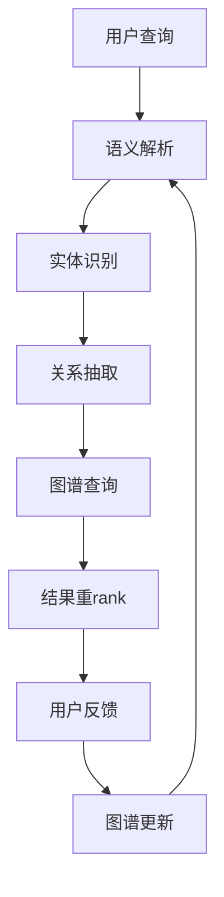

                 

**知识图谱在智能搜索引擎中的应用：语义理解与查询优化**

**作者：禅与计算机程序设计艺术 / Zen and the Art of Computer Programming**

## 1. 背景介绍

随着互联网的发展，信息爆炸已成为当今社会的显著特征。传统的搜索引擎基于关键词匹配，无法理解用户的真实意图，导致搜索结果的准确性和相关性大打折扣。知识图谱（Knowledge Graph）的出现为解决这一问题提供了新的思路。本文将深入探讨知识图谱在智能搜索引擎中的应用，重点介绍其在语义理解和查询优化方面的作用。

## 2. 核心概念与联系

### 2.1 关键概念

- **知识图谱（Knowledge Graph）**：一种知识表示形式，它将实体和关系表示为图形结构，以便于机器理解和处理。
- **语义理解（Semantic Understanding）**：搜索引擎理解用户查询背后的真实意图，而不是简单地匹配关键词。
- **查询优化（Query Optimization）**：搜索引擎根据用户查询调整搜索过程，以提供更相关、更准确的结果。

### 2.2 核心架构

知识图谱在智能搜索引擎中的应用架构如下：



## 3. 核心算法原理 & 具体操作步骤

### 3.1 算法原理概述

知识图谱在智能搜索引擎中的应用主要包括以下几个步骤：语义解析、实体识别、关系抽取、图谱查询、结果重rank，以及图谱更新。

### 3.2 算法步骤详解

1. **语义解析**：使用自然语言处理（NLP）技术分析用户查询，理解其背后的意图。
2. **实体识别**：在查询中识别出实体（人名、地名、组织等），并将其映射到知识图谱中对应的节点。
3. **关系抽取**：提取查询中隐含的关系，如"谁是某某的父亲"，并将其映射到知识图谱中的边上。
4. **图谱查询**：基于识别出的实体和抽取出的关系，在知识图谱中进行查询，获取相关结果。
5. **结果重rank**：根据用户查询的语义，对搜索结果进行重新排序，提供更相关、更准确的结果。
6. **图谱更新**：根据用户反馈和新的信息，更新知识图谱，以提高其准确性和完整性。

### 3.3 算法优缺点

**优点**：知识图谱有助于搜索引擎理解用户查询的语义，提供更相关、更准确的结果。它还可以帮助搜索引擎回答复杂的查询，如"谁是某某的父亲的母亲的兄弟"。

**缺点**：构建和维护知识图谱需要大量的资源和时间。此外，知识图谱的准确性和完整性对搜索结果的质量至关重要，但很难保证。

### 3.4 算法应用领域

知识图谱在智能搜索引擎中的应用有助于改善以下领域的搜索体验：

- **问答系统**：提供准确、简洁的回答。
- **推荐系统**：根据用户兴趣提供个性化推荐。
- **语音助手**：理解用户语音查询，提供相关结果。

## 4. 数学模型和公式 & 详细讲解 & 举例说明

### 4.1 数学模型构建

知识图谱可以表示为无向图 $G = (V, E)$, 其中 $V$ 是节点集合，表示实体；$E$ 是边集合，表示关系。每条边 $e \in E$ 连接两个节点 $v_1, v_2 \in V$, 并有一个关系类型 $r$.

### 4.2 公式推导过程

给定用户查询 $q$, 我们需要找到最相关的结果 $R$. 我们可以定义相关性函数 $f: q \times R \rightarrow [0, 1]$ 来度量 $q$ 和 $R$ 之间的相关性。我们的目标是找到最大化 $f(q, R)$ 的 $R$.

### 4.3 案例分析与讲解

假设我们有以下知识图谱：

```mermaid
graph TD;
    A[Steve Jobs] --> B[Founded] C[Apple];
    C --> D[Headquarters] E[Cupertino];
```

给定查询 "苹果公司总部在哪里"，我们可以识别出实体 "Apple" 和关系 "Headquarters". 在知识图谱中查询后，我们可以找到结果 "Cupertino".

## 5. 项目实践：代码实例和详细解释说明

### 5.1 开发环境搭建

我们将使用 Python 和其生态系统中的库来实现知识图谱在智能搜索引擎中的应用。我们需要安装以下库：spaCy、NetworkX、Py2neo。

### 5.2 源代码详细实现

以下是实现语义解析、实体识别、关系抽取、图谱查询的示例代码：

```python
import spacy
from py2neo import Graph, Node, Relationship

# 连接到 Neo4j 数据库
graph = Graph("http://localhost:7474", username="neo4j", password="password")

# 加载 spaCy 模型
nlp = spacy.load("en_core_web_sm")

def parse_query(query):
    # 语义解析
    doc = nlp(query)

    # 实体识别
    entities = [ent.text for ent in doc.ents]

    # 关系抽取
    relations = [(token.text, token.dep_, token.head.text) for token in doc if token.dep_ in ("nsubj", "dobj", "attr")]

    return entities, relations

def query_kg(entities, relations):
    # 图谱查询
    for entity in entities:
        node = Node("Entity", name=entity)
        graph.create(node)

    for relation in relations:
        subject, predicate, object = relation
        subject_node = Node("Entity", name=subject)
        object_node = Node("Entity", name=object)
        relation_node = Relationship(subject_node, predicate, object_node)
        graph.create(relation_node)

    # 查询结果
    results = graph.run("MATCH (a)-[r]->(b) RETURN a, r, b").to_data_frame()
    return results
```

### 5.3 代码解读与分析

`parse_query` 函数使用 spaCy 进行语义解析、实体识别和关系抽取。`query_kg` 函数连接到 Neo4j 数据库，创建实体节点和关系边，并查询结果。

### 5.4 运行结果展示

运行 `parse_query` 和 `query_kg` 函数后，我们可以在 Neo4j 数据库中看到创建的节点和边，并获取查询结果。

## 6. 实际应用场景

### 6.1 当前应用

知识图谱在智能搜索引擎中的应用已被广泛采用，如 Google 的知识图谱、Microsoft 的 Bing 知识图谱、Facebook 的 Open Graph 等。

### 6.2 未来应用展望

未来，知识图谱在智能搜索引擎中的应用将更加广泛，涉及更多领域，如医疗保健、金融、物联网等。此外，知识图谱还将与其他技术结合，如深度学习、强化学习，以提供更智能、更个性化的搜索体验。

## 7. 工具和资源推荐

### 7.1 学习资源推荐

- "Knowledge Graphs" 课程：<https://www.coursera.org/learn/knowledge-graphs>
- "Knowledge Graphs: Methods, Applications, and Challenges" 书籍：<https://www.amazon.com/Knowledge-Graphs-Methods-Applications-Challenges/dp/3030303137>

### 7.2 开发工具推荐

- Neo4j：<https://neo4j.com/>
- Amazon Neptune：<https://aws.amazon.com/neptune/>
- JanusGraph：<https:// janusgraph.org/>

### 7.3 相关论文推荐

- "Knowledge Graphs"：<https://arxiv.org/abs/1704.05257>
- "Knowledge Graph Embedding: A Survey of Approaches and Applications"：<https://arxiv.org/abs/1904.02884>

## 8. 总结：未来发展趋势与挑战

### 8.1 研究成果总结

本文介绍了知识图谱在智能搜索引擎中的应用，重点介绍了其在语义理解和查询优化方面的作用。我们还提供了示例代码，展示了如何实现语义解析、实体识别、关系抽取和图谱查询。

### 8.2 未来发展趋势

未来，知识图谱在智能搜索引擎中的应用将更加广泛，涉及更多领域。此外，知识图谱还将与其他技术结合，以提供更智能、更个性化的搜索体验。

### 8.3 面临的挑战

构建和维护知识图谱需要大量的资源和时间。此外，知识图谱的准确性和完整性对搜索结果的质量至关重要，但很难保证。

### 8.4 研究展望

未来的研究将侧重于提高知识图谱的构建和维护效率，提高其准确性和完整性。此外，研究还将探索知识图谱与其他技术的结合，以提供更智能、更个性化的搜索体验。

## 9. 附录：常见问题与解答

**Q：知识图谱与关系数据库有何不同？**

**A**：知识图谱使用图形结构表示实体和关系，而关系数据库使用表格结构表示实体和关系。此外，知识图谱更适合表示复杂的、动态的关系，而关系数据库更适合表示简单的、静态的关系。

**Q：如何构建和维护知识图谱？**

**A**：构建和维护知识图谱需要大量的资源和时间。常见的方法包括：从结构化数据（如关系数据库）中抽取知识图谱、从非结构化数据（如文本、图像）中抽取知识图谱、人工构建知识图谱等。

**Q：知识图谱在哪些领域有应用？**

**A**：知识图谱在智能搜索引擎、问答系统、推荐系统、语音助手等领域有广泛应用。此外，知识图谱还可以应用于医疗保健、金融、物联网等领域。

**Q：如何评估知识图谱的质量？**

**A**：评估知识图谱质量的常用指标包括：完整性、准确性、一致性、时效性等。常用的评估方法包括：人工评估、自动评估、混合评估等。

**Q：如何提高知识图谱的构建和维护效率？**

**A**：提高知识图谱构建和维护效率的方法包括：使用自动化工具、使用机器学习技术、使用知识图谱构建框架等。

**Q：如何提高知识图谱的准确性和完整性？**

**A**：提高知识图谱准确性和完整性的方法包括：使用高质量的数据源、使用人工审核、使用知识图谱质量评估指标等。

**Q：如何将知识图谱与其他技术结合以提供更智能、更个性化的搜索体验？**

**A**：知识图谱可以与深度学习、强化学习、自然语言处理等技术结合，以提供更智能、更个性化的搜索体验。例如，可以使用深度学习技术提高实体识别和关系抽取的准确性，使用强化学习技术优化搜索过程，使用自然语言处理技术理解用户查询的语义等。

**Q：知识图谱的未来发展趋势是什么？**

**A**：未来，知识图谱将更加广泛地应用于各个领域，涉及更多场景。此外，知识图谱还将与其他技术结合，以提供更智能、更个性化的搜索体验。然而，构建和维护知识图谱仍然是一个挑战，需要不断地研究和创新。

**Q：如何学习知识图谱？**

**A**：学习知识图谱可以从以下资源入手：

- 课程：如 Coursera 上的 "Knowledge Graphs" 课程。
- 书籍：如 "Knowledge Graphs: Methods, Applications, and Challenges" 书籍。
- 论文：如 "Knowledge Graphs" 和 "Knowledge Graph Embedding: A Survey of Approaches and Applications" 等论文。
- 开发工具：如 Neo4j、Amazon Neptune、JanusGraph 等。
- 学习社区：如 Stack Overflow、Reddit、GitHub 等。

## 结尾

知识图谱在智能搜索引擎中的应用为改善搜索体验提供了新的思路。本文介绍了知识图谱在语义理解和查询优化方面的作用，并提供了示例代码和实际应用场景。未来，知识图谱在智能搜索引擎中的应用将更加广泛，涉及更多领域。然而，构建和维护知识图谱仍然是一个挑战，需要不断地研究和创新。

**作者署名：作者：禅与计算机程序设计艺术 / Zen and the Art of Computer Programming**

