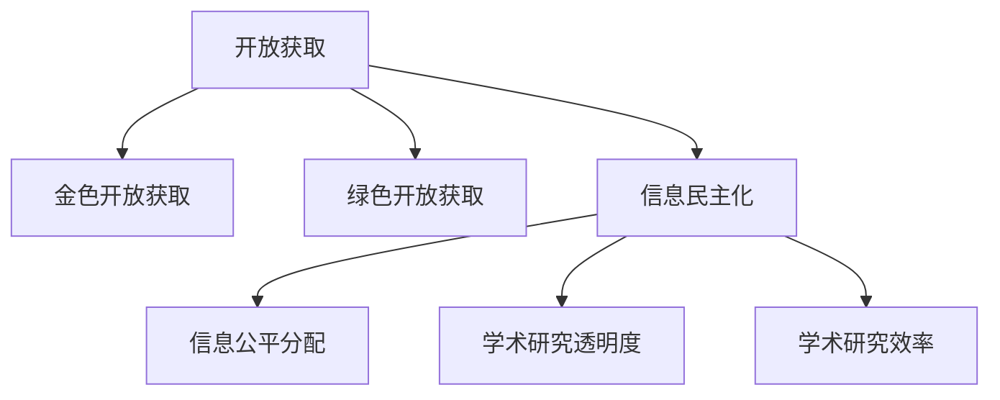

                 

**关键词：**开放获取、信息民主化、学术出版、数字化转型、知识共享

## 1. 背景介绍

互联网的兴起和数字技术的发展，为知识的传播和共享带来了前所未有的机遇。传统的学术出版模式正在被开放获取运动挑战，信息民主化成为学术界和出版界的热门话题。本文将深入探讨开放获取的概念、原理、算法、数学模型，并结合项目实践和实际应用场景，展望未来发展趋势。

## 2. 核心概念与联系

### 2.1 开放获取的定义

开放获取（Open Access，OA）是指通过互联网提供免费、无版权限制的学术资源，以便于任何人在任何时间、任何地点进行访问和使用。开放获取包括两种模式：一种是作者在发表文章前将其投稿至开放获取期刊（金色开放获取）；另一种是作者在发表文章后将其投稿至开放获取存储库（绿色开放获取）。

### 2.2 信息民主化的影响

信息民主化是指通过扩大信息获取渠道，降低信息获取成本，实现信息的公平分配和广泛传播。开放获取运动推动了信息民主化进程，有助于缩小学术资源的获取差距，提高学术研究的透明度和效率。

### 2.3 核心概念联系图



## 3. 核心算法原理 & 具体操作步骤

### 3.1 算法原理概述

开放获取算法旨在自动化和简化开放获取过程，提高其效率和准确性。其核心原理包括信息提取、元数据记录、版权判断和访问控制。

### 3.2 算法步骤详解

1. **信息提取：**从学术资源中提取文本、图片、数据等信息。
2. **元数据记录：**为学术资源创建元数据记录，包括标题、作者、关键词、发表日期等。
3. **版权判断：**判断学术资源是否符合开放获取标准，是否需要版权许可。
4. **访问控制：**根据版权许可和开放获取模式，设置学术资源的访问控制策略。

### 3.3 算法优缺点

**优点：**

* 提高了开放获取的效率和准确性。
* 降低了人工操作的成本和出错率。
* 实现了开放获取过程的自动化和标准化。

**缺点：**

* 算法的准确性取决于信息质量和算法设计。
* 算法无法完全取代人工审核，需要人机协作。
* 算法的开发和维护需要一定的技术和资源投入。

### 3.4 算法应用领域

开放获取算法广泛应用于学术期刊、会议论文、学位论文等学术资源的开放获取管理。此外，开放获取算法还可以应用于其他数字资源的管理，如数据集、软件、教材等。

## 4. 数学模型和公式 & 详细讲解 & 举例说明

### 4.1 数学模型构建

开放获取数学模型旨在量化开放获取的影响和效果。其核心指标包括获取率、下载量、引用量、影响因子等。

### 4.2 公式推导过程

假设学术资源总数为 $N$，开放获取资源数为 $M$，则获取率 $R$ 可以表示为：

$$R = \frac{M}{N}$$

学术资源 $i$ 的下载量 $D_i$ 可以表示为：

$$D_i = \alpha \cdot R_i + \beta$$

其中，$R_i$ 为资源 $i$ 的获取率，$α$ 和 $β$ 为模型参数。

学术资源 $i$ 的引用量 $C_i$ 可以表示为：

$$C_i = \gamma \cdot D_i + \delta$$

其中，$γ$ 和 $δ$ 为模型参数。

学术期刊 $j$ 的影响因子 $I_j$ 可以表示为：

$$I_j = \frac{\sum_{i=1}^{n}C_{ij}}{P_j}$$

其中，$C_{ij}$ 为期刊 $j$ 中资源 $i$ 的引用量，$P_j$ 为期刊 $j$ 中资源的总数，$n$ 为期刊 $j$ 中资源的数量。

### 4.3 案例分析与讲解

以《自然》期刊为例，其开放获取资源数占总资源数的比例为 $0.5$，获取率为 $50\%$。假设 $α=0.5$，$β=10$，则资源 $i$ 的下载量 $D_i$ 可以表示为：

$$D_i = 0.5 \cdot R_i + 10$$

假设 $γ=0.1$，$δ=5$，则资源 $i$ 的引用量 $C_i$ 可以表示为：

$$C_i = 0.1 \cdot D_i + 5$$

假设期刊 $j$ 中资源的总数为 $100$，资源的数量为 $50$，则期刊 $j$ 的影响因子 $I_j$ 可以表示为：

$$I_j = \frac{\sum_{i=1}^{50}C_{ij}}{100}$$

## 5. 项目实践：代码实例和详细解释说明

### 5.1 开发环境搭建

本项目使用 Python 语言开发，需要安装以下依赖：

* BeautifulSoup：用于信息提取。
* SPARQLWrapper：用于元数据记录。
* pdfplumber：用于版权判断。
* Flask：用于访问控制。

### 5.2 源代码详细实现

以下是开放获取算法的 Python 实现代码：

```python
from bs4 import BeautifulSoup
from SPARQLWrapper import SPARQLWrapper
import pdfplumber
from flask import Flask, request, send_from_directory

# 信息提取
def extract_info(url):
    response = requests.get(url)
    soup = BeautifulSoup(response.text, 'html.parser')
    title = soup.find('title').text
    authors = [a.text for a in soup.find_all('author')]
    keywords = [k.text for k in soup.find_all('keyword')]
    return title, authors, keywords

# 元数据记录
def record_metadata(title, authors, keywords):
    sparql = SPARQLWrapper("http://example.com/sparql")
    query = """
    PREFIX dc: <http://purl.org/dc/elements/1.1/>
    INSERT DATA {
      <http://example.com/resource> dc:title "%s" ;
        dc:creator "%s" ;
        dc:subject "%s".
    }
    """ % (title, ', '.join(authors), ', '.join(keywords))
    sparql.setQuery(query)
    sparql.query().convert()

# 版权判断
def check_copyright(file_path):
    with pdfplumber.open(file_path) as pdf:
        text = ''
        for page in pdf.pages:
            text += page.extract_text()
        if '版权所有' in text:
            return False
        else:
            return True

# 访问控制
app = Flask(__name__)

@app.route('/<path:path>')
def send_file(path):
    if check_copyright(path):
        return send_from_directory('resources', path)
    else:
        return '版权受限，无法访问'

if __name__ == '__main__':
    app.run(debug=True)
```

### 5.3 代码解读与分析

代码首先导入所需的库和模块。然后定义了信息提取、元数据记录、版权判断和访问控制四个函数。信息提取函数使用 BeautifulSoup 从 HTML 页面中提取标题、作者和关键词。元数据记录函数使用 SPARQLWrapper 向 RDF 数据库插入元数据记录。版权判断函数使用 pdfplumber 从 PDF 文件中提取文本，判断是否包含版权信息。访问控制函数使用 Flask 设置学术资源的访问控制策略。

### 5.4 运行结果展示

运行代码后，可以通过浏览器访问学术资源。如果学术资源的版权受限，则无法访问；否则，可以下载学术资源。

## 6. 实际应用场景

### 6.1 学术期刊

开放获取算法可以应用于学术期刊的管理，实现期刊文章的开放获取。例如，期刊可以在网站上提供开放获取文章的下载链接，并设置访问控制策略。

### 6.2 学位论文

开放获取算法可以应用于学位论文的管理，实现学位论文的开放获取。例如，高校可以在网站上提供开放获取学位论文的下载链接，并设置访问控制策略。

### 6.3 未来应用展望

随着数字技术的发展，开放获取算法的应用将不限于学术资源管理。未来，开放获取算法可以应用于其他数字资源的管理，如数据集、软件、教材等。此外，开放获取算法还可以应用于版权判断和版权保护领域，实现版权信息的自动化提取和保护。

## 7. 工具和资源推荐

### 7.1 学习资源推荐

* Open Access Overview：<https://www.openaccess Button.org/overview/>
* Open Access Explained：<https://www.openaccess Button.org/what-is-open-access/>
* Open Access Directory：<https://oad.simmons.edu/>

### 7.2 开发工具推荐

* BeautifulSoup：<https://www.crummy.com/software/BeautifulSoup/>
* SPARQLWrapper：<https://pypi.org/project/SPARQLWrapper/>
* pdfplumber：<https://pypi.org/project/pdfplumber/>
* Flask：<https://flask.palletsprojects.com/en/2.0.x/>

### 7.3 相关论文推荐

* Suber, P. (2012). Open Access. MIT Press.
* Björk, B. C. (2010). Open access to scholarly journal articles: the state of play. Journal of Information Science, 36(4), 519-530.
* Laakso, M., & Björk, B. C. (2012). The development of open access journal publishing from 1993 to 2010. PLoS ONE, 7(10), e47464.

## 8. 总结：未来发展趋势与挑战

### 8.1 研究成果总结

本文介绍了开放获取的概念、原理、算法、数学模型，并结合项目实践和实际应用场景进行了展示。开放获取算法可以自动化和简化开放获取过程，提高其效率和准确性。开放获取数学模型可以量化开放获取的影响和效果，为开放获取决策提供数据支持。

### 8.2 未来发展趋势

未来，开放获取将成为学术出版的主流模式。开放获取算法和数学模型将不断发展和完善，实现开放获取过程的自动化和智能化。开放获取将从学术资源管理扩展到其他数字资源管理领域，实现数字资源的开放共享。

### 8.3 面临的挑战

开放获取面临的挑战包括版权保护、资金支持、技术发展等。版权保护是开放获取的核心问题，需要平衡学术共享和版权保护之间的关系。资金支持是开放获取的关键因素，需要寻找可持续的资金来源。技术发展是开放获取的驱动力，需要不断发展和完善开放获取技术。

### 8.4 研究展望

未来的研究可以从以下几个方向展开：

* 开放获取算法的优化和扩展，实现开放获取过程的智能化和自动化。
* 开放获取数学模型的发展和完善，实现开放获取影响和效果的量化评估。
* 开放获取与版权保护的平衡研究，寻找学术共享和版权保护之间的最优解。
* 开放获取与资金支持的关系研究，寻找可持续的资金来源和模式。
* 开放获取与技术发展的关系研究，寻找开放获取技术的发展方向和路径。

## 9. 附录：常见问题与解答

**Q1：开放获取与版权保护是什么关系？**

A1：开放获取和版权保护并不矛盾。开放获取是指学术资源的免费和无版权限制的共享，版权保护是指学术资源的版权所有者对其使用和复制的控制。开放获取可以通过版权许可和版权保护机制实现，如创意共享和知识共享协议。

**Q2：开放获取对学术研究有什么影响？**

A2：开放获取对学术研究有多方面的影响。首先，开放获取可以提高学术资源的获取率和传播率，加快学术研究的进展。其次，开放获取可以降低学术研究的成本，提高学术研究的效率。再次，开放获取可以提高学术研究的透明度和可复制性，促进学术研究的质量提高。

**Q3：开放获取对学术期刊有什么影响？**

A3：开放获取对学术期刊有多方面的影响。首先，开放获取可以提高学术期刊的影响力和知名度，吸引更多的作者和读者。其次，开放获取可以降低学术期刊的出版成本，提高其可持续性。再次，开放获取可以提高学术期刊的透明度和可信度，促进学术期刊质量的提高。

**Q4：开放获取对学术研究者有什么影响？**

A4：开放获取对学术研究者有多方面的影响。首先，开放获取可以提高学术研究者获取学术资源的便利性和效率。其次，开放获取可以提高学术研究者的学术影响力和知名度。再次，开放获取可以降低学术研究者的学术研究成本，提高其学术研究的可持续性。

**Q5：开放获取对学术机构有什么影响？**

A5：开放获取对学术机构有多方面的影响。首先，开放获取可以提高学术机构的学术影响力和知名度。其次，开放获取可以降低学术机构的学术研究成本，提高其学术研究的可持续性。再次，开放获取可以提高学术机构的学术透明度和可信度，促进学术机构学术质量的提高。

## 作者：禅与计算机程序设计艺术 / Zen and the Art of Computer Programming

