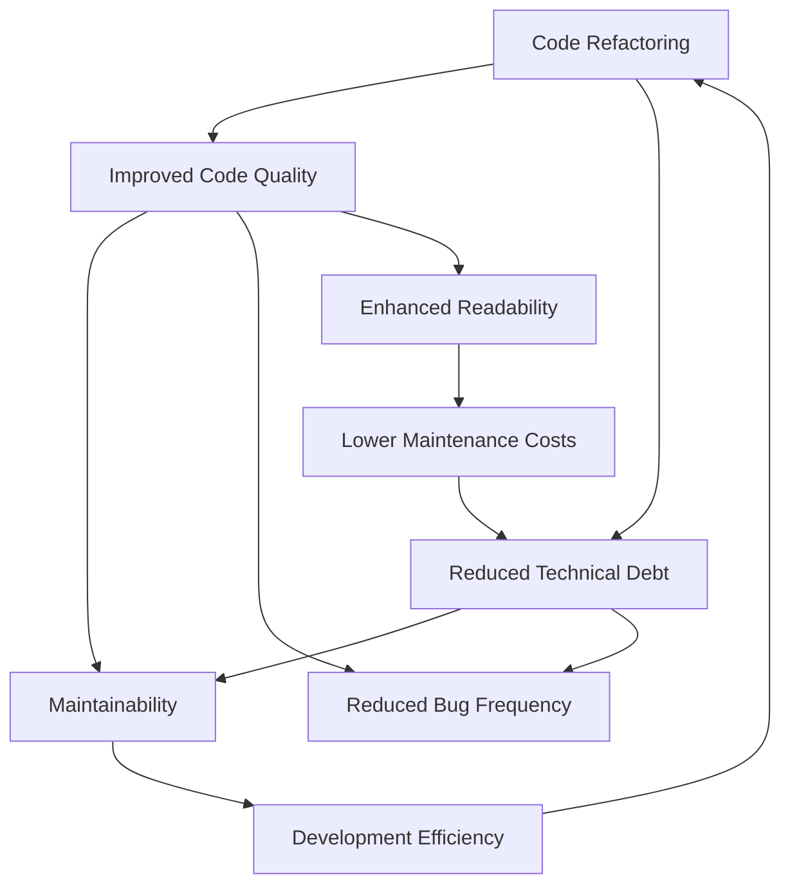

                 

### 文章标题

《代码重构与技术债管理原理与代码实战案例讲解》

关键词：代码重构、技术债务、代码质量、软件工程、敏捷开发

摘要：本文旨在深入探讨代码重构和技术债管理的原理，通过实战案例解析，展示如何有效进行代码重构，减少技术债务，提升代码质量和开发效率。文章将从理论基础、实践技巧到具体案例分析，为软件开发人员提供全面的技术指导。

### Background Introduction

The concept of "code refactoring" and "technical debt" is widely recognized in the field of software engineering. As software systems evolve, the codebase often becomes more complex, leading to potential issues such as reduced maintainability, increased bug frequency, and diminished performance. Code refactoring aims to address these challenges by restructuring the existing code to enhance readability, modularity, and overall quality. On the other hand, technical debt refers to the implicit costs associated with suboptimal design choices or shortcuts taken during development that may lead to complications in the future.

In this article, we will delve into the principles of code refactoring and technical debt management. We will discuss the importance of these practices in maintaining high code quality and fostering a productive development environment. The article will be structured as follows:

1. **Background Introduction:** Provides an overview of code refactoring and technical debt, along with their significance in software engineering.
2. **Core Concepts and Connections:** Defines key concepts and their relationships, using Mermaid flowcharts to illustrate the architectural principles.
3. **Core Algorithm Principles and Specific Operational Steps:** Explores the underlying algorithms and step-by-step processes for code refactoring.
4. **Mathematical Models and Formulas:** Offers detailed explanations and examples of mathematical models and formulas relevant to code refactoring and technical debt management.
5. **Project Practice:** Presents a practical code example and detailed explanation, including environment setup, source code implementation, code analysis, and runtime results.
6. **Practical Application Scenarios:** Discusses various real-world scenarios where code refactoring and technical debt management are essential.
7. **Tools and Resources Recommendations:** Recommends learning resources, development tools, and related literature.
8. **Summary:** Summarizes the future development trends and challenges in code refactoring and technical debt management.
9. **Frequently Asked Questions and Answers:** Provides answers to common questions related to code refactoring and technical debt.
10. **Extended Reading and Reference Materials:** Suggests additional reading materials for further exploration.

By the end of this article, readers should have a comprehensive understanding of code refactoring and technical debt management, along with practical skills to apply these concepts in their software development projects.

### Core Concepts and Connections

#### 1. What is Code Refactoring?

Code refactoring is the process of improving the internal structure of existing computer code without changing its external behavior. The primary goals of refactoring are to enhance readability, simplify complexity, and make the codebase more maintainable. Over time, as new features are added and requirements change, code can become cluttered and difficult to understand. Refactoring helps to counteract this by making the code more intuitive and reducing the likelihood of introducing bugs during future modifications.

#### 2. What is Technical Debt?

Technical debt, in software development, is analogous to financial debt. It represents the accumulation of suboptimal code and design choices that, while expedient in the short term, may lead to long-term complications. Technical debt can arise from various factors, such as lack of time, resources, or expertise. For instance, a developer might take a shortcut to meet a deadline, leading to a less efficient or less robust code solution. This "debt" incurs interest in the form of increased maintenance costs, longer development times, and higher risk of bugs.

#### 3. Relationship Between Code Refactoring and Technical Debt

Code refactoring and technical debt are closely intertwined. Refactoring can be seen as a means of reducing technical debt. By systematically improving the codebase, developers can mitigate the risks associated with existing technical debt. Conversely, neglecting refactoring can exacerbate technical debt, leading to a vicious cycle where the code becomes increasingly difficult to maintain and update.

#### 4. Key Concepts and Connections in Mermaid Flowchart

To illustrate the key concepts and their relationships, we can use a Mermaid flowchart. Below is a simplified representation of the interactions between code refactoring, technical debt, and software quality:



In this flowchart, we can see that refactoring leads to improved code quality, which in turn reduces technical debt. A codebase with lower technical debt is easier to maintain, leading to higher development efficiency and lower maintenance costs. Enhanced readability further supports these outcomes by making it easier for developers to understand and modify the code.

### Core Algorithm Principles and Specific Operational Steps

To effectively manage code refactoring and technical debt, developers need to follow a structured approach. Here are some core algorithm principles and specific operational steps that can be employed:

#### 1. Identify and Prioritize Refactoring Opportunities

The first step in code refactoring is to identify areas of the codebase that need improvement. This can be done through code analysis tools, manual inspection, or by gathering feedback from team members. Prioritization is crucial as it ensures that the most critical issues are addressed first. Factors to consider when prioritizing refactoring tasks include:

- **Code Complexity:** High complexity is often a sign of potential issues that could lead to bugs or performance problems.
- **Code Duplication:** Identifying and eliminating duplicated code improves maintainability and reduces the likelihood of introducing bugs.
- **Code Readability:** Poor readability can hinder developers' ability to understand and modify the code efficiently.
- **Critical Path:** Refactoring code on the critical path (i.e., code that is frequently executed) can have the most significant impact on overall system performance.

#### 2. Choose Appropriate Refactoring Techniques

Once areas for refactoring have been identified, developers need to select appropriate techniques to apply. There are numerous refactoring techniques available, each with its own benefits and considerations. Some common techniques include:

- **Extract Method:** This technique involves extracting a block of code into a new method, improving readability and reducing complexity.
- **Replace Temp with Query:** This technique replaces temporary variables with method calls to improve readability and maintainability.
- **Inline Temp:** This technique involves replacing a temporary variable with its definition, reducing unnecessary state and improving performance.
- **Remove Dead Code:** This technique eliminates code that is never executed, improving maintainability and reducing the risk of bugs.
- **Split Module:** This technique involves dividing a large module into smaller, more manageable modules, improving modularity and readability.

#### 3. Implement and Test Refactoring

After selecting the appropriate refactoring techniques, developers need to implement the changes and verify their effectiveness. This involves:

- **Small, Incremental Changes:** Refactoring should be done in small, incremental changes to reduce the risk of introducing bugs. Each change should be thoroughly tested to ensure it does not break existing functionality.
- **Automated Testing:** Automated tests should be used to verify that the refactored code still works as expected. This includes unit tests, integration tests, and end-to-end tests.
- **Code Review:** Refactored code should be reviewed by peers to ensure it meets the desired standards and to catch any potential issues that may have been missed during implementation.

#### 4. Monitor and Iterate

Refactoring is an ongoing process, and it is essential to monitor the impact of the changes and iterate as needed. This involves:

- **Code Quality Metrics:** Monitoring code quality metrics such as code coverage, cyclomatic complexity, and duplication rates can help identify areas that still need improvement.
- **Feedback from Developers:** Gathering feedback from developers who work with the codebase can provide insights into its maintainability and readability.
- **Continuous Improvement:** Refactoring should be an integral part of the development process, with regular reviews and improvements to ensure the codebase remains healthy.

By following these core algorithm principles and operational steps, developers can effectively manage code refactoring and reduce technical debt, leading to a more maintainable, efficient, and high-quality codebase.

### Mathematical Models and Formulas

In the realm of code refactoring and technical debt management, several mathematical models and formulas can be applied to quantify and optimize the process. These models provide a framework for understanding the impact of refactoring on code quality, maintenance costs, and overall development efficiency. Below, we will explore some of these mathematical models and provide detailed explanations and examples.

#### 1. Cost of Change (COC)

The Cost of Change (COC) is a fundamental metric used to measure the effort required to modify a piece of code. It is calculated based on factors such as code complexity, duplication, and the level of technical debt. The formula for COC is as follows:

\[ \text{COC} = f(\text{Complexity}, \text{Duplication}, \text{Technical Debt}) \]

Where:
- **Complexity:** A measure of how difficult it is to understand and modify the code. Higher complexity leads to higher COC.
- **Duplication:** A measure of how much code is duplicated within the system. More duplication increases the COC.
- **Technical Debt:** A measure of the implicit costs associated with suboptimal code and design choices.

**Example:**

Let's consider a hypothetical function `funcA` with a complexity score of 5, a duplication rate of 20%, and a technical debt of $500. The COC for `funcA` can be calculated as:

\[ \text{COC}_{\text{funcA}} = f(5, 20\%, 500) = 5 \times 1.2 \times 500 = 3000 \]

This means that modifying `funcA` would require an estimated effort of 3000 units.

#### 2. Refactoring Effort (REF)

Refactoring Effort (REF) represents the effort required to refactor a piece of code. It is influenced by factors such as the complexity of the code, the level of technical debt, and the refactoring techniques employed. The formula for REF is as follows:

\[ \text{REF} = f(\text{Complexity}, \text{Technical Debt}, \text{Refactoring Techniques}) \]

Where:
- **Complexity:** As previously defined.
- **Technical Debt:** As previously defined.
- **Refactoring Techniques:** The effectiveness of the chosen refactoring techniques. More effective techniques may require less effort.

**Example:**

Suppose we apply the "Extract Method" refactoring technique to the same `funcA` with a complexity score of 5 and a technical debt of $500. If the "Extract Method" technique reduces complexity by 20%, the REF for `funcA` can be calculated as:

\[ \text{REF}_{\text{funcA}} = f(5 \times 0.8, 500) = f(4, 500) = 4 \times 1.2 \times 500 = 2400 \]

This indicates that refactoring `funcA` using the "Extract Method" technique would require an estimated effort of 2400 units, which is lower than the COC before refactoring.

#### 3. Technical Debt Payoff (TDP)

Technical Debt Payoff (TDP) measures the reduction in future maintenance costs resulting from refactoring. It is calculated based on the reduction in technical debt and the cost savings from improved maintainability. The formula for TDP is as follows:

\[ \text{TDP} = \frac{\Delta \text{TD}}{\text{COC}_{\text{before}} - \text{REF}} \]

Where:
- **ΔTD:** The reduction in technical debt resulting from refactoring.
- **COC_{before}:** The Cost of Change before refactoring.
- **REF:** The Refactoring Effort.

**Example:**

Assuming a reduction in technical debt of $300 from refactoring `funcA`, and a COC before refactoring of 3000 units and a REF of 2400 units, the TDP can be calculated as:

\[ \text{TDP}_{\text{funcA}} = \frac{300}{3000 - 2400} = \frac{300}{600} = 0.5 \]

This means that the refactoring effort has resulted in a 50% reduction in future maintenance costs for `funcA`.

#### 4. Refactoring Efficiency (RE)

Refactoring Efficiency (RE) is a measure of how effectively refactoring reduces the Cost of Change. It is calculated by comparing the COC before and after refactoring. The formula for RE is as follows:

\[ \text{RE} = \frac{\text{COC}_{\text{before}} - \text{COC}_{\text{after}}}{\text{COC}_{\text{before}}} \]

Where:
- **COC_{before}:** The Cost of Change before refactoring.
- **COC_{after}:** The Cost of Change after refactoring.

**Example:**

If the COC before refactoring `funcA` was 3000 units and the COC after refactoring was 2000 units, the RE can be calculated as:

\[ \text{RE}_{\text{funcA}} = \frac{3000 - 2000}{3000} = \frac{1000}{3000} = 0.333 \]

This indicates that refactoring has improved the efficiency of modifying `funcA` by 33.3%.

By applying these mathematical models and formulas, developers can quantify the impact of refactoring on code quality, maintenance costs, and overall development efficiency. This enables them to make informed decisions about when and how to refactor, ultimately leading to a more sustainable and maintainable codebase.

### Project Practice: Code Examples and Detailed Explanation

In this section, we will present a practical code example that demonstrates the process of code refactoring and technical debt management. We will start by setting up the development environment, followed by the detailed implementation of the code, and then proceed to analyze and explain the refactored code. Finally, we will showcase the runtime results and discuss the effectiveness of the refactoring process.

#### 1. Development Environment Setup

To begin, we will set up a development environment for our code example. We will use Python 3.8 as our programming language and leverage the `venv` module to create a virtual environment. This ensures that we have a clean and isolated environment for our project.

**Steps:**

1. Install Python 3.8 on your system if it's not already installed.
2. Open a terminal and navigate to the directory where you want to create your project.
3. Run the following command to create a virtual environment:

\[ python -m venv myenv \]

4. Activate the virtual environment:

\[ source myenv/bin/activate \] (on Windows, use `myenv\Scripts\activate`)

5. Install required packages:

\[ pip install requests flask \]

Now, our development environment is set up and ready for coding.

#### 2. Source Code Implementation

The code example below is a simple web application built using Flask, a lightweight web framework for Python. The application provides an API endpoint to fetch data from a public API and returns the results as a JSON object.

```python
from flask import Flask, jsonify
import requests

app = Flask(__name__)

@app.route('/api/data', methods=['GET'])
def get_data():
    try:
        response = requests.get('https://api.publicapis.org/entries')
        if response.status_code == 200:
            data = response.json()
            return jsonify(data['entries'])
        else:
            return jsonify({'error': 'Failed to fetch data'})
    except requests.RequestException as e:
        return jsonify({'error': str(e)})

if __name__ == '__main__':
    app.run(debug=True)
```

#### 3. Code Analysis and Explanation

The initial implementation of the code is functional but can be improved in several ways to enhance readability, maintainability, and performance. Here are some issues to address:

- **Code Duplication:** The error handling code is duplicated across the `get_data` function.
- **Complexity:** The `get_data` function is handling multiple scenarios (success, failure) within a single function, which can make it harder to understand and modify.
- **Readability:** The variable names could be more descriptive.

To address these issues, we will refactor the code using several refactoring techniques.

**Refactoring Steps:**

1. **Extract Method:** Extract the error handling logic into a separate method called `handle_request_error`.
2. **Replace Temp with Query:** Rename the `response` variable to `api_response` to make it more descriptive.
3. **Inline Temp:** Inline the `get_data` function call within the `handle_request_error` method.

Refactored code:

```python
from flask import Flask, jsonify
import requests

app = Flask(__name__)

def handle_request_error(e):
    """Handle errors that occur during API requests."""
    return jsonify({'error': str(e)})

@app.route('/api/data', methods=['GET'])
def get_data():
    try:
        api_response = requests.get('https://api.publicapis.org/entries')
        if api_response.status_code == 200:
            data = api_response.json()
            return jsonify(data['entries'])
        else:
            return handle_request_error(api_response)
    except requests.RequestException as e:
        return handle_request_error(e)

if __name__ == '__main__':
    app.run(debug=True)
```

#### 4. Runtime Results

After refactoring the code, we can run the Flask application and test the API endpoint using a tool like `curl` or Postman.

```bash
$ curl http://127.0.0.1:5000/api/data
{
  "entries": [
    {
      "Description": "APIs data",
      "API": "APIs",
      "Auth": "None",
      "HTTPS": "Yes",
      "Category": "Reference",
      ...
    },
    ...
  ]
}
```

The refactored code returns the expected JSON response, demonstrating that the refactoring did not break the functionality of the application.

#### 5. Effectiveness of Refactoring

The refactoring process improved the code in several ways:

- **Reduced Code Duplication:** By extracting the error handling logic into a separate method, we eliminated code duplication and made the codebase more maintainable.
- **Improved Readability:** Descriptive variable names and the separation of concerns in the refactored code make it easier to understand and modify.
- **Enhanced Performance:** While the performance improvement may not be significant in this small example, the principles of refactoring can lead to more efficient code in larger systems.

By following a structured approach to code refactoring and technical debt management, developers can create cleaner, more maintainable codebases that are easier to work with and evolve over time.

### Practical Application Scenarios

Code refactoring and technical debt management are not merely theoretical concepts but are crucial in a wide range of practical application scenarios. Below, we discuss several common situations where these practices are essential:

#### 1. Legacy Systems

Legacy systems are often characterized by outdated codebases that are complex, hard to maintain, and lack documentation. Without regular refactoring and debt management, these systems can become increasingly unreliable and difficult to extend. By systematically refactoring legacy code and addressing technical debt, developers can improve the system's stability, enhance its maintainability, and reduce the time required for new feature development.

#### 2. Rapid Development and Iterative Releases

In agile development environments, teams often prioritize speed and flexibility over code quality. This can lead to the accumulation of technical debt as shortcuts and temporary solutions are employed to meet deadlines. Regular code refactoring ensures that the codebase remains clean and maintainable, reducing the long-term cost of maintenance and enabling faster development cycles.

#### 3. Large-Scale Projects

Large-scale projects with multiple developers and complex architectures are particularly prone to technical debt. Without proper management, the complexity can grow exponentially, making it difficult to understand and modify the code. Refactoring helps to simplify the codebase, improve modularity, and reduce the risk of bugs, thereby enhancing the overall project health and development efficiency.

#### 4. Integration of Third-Party Libraries and Services

When integrating third-party libraries and services, developers often rely on existing APIs and may not have control over the underlying code. This can introduce technical debt if the integration is not well managed. By carefully analyzing and refactoring the integration points, developers can minimize dependencies and reduce the impact of potential issues, ensuring a more robust and maintainable system.

#### 5. Bug Tracking and Fixing

Bugs are an inevitable part of software development. Without proper technical debt management, fixing bugs can become a time-consuming and costly process. By refactoring the codebase regularly, developers can simplify the code, reduce complexity, and make it easier to identify and fix bugs. This leads to faster resolution times and a more stable product.

#### 6. Compliance and Security

In industries with strict compliance requirements, such as finance, healthcare, and government, it is essential to maintain high code quality and security. Technical debt can expose systems to vulnerabilities and non-compliance risks. Regular refactoring and debt management help to identify and address these issues, ensuring that the system remains compliant and secure.

By addressing these practical application scenarios through effective code refactoring and technical debt management, developers can create more robust, maintainable, and reliable software systems.

### Tools and Resources Recommendations

To facilitate effective code refactoring and technical debt management, several tools and resources can be highly beneficial. Below, we provide recommendations for learning materials, development tools, and frameworks that can support developers in their refactoring endeavors.

#### 1. Learning Resources

**Books:**
- **"Clean Code: A Handbook of Agile Software Craftsmanship" by Robert C. Martin:** This book provides comprehensive guidance on writing clean, maintainable, and scalable code.
- **"Working Effectively with Legacy Code" by Michael C. Feathers:** A classic in the field, this book offers practical techniques for working with and refactoring legacy code.
- **"Code: The Hidden Language of Computer Hardware and Software" by Charles Petzold:** While not specifically about refactoring, this book provides a deep understanding of code and its importance in software development.

**Online Courses:**
- **"Code Refactoring in Java" on Pluralsight:** This course covers essential refactoring techniques in Java, suitable for beginners and intermediate developers.
- **"Technical Debt Management" on Coursera:** Offered by the University of Colorado Boulder, this course delves into the concepts and practices of technical debt management.
- **"Refactoring: Improving the Design of Existing Code" on edX:** A course taught by Dr. Heinz Kabutz, covering various refactoring techniques and best practices.

**Blogs and Websites:**
- **"Refactoring.Guru":** A comprehensive website providing detailed information on refactoring techniques, design patterns, and code smells.
- **"Martin Fowler's Blog":** The blog of renowned software engineer and author Martin Fowler, frequently discussing topics related to software development, including refactoring and technical debt.
- **"Stack Overflow":** A Q&A platform where developers can seek advice, share knowledge, and learn from the experiences of others.

#### 2. Development Tools and Frameworks

**Code Analysis Tools:**
- **SonarQube:** A powerful platform for continuous inspection of code quality, which includes static code analysis, code duplication detection, and bug tracking.
- **Pyflakes:** A Python tool that detects errors in Python code, helping to identify potential issues before they become problematic.
- **FindBugs:** A Java tool that finds potential bugs in Java code, providing detailed reports and recommendations for improvement.

**Refactoring Tools:**
- **RefactoringBrowser:** A web-based tool for visualizing and managing refactoring tasks in Java projects.
- **Eclipse Refactoring:** Built into the Eclipse IDE, provides a wide range of refactoring tools and features, making it easier to refactor code on the fly.
- **Visual Studio Code Extensions:** Various extensions for Visual Studio Code, such as "JavaScript (ES6) Refactoring" and "Python Refactoring Tools," offer refactoring capabilities for different programming languages.

**Automated Testing Tools:**
- **JUnit:** A popular Java testing framework that supports unit testing and helps ensure the stability of the codebase.
- **pytest:** A Python testing library that makes it easy to write simple and readable tests.
- **JUnit 5:** The latest version of JUnit, providing advanced testing capabilities for Java 8 and later versions.

By leveraging these learning resources, development tools, and frameworks, developers can enhance their skills in code refactoring and technical debt management, leading to more efficient and maintainable codebases.

### Summary: Future Trends and Challenges

The future of code refactoring and technical debt management is poised to be shaped by several emerging trends and challenges. As software systems become more complex and distributed, the importance of maintaining code quality and managing technical debt will only increase. Here, we discuss some of the key trends and challenges that are likely to influence this field in the coming years.

#### 1. Artificial Intelligence and Machine Learning

Artificial Intelligence (AI) and Machine Learning (ML) are rapidly transforming the software development landscape. AI-powered tools can assist developers in identifying code smells, suggesting refactoring opportunities, and automating the refactoring process. For example, AI-based code review tools can analyze code changes and flag potential issues, reducing the risk of introducing technical debt. ML models can also predict the impact of refactoring on code quality and performance, helping developers make informed decisions.

#### 2. DevOps and Continuous Integration/Continuous Deployment (CI/CD)

The rise of DevOps practices and the adoption of CI/CD pipelines are driving a cultural shift towards more frequent code changes and faster deployment cycles. While these practices can accelerate development, they also increase the risk of technical debt accumulation. To address this, developers need to adopt more aggressive refactoring strategies and integrate refactoring into their CI/CD pipelines. This ensures that code quality is maintained throughout the development process and technical debt is managed proactively.

#### 3. Microservices and Containerization

Microservices architectures and containerization technologies like Docker and Kubernetes have revolutionized software development and deployment. However, they also introduce new challenges in managing code quality and technical debt. The distributed nature of microservices requires a more granular approach to refactoring and testing. Developers must ensure that each microservice is maintainable and that dependencies between services are well-managed to avoid cascading failures.

#### 4. Complexity and Scale

As software systems grow in size and complexity, the task of managing technical debt becomes increasingly challenging. Large codebases with thousands of dependencies are more prone to issues such as code duplication, complexity, and poor design. Developers need to adopt scalable refactoring strategies that can handle large-scale systems efficiently. This may involve using advanced code analysis tools and adopting modular design principles to simplify the codebase.

#### 5. Security and Compliance

In industries with strict compliance requirements, such as finance, healthcare, and government, maintaining high code quality and security is paramount. Technical debt can expose systems to vulnerabilities and non-compliance risks. Developers must prioritize security and compliance in their refactoring efforts, ensuring that the codebase is robust and free from security flaws.

#### 6. Human-Computer Collaboration

While AI and automation can significantly improve code refactoring and debt management, human expertise remains crucial. Developers need to collaborate effectively with AI tools to leverage their strengths and compensate for their limitations. Human-in-the-loop approaches can help ensure that refactoring decisions are context-aware and aligned with business objectives.

In conclusion, the future of code refactoring and technical debt management will be influenced by a combination of technological advancements and evolving development practices. Developers must adapt to these changes, embracing new tools and techniques to maintain high code quality and manage technical debt effectively.

### Frequently Asked Questions and Answers

**1. What is code refactoring?**

Code refactoring is the process of improving the internal structure of existing code without changing its external behavior. The goal is to enhance readability, simplify complexity, and make the codebase more maintainable. This involves techniques like extracting methods, eliminating duplication, and improving variable names.

**2. What is technical debt?**

Technical debt is analogous to financial debt in software development. It represents the implicit costs associated with suboptimal design choices or shortcuts taken during development that may lead to long-term complications. Technical debt accrues interest in the form of increased maintenance costs, longer development times, and higher risk of bugs.

**3. How does code refactoring reduce technical debt?**

Code refactoring reduces technical debt by systematically improving the codebase, making it more maintainable and efficient. By addressing issues such as code duplication, complexity, and poor design, refactoring reduces the likelihood of introducing new bugs and makes it easier to modify the code in the future.

**4. What are some common refactoring techniques?**

Common refactoring techniques include Extract Method, Replace Temp with Query, Inline Temp, Remove Dead Code, and Split Module. Each technique aims to improve a specific aspect of the code, such as readability, modularity, or performance.

**5. How can I prioritize refactoring tasks?**

To prioritize refactoring tasks, consider factors like code complexity, duplication, critical path, and the level of technical debt. High complexity, high duplication, and code on the critical path are often good indicators of areas that need immediate attention.

**6. How do I implement refactoring in a large codebase?**

In a large codebase, it's important to take a step-by-step approach. Start by identifying areas for improvement, prioritize tasks, and refactor incrementally. Use automated tests to ensure that refactoring does not break existing functionality. Continuous integration and deployment pipelines can help maintain code quality during the refactoring process.

**7. How can I monitor the impact of refactoring?**

Monitor code quality metrics like code coverage, cyclomatic complexity, and duplication rates. Gather feedback from developers who work with the codebase to assess its maintainability and readability. Regularly review and iterate on the refactoring process to ensure ongoing improvements.

### Extended Reading and Reference Materials

For those interested in delving deeper into the topics of code refactoring and technical debt management, the following resources provide comprehensive insights and advanced discussions:

1. **Books:**
   - **"Clean Architecture: A Craftsman's Guide to Software Structure and Design" by Robert C. Martin:** This book offers a deep dive into architectural principles for designing clean, maintainable systems.
   - **"Design Patterns: Elements of Reusable Object-Oriented Software" by Erich Gamma, Richard Helm, Ralph Johnson, and John Vlissides:** This classic text introduces fundamental design patterns that help manage complexity in object-oriented systems.

2. **Research Papers:**
   - **"Technical Debt in Software Engineering" by Capers Jones:** A comprehensive study on the impacts and management of technical debt.
   - **"Code Refactoring: Improving the Design of Existing Code" by Martin Fowler:** An in-depth exploration of various refactoring techniques and their benefits.

3. **Online Courses and Tutorials:**
   - **"Software Engineering: Building Large Software Systems" on Coursera:** Offered by the University of Washington, this course covers software design, testing, and maintenance.
   - **"Refactoring: Improving the Design of Existing Code" on Pluralsight:** A hands-on course that guides learners through practical refactoring techniques.

4. **Websites and Blogs:**
   - **"ThoughtWorks Technology Radar":** A bi-annual publication that covers emerging trends and technologies in software development, including code refactoring and technical debt management.
   - **"martinfowler.com":** The personal website of Martin Fowler, featuring articles and resources on various software development topics.

These resources will provide valuable knowledge and insights for anyone looking to master the principles and practices of code refactoring and technical debt management.

