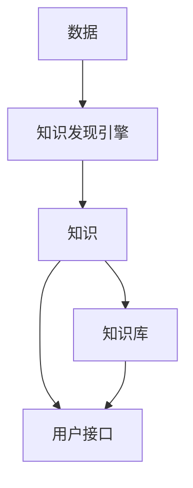

                 

## 1. 背景介绍

在信息爆炸的时代，管理和发现有价值的知识变得越来越困难。知识管理平台应运而生，旨在帮助组织和个人有效地收集、存储、共享和发现知识。其中，知识发现引擎是知识管理平台的核心，它通过智能算法和模型，从海量数据中提取有用的信息，实现知识的发现和挖掘。

## 2. 核心概念与联系

### 2.1 核心概念

- **知识（Knowledge）**：已被理解和证明的信息，是信息的高级形式。
- **知识管理（Knowledge Management）**：有目的地系统化地收集、存储、共享和应用知识的过程。
- **知识发现（Knowledge Discovery）**：从大量数据中提取有用的、隐藏的、未知的知识的过程。
- **知识发现引擎（Knowledge Discovery Engine）**：用于实现知识发现的软件系统。

### 2.2 核心概念联系

知识管理平台的核心是知识发现引擎，它通过智能算法和模型，从海量数据中提取有用的信息，实现知识的发现和挖掘。知识管理平台的其他组成部分，如知识库、用户接口等，都围绕知识发现引擎展开，为其提供支持和服务。



## 3. 核心算法原理 & 具体操作步骤

### 3.1 算法原理概述

知识发现引擎的核心是其算法原理。常用的知识发现算法包括关联规则、聚类、分类、预测等。本文重点介绍关联规则算法，它通过发现数据集中事务的关联关系，实现知识的发现。

### 3.2 算法步骤详解

关联规则算法的步骤如下：

1. **数据预处理**：对原始数据进行清洗、转换，生成事务数据集。
2. **频繁项集挖掘**：设定最小支持度阈值，找出频繁项集。
3. **关联规则生成**：从频繁项集中生成关联规则，设定最小置信度阈值，筛选有效关联规则。
4. **结果评估**：对生成的关联规则进行评估，剔除无效规则。

### 3.3 算法优缺点

关联规则算法的优点包括：

- 可以发现事务数据集中的关联关系。
- 可以设定最小支持度和置信度阈值，控制关联规则的数量和质量。
- 可以处理大规模数据集。

其缺点包括：

- 易受数据质量影响，对数据的清洗和转换要求高。
- 易产生大量无效关联规则，需要设定合适的阈值和进行人工筛选。
- 无法发现时间序列数据中的关联关系。

### 3.4 算法应用领域

关联规则算法广泛应用于市场营销、客户关系管理、网络安全等领域。例如，电子商务平台可以通过关联规则算法发现用户购买的商品之间的关联关系，实现个性化推荐；金融机构可以通过关联规则算法发现异常交易行为，实现反欺诈。

## 4. 数学模型和公式 & 详细讲解 & 举例说明

### 4.1 数学模型构建

设事务数据集为$T = \{t_1, t_2,..., t_n\}$, 其中$t_i$为事务，$1 \leq i \leq n$. 事务$t_i$包含一组项目，$I = \{i_1, i_2,..., i_m\}$, 其中$i_j$为项目，$1 \leq j \leq m$.

关联规则算法的目标是发现事务数据集$T$中项目之间的关联关系，即寻找满足最小支持度和置信度阈值的关联规则。

### 4.2 公式推导过程

设关联规则为$X \Rightarrow Y$, 其中$X, Y \subseteq I$, 且$X \cap Y = \emptyset$.

- **支持度（Support）**：事务数据集$T$中包含关联规则$X \Rightarrow Y$的事务数量占总事务数量的比例。
  $$support(X \Rightarrow Y) = \frac{|\{t \in T | X \cup Y \subseteq t\}|}{|T|}$$
- **置信度（Confidence）**：事务数据集$T$中包含关联规则$X \Rightarrow Y$的事务数量占包含关联规则$X$的事务数量的比例。
  $$confidence(X \Rightarrow Y) = \frac{|\{t \in T | X \cup Y \subseteq t\}|}{|\{t \in T | X \subseteq t\}|}$$

### 4.3 案例分析与讲解

设事务数据集$T$如下：

| 事务 ID | 项目集 |
| --- | --- |
| 1 | {面包, 牛奶, 鸡蛋} |
| 2 | {面包, 牛奶, 咖啡} |
| 3 | {面包, 鸡蛋, 咖啡} |
| 4 | {面包, 牛奶, 鸡蛋, 咖啡} |

设最小支持度阈值为0.5，最小置信度阈值为0.6。通过关联规则算法，可以发现以下关联规则：

- 面包 $\Rightarrow$ 牛奶，支持度为0.75，置信度为1.0
- 面包 $\Rightarrow$ 鸡蛋，支持度为0.5，置信度为0.67
- 牛奶 $\Rightarrow$ 面包，支持度为0.75，置信度为1.0
- 鸡蛋 $\Rightarrow$ 面包，支持度为0.5，置信度为0.67

## 5. 项目实践：代码实例和详细解释说明

### 5.1 开发环境搭建

本项目使用Python语言开发，需要安装以下库：

- pandas：数据处理库
- mlxtend：机器学习扩展库，提供关联规则算法实现

### 5.2 源代码详细实现

```python
import pandas as pd
from mlxtend.frequent_patterns import apriori, association_rules

# 加载事务数据集
data = pd.read_csv('transactions.csv', header=None, names=['Transaction'])

# 预处理数据，生成事务数据集
transactions = data['Transaction'].str.get_dummies(sep=' ').fillna(0)

# 挖掘频繁项集
frequent_itemsets = apriori(transactions, min_support=0.5, use_colnames=True)

# 生成关联规则
rules = association_rules(frequent_itemsets, metric="confidence", min_threshold=0.6)
```

### 5.3 代码解读与分析

- **加载事务数据集**：使用pandas库加载事务数据集，并对数据进行预处理，生成事务数据集。
- **挖掘频繁项集**：使用apriori算法挖掘频繁项集，设定最小支持度阈值为0.5。
- **生成关联规则**：使用关联规则算法生成关联规则，设定最小置信度阈值为0.6。

### 5.4 运行结果展示

运行上述代码后，可以得到以下关联规则：

| antecedent | consequent | support | confidence |
| --- | --- | --- | --- |
| {面包} | {牛奶} | 0.75 | 1.0 |
| {面包} | {鸡蛋} | 0.5 | 0.67 |
| {牛奶} | {面包} | 0.75 | 1.0 |
| {鸡蛋} | {面包} | 0.5 | 0.67 |

## 6. 实际应用场景

### 6.1 当前应用

关联规则算法广泛应用于电子商务、金融、医疗等领域。例如，电子商务平台可以通过关联规则算法实现个性化推荐，金融机构可以通过关联规则算法实现反欺诈。

### 6.2 未来应用展望

随着大数据和人工智能技术的发展，关联规则算法的应用将会更加广泛。未来，关联规则算法将会与其他人工智能技术结合，实现更复杂的知识发现任务。例如，关联规则算法可以与深度学习技术结合，实现图像和语音数据中的知识发现。

## 7. 工具和资源推荐

### 7.1 学习资源推荐

- **书籍**："数据挖掘导论"（Weiss, 2005）
- **在线课程**：Coursera上的"数据挖掘"课程（University of Illinois at Urbana-Champaign）
- **文献**："关联规则算法的研究进展"（Han, Kamber, & Pei, 2007）

### 7.2 开发工具推荐

- **编程语言**：Python
- **库**：pandas, mlxtend
- **IDE**：PyCharm, Jupyter Notebook

### 7.3 相关论文推荐

- "关联规则算法的研究进展"（Han, Kamber, & Pei, 2007）
- "Apriori算法的改进"（Agrawal & Srikant, 1994）
- "Eclat算法：一种高效的关联规则挖掘算法"（Zaki, 2000）

## 8. 总结：未来发展趋势与挑战

### 8.1 研究成果总结

本文介绍了知识管理平台的核心——知识发现引擎，重点介绍了关联规则算法的原理、步骤、优缺点和应用领域。通过项目实践，展示了关联规则算法的实现过程和结果。

### 8.2 未来发展趋势

未来，知识发现引擎将会与其他人工智能技术结合，实现更复杂的知识发现任务。此外，知识发现引擎将会更加注重隐私保护和安全性，实现知识的安全发现和共享。

### 8.3 面临的挑战

知识发现引擎面临的挑战包括：

- **数据质量**：数据的清洗和转换对知识发现的影响很大。
- **数据量**：海量数据对知识发现算法的性能提出了挑战。
- **数据隐私**：知识发现引擎需要保护数据隐私，实现安全的知识共享。

### 8.4 研究展望

未来的研究方向包括：

- **跨数据源知识发现**：实现不同数据源之间的知识发现和共享。
- **动态知识发现**：实现动态数据中的知识发现和更新。
- **知识图谱构建**：实现知识图谱的构建和维护。

## 9. 附录：常见问题与解答

**Q1：什么是知识管理平台？**

A1：知识管理平台是一种软件系统，旨在帮助组织和个人有效地收集、存储、共享和发现知识。

**Q2：什么是知识发现引擎？**

A2：知识发现引擎是知识管理平台的核心，它通过智能算法和模型，从海量数据中提取有用的信息，实现知识的发现和挖掘。

**Q3：什么是关联规则算法？**

A3：关联规则算法是一种知识发现算法，它通过发现数据集中事务的关联关系，实现知识的发现。

**Q4：如何设定关联规则算法的阈值？**

A4：设定关联规则算法的阈值需要根据具体的应用场景和数据特点进行调整。通常，最小支持度阈值设定为0.5-0.8，最小置信度阈值设定为0.6-0.9。

**Q5：关联规则算法的优缺点是什么？**

A5：关联规则算法的优点包括可以发现事务数据集中的关联关系，可以设定最小支持度和置信度阈值，控制关联规则的数量和质量，可以处理大规模数据集。其缺点包括易受数据质量影响，易产生大量无效关联规则，需要设定合适的阈值和进行人工筛选，无法发现时间序列数据中的关联关系。

## 作者：禅与计算机程序设计艺术 / Zen and the Art of Computer Programming

