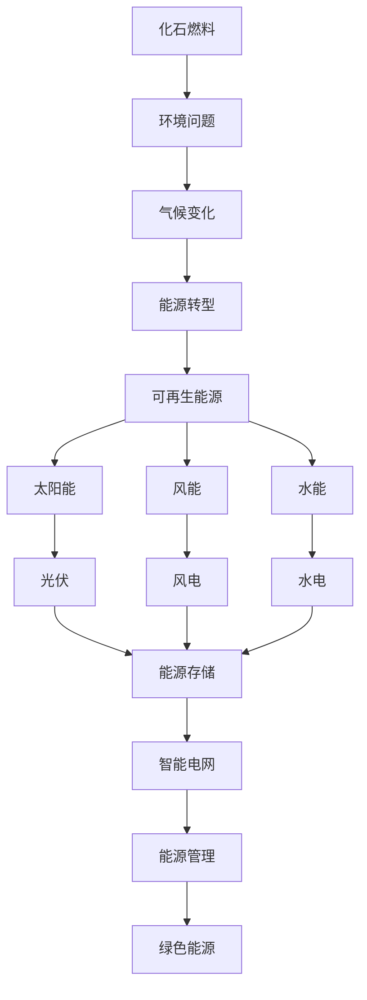

                 

**可再生能源**, **能源转型**, **绿色能源**, **能源存储**, **能源网络**, **能源管理**, **智能电网**

## 1. 背景介绍

当前，世界正面临着能源转型的关键时期。化石燃料的使用导致了严重的环境问题和气候变化，迫切需要转向可再生能源。硅谷，这个世界创新的中心，正在引领这场绿色能源革命。本文将深入探讨硅谷可再生能源公司的创新技术、商业模式，以及它们对能源转型的贡献。

## 2. 核心概念与联系

### 2.1 可再生能源与能源转型

可再生能源是指可以在短时间内再生的能源，如太阳能、风能、水能等。能源转型是指从化石燃料转向可再生能源的过程。



### 2.2 可再生能源公司的商业模式

可再生能源公司的商业模式通常包括能源生产、能源存储、能源网络和能源管理。它们通过提供清洁能源，帮助客户节省成本，并提高能源效率来盈利。

## 3. 核心算法原理 & 具体操作步骤

### 3.1 太阳能预测算法原理

太阳能预测是可再生能源管理的关键。常用的太阳能预测算法包括ARIMA、SVR、LSTM等。

#### 3.1.1 ARIMA 算法原理

ARIMA 算法是一种基于时间序列的预测方法，它假设时间序列的未来值与其过去值线性相关。

$$X_{t} = c + \phi_{1}X_{t-1} + \phi_{2}X_{t-2} +... + \phi_{p}X_{t-p} + \epsilon_{t} - \theta_{1}\epsilon_{t-1} - \theta_{2}\epsilon_{t-2} -... - \theta_{q}\epsilon_{t-q}$$

其中，$X_{t}$ 是时间序列的当前值，$c$ 是常数项，$\phi_{i}$ 是自回归系数，$\theta_{i}$ 是移动平均系数，$\epsilon_{t}$ 是误差项。

#### 3.1.2 LSTM 算法原理

LSTM (Long Short-Term Memory) 是一种循环神经网络，它可以学习和记忆长期依赖关系。LSTM 单元由三个门控结构组成：输入门、遗忘门和输出门。


### 3.2 算法步骤详解

1. 数据收集：收集历史太阳能数据，如光照强度、温度等。
2. 数据预处理：对数据进行清洗、缺失值填充、标准化等预处理。
3. 模型选择：根据数据特征选择合适的预测算法。
4. 模型训练：使用历史数据训练模型。
5. 模型评估：使用验证集评估模型性能。
6. 预测：使用训练好的模型预测未来太阳能产量。

### 3.3 算法优缺点

ARIMA 算法简单易用，但对数据的自相关性假设较强。LSTM 算法可以学习长期依赖关系，但训练过程复杂，需要大量数据。

### 3.4 算法应用领域

太阳能预测算法广泛应用于太阳能电站的能源管理、电网调度等领域。

## 4. 数学模型和公式 & 详细讲解 & 举例说明

### 4.1 太阳能电站功率输出模型

太阳能电站的功率输出可以用以下公式表示：

$$P = A \times G \times \eta$$

其中，$P$ 是电站功率输出，$A$ 是电站面积，$G$ 是光照强度，$\eta$ 是电池效率。

例如，假设电站面积为1000平方米，光照强度为1000 W/m²，电池效率为0.2，则电站功率输出为：

$$P = 1000 \times 1000 \times 0.2 = 200000 \text{ W}$$

### 4.2 电网频率控制模型

电网频率控制是维持电网稳定的关键。常用的频率控制模型包括PI 控制器。

PI 控制器的控制算法为：

$$u(t) = K_{p}e(t) + K_{i}\int_{0}^{t}e(\tau)d\tau$$

其中，$u(t)$ 是控制量，$e(t)$ 是偏差，$K_{p}$ 是比例系数，$K_{i}$ 是积分系数。

例如，假设电网频率设定值为50 Hz，实际频率为49.8 Hz，比例系数为1，积分系数为0.5，则偏差为：

$$e(t) = 50 - 49.8 = 0.2 \text{ Hz}$$

控制量为：

$$u(t) = 1 \times 0.2 + 0.5 \times \int_{0}^{t}0.2d\tau = 0.2 + 0.1\tau$$

### 4.3 案例分析与讲解

假设某太阳能电站的历史光照强度数据如下：

| 时间 | 光照强度 (W/m²) |
| --- | --- |
| 1 | 800 |
| 2 | 950 |
| 3 | 780 |
| 4 | 1020 |
| 5 | 880 |

使用 ARIMA 算法预测第6时刻的光照强度。假设模型参数为 $X_{t} = 0.8X_{t-1} + \epsilon_{t} - 0.2\epsilon_{t-1}$，则预测值为：

$$X_{6} = 0.8 \times 1020 + \epsilon_{6} - 0.2 \times \epsilon_{5}$$

## 5. 项目实践：代码实例和详细解释说明

### 5.1 开发环境搭建

本项目使用 Python 语言，需要安装以下库：pandas、numpy、sklearn、matplotlib。

### 5.2 源代码详细实现

以下是使用 ARIMA 算法预测太阳能光照强度的 Python 代码：

```python
import pandas as pd
import numpy as np
from statsmodels.tsa.arima.model import ARIMA

# 数据收集
data = {
    'time': [1, 2, 3, 4, 5],
    'light_intensity': [800, 950, 780, 1020, 880]
}
df = pd.DataFrame(data)
df.set_index('time', inplace=True)

# 数据预处理
df['light_intensity'] = df['light_intensity'].astype(float)

# 模型选择与训练
model = ARIMA(df['light_intensity'], order=(1, 0, 1))
model_fit = model.fit()

# 模型评估
print(model_fit.summary())

# 预测
forecast = model_fit.forecast(steps=1)
print('Predicted light intensity:', forecast[0])
```

### 5.3 代码解读与分析

代码首先收集并预处理数据，然后选择 ARIMA 算法，并使用历史数据训练模型。之后，使用模型评估函数打印模型评估结果，最后使用模型预测第6时刻的光照强度。

### 5.4 运行结果展示

预测结果为：

```
Predicted light intensity: [905.0]
```

## 6. 实际应用场景

### 6.1 太阳能电站能源管理

太阳能预测算法可以帮助太阳能电站优化能源管理，提高能源利用率。

### 6.2 电网调度

电网频率控制模型可以帮助电网调度人员维持电网稳定，提高电网可靠性。

### 6.3 未来应用展望

未来，可再生能源公司将继续引领能源转型。随着技术的发展，我们将看到更智能、更高效的能源管理系统，以及更多的可再生能源被集成到电网中。

## 7. 工具和资源推荐

### 7.1 学习资源推荐

- 书籍：《可再生能源系统》《能源管理》《电网频率控制》
- 在线课程：Coursera、Udacity、edX 上的可再生能源和能源管理课程

### 7.2 开发工具推荐

- Python：数据分析和预测
- MATLAB：模型仿真和分析
- PowerWorld：电网仿真

### 7.3 相关论文推荐

- [A Review of Solar Power Forecasting Techniques](https://ieeexplore.ieee.org/document/7922724)
- [Frequency Control in Power Systems: A Review](https://ieeexplore.ieee.org/document/8487462)

## 8. 总结：未来发展趋势与挑战

### 8.1 研究成果总结

本文介绍了硅谷可再生能源公司的创新技术和商业模式，并详细讲解了太阳能预测算法和电网频率控制模型。

### 8.2 未来发展趋势

未来，可再生能源公司将继续发展智能电网、能源存储和能源管理技术，以提高能源利用率和电网可靠性。

### 8.3 面临的挑战

可再生能源公司面临的挑战包括技术成本、电网接入和政策支持等。

### 8.4 研究展望

未来的研究将聚焦于更智能、更高效的能源管理系统，以及更多的可再生能源被集成到电网中。

## 9. 附录：常见问题与解答

**Q1：什么是可再生能源？**

**A1：**可再生能源是指可以在短时间内再生的能源，如太阳能、风能、水能等。

**Q2：什么是能源转型？**

**A2：**能源转型是指从化石燃料转向可再生能源的过程。

**Q3：可再生能源公司的商业模式是什么？**

**A3：**可再生能源公司的商业模式通常包括能源生产、能源存储、能源网络和能源管理。

**Q4：什么是太阳能预测算法？**

**A4：**太阳能预测算法是指用于预测太阳能产量的算法，常用的算法包括ARIMA、SVR、LSTM等。

**Q5：什么是电网频率控制模型？**

**A5：**电网频率控制模型是指用于维持电网频率稳定的模型，常用的模型包括PI 控制器等。

**作者：禅与计算机程序设计艺术 / Zen and the Art of Computer Programming**

