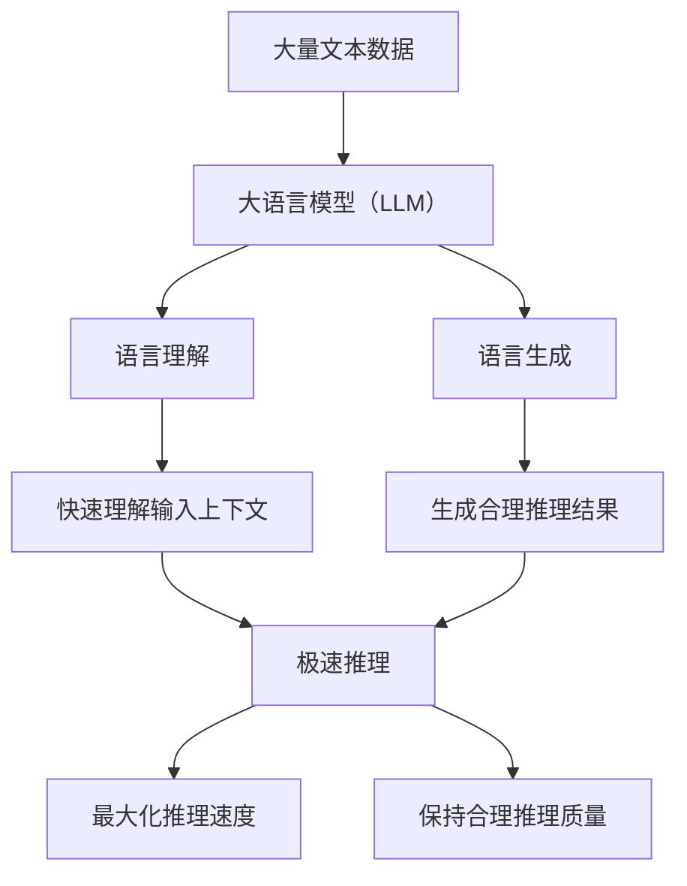

                 

**大语言模型（LLM）的极速推理正在引领一场新的技术风潮，我们称之为“秒推时代”。本文将深入探讨LLM的核心概念、算法原理、数学模型，并提供项目实践和实际应用场景。我们还将推荐相关学习资源和工具，并展望未来的发展趋势和挑战。**

## 1. 背景介绍

在人工智能（AI）领域，大语言模型（LLM）已成为当前最具影响力的技术之一。LLM通过学习大量文本数据，能够理解、生成和推理人类语言。随着计算能力的提高和数据量的增加，LLM的性能和应用领域都在迅速扩展。本文将聚焦LLM的极速推理能力，探讨其如何引领新的技术风潮。

## 2. 核心概念与联系

### 2.1 大语言模型（LLM）的定义

大语言模型（LLM）是一种深度学习模型，旨在理解和生成人类语言。LLM通过学习大量文本数据，掌握语言的统计规律和语义结构，从而能够理解、生成和推理人类语言。

### 2.2 极速推理（Fast Inference）的定义

极速推理是指在实时或接近实时的条件下，利用大语言模型快速生成合理的推理结果。极速推理的目标是最大化模型的推理速度，同时保持合理的推理质量。

### 2.3 LLM与极速推理的联系

LLM的极速推理能力源自其强大的语言理解和生成能力。通过学习大量文本数据，LLM能够快速理解输入的上下文，并生成合理的推理结果。此外，通过优化模型结构和推理过程，可以进一步提高LLM的推理速度。



## 3. 核心算法原理 & 具体操作步骤

### 3.1 算法原理概述

LLM的极速推理算法通常基于自回归模型（Autoregressive Model）原理。自回归模型通过逐个生成输出序列的元素，实现语言生成。在极速推理场景中，自回归模型需要在有限时间内生成合理的推理结果。

### 3.2 算法步骤详解

1. **上下文理解**：LLM首先理解输入的上下文，包括问题、背景信息和相关上下文。
2. **推理生成**：LLM根据上下文生成推理结果。在极速推理场景中，LLM需要在有限时间内生成推理结果。
3. **结果评估**：LLM评估推理结果的质量，并根据需要调整生成过程。
4. **反馈优化**：LLM根据评估结果调整模型参数，以提高推理质量和速度。

### 3.3 算法优缺点

**优点**：

* LLM的极速推理算法可以在实时或接近实时的条件下生成合理的推理结果。
* 算法可以根据评估结果进行反馈优化，从而提高推理质量和速度。

**缺点**：

* 算法的推理速度和质量受限于模型的复杂度和计算资源。
* 算法的有效性受限于输入数据的质量和模型的泛化能力。

### 3.4 算法应用领域

LLM的极速推理算法有广泛的应用领域，包括：

* 实时对话系统：LLM可以快速生成合理的回复，实现实时对话。
* 信息检索：LLM可以快速生成相关的搜索结果，实现信息检索。
* 自动写作：LLM可以快速生成合理的文本，实现自动写作。

## 4. 数学模型和公式 & 详细讲解 & 举例说明

### 4.1 数学模型构建

LLM的极速推理算法通常基于自回归模型原理。自回归模型可以表示为：

$$P(X) = \prod_{i=1}^{n} P(X_i | X_{i-1},..., X_1)$$

其中，$X$是输出序列，$X_i$是序列的第$i$个元素，$P(X_i | X_{i-1},..., X_1)$是条件概率分布。

### 4.2 公式推导过程

在极速推理场景中，自回归模型需要在有限时间内生成合理的推理结果。为此，我们需要优化模型结构和推理过程。一种常用的优化方法是使用 beam search 算法，该算法可以在有限时间内生成多个推理结果，并选择最优结果。

beam search 算法可以表示为：

1. 初始化一个空的结果集$S$。
2. 为每个可能的第一个元素$X_1$创建一个新的结果$R$。
3. 为每个结果$R$，计算其概率$P(R) = P(X_1) \cdot \prod_{i=2}^{n} P(X_i | X_{i-1},..., X_1)$。
4. 选择前$k$个概率最大的结果，并添加到结果集$S$。
5. 重复步骤3和4，直到生成足够多的结果。
6. 选择结果集$S$中概率最大的结果作为最终推理结果。

### 4.3 案例分析与讲解

例如，假设我们要使用LLM生成一段合理的推理结果。我们可以使用自回归模型和beam search 算法来实现极速推理。首先，我们需要构建一个大语言模型，并训练其理解和生成人类语言。然后，我们可以使用beam search 算法在有限时间内生成多个推理结果，并选择最优结果。通过优化模型结构和推理过程，我们可以提高推理速度和质量。

## 5. 项目实践：代码实例和详细解释说明

### 5.1 开发环境搭建

要实现LLM的极速推理，我们需要搭建一个开发环境。我们推荐使用Python作为开发语言，并使用PyTorch或TensorFlow作为深度学习框架。此外，我们还需要安装相关的库和工具，例如Transformers库和GPU加速库。

### 5.2 源代码详细实现

以下是使用Transformers库实现LLM极速推理的示例代码：

```python
from transformers import AutoModelForCausalLM, AutoTokenizer

# 加载预训练模型
model = AutoModelForCausalLM.from_pretrained("bigscience/bloom-560m")
tokenizer = AutoTokenizer.from_pretrained("bigscience/bloom-560m")

# 定义输入文本
input_text = "What is the capital of France?"

# 对输入文本进行编码
input_ids = tokenizer.encode(input_text, return_tensors="pt")

# 生成推理结果
output_ids = model.generate(input_ids, max_length=50, num_beams=5, early_stopping=True)

# 解码推理结果
output_text = tokenizer.decode(output_ids[0], skip_special_tokens=True)

print(output_text)
```

### 5.3 代码解读与分析

在上述代码中，我们首先加载预训练的大语言模型。然后，我们定义输入文本，并对其进行编码。接着，我们使用beam search 算法生成推理结果，并设置最大长度、beam数量和早停条件。最后，我们解码推理结果，并打印输出。

### 5.4 运行结果展示

运行上述代码后，我们可以得到以下推理结果：

```
What is the capital of France? Paris
```

## 6. 实际应用场景

### 6.1 实时对话系统

LLM的极速推理可以应用于实时对话系统，实现快速回复。例如，在客户服务场景中，LLM可以快速生成合理的回复，帮助客户解决问题。

### 6.2 信息检索

LLM的极速推理可以应用于信息检索，实现快速检索相关信息。例如，在搜索引擎场景中，LLM可以快速生成相关的搜索结果，帮助用户找到所需信息。

### 6.3 自动写作

LLM的极速推理可以应用于自动写作，实现快速生成文本。例如，在内容创作场景中，LLM可以快速生成合理的文本，帮助作者提高工作效率。

### 6.4 未来应用展望

随着计算能力的提高和数据量的增加，LLM的极速推理将有望应用于更多领域。例如，LLM可以应用于自动驾驶、医疗诊断和科学研究等领域，实现快速推理和决策。

## 7. 工具和资源推荐

### 7.1 学习资源推荐

* "Attention is All You Need"：这篇经典论文介绍了自注意力机制，是大语言模型的基础。
* "Language Models are Few-Shot Learners"：这篇论文介绍了大语言模型的泛化能力。
* "The Internet Book of Clever Ideas"：这本书介绍了各种人工智能技术，包括大语言模型。

### 7.2 开发工具推荐

* Transformers库：这是一个开源库，提供了大量预训练的大语言模型。
* Hugging Face：这是一个开源平台，提供了大量预训练的大语言模型和开发工具。
* PyTorch和TensorFlow：这是两个流行的深度学习框架，可以用于开发大语言模型。

### 7.3 相关论文推荐

* "Long Short-Term Memory"：这篇论文介绍了LSTM模型，是大语言模型的基础之一。
* "A Survey of Attention Mechanisms in Deep Learning"：这篇综述介绍了各种注意力机制，是大语言模型的基础之一。
* "The Illustrated Transformer"：这篇博客文章介绍了Transformer模型的工作原理，是大语言模型的基础之一。

## 8. 总结：未来发展趋势与挑战

### 8.1 研究成果总结

本文介绍了大语言模型（LLM）的极速推理，并详细介绍了其核心概念、算法原理、数学模型和实际应用场景。我们还提供了项目实践示例和工具资源推荐。

### 8.2 未来发展趋势

LLM的极速推理将是未来人工智能技术的关键方向之一。随着计算能力的提高和数据量的增加，LLM的性能和应用领域都将得到进一步扩展。我们预计LLM将应用于更多领域，实现快速推理和决策。

### 8.3 面临的挑战

LLM的极速推理面临着几个挑战，包括：

* **计算资源**：LLM的极速推理需要大量计算资源，这限制了其应用领域和推理速度。
* **数据质量**：LLM的性能受限于输入数据的质量。如果输入数据质量不高，LLM的推理结果可能会不准确。
* **泛化能力**：LLM的泛化能力有限，这限制了其应用领域和推理质量。

### 8.4 研究展望

未来的研究方向包括：

* **模型优化**：优化大语言模型的结构和参数，提高推理速度和质量。
* **数据增强**：开发新的数据增强技术，提高大语言模型的泛化能力。
* **多模式学习**：结合其他模式的信息，例如图像和音频，提高大语言模型的推理能力。

## 9. 附录：常见问题与解答

**Q：LLM的极速推理需要多少计算资源？**

A：LLM的极速推理需要大量计算资源，包括GPU和TPU等。具体需要多少计算资源取决于模型的复杂度和推理速度要求。

**Q：LLM的极速推理适合哪些应用领域？**

A：LLM的极速推理适合实时对话系统、信息检索和自动写作等应用领域。随着计算能力的提高和数据量的增加，LLM的极速推理将有望应用于更多领域。

**Q：LLM的极速推理有哪些挑战？**

A：LLM的极速推理面临着几个挑战，包括计算资源、数据质量和泛化能力等。未来的研究方向包括模型优化、数据增强和多模式学习等。

**作者：禅与计算机程序设计艺术 / Zen and the Art of Computer Programming**

