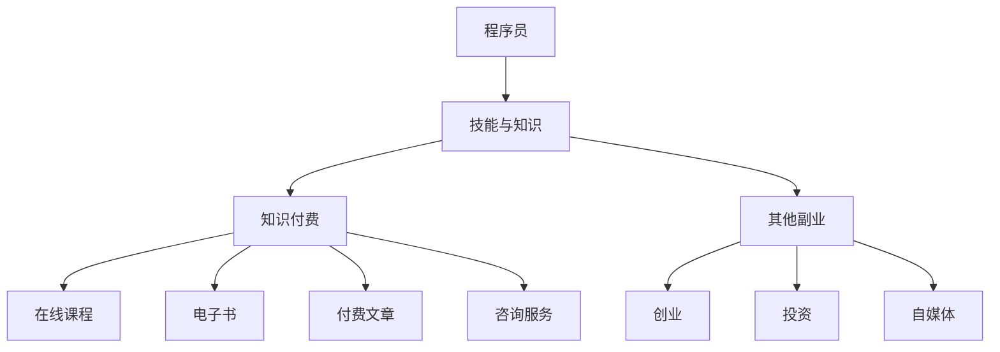

                 

**程序员副业：知识付费的机遇与挑战**

**作者：禅与计算机程序设计艺术 / Zen and the Art of Computer Programming**

## 1. 背景介绍

在当今信息爆炸的时代，知识付费已然成为一种主流的商业模式。程序员作为技术人才的代表，也开始尝试将自己的知识和技能转化为副业收入。本文将从程序员的角度出发，探讨知识付费的机遇与挑战，并提供实用的建议和指南。

## 2. 核心概念与联系

### 2.1 知识付费的定义

知识付费是指通过提供有价值的知识内容，并向受益者收取费用的商业模式。它包括但不限于在线课程、电子书、付费文章、咨询服务等。

### 2.2 程序员副业的定义

程序员副业是指程序员在此之外的、与编程相关或不相关的商业活动。知识付费是程序员副业的一种常见形式。

### 2.3 核心概念联系

程序员副业与知识付费的核心联系在于，程序员拥有独特的技能和知识，可以通过知识付费将其转化为价值，从而获得额外收入。以下是这两个概念的关系图：



## 3. 核心算法原理 & 具体操作步骤

### 3.1 算法原理概述

知识付费的核心算法是内容创作和变现算法。它包括内容生产、内容推广、内容变现三个环节。

### 3.2 算法步骤详解

1. **内容生产**：选择一个有市场需求的领域，创作高质量、有价值的内容。内容形式可以是文字、音频、视频等。
2. **内容推广**：通过各种渠道推广内容，吸引目标受众。渠道包括但不限于社交媒体、搜索引擎、邮件营销等。
3. **内容变现**：设置合适的价格，提供便捷的支付渠道，收取费用。变现渠道包括但不限于在线课程平台、电子书平台、内容订阅等。

### 3.3 算法优缺点

**优点**：

* 低成本：内容创作和推广的成本相对较低。
* 高收益：知识付费的利润率高。
* 灵活性：可以根据市场需求调整内容。

**缺点**：

* 竞争激烈：市场上同类内容众多，需要持续创新。
* 需要持续投入：内容创作和推广需要持续投入时间和精力。
* 变现风险：市场需求和受众喜好变化快，变现风险高。

### 3.4 算法应用领域

知识付费适用于各种技能和知识领域，程序员可以根据自己的技能选择以下领域之一：

* 编程语言和框架
* 算法和数据结构
* 网络和系统管理
* 移动应用开发
* 人工智能和机器学习
* 网络安全
* 创业和管理

## 4. 数学模型和公式 & 详细讲解 & 举例说明

### 4.1 数学模型构建

知识付费的数学模型可以表示为：

$$ Revenue = P \times N \times C $$

其中：

* $P$ 是内容的价格，
* $N$ 是内容的销量，
* $C$ 是内容的成本。

### 4.2 公式推导过程

知识付费的收入取决于内容的价格、销量和成本。其中：

* 价格取决于内容的价值和市场需求。
* 销量取决于内容的推广和受众的喜好。
* 成本取决于内容的创作和推广。

### 4.3 案例分析与讲解

假设程序员A创作了一门在线课程，内容价值高，市场需求旺盛。程序员A设置了每人50美元的价格，预计销量为1000人，内容创作和推广成本为5000美元。那么，程序员A的预期收入为：

$$ Revenue = 50 \times 1000 \times (1 - \frac{5000}{50 \times 1000}) = 40000 \text{ 美元} $$

## 5. 项目实践：代码实例和详细解释说明

### 5.1 开发环境搭建

程序员副业的开发环境可以是本地环境，也可以是云端环境。推荐使用云端环境，因为它可以提供更好的可扩展性和安全性。

### 5.2 源代码详细实现

以下是一个简单的在线课程平台的源代码实现：

```python
class Course:
    def __init__(self, title, price, content):
        self.title = title
        self.price = price
        self.content = content
        self.sales = 0

    def sell(self, quantity):
        self.sales += quantity

    def revenue(self):
        return self.price * self.sales

class CoursePlatform:
    def __init__(self):
        self.courses = []

    def add_course(self, course):
        self.courses.append(course)

    def total_revenue(self):
        return sum(course.revenue() for course in self.courses)
```

### 5.3 代码解读与分析

* `Course` 类表示一个在线课程，它有标题、价格、内容和销量四个属性。
* `CoursePlatform` 类表示一个在线课程平台，它有课程列表一个属性。
* `add_course` 方法用于添加课程。
* `total_revenue` 方法用于计算平台的总收入。

### 5.4 运行结果展示

以下是运行结果的示例：

```python
course1 = Course("Python编程", 50, "Python编程内容")
course2 = Course("数据结构与算法", 100, "数据结构与算法内容")
platform = CoursePlatform()
platform.add_course(course1)
platform.add_course(course2)
course1.sell(1000)
course2.sell(500)
print(platform.total_revenue())  # 输出：75000
```

## 6. 实际应用场景

### 6.1 程序员副业的应用场景

程序员副业的应用场景包括但不限于：

* 在线课程：程序员可以创作在线课程，教授编程语言、算法、数据结构等技能。
* 电子书：程序员可以写作电子书，分享自己的编程经验和技巧。
* 付费文章：程序员可以写作付费文章，分享自己的编程见解和思路。
* 咨询服务：程序员可以提供咨询服务，帮助企业解决技术问题。

### 6.2 未来应用展望

随着技术的发展，程序员副业的应用场景将会更加丰富。未来，程序员副业可能会扩展到虚拟现实、人工智能、区块链等领域。

## 7. 工具和资源推荐

### 7.1 学习资源推荐

* 在线课程平台：Udemy、 Coursera、 Pluralsight
* 编程语言和框架文档：Python官方文档、 Java官方文档、 React文档
* 技术博客：Medium、 Dev.to、 Hacker News

### 7.2 开发工具推荐

* 编辑器：Visual Studio Code、 Atom、 Sublime Text
* 云端环境：AWS、 Google Cloud、 Microsoft Azure
* 在线课程平台：Teachable、 Thinkific、 Udemy

### 7.3 相关论文推荐

* "The Sharing Economy: Income Supplementation or Income Replacement?"（共享经济：收入补充还是收入替代？）
* "The Gig Economy & Alternative Work Arrangements"（兼职经济与替代工作安排）
* "The Rise of the 'Micro-entrepreneur': Self-employment in the 'Gig Economy'"（微企业主的崛起：兼职经济中的自营）

## 8. 总结：未来发展趋势与挑战

### 8.1 研究成果总结

本文从程序员的角度出发，分析了知识付费的机遇与挑战，并提供了实用的建议和指南。程序员可以通过知识付费将自己的技能和知识转化为副业收入，从而获得额外收益。

### 8.2 未来发展趋势

未来，知识付费将会继续发展，程序员副业也将会更加丰富。随着技术的发展，程序员副业可能会扩展到虚拟现实、人工智能、区块链等领域。

### 8.3 面临的挑战

程序员副业面临的挑战包括但不限于：

* 竞争激烈：市场上同类内容众多，需要持续创新。
* 需要持续投入：内容创作和推广需要持续投入时间和精力。
* 变现风险：市场需求和受众喜好变化快，变现风险高。

### 8.4 研究展望

未来的研究可以从以下几个方向展开：

* 研究程序员副业的商业模式，提供更多的实用建议和指南。
* 研究程序员副业的税收政策，帮助程序员合法合规地经营副业。
* 研究程序员副业的法律风险，帮助程序员规避法律风险。

## 9. 附录：常见问题与解答

**Q1：程序员副业需要投入多少时间和精力？**

**A1：程序员副业需要持续投入时间和精力。内容创作和推广需要持续投入，变现风险高。程序员需要根据自己的情况，合理安排时间和精力。**

**Q2：程序员副业的利润率高吗？**

**A2：知识付费的利润率高。但是，程序员副业面临的挑战包括但不限于竞争激烈、需要持续投入、变现风险高。程序员需要根据自己的情况，合理规划副业。**

**Q3：程序员副业的税收政策是什么？**

**A3：程序员副业的税收政策因国家和地区而异。程序员需要根据自己的情况，咨询税务顾问，合法合规地经营副业。**

**Q4：程序员副业的法律风险是什么？**

**A4：程序员副业的法律风险包括但不限于版权侵权、商标侵权、合同纠纷等。程序员需要根据自己的情况，咨询法律顾问，规避法律风险。**

**Q5：程序员副业的未来发展趋势是什么？**

**A5：未来，程序员副业可能会扩展到虚拟现实、人工智能、区块链等领域。程序员需要根据市场需求，及时调整副业方向。**

**作者：禅与计算机程序设计艺术 / Zen and the Art of Computer Programming**

