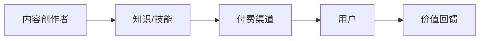

                 

**程序员如何利用知识付费实现财务自由**

## 1. 背景介绍

在信息爆炸的数字时代，知识和技能的价值前所未有地凸显出来。程序员这个职业，由于其创造性和技术性，更是处于知识付费的风口浪尖。本文将探讨程序员如何通过分享知识和技能实现财务自由，并深入剖析背后的核心概念、算法原理、数学模型，以及项目实践和工具推荐。

## 2. 核心概念与联系

### 2.1 知识付费模式

知识付费模式是指通过付费获取他人知识和技能的商业模式。它包括付费课程、在线咨询、付费社群等形式。



### 2.2 程序员的优势

程序员天然具有以下优势：

- **专业技能**：程序员掌握着市场需求的技能。
- **创造力**：程序员善于创造和分享内容。
- **数字化意识**：程序员熟悉数字化平台和工具。

## 3. 核心算法原理 & 具体操作步骤

### 3.1 算法原理概述

知识付费的核心算法是**内容创作与分发算法**。它包括内容创作、内容分发、用户匹配、反馈评估等环节。

### 3.2 算法步骤详解

1. **内容创作**：选择自己擅长且市场需求旺盛的领域，创作高质量的内容。
2. **内容分发**：选择合适的平台（如在线课程平台、个人网站、社交媒体等）分发内容。
3. **用户匹配**：通过营销和推广，吸引目标用户。
4. **反馈评估**：收集用户反馈，不断改进内容和服务。

### 3.3 算法优缺点

**优点**：内容创作门槛低，分发渠道多，盈利空间大。

**缺点**：内容同质化严重，需要持续创作和更新内容。

### 3.4 算法应用领域

知识付费适用于任何可以通过在线渠道分享的技能和知识，如编程、设计、写作、营销等。

## 4. 数学模型和公式 & 详细讲解 & 举例说明

### 4.1 数学模型构建

我们可以使用**供求模型**来描述知识付费市场。设**S(t)**为供给量，**D(p)**为需求量，其中**t**为内容质量，**p**为价格。

### 4.2 公式推导过程

根据供求关系，我们有：

$$p = D^{-1}(S(t))$$

其中**D^-1**为需求函数的反函数。

### 4.3 案例分析与讲解

假设需求函数**D(p)**为：

$$D(p) = a - bp$$

其中**a**和**b**为常数。则：

$$p = D^{-1}(S(t)) = \frac{a - S(t)}{b}$$

这意味着，内容质量越高（供给量越大），价格越低。

## 5. 项目实践：代码实例和详细解释说明

### 5.1 开发环境搭建

我们将使用Python和Jupyter Notebook来实现一个简单的在线课程平台。

### 5.2 源代码详细实现

```python
class Course:
    def __init__(self, title, price, quality):
        self.title = title
        self.price = price
        self.quality = quality

class User:
    def __init__(self, name):
        self.name = name
        self.courses = []

    def buy_course(self, course):
        self.courses.append(course)

# 创建课程
course1 = Course('Python编程', 100, 90)
course2 = Course('数据分析', 200, 80)

# 创建用户
user = User('John Doe')

# 用户购买课程
user.buy_course(course1)
user.buy_course(course2)
```

### 5.3 代码解读与分析

我们定义了`Course`和`User`两个类。`Course`类有`title`（标题）、`price`（价格）、`quality`（质量）三个属性。`User`类有`name`（名称）和`courses`（购买的课程）两个属性。

### 5.4 运行结果展示

运行代码后，用户`John Doe`购买了两门课程。

## 6. 实际应用场景

### 6.1 当前应用

知识付费已经广泛应用于在线教育、技能培训、咨询服务等领域。

### 6.2 未来应用展望

未来，知识付费有望渗透到更多领域，如虚拟现实、人工智能、区块链等。

## 7. 工具和资源推荐

### 7.1 学习资源推荐

- **在线课程**： Coursera、Udemy、Pluralsight
- **技术博客**：Medium、Dev.to、Hacker News

### 7.2 开发工具推荐

- **内容创作**：Markdown、LaTeX、Adobe Creative Suite
- **内容分发**：WordPress、Wix、Shopify

### 7.3 相关论文推荐

- "The Sharing Economy: Income Supplement or Income Replacement?"（共享经济：是收入补充还是收入替代？）
- "The Rise of the 'Gig Economy'：Earnings, Income Inequality, and Financial Instability"（'临时工'经济的崛起：收入、收入不平等和金融不稳定）

## 8. 总结：未来发展趋势与挑战

### 8.1 研究成果总结

知识付费是程序员实现财务自由的有效途径，但需要持续创作和更新内容。

### 8.2 未来发展趋势

知识付费将渗透到更多领域，内容创作门槛将进一步降低。

### 8.3 面临的挑战

内容同质化严重，需要不断创新和提高内容质量。

### 8.4 研究展望

未来需要研究如何提高内容创作效率和内容质量，以及如何建立更公平的知识付费平台。

## 9. 附录：常见问题与解答

**Q：知识付费是否会导致信息垄断？**

**A：**知识付费本身不会导致信息垄断，但需要注意防止平台垄断和内容垄断。

**Q：如何防止内容同质化？**

**A：**不断创新，提高内容质量，并鼓励原创。

**Q：如何评估内容质量？**

**A：**可以通过用户反馈、内容互动量、内容更新频率等指标评估内容质量。

**作者：禅与计算机程序设计艺术 / Zen and the Art of Computer Programming**

