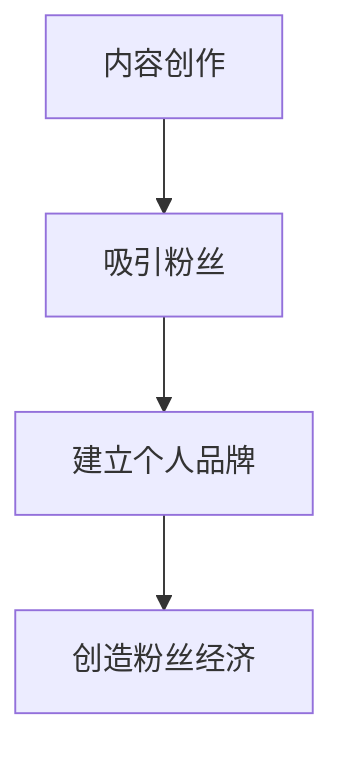

                 

## 1. 背景介绍

在当今的数字时代，程序员的影响力和知名度已经不再局限于技术圈内。建立自己的粉丝社群，可以帮助程序员提高个人品牌，扩大影响力，甚至创造商业机会。本文将深入探讨程序员如何建立自己的粉丝社群，并提供实用的建议和技巧。

## 2. 核心概念与联系

### 2.1 粉丝经济

粉丝经济是指通过建立忠实的粉丝群体，为个人或品牌创造价值的经济模式。程序员可以通过提供高质量的内容，建立个人品牌，从而吸引粉丝并创造粉丝经济。



### 2.2 个人品牌

个人品牌是指程序员在市场上展示的个人形象和特点。建立个人品牌有助于程序员与粉丝建立联系，并使粉丝更容易识别和记忆。

### 2.3 粉丝关系

粉丝关系是指程序员与粉丝之间的互动和联系。建立良好的粉丝关系有助于程序员保持粉丝忠诚度，并吸引新的粉丝加入。

## 3. 核心算法原理 & 具体操作步骤

### 3.1 算法原理概述

建立粉丝社群的算法原理基于内容创作、互动和联系三个关键因素。程序员需要不断创作高质量的内容，与粉丝互动，并建立联系，从而吸引和维持粉丝。

### 3.2 算法步骤详解

1. **内容创作**：程序员需要创作高质量、有价值的内容，吸引潜在粉丝。内容可以是博客文章、视频教程、代码示例等。
2. **互动**：程序员需要与粉丝互动，回复评论，参与讨论，并鼓励粉丝分享内容。互动有助于建立粉丝关系和提高粉丝忠诚度。
3. **联系**：程序员需要建立联系渠道，如邮件列表、社交媒体账号等，方便粉丝与程序员联系，并及时获取最新内容。

### 3.3 算法优缺点

**优点**：

* 提高个人品牌知名度
* 扩大影响力
* 创造商业机会
* 建立忠实的粉丝群体

**缺点**：

* 需要大量时间和精力
* 可能面临负面评价或批评
* 需要持续创作高质量内容

### 3.4 算法应用领域

建立粉丝社群的算法适用于所有程序员，无论是初级还是高级。它可以应用于个人博客、技术视频、开源项目等领域。

## 4. 数学模型和公式 & 详细讲解 & 举例说明

### 4.1 数学模型构建

建立粉丝社群的数学模型可以表示为：

$$G = f(C, I, L)$$

其中，$G$表示粉丝社群规模，$C$表示内容创作质量，$I$表示互动频率，$L$表示联系渠道数量。

### 4.2 公式推导过程

程序员可以通过改善内容创作质量、增加互动频率和扩展联系渠道，来增加粉丝社群规模。数学模型可以帮助程序员量化这些因素的影响，并优化策略。

### 4.3 案例分析与讲解

例如，一位程序员每周发布两篇高质量博客文章（$C=2$），每篇文章平均收到5条评论，程序员回复其中3条（$I=3$），并维护一个邮件列表和两个社交媒体账号（$L=3$）。根据数学模型，该程序员每周可以吸引约15名新粉丝加入社群。

$$G = f(2, 3, 3) = 15$$

## 5. 项目实践：代码实例和详细解释说明

### 5.1 开发环境搭建

程序员可以使用以下工具和服务建立自己的粉丝社群：

* 博客平台：WordPress、Medium、Dev.to
* 视频平台：YouTube、Bilibili、Twitch
* 邮件列表：Mailchimp、SendGrid、ConvertKit
* 社交媒体：Twitter、LinkedIn、GitHub

### 5.2 源代码详细实现

以下是一个简单的Python脚本，用于自动回复Twitter上针对程序员账号的评论，以提高互动频率：

```python
import tweepy

# 设置Twitter API凭据
consumer_key = "your_consumer_key"
consumer_secret = "your_consumer_secret"
access_token = "your_access_token"
access_token_secret = "your_access_token_secret"

# 创建API对象
auth = tweepy.OAuthHandler(consumer_key, consumer_secret)
auth.set_access_token(access_token, access_token_secret)
api = tweepy.API(auth)

# 定义回复消息
reply_message = "感谢您的评论！"

# 获取最新评论
tweets = api.mentions_timeline()

# 回复评论
for tweet in tweets:
    api.update_status(f"@{tweet.user.screen_name} {reply_message}", tweet.id)
```

### 5.3 代码解读与分析

该脚本使用Tweepy库连接Twitter API，并获取程序员账号的最新评论。然后，它回复每条评论，并使用评论ID来确保回复正确的评论。

### 5.4 运行结果展示

运行该脚本后，程序员的Twitter账号将自动回复评论，从而提高互动频率。

## 6. 实际应用场景

### 6.1 当前应用

程序员可以在个人博客、技术视频、开源项目等领域应用建立粉丝社群的算法。例如，一位程序员可以在博客上发布高质量的技术文章，并通过邮件列表和社交媒体与粉丝互动。

### 6.2 未来应用展望

随着技术的发展，程序员可以利用人工智能和机器学习技术，更智能地与粉丝互动。例如，程序员可以使用自然语言处理技术，自动生成回复评论的消息。

## 7. 工具和资源推荐

### 7.1 学习资源推荐

* 书籍：《影响力》（Robert Cialdini）、《粉丝经济》（David Meerman Scott）
* 博客：[Medium](https://medium.com/)、[Dev.to](https://dev.to/)
* 视频：[YouTube](https://www.youtube.com/)、[Twitch](https://www.twitch.tv/)

### 7.2 开发工具推荐

* 博客平台：WordPress、Medium、Dev.to
* 视频平台：YouTube、Bilibili、Twitch
* 邮件列表：Mailchimp、SendGrid、ConvertKit
* 社交媒体：Twitter、LinkedIn、GitHub
* API库：Tweepy（Python）、Twitter4J（Java）、TwitterKit（iOS、Android）

### 7.3 相关论文推荐

* [The Role of Social Media in Building a Personal Brand](https://www.researchgate.net/publication/320124018_The_Role_of_Social_Media_in_Building_a_Personal_Brand)
* [The Impact of Content Marketing on Brand Equity](https://www.researchgate.net/publication/316345254_The_Impact_of_Content_Marketing_on_Brand_Equity)

## 8. 总结：未来发展趋势与挑战

### 8.1 研究成果总结

本文介绍了程序员如何建立自己的粉丝社群，并提供了实用的建议和技巧。通过内容创作、互动和联系，程序员可以吸引和维持粉丝，从而提高个人品牌知名度和扩大影响力。

### 8.2 未来发展趋势

未来，程序员可以利用人工智能和机器学习技术，更智能地与粉丝互动。此外，短视频和直播等新兴平台也将为程序员提供新的机会，建立粉丝社群。

### 8.3 面临的挑战

建立粉丝社群需要大量时间和精力，程序员可能面临负面评价或批评，并需要持续创作高质量内容。此外，技术变化快，程序员需要不断适应新平台和新工具。

### 8.4 研究展望

未来的研究可以关注人工智能和机器学习技术在建立粉丝社群中的应用，以及新兴平台对程序员建立粉丝社群的影响。

## 9. 附录：常见问题与解答

**Q：我应该在哪些平台建立粉丝社群？**

A：选择平台取决于您的目标受众和内容类型。如果您的目标受众是技术人员，那么技术博客平台（如Dev.to）和开发者社区（如Stack Overflow）可能是好的选择。如果您的目标受众是广泛的技术爱好者，那么YouTube和Twitter可能是好的选择。

**Q：我应该如何与粉丝互动？**

A：您可以通过回复评论、参与讨论、分享粉丝创作的内容等方式与粉丝互动。关键是要真诚、及时地回应粉丝，并鼓励粉丝参与互动。

**Q：我应该如何吸引新的粉丝？**

A：您可以通过分享高质量的内容、与其他程序员和影响者合作、参加技术会议和活动等方式吸引新的粉丝。关键是要提供有价值的内容，并与您的目标受众建立联系。

---

作者：禅与计算机程序设计艺术 / Zen and the Art of Computer Programming

