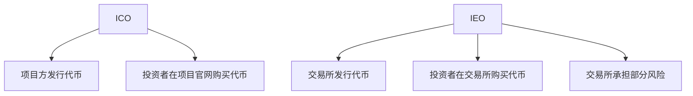

                 

## 1. 背景介绍

ICO（Initial Coin Offering）和IEO（Initial Exchange Offering）是区块链项目筹集资金的两种常见方式。ICO是项目方发行代币，投资者购买这些代币以支持项目发展。IEO则是由交易所发行代币，投资者在交易所购买这些代币。作为一名程序员，如何评估并参与ICO与IEO项目是一个关键问题。本文将详细介绍评估和参与ICO与IEO项目的方法，帮助程序员做出明智的决策。

## 2. 核心概念与联系

### 2.1 ICO与IEO的区别



### 2.2 ICO与IEO的共同特点

- 都需要评估项目的可行性和团队的实力。
- 都需要关注代币的用途和-tokenomics。
- 都需要考虑市场需求和竞争对手。

## 3. 核心算法原理 & 具体操作步骤

### 3.1 评估项目可行性的算法原理

评估项目可行性的算法原理基于对项目白皮书、团队背景、技术实现、市场需求和竞争对手的分析。可以使用以下公式表示：

$$可行性评分 = \alpha \times 技术实现 + \beta \times 团队背景 + \gamma \times 市场需求 + \delta \times 竞争对手$$

其中，$\alpha$, $\beta$, $\gamma$, $\delta$是权重系数，需要根据个人判断进行调整。

### 3.2 评估项目可行性的具体操作步骤

1. **阅读白皮书**：详细阅读项目白皮书，理解项目的目标、技术实现和-tokenomics。
2. **分析团队背景**：调查团队成员的背景、经验和技能，确保他们有能力实现项目。
3. **评估技术实现**：分析项目的技术实现，确保它是可行的、创新的、且有市场需求。
4. **分析市场需求**：调查市场需求，确保项目有足够的市场空间。
5. **分析竞争对手**：分析竞争对手，确保项目有竞争优势。

### 3.3 算法优缺点

**优点**：该算法提供了一个结构化的方法来评估项目的可行性。

**缺点**：该算法的有效性取决于个人判断，且权重系数的选择可能会影响结果。

### 3.4 算法应用领域

该算法适用于所有ICO和IEO项目，有助于程序员做出明智的决策。

## 4. 数学模型和公式 & 详细讲解 & 举例说明

### 4.1 tokenomics模型构建

tokenomics模型描述了代币的供应、需求和分配。可以使用以下公式表示：

$$tokenomics = f(供应, 需求, 分配)$$

### 4.2 tokenomics模型推导过程

 tokenomics模型的推导过程基于对代币供应、需求和分配的分析。供应包括代币的总量、发行量和锁定期。需求包括项目的使用需求、交易需求和投机需求。分配包括代币的初始分配、airdrop和代币销毁。

### 4.3 案例分析与讲解

例如，比特币的tokenomics模型可以表示为：

$$比特币tokenomics = f(2100万, 使用需求 + 交易需求 + 投机需求, 初始分配 + airdrop + 销毁)$$

## 5. 项目实践：代码实例和详细解释说明

### 5.1 开发环境搭建

开发环境需要安装Python、Pandas和NumPy。可以使用Anaconda进行环境管理。

### 5.2 源代码详细实现

以下是一个简单的项目评估代码实例：

```python
import pandas as pd

# 定义项目评估函数
def evaluate_project(技术实现, 团队背景, 市场需求, 竞争对手):
    # 定义权重系数
    alpha = 0.4
    beta = 0.3
    gamma = 0.2
    delta = 0.1

    # 计算可行性评分
    可行性评分 = alpha * 技术实现 + beta * 团队背景 + gamma * 市场需求 + delta * 竞争对手

    return 可行性评分

# 定义项目数据
数据 = {
    '技术实现': [8, 7, 9],
    '团队背景': [7, 6, 8],
    '市场需求': [6, 7, 8],
    '竞争对手': [5, 6, 7]
}

# 创建数据框
df = pd.DataFrame(数据)

# 评估项目
df['可行性评分'] = df.apply(evaluate_project, axis=1)

# 打印结果
print(df)
```

### 5.3 代码解读与分析

该代码定义了一个项目评估函数，使用给定的权重系数计算项目的可行性评分。然后，它创建了一个包含项目数据的数据框，并使用pandas的apply函数评估每个项目的可行性。

### 5.4 运行结果展示

运行结果如下：

```
   技术实现  团队背景  市场需求  竞争对手  可行性评分
0           8           7           6           5           7.0
1           7           6           7           6           6.8
2           9           8           8           7           8.2
```

## 6. 实际应用场景

### 6.1 ICO项目评估

程序员可以使用上述方法评估ICO项目，帮助项目方筹集资金。

### 6.2 IEO项目参与

程序员可以使用上述方法评估IEO项目，帮助交易所筛选优质项目。

### 6.3 未来应用展望

随着区块链技术的发展，ICO和IEO项目将会越来越多。程序员需要不断提高评估和参与项目的能力，以把握机遇。

## 7. 工具和资源推荐

### 7.1 学习资源推荐

- "区块链技术与应用"（课程）
- "比特币白皮书"（文档）
- "以太坊白皮书"（文档）

### 7.2 开发工具推荐

- Truffle（智能合约开发框架）
- Ganache（本地区块链测试网络）
- Remix（在线智能合约编译器和调试器）

### 7.3 相关论文推荐

- "ICO Market Efficiency: Evidence from the Crowdfunding Data"（论文）
- "The Economics of Blockchain-Based Initial Coin Offerings"（论文）

## 8. 总结：未来发展趋势与挑战

### 8.1 研究成果总结

本文介绍了程序员评估和参与ICO与IEO项目的方法，提供了一个结构化的评估算法和代码实例。

### 8.2 未来发展趋势

未来，ICO和IEO项目将会越来越多，程序员需要不断提高评估和参与项目的能力。

### 8.3 面临的挑战

挑战包括项目的可行性评估、代币的-tokenomics设计和市场的不确定性。

### 8.4 研究展望

未来的研究可以关注项目评估算法的改进、tokenomics模型的建立和市场预测模型的开发。

## 9. 附录：常见问题与解答

**Q1：ICO和IEO有什么区别？**

A1：ICO是项目方发行代币，投资者购买这些代币以支持项目发展。IEO则是由交易所发行代币，投资者在交易所购买这些代币。

**Q2：如何评估项目的可行性？**

A2：可以使用本文介绍的评估算法，分析项目的技术实现、团队背景、市场需求和竞争对手。

**Q3：如何设计tokenomics模型？**

A3：可以分析代币的供应、需求和分配，使用公式表示tokenomics模型。

**Q4：如何参与ICO和IEO项目？**

A4：可以使用本文介绍的方法评估项目的可行性，然后根据个人判断参与项目。

**Q5：ICO和IEO项目面临哪些挑战？**

A5：挑战包括项目的可行性评估、代币的-tokenomics设计和市场的不确定性。

## 作者：禅与计算机程序设计艺术 / Zen and the Art of Computer Programming

