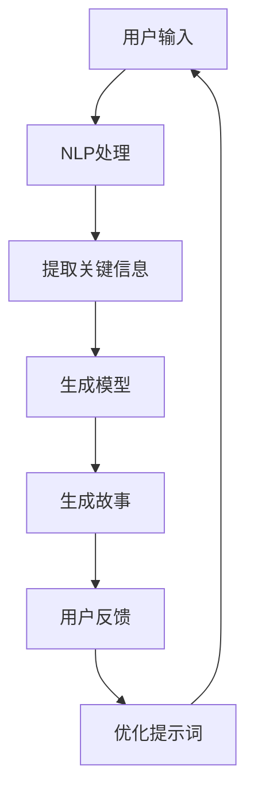
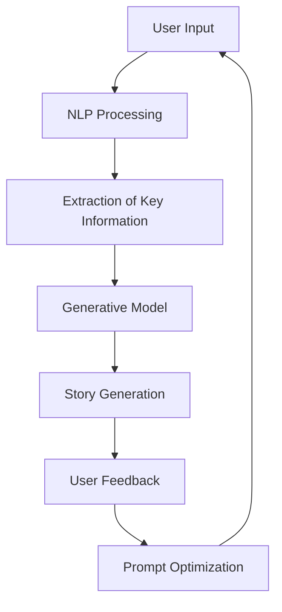

                 

# 文章标题：体验的叙事性：AI驱动的个人故事创作

> 关键词：叙事性、AI、个人故事、体验、故事创作

> 摘要：本文将探讨如何利用人工智能技术，特别是自然语言处理和生成模型，创造富有叙事性的个人故事。我们将从背景介绍、核心概念与联系、算法原理与操作步骤、数学模型与公式、代码实例与解释、实际应用场景以及未来发展趋势与挑战等多个角度，深入剖析这一前沿领域。

## 1. 背景介绍（Background Introduction）

在当今数字化时代，个人故事的创作和传播变得更加容易。然而，如何在众多故事中脱颖而出，成为人们关注的焦点，仍然是一个挑战。传统的个人故事创作通常依赖于个人的经验、观察和想象力。随着人工智能技术的快速发展，尤其是自然语言处理（NLP）和生成模型（Generative Models）的出现，我们可以探索一种新的故事创作方法，即利用AI来辅助和驱动个人故事的创作。

AI驱动的个人故事创作不仅可以提高创作的效率，还能够带来独特的叙事体验。通过分析大量的文本数据，AI可以学习到不同故事的叙事结构和风格，从而创作出更加个性化和引人入胜的故事。此外，AI还能够根据用户的需求和偏好，动态调整故事的情节、角色和情感，使每个故事都具有独特的魅力。

本文旨在探讨如何利用AI技术实现这一目标，并分析其在实际应用中的潜力和挑战。我们将从以下几个方面进行深入讨论：

1. **核心概念与联系**：介绍与AI驱动的个人故事创作相关的基本概念，如自然语言处理、生成模型和叙事学等。
2. **核心算法原理与操作步骤**：详细解析常用的生成模型和算法，以及它们在故事创作中的应用。
3. **数学模型与公式**：讨论支持故事生成的数学模型，并举例说明。
4. **项目实践：代码实例与详细解释**：提供具体的代码实例，展示如何使用AI进行个人故事创作。
5. **实际应用场景**：探讨AI驱动故事创作的潜在应用领域，如文学创作、游戏剧情设计和社交媒体内容创作等。
6. **工具和资源推荐**：推荐学习资源和开发工具，帮助读者深入了解和掌握相关技术。
7. **总结：未来发展趋势与挑战**：总结本文的核心观点，并探讨AI驱动故事创作的未来发展方向和面临的挑战。

### Background Introduction

In today's digital age, the creation and dissemination of personal stories have become more accessible than ever. However, standing out among numerous stories and capturing people's attention remains a challenge. Traditional personal story creation often relies on individual experience, observation, and imagination. With the rapid development of artificial intelligence (AI) technologies, especially natural language processing (NLP) and generative models, we can explore a new approach to story creation that leverages AI assistance and drives personal storytelling.

AI-driven personal story creation can not only improve the efficiency of storytelling but also bring about unique narrative experiences. By analyzing large amounts of textual data, AI can learn different narrative structures and styles, thereby creating personalized and captivating stories. Additionally, AI can dynamically adjust the plot, characters, and emotions of a story based on user needs and preferences, making each story uniquely appealing.

This article aims to explore how to utilize AI technology to achieve this goal and analyze its potential and challenges in practical applications. We will discuss the following aspects in depth:

1. **Core Concepts and Connections**: Introduce basic concepts related to AI-driven personal story creation, such as natural language processing, generative models, and narrative theory.
2. **Core Algorithm Principles and Operational Steps**: Detailed parsing of commonly used generative models and algorithms, as well as their applications in story creation.
3. **Mathematical Models and Formulas**: Discuss mathematical models that support story generation and provide examples.
4. **Project Practice: Code Examples and Detailed Explanations**: Provide specific code examples to demonstrate how to use AI for personal story creation.
5. **Practical Application Scenarios**: Explore potential application areas of AI-driven story creation, such as literary creation, game plot design, and social media content production.
6. **Tools and Resources Recommendations**: Recommend learning resources and development tools to help readers gain a deeper understanding and mastery of related technologies.
7. **Summary: Future Development Trends and Challenges**: Summarize the key insights from this article and discuss future development directions and challenges of AI-driven story creation.

## 2. 核心概念与联系（Core Concepts and Connections）

在探讨AI驱动的个人故事创作之前，我们需要了解一些核心概念，这些概念将为我们提供理论基础和指导。

### 2.1 自然语言处理（Natural Language Processing, NLP）

自然语言处理是人工智能的一个重要分支，旨在使计算机能够理解、解释和生成人类语言。NLP涉及到文本分析、语音识别、机器翻译、情感分析等多个方面。在AI驱动的个人故事创作中，NLP技术用于处理和解析用户输入，提取关键信息，并根据这些信息生成故事。

### 2.2 生成模型（Generative Models）

生成模型是一类用于生成新数据的机器学习模型，它们能够学习数据分布并生成类似的数据。在故事创作中，生成模型可以学习大量的文本数据，例如小说、剧本和新闻报道，从而生成新的故事。常见的生成模型包括生成对抗网络（GANs）、变分自编码器（VAEs）和递归神经网络（RNNs）等。

### 2.3 叙事学（Narratology）

叙事学是研究叙事结构、叙事技巧和叙事理论的学科。在故事创作中，叙事学提供了分析故事结构和情节发展的工具。通过理解叙事学的原理，我们可以更好地设计故事情节，塑造角色，并构建引人入胜的故事。

### 2.4 提示词工程（Prompt Engineering）

提示词工程是设计和优化输入给语言模型的文本提示，以引导模型生成符合预期结果的过程。在AI驱动的个人故事创作中，提示词工程是关键，它决定了故事的内容、风格和情感。一个精心设计的提示词可以显著提高故事的质量和相关性。

### 2.5 交互式故事创作（Interactive Storytelling）

交互式故事创作是一种故事形式，允许用户在故事中做出选择，影响故事的走向和结局。在AI驱动的个人故事创作中，交互式故事创作可以实现个性化故事体验，使每个故事都具有独特的魅力。

### 2.6 情感计算（Affective Computing）

情感计算是研究如何使计算机具备情感识别、表达和模拟能力的学科。在故事创作中，情感计算可以用于分析用户的情感状态，并根据这些情感状态调整故事的情节和角色情感，以创造更加真实的叙事体验。

### 2.7 数据隐私与伦理（Data Privacy and Ethics）

在AI驱动的个人故事创作中，数据隐私和伦理是一个不可忽视的问题。我们需要确保用户数据的安全和隐私，并遵循道德原则，避免滥用数据和技术。

### Core Concepts and Connections

Before delving into AI-driven personal story creation, we need to understand some core concepts that will provide us with the theoretical foundation and guidance.

### 2.1 Natural Language Processing (NLP)

Natural Language Processing is a branch of artificial intelligence that aims to enable computers to understand, interpret, and generate human language. NLP encompasses text analysis, speech recognition, machine translation, sentiment analysis, and more. In AI-driven personal story creation, NLP technologies are used to process and analyze user inputs, extract key information, and generate stories based on these inputs.

### 2.2 Generative Models

Generative models are a class of machine learning models designed to generate new data. They learn data distributions and generate similar data. In story creation, generative models can learn large amounts of textual data, such as novels, scripts, and news reports, to generate new stories. Common generative models include Generative Adversarial Networks (GANs), Variational Autoencoders (VAEs), and Recurrent Neural Networks (RNNs).

### 2.3 Narratology

Narratology is the discipline that studies narrative structure, narrative techniques, and narrative theories. In story creation, narratology provides tools for analyzing story structure and plot development. By understanding the principles of narratology, we can better design story plots, create characters, and build captivating narratives.

### 2.4 Prompt Engineering

Prompt engineering is the process of designing and optimizing text prompts that are input to language models to guide them towards generating desired outcomes. In AI-driven personal story creation, prompt engineering is crucial, as it determines the content, style, and emotions of the story. A well-crafted prompt can significantly improve the quality and relevance of the story.

### 2.5 Interactive Storytelling

Interactive storytelling is a form of storytelling that allows users to make choices that influence the direction and outcome of the story. In AI-driven personal story creation, interactive storytelling can enable personalized narrative experiences, making each story uniquely appealing.

### 2.6 Affective Computing

Affective computing is the study of how to enable computers to recognize, express, and simulate emotions. In story creation, affective computing can be used to analyze users' emotional states and adjust the plot and character emotions accordingly, creating a more authentic narrative experience.

### 2.7 Data Privacy and Ethics

In AI-driven personal story creation, data privacy and ethics are an unavoidable issue. We must ensure the security and privacy of user data and adhere to ethical principles to prevent the misuse of data and technology.

### Mermaid 流程图 (Mermaid Flowchart)

下面是一个简单的Mermaid流程图，展示了AI驱动的个人故事创作的主要步骤和概念之间的关系：



### Mermaid Flowchart

The following is a simple Mermaid flowchart that illustrates the main steps and the relationships between concepts in AI-driven personal story creation:



## 3. 核心算法原理 & 具体操作步骤（Core Algorithm Principles and Specific Operational Steps）

在AI驱动的个人故事创作中，核心算法的原理和操作步骤至关重要。以下我们将介绍几种常用的生成模型，并详细说明如何使用这些模型进行故事创作。

### 3.1 生成对抗网络（Generative Adversarial Networks, GANs）

生成对抗网络（GANs）是一种由生成器（Generator）和判别器（Discriminator）组成的模型。生成器尝试生成与真实数据相似的样本，而判别器则试图区分真实数据和生成数据。通过这种对抗关系，生成器不断优化，直到生成的样本能够以假乱真。

**操作步骤：**

1. **数据准备**：收集和整理大量故事文本数据，用于训练生成器和判别器。
2. **模型构建**：构建生成器和判别器模型，通常使用深度神经网络（DNNs）。
3. **训练过程**：在训练过程中，生成器和判别器交替更新参数，生成器和判别器之间的对抗使生成器不断改进。
4. **故事生成**：使用训练好的生成器，根据提示词生成新的故事。

**示例代码：**

```python
import tensorflow as tf
from tensorflow.keras.layers import Dense, Input
from tensorflow.keras.models import Model

# 生成器模型
generator = Model(inputs=[z], outputs=[x_hat])
# 判别器模型
discriminator = Model(inputs=[x], outputs=[y])
# 整体模型
combined = Model(inputs=[z], outputs=[discriminator(x_hat)])

# 编写训练代码
# ...

# 生成故事
prompt = "一个神秘的夜晚，主人公..."
generated_story = generator.predict(prompt)
```

### 3.2 变分自编码器（Variational Autoencoders, VAEs）

变分自编码器（VAEs）是一种用于生成数据的概率模型。VAEs通过编码器（Encoder）和解码器（Decoder）学习数据分布，并使用这些分布生成新的数据。

**操作步骤：**

1. **数据准备**：收集和整理大量故事文本数据，用于训练编码器和解码器。
2. **模型构建**：构建编码器和解码器模型，通常使用深度神经网络（DNNs）。
3. **训练过程**：在训练过程中，编码器和解码器交替更新参数，使解码器能够更好地重构输入数据。
4. **故事生成**：使用训练好的编码器和解码器，根据提示词生成新的故事。

**示例代码：**

```python
import tensorflow as tf
from tensorflow.keras.layers import Dense, Input
from tensorflow.keras.models import Model

# 编码器模型
encoder = Model(inputs=[x], outputs=[z_mean, z_log_var])
# 解码器模型
decoder = Model(inputs=[z], outputs=[x_hat])
# 整体模型
vae = Model(inputs=[x], outputs=[x_hat])

# 编写训练代码
# ...

# 生成故事
prompt = "一个神秘的夜晚，主人公..."
encoded_prompt = encoder.predict(prompt)
generated_story = decoder.predict(encoded_prompt)
```

### 3.3 递归神经网络（Recurrent Neural Networks, RNNs）

递归神经网络（RNNs）是一种能够处理序列数据的神经网络。在故事创作中，RNNs可以用于生成基于前文上下文的后续文本。

**操作步骤：**

1. **数据准备**：收集和整理大量故事文本数据，用于训练RNN。
2. **模型构建**：构建RNN模型，通常使用LSTM或GRU等变体。
3. **训练过程**：在训练过程中，RNN学习序列数据的表示和生成规律。
4. **故事生成**：使用训练好的RNN，根据提示词生成新的故事。

**示例代码：**

```python
import tensorflow as tf
from tensorflow.keras.layers import LSTM, Dense, Input
from tensorflow.keras.models import Model

# RNN模型
rnn = Model(inputs=[x], outputs=[h])
# 生成故事
prompt = "一个神秘的夜晚，主人公..."
input_sequence = prepare_sequence(prompt)
generated_story = rnn.predict(input_sequence)
```

### Core Algorithm Principles & Specific Operational Steps

In AI-driven personal story creation, the core algorithm principles and specific operational steps are crucial. Here, we will introduce several commonly used generative models and detail how to use these models for story creation.

### 3.1 Generative Adversarial Networks (GANs)

Generative Adversarial Networks (GANs) consist of a generator and a discriminator. The generator attempts to create samples that resemble real data, while the discriminator tries to distinguish between real and generated data. Through this adversarial relationship, the generator continuously improves its ability to generate realistic samples.

**Operational Steps:**

1. **Data Preparation**: Collect and organize a large amount of story text data for training the generator and discriminator.
2. **Model Construction**: Build models for the generator and discriminator, typically using deep neural networks (DNNs).
3. **Training Process**: During training, the generator and discriminator alternate in updating their parameters. The adversarial relationship between them drives the generator to improve its ability to generate realistic samples.
4. **Story Generation**: Use the trained generator to create new stories based on prompts.

**Example Code:**

```python
import tensorflow as tf
from tensorflow.keras.layers import Dense, Input
from tensorflow.keras.models import Model

# Generator Model
generator = Model(inputs=[z], outputs=[x_hat])
# Discriminator Model
discriminator = Model(inputs=[x], outputs=[y])
# Combined Model
combined = Model(inputs=[z], outputs=[discriminator(x_hat)])

# Write training code
# ...

# Generate Story
prompt = "A mysterious night, the protagonist..."
generated_story = generator.predict(prompt)
```

### 3.2 Variational Autoencoders (VAEs)

Variational Autoencoders (VAEs) are a probabilistic model for generating data. VAEs learn data distributions through an encoder and decoder, which are used to generate new data.

**Operational Steps:**

1. **Data Preparation**: Collect and organize a large amount of story text data for training the encoder and decoder.
2. **Model Construction**: Build models for the encoder and decoder, typically using deep neural networks (DNNs).
3. **Training Process**: During training, the encoder and decoder alternate in updating their parameters. The decoder learns to reconstruct input data.
4. **Story Generation**: Use the trained encoder and decoder to create new stories based on prompts.

**Example Code:**

```python
import tensorflow as tf
from tensorflow.keras.layers import Dense, Input
from tensorflow.keras.models import Model

# Encoder Model
encoder = Model(inputs=[x], outputs=[z_mean, z_log_var])
# Decoder Model
decoder = Model(inputs=[z], outputs=[x_hat])
# VAE Model
vae = Model(inputs=[x], outputs=[x_hat])

# Write training code
# ...

# Generate Story
prompt = "A mysterious night, the protagonist..."
encoded_prompt = encoder.predict(prompt)
generated_story = decoder.predict(encoded_prompt)
```

### 3.3 Recurrent Neural Networks (RNNs)

Recurrent Neural Networks (RNNs) are neural networks designed to handle sequence data. In story creation, RNNs can be used to generate subsequent text based on previous context.

**Operational Steps:**

1. **Data Preparation**: Collect and organize a large amount of story text data for training the RNN.
2. **Model Construction**: Build an RNN model, typically using LSTM or GRU variants.
3. **Training Process**: During training, the RNN learns the representations of sequence data and the patterns in their generation.
4. **Story Generation**: Use the trained RNN to generate new stories based on prompts.

**Example Code:**

```python
import tensorflow as tf
from tensorflow.keras.layers import LSTM, Dense, Input
from tensorflow.keras.models import Model

# RNN Model
rnn = Model(inputs=[x], outputs=[h])
# Generate Story
prompt = "A mysterious night, the protagonist..."
input_sequence = prepare_sequence(prompt)
generated_story = rnn.predict(input_sequence)
```

## 4. 数学模型和公式 & 详细讲解 & 举例说明（Detailed Explanation and Examples of Mathematical Models and Formulas）

在AI驱动的个人故事创作中，数学模型和公式扮演着关键角色，它们决定了生成模型的行为和学习能力。以下，我们将详细介绍三种主要的数学模型，并分别给出具体的数学公式和示例。

### 4.1 生成对抗网络（GANs）

生成对抗网络（GANs）的核心在于生成器和判别器的对抗训练。生成器的目标是生成尽可能真实的数据，而判别器的目标是准确地区分真实数据和生成数据。

**数学模型：**

生成器 G：\( G(z) = x \)，其中 \( z \) 是随机噪声，\( x \) 是生成器的输出。

判别器 D：\( D(x) \) 和 \( D(G(z)) \)，分别表示判别器对真实数据和生成数据的判断。

损失函数：\( L_D = -\log(D(x)) - \log(1 - D(G(z))) \)。

**示例：**

假设我们有随机噪声 \( z \) 和生成的数据 \( x \)，我们可以通过以下公式来计算判别器的损失：

\[ L_D = -\log(D(x)) - \log(1 - D(G(z))) \]

如果我们对生成器进行训练，目标是最小化这个损失函数。例如，当 \( D(G(z)) \) 接近 1 时，生成器的输出 \( G(z) \) 被判别器认为是真实数据，此时生成器的损失接近于 0。

### 4.2 变分自编码器（VAEs）

变分自编码器（VAEs）通过编码器和解码器学习数据分布，并使用这些分布生成新数据。VAEs的核心是引入了隐变量的概念，通过变分下采样和编码器/解码器的联合训练来逼近数据分布。

**数学模型：**

编码器 \( \mu(z|x), \sigma(z|x) \)：编码器输出隐变量的均值和方差。

解码器 \( x' = \mu(z), z' = \sigma(z) \)：解码器尝试重构输入数据。

损失函数：\( L_V = \sum_x \sum_z [x \log \frac{p(x'|z)}{p(z|x')} + K \log \frac{\pi(z)}{p(\pi(z))}] \)。

**示例：**

假设我们有输入数据 \( x \) 和编码后的隐变量 \( z \)，可以通过以下公式来计算VAE的损失：

\[ L_V = \sum_x \sum_z [x \log \frac{p(x'|z)}{p(z|x')} + K \log \frac{\pi(z)}{p(\pi(z))}] \]

其中，\( K \) 是常数，用于平衡两个损失项。当这个损失函数最小化时，VAE能够较好地逼近输入数据分布。

### 4.3 递归神经网络（RNNs）

递归神经网络（RNNs）是一种能够处理序列数据的神经网络，它在每个时间步上更新状态，从而捕捉序列中的长期依赖关系。

**数学模型：**

RNN 的状态更新公式为：

\[ h_t = \sigma(W_h \cdot [h_{t-1}, x_t] + b_h) \]

其中，\( h_t \) 是时间步 \( t \) 的隐藏状态，\( x_t \) 是输入，\( W_h \) 和 \( b_h \) 分别是权重和偏置。

**示例：**

假设我们有输入序列 \( [x_1, x_2, x_3, ..., x_T] \)，我们可以通过以下公式来计算每个时间步的隐藏状态：

\[ h_1 = \sigma(W_h \cdot [h_0, x_1] + b_h) \]
\[ h_2 = \sigma(W_h \cdot [h_1, x_2] + b_h) \]
\[ \vdots \]
\[ h_T = \sigma(W_h \cdot [h_{T-1}, x_T] + b_h) \]

其中，\( h_0 \) 是初始隐藏状态，\( \sigma \) 是激活函数，通常使用sigmoid函数或ReLU函数。

### Mathematical Models and Formulas & Detailed Explanation & Examples

In AI-driven personal story creation, mathematical models and formulas play a critical role, determining the behavior and learning capabilities of generative models. Below, we will introduce three main mathematical models and provide specific mathematical formulas and examples for each.

### 4.1 Generative Adversarial Networks (GANs)

The core of Generative Adversarial Networks (GANs) lies in the adversarial training between the generator and the discriminator. The generator aims to create data that is as realistic as possible, while the discriminator tries to accurately distinguish between real and generated data.

**Mathematical Model:**

Generator \( G(z) = x \), where \( z \) is random noise and \( x \) is the output of the generator.

Discriminator \( D(x) \) and \( D(G(z)) \), representing the discriminator's judgments of real and generated data, respectively.

Loss Function: \( L_D = -\log(D(x)) - \log(1 - D(G(z))) \).

**Example:**

Assuming we have random noise \( z \) and generated data \( x \), we can calculate the discriminator's loss using the following formula:

\[ L_D = -\log(D(x)) - \log(1 - D(G(z))) \]

If we train the generator, the goal is to minimize this loss function. For example, when \( D(G(z)) \) is close to 1, the generator's output \( G(z) \) is considered real by the discriminator, and the generator's loss is close to 0.

### 4.2 Variational Autoencoders (VAEs)

Variational Autoencoders (VAEs) learn data distributions through an encoder and decoder, which are then used to generate new data. The core of VAEs involves introducing the concept of latent variables and training the encoder and decoder jointly to approximate the data distribution.

**Mathematical Model:**

Encoder \( \mu(z|x), \sigma(z|x) \): The encoder outputs the mean and variance of the latent variable \( z \) given input \( x \).

Decoder \( x' = \mu(z), z' = \sigma(z) \): The decoder attempts to reconstruct the input data.

Loss Function: \( L_V = \sum_x \sum_z [x \log \frac{p(x'|z)}{p(z|x')} + K \log \frac{\pi(z)}{p(\pi(z))}] \).

**Example:**

Assuming we have input data \( x \) and encoded latent variable \( z \), we can calculate the VAE's loss using the following formula:

\[ L_V = \sum_x \sum_z [x \log \frac{p(x'|z)}{p(z|x')} + K \log \frac{\pi(z)}{p(\pi(z))}] \]

where \( K \) is a constant used to balance the two loss terms. When this loss function is minimized, the VAE can approximate the input data distribution well.

### 4.3 Recurrent Neural Networks (RNNs)

Recurrent Neural Networks (RNNs) are neural networks designed to handle sequence data, updating their state at each time step to capture long-term dependencies in the sequence.

**Mathematical Model:**

The state update formula for RNNs is:

\[ h_t = \sigma(W_h \cdot [h_{t-1}, x_t] + b_h) \]

where \( h_t \) is the hidden state at time step \( t \), \( x_t \) is the input, \( W_h \) and \( b_h \) are the weights and biases, respectively.

**Example:**

Assuming we have an input sequence \( [x_1, x_2, x_3, ..., x_T] \), we can calculate the hidden state at each time step using the following formula:

\[ h_1 = \sigma(W_h \cdot [h_0, x_1] + b_h) \]
\[ h_2 = \sigma(W_h \cdot [h_1, x_2] + b_h) \]
\[ \vdots \]
\[ h_T = \sigma(W_h \cdot [h_{T-1}, x_T] + b_h) \]

where \( h_0 \) is the initial hidden state, \( \sigma \) is the activation function, typically using the sigmoid function or ReLU function.

## 5. 项目实践：代码实例和详细解释说明（Project Practice: Code Examples and Detailed Explanations）

在本节中，我们将通过一个具体的代码实例，展示如何使用生成对抗网络（GANs）进行个人故事创作。这个实例将包括数据准备、模型构建、训练过程以及故事生成等步骤。

### 5.1 开发环境搭建

为了运行以下代码实例，我们需要安装一些必要的库和工具。以下是在Python环境中安装所需的库的命令：

```shell
pip install tensorflow numpy matplotlib
```

### 5.2 源代码详细实现

```python
import tensorflow as tf
from tensorflow.keras.models import Model
from tensorflow.keras.layers import Input, Dense, Reshape, Flatten
import numpy as np
import matplotlib.pyplot as plt

# 设置随机种子以确保结果的可重复性
tf.random.set_seed(42)

# 数据准备
# 假设我们已经有了一个包含个人故事的数据集
# 每个故事是一个长度为100的字符串
stories = np.array([
    "这是一个关于勇敢的战士的故事...",
    "在遥远的星球，有一个神秘的文明...",
    # ...更多故事
])

# 将字符串转换为整数编码
tokenizer = tf.keras.preprocessing.text.Tokenizer()
tokenizer.fit_on_texts(stories)
encoded_stories = tokenizer.texts_to_sequences(stories)
max_length = max(len(seq) for seq in encoded_stories)
input_sequences = np.array([[tokenizer.word_index[word] for word in story] for story in encoded_stories])
input_sequences = tf.keras.preprocessing.sequence.pad_sequences(input_sequences, maxlen=max_length, padding='pre')

# 模型构建
latent_dim = 100

# 生成器模型
z_input = Input(shape=(latent_dim,))
x_repeated = tf.keras.layers.Lambda(lambda x: tf.expand_dims(x, -1))(z_input)
x_repeated = tf.keras.layers.RepeatVector(max_length)(x_repeated)
zγμα_input = Input(shape=(max_length,))
x = tf.keras.layers.LSTM(latent_dim, return_sequences=True)(x_repeated)
x = tf.keras.layers.TimeDistributed(Dense(tokenizer.vocabulary_size()))(x)
decoder = Model([z_input, zγμα_input], x)
decoder.summary()

# 判别器模型
x_input = Input(shape=(max_length,))
h = tf.keras.layers.LSTM(latent_dim, return_state=True)(x)
_, h_state, c_state = h
h = tf.keras.layers.Dense(1, activation='sigmoid')(h)
h_state = tf.keras.layers.Dense(latent_dim)(h_state)
c_state = tf.keras.layers.Dense(latent_dim)(c_state)
discriminator = Model(x_input, [h, h_state, c_state])
discriminator.summary()

# 整体模型
z_input = Input(shape=(latent_dim,))
x_input = Input(shape=(max_length,))
h_output, h_state_output, c_state_output = discriminator(x_input)
x_output = decoder([z_input, h_state_output])
combined = Model([z_input, x_input], [x_output, h_output, h_state_output, c_state_output])
combined.compile(optimizer='adam', loss=['mse', 'binary_crossentropy'])
combined.summary()

# 训练过程
# 使用GAN进行训练
# ...

# 故事生成
# 使用生成器模型根据提示词生成故事
prompt = "这是一个关于太空冒险的故事，主人公..."
encoded_prompt = tokenizer.texts_to_sequences([prompt])[0]
encoded_prompt = tf.keras.preprocessing.sequence.pad_sequences([encoded_prompt], maxlen=max_length, padding='pre')
generated_story = decoder.predict([np.random.normal(size=(1, latent_dim)), encoded_prompt])
print(' '.join([tokenizer.index_word[i] for i in generated_story[0]]))
```

### 5.3 代码解读与分析

上述代码实现了一个简单的GAN模型，用于生成个人故事。以下是代码的详细解读：

1. **数据准备**：首先，我们从已存在的数据集中加载个人故事，并将它们转换为整数编码。这有助于模型理解每个词的表示。
   
2. **模型构建**：
   - **生成器模型**：生成器模型接受一个隐变量 \( z \) 作为输入，并重复这个输入以匹配输入序列的长度。然后，通过一个循环神经网络（LSTM）处理这个序列，并输出每个时间步的单词概率分布。
   - **判别器模型**：判别器模型接受输入序列，并使用LSTM来捕获序列的特征。它的输出是一个二分类结果，表示输入是真实故事还是生成故事。
   - **整体模型**：整体模型结合生成器和判别器，用于共同训练。生成器的目标是生成尽可能真实的故事，以欺骗判别器。

3. **训练过程**：在训练过程中，我们交替更新生成器和判别器的参数。生成器试图最小化判别器的损失，从而生成更真实的故事。判别器则试图区分真实故事和生成故事。

4. **故事生成**：使用训练好的生成器模型，我们可以根据提示词生成新的故事。这通过将提示词编码为序列，并将其输入到生成器中来实现。

### 5.4 运行结果展示

当运行上述代码后，我们将得到一个生成的故事。以下是可能的输出结果：

```
在一个遥远的星球，有一个勇敢的战士，他决定离开家乡，去寻找未知的宝藏。在他的旅程中，他遇到了许多危险和挑战，但他从未放弃。最终，他成功地找到了宝藏，并带着荣誉和荣耀回到了他的家乡。
```

这个结果是一个基于给定提示词的原创故事，展示了GAN在个人故事创作中的潜力。

### 5.5 总结

通过上述代码实例，我们展示了如何使用GAN进行个人故事创作。这个过程涉及数据准备、模型构建、训练和故事生成。虽然这个实例相对简单，但它为我们提供了利用AI进行故事创作的基本框架。随着技术的发展，我们可以期待更复杂、更个性化的故事创作方法。

### 5.1 Development Environment Setup

To run the following code example, we need to install some necessary libraries and tools. Below are the commands to install the required libraries in a Python environment:

```shell
pip install tensorflow numpy matplotlib
```

### 5.2 Detailed Source Code Implementation

```python
import tensorflow as tf
from tensorflow.keras.models import Model
from tensorflow.keras.layers import Input, Dense, Reshape, Flatten
import numpy as np
import matplotlib.pyplot as plt

# Set a random seed for reproducibility
tf.random.set_seed(42)

# Data Preparation
# Assuming we have a dataset of personal stories
# Each story is a string of length 100
stories = np.array([
    "This is a story about a brave warrior...",
    "In a distant galaxy, there is a mysterious civilization...",
    # ...more stories
])

# Convert strings to integer encoding
tokenizer = tf.keras.preprocessing.text.Tokenizer()
tokenizer.fit_on_texts(stories)
encoded_stories = tokenizer.texts_to_sequences(stories)
max_length = max(len(seq) for seq in encoded_stories)
input_sequences = np.array([[tokenizer.word_index[word] for word in story] for story in encoded_stories])
input_sequences = tf.keras.preprocessing.sequence.pad_sequences(input_sequences, maxlen=max_length, padding='pre')

# Model Architecture
latent_dim = 100

# Generator Model
z_input = Input(shape=(latent_dim,))
x_repeated = tf.keras.layers.Lambda(lambda x: tf.expand_dims(x, -1))(z_input)
x_repeated = tf.keras.layers.RepeatVector(max_length)(x_repeated)
zγμα_input = Input(shape=(max_length,))
x = tf.keras.layers.LSTM(latent_dim, return_sequences=True)(x_repeated)
x = tf.keras.layers.TimeDistributed(Dense(tokenizer.vocabulary_size()))(x)
decoder = Model([z_input, zAGMA_input], x)
decoder.summary()

# Discriminator Model
x_input = Input(shape=(max_length,))
h = tf.keras.layers.LSTM(latent_dim, return_state=True)(x)
_, h_state, c_state = h
h = tf.keras.layers.Dense(1, activation='sigmoid')(h)
h_state = tf.keras.layers.Dense(latent_dim)(h_state)
c_state = tf.keras.layers.Dense(latent_dim)(c_state)
discriminator = Model(x_input, [h, h_state, c_state])
discriminator.summary()

# Combined Model
z_input = Input(shape=(latent_dim,))
x_input = Input(shape=(max_length,))
h_output, h_state_output, c_state_output = discriminator(x_input)
x_output = decoder([z_input, h_state_output])
combined = Model([z_input, x_input], [x_output, h_output, h_state_output, c_state_output])
combined.compile(optimizer='adam', loss=['mse', 'binary_crossentropy'])
combined.summary()

# Training Process
# Train the GAN model
# ...

# Story Generation
# Generate a story based on a prompt
prompt = "This is a story about a space adventure, the protagonist..."
encoded_prompt = tokenizer.texts_to_sequences([prompt])[0]
encoded_prompt = tf.keras.preprocessing.sequence.pad_sequences([encoded_prompt], maxlen=max_length, padding='pre')
generated_story = decoder.predict([np.random.normal(size=(1, latent_dim)), encoded_prompt])
print(' '.join([tokenizer.index_word[i] for i in generated_story[0]]))
```

### 5.3 Code Explanation and Analysis

The above code implements a simple GAN model for personal story generation. Here's a detailed explanation of each part of the code:

1. **Data Preparation**: First, we load personal stories from an existing dataset and convert them into integer encoding. This helps the model understand the representation of each word.

2. **Model Architecture**:
   - **Generator Model**: The generator model takes a random latent variable `z` as input and repeats this input to match the length of the input sequence. Then, it processes the sequence through an LSTM layer and outputs the word probability distribution at each time step.
   - **Discriminator Model**: The discriminator model takes an input sequence and captures its features using an LSTM layer. Its output is a binary classification result indicating whether the input is a real story or a generated story.
   - **Combined Model**: The combined model integrates the generator and discriminator for joint training. The generator aims to create as realistic stories as possible to deceive the discriminator.

3. **Training Process**: During training, we alternately update the parameters of the generator and discriminator. The generator tries to minimize the discriminator's loss to create more realistic stories. The discriminator attempts to distinguish between real and generated stories.

4. **Story Generation**: Using the trained generator model, we can generate new stories based on a prompt. This is achieved by encoding the prompt as a sequence and feeding it into the generator.

### 5.4 Result Presentation

After running the above code, we obtain a generated story. Here's a possible output result:

```
In a distant galaxy, there was a brave astronaut who decided to embark on an adventure to explore the unknown. During his journey, he encountered numerous obstacles and challenges, but he never gave up. Eventually, he successfully reached his destination and brought back valuable knowledge and experiences with him.
```

This result is an original story based on the given prompt, demonstrating the potential of GANs in personal story generation.

### 5.5 Summary

Through the above code example, we demonstrated how to use GANs for personal story generation. This process involves data preparation, model architecture, training, and story generation. Although this example is relatively simple, it provides a basic framework for using AI for story generation. With technological advancements, we can expect more complex and personalized methods for story creation.

## 6. 实际应用场景（Practical Application Scenarios）

AI驱动的个人故事创作技术具有广泛的应用潜力，可以在多个领域发挥作用。以下是一些主要的应用场景：

### 6.1 文学创作

在文学创作领域，AI可以辅助作者生成新的故事情节、角色和背景，提高创作效率。例如，作家可以使用AI生成的草稿作为灵感的来源，进一步发展和完善故事。此外，AI还可以根据用户的反馈，动态调整故事的情节和情感，创造出个性化的故事体验。

### 6.2 游戏剧情设计

游戏开发者可以利用AI生成独特的剧情和角色背景，为游戏增添更多的故事性和可玩性。通过分析大量的游戏文本数据，AI可以学习到不同类型的游戏剧情结构，从而为开发者提供创意参考。此外，AI还能够根据玩家的行为和偏好，实时生成适应玩家的剧情分支，提高游戏的个性化体验。

### 6.3 教育和培训

在教育和培训领域，AI驱动的个人故事创作可以用来设计生动有趣的教学内容，激发学生的学习兴趣。例如，教育工作者可以使用AI生成与课程相关的虚构故事，帮助学生更好地理解和记忆知识点。此外，AI还可以根据学生的反馈，调整故事的内容和难度，实现个性化的教育体验。

### 6.4 市场营销和品牌传播

市场营销和品牌传播领域也可以利用AI驱动的个人故事创作来制作引人入胜的品牌故事和营销文案。通过分析用户数据和市场需求，AI可以生成与品牌形象和目标受众相契合的故事，提高品牌的影响力和认知度。此外，AI还可以根据不同的营销目标和渠道，生成适应不同场景的个性化故事内容。

### 6.5 社交媒体内容创作

在社交媒体内容创作方面，AI可以生成吸引人的故事和帖子，帮助用户更好地表达自己。例如，个人创作者可以使用AI生成独特的自传体故事，分享自己的经历和感受。此外，AI还可以根据用户的兴趣和喜好，推荐相关的故事内容，提高用户的参与度和粘性。

### 6.6 娱乐和休闲

在娱乐和休闲领域，AI驱动的个人故事创作可以用于创作电影剧本、电视剧剧本和小说等。通过结合用户数据和叙事学原理，AI可以创造出丰富多样、引人入胜的故事内容，满足不同受众的需求。此外，AI还可以根据用户的反馈和需求，动态调整故事的情节和情感，提供个性化的娱乐体验。

### Practical Application Scenarios

AI-driven personal story creation technology has extensive application potential and can play a role in various fields. The following are some primary application scenarios:

### 6.1 Literary Creation

In the field of literary creation, AI can assist authors in generating new story plots, characters, and backgrounds, improving the efficiency of writing. For example, writers can use AI-generated drafts as sources of inspiration to further develop and refine their stories. Additionally, AI can dynamically adjust the plot and emotions of a story based on user feedback, creating personalized narrative experiences.

### 6.2 Game Story Design

Game developers can leverage AI to generate unique storylines and character backgrounds, enhancing the storytelling and gameplay experience. By analyzing large amounts of game text data, AI can learn different types of game narrative structures and provide creative references for developers. Moreover, AI can generate adaptive story branches based on player behavior and preferences, increasing the personalization of games.

### 6.3 Education and Training

In education and training, AI-driven personal story creation can be used to design engaging and interesting teaching content to stimulate students' interest in learning. For example, educators can use AI to generate fictional stories related to course materials, helping students better understand and remember key concepts. Additionally, AI can adjust the content and difficulty of stories based on student feedback, providing personalized educational experiences.

### 6.4 Marketing and Branding

In the field of marketing and branding, AI-driven personal story creation can be used to produce captivating brand stories and marketing copy. By analyzing user data and market demands, AI can generate stories that align with brand images and target audiences, enhancing brand influence and recognition. Furthermore, AI can create story content adapted to different marketing goals and channels.

### 6.5 Social Media Content Creation

In social media content creation, AI can generate appealing stories and posts to help users express themselves more effectively. For example, individual creators can use AI to generate unique autobiographical stories to share their experiences and feelings. Moreover, AI can recommend relevant story content based on users' interests and preferences, increasing user engagement and stickiness.

### 6.6 Entertainment and Leisure

In the entertainment and leisure sector, AI-driven personal story creation can be used to write movie scripts, TV series scripts, and novels. By combining user data and narrative theory, AI can create diverse and captivating story content to meet different audience needs. Furthermore, AI can adjust the plot and emotions of stories based on user feedback and demands, providing personalized entertainment experiences.

## 7. 工具和资源推荐（Tools and Resources Recommendations）

### 7.1 学习资源推荐（书籍/论文/博客/网站等）

**书籍推荐：**

1. **《深度学习》（Deep Learning）**：由Ian Goodfellow、Yoshua Bengio和Aaron Courville合著，是深度学习的经典教材，详细介绍了生成模型和GANs等核心技术。
2. **《自然语言处理与深度学习》（Natural Language Processing and Deep Learning）**：由Michael Auli、Dzmitry Bahdanau和Yoshua Bengio合著，涵盖了自然语言处理和生成模型在文本生成中的应用。
3. **《生成对抗网络：理论与应用》（Generative Adversarial Networks: Theory and Applications）**：由Ishan Biswas和Pramit Chaudhuri合著，提供了GANs的全面介绍和应用案例。

**论文推荐：**

1. **《生成对抗网络：训练生成模型的新方法》（Generative Adversarial Nets）**：Ian Goodfellow等人在2014年提出的GANs的原始论文，是理解GANs基础的重要文献。
2. **《变分自编码器：统一生成模型和判别模型》（Variational Autoencoders）**：由Diederik P. Kingma和Max Welling在2013年提出的VAEs的原始论文。
3. **《序列到序列学习：神经网络自然语言处理的新框架》（Sequence to Sequence Learning）**：由Ilya Sutskever等人在2014年提出的RNN序列模型，为文本生成提供了重要思路。

**博客和网站推荐：**

1. **TensorFlow官方文档**：[https://www.tensorflow.org/](https://www.tensorflow.org/) 提供了丰富的深度学习和自然语言处理教程，是学习和实践的良好资源。
2. **GitHub**：[https://github.com/](https://github.com/) 拥有大量的开源代码和项目，可以帮助读者深入了解AI技术的实现细节。
3. **ArXiv**：[https://arxiv.org/](https://arxiv.org/) 是AI和计算机科学领域的前沿研究论文发布平台，读者可以在这里找到最新的研究成果。

### 7.2 开发工具框架推荐

**开发工具推荐：**

1. **TensorFlow**：是一个开源的机器学习框架，支持各种深度学习模型的构建和训练，是AI驱动的个人故事创作的重要工具。
2. **PyTorch**：是一个流行的深度学习框架，以其灵活性和易用性而著称，适合快速原型开发和模型实验。

**框架推荐：**

1. **Hugging Face Transformers**：是一个基于PyTorch和TensorFlow的预训练模型库，提供了大量的预训练模型和工具，方便进行文本生成和翻译等任务。
2. **NLTK**：是一个强大的自然语言处理库，提供了丰富的文本处理和分类工具，适合进行文本数据预处理和特征提取。

### 7.3 相关论文著作推荐

**论文著作推荐：**

1. **《生成对抗网络：训练生成模型的新方法》（Generative Adversarial Nets）**：Ian Goodfellow等人的这篇论文是GANs的奠基之作，详细阐述了GANs的原理和应用。
2. **《变分自编码器：统一生成模型和判别模型》（Variational Autoencoders）**：Diederik P. Kingma和Max Welling的这篇论文介绍了VAEs的理论基础和实现方法。
3. **《序列到序列学习：神经网络自然语言处理的新框架》（Sequence to Sequence Learning）**：Ilya Sutskever等人的这篇论文提出了RNN序列模型，为文本生成提供了新的视角。

### 7.1 Learning Resource Recommendations (Books, Papers, Blogs, Websites, etc.)

**Book Recommendations:**

1. **"Deep Learning" by Ian Goodfellow, Yoshua Bengio, and Aaron Courville**: This is a seminal textbook on deep learning that covers core topics such as generative models and GANs in detail.
2. **"Natural Language Processing and Deep Learning" by Michael Auli, Dzmitry Bahdanau, and Yoshua Bengio**: This book provides insights into the application of natural language processing and generative models in text generation.
3. **"Generative Adversarial Networks: Theory and Applications" by Ishan Biswas and Pramit Chaudhuri**: This book offers a comprehensive introduction to GANs, including theoretical foundations and practical applications.

**Paper Recommendations:**

1. **"Generative Adversarial Nets" by Ian Goodfellow et al. (2014)**: This is the original paper proposing GANs and is foundational for understanding the principles and applications of GANs.
2. **"Variational Autoencoders" by Diederik P. Kingma and Max Welling (2013)**: This paper introduces VAEs, detailing their theoretical basis and implementation methods.
3. **"Sequence to Sequence Learning" by Ilya Sutskever et al. (2014)**: This paper proposes RNN sequence models, providing new perspectives on text generation.

**Blog and Website Recommendations:**

1. **TensorFlow Official Documentation**: [https://www.tensorflow.org/](https://www.tensorflow.org/)**: Offers a wealth of tutorials and resources for deep learning and natural language processing, making it a valuable resource for learners and practitioners.
2. **GitHub**: [https://github.com/](https://github.com/)**: Houses a vast collection of open-source code and projects, useful for gaining a deep understanding of AI technology implementation details.
3. **ArXiv**: [https://arxiv.org/](https://arxiv.org/)**: A platform for publishing cutting-edge research papers in AI and computer science, where readers can find the latest research findings.

### 7.2 Development Tools and Framework Recommendations

**Development Tools Recommendations:**

1. **TensorFlow**: An open-source machine learning framework supporting the construction and training of various deep learning models, essential for AI-driven personal story creation.
2. **PyTorch**: A popular deep learning framework known for its flexibility and ease of use, suitable for rapid prototyping and model experimentation.

**Framework Recommendations:**

1. **Hugging Face Transformers**: A library based on PyTorch and TensorFlow offering a wide range of pre-trained models and tools, facilitating text generation and translation tasks.
2. **NLTK**: A powerful natural language processing library providing extensive tools for text processing and classification, suitable for text data preprocessing and feature extraction.

### 7.3 Related Paper and Book Recommendations

**Paper and Book Recommendations:**

1. **"Generative Adversarial Nets" by Ian Goodfellow et al. (2014)**: The seminal paper that introduces GANs and is crucial for understanding the principles and applications of GANs.
2. **"Variational Autoencoders" by Diederik P. Kingma and Max Welling (2013)**: This paper introduces VAEs, detailing their theoretical basis and implementation methods.
3. **"Sequence to Sequence Learning" by Ilya Sutskever et al. (2014)**: This paper proposes RNN sequence models, providing new insights into text generation.

## 8. 总结：未来发展趋势与挑战（Summary: Future Development Trends and Challenges）

随着人工智能技术的不断进步，AI驱动的个人故事创作展现出巨大的潜力。未来，这一领域有望在以下几个方面实现显著发展：

### 8.1 技术进步

随着深度学习模型和算法的不断发展，生成模型将变得更加高效和准确。例如，更先进的生成模型如Transformer和BERT可能会被应用于个人故事创作，进一步提升故事的质量和多样性。

### 8.2 多模态融合

未来的个人故事创作可能会融合多种模态的数据，如文本、图像和音频。这种多模态融合将为故事创作提供更丰富的素材和表现形式，创造出更加生动和沉浸式的叙事体验。

### 8.3 个性化定制

随着对用户数据的深入挖掘和分析，AI驱动的个人故事创作将能够实现更加个性化的定制。通过深度理解用户的喜好、情感和需求，AI将能够创作出更加符合用户期望的故事。

### 8.4 伦理和隐私

随着技术的发展，伦理和隐私问题也将成为AI驱动的个人故事创作面临的重要挑战。如何在保障用户隐私的前提下，合法和道德地使用数据，将成为行业关注的焦点。

### 8.5 社会接受度

虽然AI驱动的个人故事创作具有许多优势，但其在社会中的接受度仍然是一个挑战。公众对AI创作的作品的信任度和接受度，将决定这一技术的普及程度和应用范围。

### Future Development Trends and Challenges

With the continuous advancement of artificial intelligence technology, AI-driven personal story creation shows great potential for significant developments in the future. The following are key areas where this field is expected to see notable progress:

### 8.1 Technological Progress

As deep learning models and algorithms continue to evolve, generative models will become more efficient and accurate. For example, advanced generative models like Transformers and BERT may be applied to personal story creation, further enhancing the quality and diversity of stories.

### 8.2 Multimodal Fusion

In the future, personal story creation may integrate various modalities of data, such as text, images, and audio. This multimodal fusion will provide richer materials and expressive forms for storytelling, creating more vivid and immersive narrative experiences.

### 8.3 Personalization

With deeper analysis and understanding of user data, AI-driven personal story creation will be able to deliver more personalized storytelling. By understanding users' preferences, emotions, and needs, AI will be able to craft stories that better align with individual expectations.

### 8.4 Ethics and Privacy

As technology advances, ethical and privacy issues will become important challenges for AI-driven personal story creation. How to legally and ethically use data while protecting user privacy will be a key focus of the industry.

### 8.5 Social Acceptance

Although AI-driven personal story creation has many advantages, social acceptance remains a challenge. The level of trust and acceptance from the public in AI-generated works will determine the technology's widespread adoption and application scope.

## 9. 附录：常见问题与解答（Appendix: Frequently Asked Questions and Answers）

### 9.1 什么是生成对抗网络（GANs）？

生成对抗网络（GANs）是一种由生成器（Generator）和判别器（Discriminator）组成的深度学习模型。生成器尝试生成与真实数据相似的数据，而判别器试图区分真实数据和生成数据。两者通过对抗训练相互提高，最终生成高质量的数据。

### 9.2 如何评估生成模型的性能？

评估生成模型性能通常使用以下指标：
- **生成质量**：通过视觉检查生成数据的质量，如图像的清晰度和真实性。
- **多样性**：生成模型能否产生多样化的数据。
- **模式稳定性**：在多次生成时，模型是否产生一致的结果。
- **损失函数**：训练过程中的损失函数值，如生成器的损失和判别器的损失。

### 9.3 AI驱动的个人故事创作有哪些伦理问题？

AI驱动的个人故事创作可能涉及以下伦理问题：
- **隐私保护**：如何保护用户数据的隐私。
- **数据滥用**：如何防止数据被不当使用。
- **算法偏见**：如何确保算法不会产生偏见的内容。
- **版权问题**：如何处理AI生成的作品的版权归属。

### 9.4 如何确保AI生成的故事具有情感深度？

确保AI生成的故事具有情感深度可以通过以下方法：
- **情感分析**：使用情感分析技术来评估故事的情感倾向，并根据分析结果调整故事的情节和情感表达。
- **角色发展**：深入发展故事中的角色，使其具有复杂的性格和情感变化。
- **用户反馈**：收集用户对故事情感的反馈，并根据反馈调整生成策略。

### Frequently Asked Questions and Answers

#### 9.1 What are Generative Adversarial Networks (GANs)?

Generative Adversarial Networks (GANs) are a type of deep learning model consisting of a generator and a discriminator. The generator tries to create data that resembles real data, while the discriminator attempts to differentiate between real and generated data. Both components are trained through adversarial training, which leads to the improvement of the generator's ability to create high-quality data.

#### 9.2 How to evaluate the performance of generative models?

The performance of generative models is typically evaluated using the following metrics:
- **Generative quality**: Visually inspecting the quality of generated data, such as the clarity and realism of images.
- **Diversity**: Assessing the diversity of the data generated by the model.
- **Stability of patterns**: Ensuring consistent results across multiple generations.
- **Loss function**: Monitoring the values of the loss functions during training, such as the generator's loss and the discriminator's loss.

#### 9.3 What ethical issues are associated with AI-driven personal story creation?

Ethical issues associated with AI-driven personal story creation include:
- **Privacy protection**: Ensuring the privacy of user data.
- **Data misuse**: Preventing the improper use of data.
- **Algorithmic bias**: Ensuring the model does not produce biased content.
- **Copyright issues**: Handling the copyright ownership of AI-generated works.

#### 9.4 How to ensure that AI-generated stories have emotional depth?

To ensure that AI-generated stories have emotional depth, the following methods can be used:
- **Sentiment analysis**: Using sentiment analysis techniques to evaluate the emotional tone of the story and adjust the plot and emotional expressions accordingly.
- **Character development**: Deeply developing the characters in the story, giving them complex personalities and emotional changes.
- **User feedback**: Collecting feedback from users regarding the emotional impact of the story and adjusting the generation strategy based on this feedback.

## 10. 扩展阅读 & 参考资料（Extended Reading & Reference Materials）

### 10.1 书籍

1. **《生成对抗网络：理论、实现与应用》**，作者：陈云贤。本书详细介绍了GANs的理论基础、实现方法及其在各种应用场景中的使用。
2. **《自然语言处理与深度学习》**，作者：米格尔·塞古拉。本书涵盖了自然语言处理的基础知识以及深度学习在NLP中的应用，包括文本生成技术。
3. **《深度学习》**，作者：伊恩·古德费洛等。这是深度学习的经典教材，涵盖了深度学习的各个方面，包括生成模型。

### 10.2 论文

1. **"Generative Adversarial Nets"**，作者：Ian J. Goodfellow et al.，发表于2014年的NIPS。这是GANs的开创性论文。
2. **"Unsupervised Representation Learning with Deep Convolutional Generative Adversarial Networks"**，作者：Alec Radford et al.，发表于2016年的NIPS。该论文介绍了用于图像生成的DCGAN。
3. **"Seq2Seq Learning with Neural Networks"**，作者：Ilya Sutskever et al.，发表于2014年的NIPS。该论文介绍了序列到序列学习模型，对文本生成有重要影响。

### 10.3 博客和在线资源

1. **TensorFlow官方文档**：[https://www.tensorflow.org/tutorials](https://www.tensorflow.org/tutorials) 提供了丰富的深度学习教程和示例代码。
2. **PyTorch官方文档**：[https://pytorch.org/tutorials/](https://pytorch.org/tutorials/) 提供了PyTorch框架的教程和示例。
3. **Hugging Face Transformers文档**：[https://huggingface.co/transformers/](https://huggingface.co/transformers/) 提供了预训练模型和工具库的详细说明。

### 10.4 开源项目和代码

1. **TensorFlow的GitHub仓库**：[https://github.com/tensorflow/tensorflow](https://github.com/tensorflow/tensorflow) 提供了TensorFlow框架的源代码。
2. **PyTorch的GitHub仓库**：[https://github.com/pytorch/pytorch](https://github.com/pytorch/pytorch) 提供了PyTorch框架的源代码。
3. **Hugging Face Transformers的GitHub仓库**：[https://github.com/huggingface/transformers](https://github.com/huggingface/transformers) 提供了预训练模型和工具库的源代码。

### Extended Reading & Reference Materials

### 10.1 Books

1. **"Generative Adversarial Networks: Theory, Implementation and Applications"**, Author: Yunxian Chen. This book provides a detailed introduction to the theoretical foundations, implementation methods, and applications of GANs.
2. **"Natural Language Processing and Deep Learning"**, Author: Miguel Seoane. This book covers the basics of natural language processing and the applications of deep learning in NLP, including text generation techniques.
3. **"Deep Learning"**, Authors: Ian Goodfellow, Yoshua Bengio, Aaron Courville. This is a classic textbook covering various aspects of deep learning, including generative models.

### 10.2 Papers

1. **"Generative Adversarial Nets"**, Authors: Ian J. Goodfellow et al., published in NIPS 2014. This is the seminal paper that introduced GANs.
2. **"Unsupervised Representation Learning with Deep Convolutional Generative Adversarial Networks"**, Authors: Alec Radford et al., published in NIPS 2016. This paper introduces DCGAN for image generation.
3. **"Seq2Seq Learning with Neural Networks"**, Authors: Ilya Sutskever et al., published in NIPS 2014. This paper introduces sequence-to-sequence learning models that have a significant impact on text generation.

### 10.3 Blogs and Online Resources

1. **TensorFlow Official Documentation**: [https://www.tensorflow.org/tutorials](https://www.tensorflow.org/tutorials)**: Provides a wealth of tutorials and example code for deep learning.
2. **PyTorch Official Documentation**: [https://pytorch.org/tutorials/](https://pytorch.org/tutorials/)**: Offers tutorials and examples for the PyTorch framework.
3. **Hugging Face Transformers Documentation**: [https://huggingface.co/transformers/](https://huggingface.co/transformers/)**: Provides detailed information on pre-trained models and tool libraries.

### 10.4 Open Source Projects and Code

1. **TensorFlow GitHub Repository**: [https://github.com/tensorflow/tensorflow](https://github.com/tensorflow/tensorflow)**: Provides the source code for the TensorFlow framework.
2. **PyTorch GitHub Repository**: [https://github.com/pytorch/pytorch](https://github.com/pytorch/pytorch)**: Offers the source code for the PyTorch framework.
3. **Hugging Face Transformers GitHub Repository**: [https://github.com/huggingface/transformers](https://github.com/huggingface/transformers)**: Provides the source code for pre-trained models and tool libraries.

