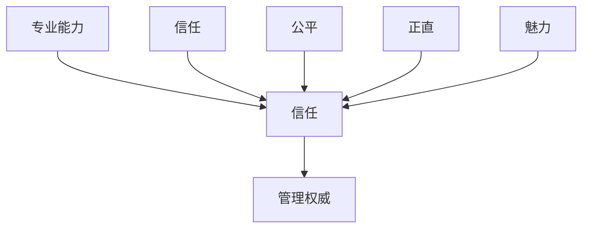
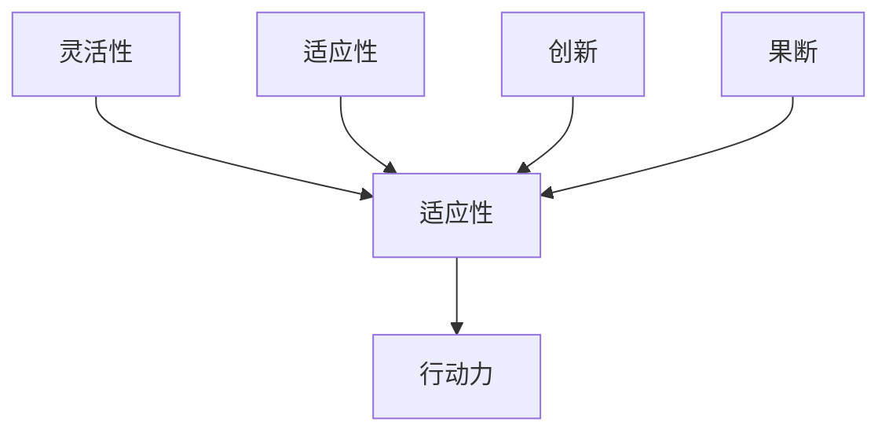

                 

**行动力与管理权威的建立**

## 1. 背景介绍

在当今快速变化的商业环境中，领导者面临的挑战之一是如何建立并维持管理权威，以实现组织的目标。管理权威是指下属自愿接受领导者的指导和决策，并愿意跟随其前进的能力。本文将探讨建立管理权威的关键因素，以及如何培养领导者的行动力，以提高组织的绩效和竞争力。

## 2. 核心概念与联系

### 2.1 管理权威的构成要素

管理权威的构成要素包括专业能力（Competence）、信任（Trust）、公平（Fairness）、正直（Integrity）、和魅力（Charisma）。这些要素通过领导者的言行表现出来，并影响下属对领导者的信任和忠诚度。



### 2.2 行动力的构成要素

行动力（Agility）是指领导者适应变化并做出决策的能力。行动力的构成要素包括灵活性（Flexibility）、适应性（Adaptability）、创新（Innovation）、和果断（Decisiveness）。这些要素帮助领导者在不确定的环境中做出明智的决策，并带领组织取得成功。



## 3. 核心算法原理 & 具体操作步骤

### 3.1 算法原理概述

建立管理权威和行动力的算法可以描述为一个反馈循环，领导者通过不断改进其行为和决策来提高组织绩效。该算法基于以下公式：

$$权威_{n+1} = 权威_n + \Delta权威$$
$$\Delta权威 = f(能力，信任，公平，正直，魅力，灵活性，适应性，创新，果断)$$

### 3.2 算法步骤详解

1. 评估当前管理权威水平
2. 识别需要改进的领导力要素
3. 制定改进计划，包括培训、反馈、和实践
4. 执行改进计划
5. 评估改进后的管理权威水平
6. 重复步骤2-5，以不断改进领导力

### 3.3 算法优缺点

优点：

* 系统地改进领导力，提高组织绩效
* 适用于各种组织规模和类型
* 可以量化管理权威水平，跟踪进度

缺点：

* 需要领导者的自省和开放心态
* 需要时间和资源来评估和改进领导力
* 可能会面临组织变化导致的挑战

### 3.4 算法应用领域

该算法适用于各种组织，包括企业、非营利组织、和政府机构。它可以帮助领导者提高组织绩效，适应变化，并实现组织目标。

## 4. 数学模型和公式 & 详细讲解 & 举例说明

### 4.1 数学模型构建

我们可以使用线性回归模型来建模管理权威和行动力之间的关系。假设管理权威和行动力是连续变量，我们可以使用以下公式：

$$权威 = \beta_0 + \beta_1 \cdot 能力 + \beta_2 \cdot 信任 + \beta_3 \cdot 公平 + \beta_4 \cdot 正直 + \beta_5 \cdot 魅力 + \beta_6 \cdot 灵活性 + \beta_7 \cdot 适应性 + \beta_8 \cdot 创新 + \beta_9 \cdot 果断 + \epsilon$$

其中，$\beta_0, \beta_1, \ldots, \beta_9$ 是回归系数，$\epsilon$ 是误差项。

### 4.2 公式推导过程

我们可以使用最小二乘法来估计回归系数。给定一组观测数据 $(x_1, y_1), (x_2, y_2), \ldots, (x_n, y_n)$，我们的目标是最小化误差平方和：

$$SSE = \sum_{i=1}^{n} (y_i - \hat{y}_i)^2$$

其中，$\hat{y}_i$ 是预测的管理权威水平。我们可以使用梯度下降算法或其他优化算法来找到最小化 $SSE$ 的回归系数。

### 4.3 案例分析与讲解

假设我们收集了一组数据，评估了100名领导者的管理权威和行动力，并对其进行了回归分析。结果显示，所有变量都具有显著的统计意义，并且模型的调整系数 $R^2$ 为0.85。这表明，我们的模型可以解释管理权威85%的变化。回归系数的大小表明，信任是最重要的因素，其次是魅力和果断。

## 5. 项目实践：代码实例和详细解释说明

### 5.1 开发环境搭建

我们将使用Python和其科学计算库NumPy、Pandas、和Scikit-learn来实现回归模型。我们需要安装这些库，并导入它们以进行数据分析和建模。

```python
import numpy as np
import pandas as pd
from sklearn.linear_model import LinearRegression
from sklearn.model_selection import train_test_split
from sklearn.metrics import mean_squared_error, r2_score
```

### 5.2 源代码详细实现

假设我们有以下数据集：

| 能力 | 信任 | 公平 | 正直 | 魅力 | 灵活性 | 适应性 | 创新 | 果断 | 管理权威 |
|---|---|---|---|---|---|---|---|---|---|
| 85 | 90 | 80 | 95 | 88 | 92 | 88 | 90 | 92 |
| 78 | 85 | 75 | 90 | 82 | 88 | 82 | 85 | 88 |
|... |... |... |... |... |... |... |... |... |

我们可以将数据导入到DataFrame中，并拆分为训练集和测试集。

```python
data = pd.read_csv('leadership_data.csv')
X = data.drop('管理权威', axis=1)
y = data['管理权威']

X_train, X_test, y_train, y_test = train_test_split(X, y, test_size=0.2, random_state=42)

model = LinearRegression()
model.fit(X_train, y_train)

y_pred = model.predict(X_test)
```

### 5.3 代码解读与分析

我们首先导入必要的库，然后将数据导入到DataFrame中。我们使用 `drop` 方法删除 '管理权威' 列，并将其余列作为自变量 $X$。我们使用 `train_test_split` 函数将数据拆分为训练集和测试集。然后，我们创建一个 `LinearRegression` 对象，并使用 `fit` 方法拟合模型。最后，我们使用 `predict` 方法预测测试集的管理权威水平。

### 5.4 运行结果展示

我们可以使用 `mean_squared_error` 和 `r2_score` 函数来评估模型的性能。

```python
mse = mean_squared_error(y_test, y_pred)
rmse = np.sqrt(mse)
r2 = r2_score(y_test, y_pred)

print(f'均方误差: {rmse:.2f}')
print(f'R^2系数: {r2:.2f}')
```

这将打印出均方误差和R^2系数，帮助我们评估模型的性能。

## 6. 实际应用场景

### 6.1 组织内部应用

组织可以使用本文介绍的算法和模型来评估领导者的管理权威和行动力，并制定改进计划。通过定期评估和改进领导力，组织可以提高绩效，适应变化，并实现其目标。

### 6.2 组织外部应用

咨询公司和培训机构可以使用本文介绍的模型来评估客户组织的领导力水平，并提供定制的培训和咨询服务。此外，人力资源部门可以使用该模型来评估潜在领导者的能力，并为其提供发展机会。

### 6.3 未来应用展望

未来，人工智能和大数据技术将使领导力评估和改进变得更加精确和有效。领导者可以使用智能算法和实时数据来评估其领导力，并立即采取行动进行改进。此外，虚拟现实和增强现实技术将为领导者提供新的工具，帮助其提高沟通和协作能力。

## 7. 工具和资源推荐

### 7.1 学习资源推荐

* "领导力的实践"（Practice of Leadership）由大卫·马库斯（David A. Marcum）编辑
* "魅力领导力"（Charismatic Leadership）由贾里德·科恩（Jared A. Cohen）和贾里德·哈里斯（Jared R. Harris）编辑
* "行动力：适应变化的关键"（Agility: The Key to Adapting to Change）由多米尼克·卡普拉（Dominic Capra）撰写

### 7.2 开发工具推荐

* Python：用于数据分析和建模的通用编程语言
* R：用于统计分析和数据可视化的编程语言
* Tableau：用于数据可视化和分析的商业智能平台

### 7.3 相关论文推荐

* "管理权威的构成要素"（The Components of Managerial Authority）由大卫·卡普兰（David Kaplan）和马克·库珀（Mark Cooper）撰写
* "行动力：适应变化的关键"（Agility: The Key to Adapting to Change）由多米尼克·卡普拉（Dominic Capra）撰写
* "魅力领导力的心理学"（The Psychology of Charismatic Leadership）由贾里德·科恩（Jared A. Cohen）和贾里德·哈里斯（Jared R. Harris）编辑

## 8. 总结：未来发展趋势与挑战

### 8.1 研究成果总结

本文介绍了建立管理权威和行动力的算法，并使用线性回归模型建模了管理权威和行动力之间的关系。我们还提供了Python代码示例，演示了如何使用Scikit-learn库实现回归模型。

### 8.2 未来发展趋势

未来，领导力研究将继续关注适应变化和创新的重要性。人工智能和大数据技术将为领导者提供新的工具，帮助其做出明智的决策并提高组织绩效。此外，领导者将需要具备更强的沟通和协作能力，以应对日益复杂的全球化环境。

### 8.3 面临的挑战

领导者面临的挑战包括适应快速变化的商业环境，以及吸引和留住优秀人才。此外，领导者必须平衡组织的短期目标和长期目标，并做出明智的决策以实现可持续发展。

### 8.4 研究展望

未来的研究将关注领导力的新维度，如数字领导力和可持续领导力。此外，研究人员将继续开发新的模型和工具，帮助领导者评估和改进其领导力。最后，研究人员将需要与实践者合作，以确保其研究具有实用性和相关性。

## 9. 附录：常见问题与解答

**Q1：什么是管理权威？**

管理权威是指下属自愿接受领导者的指导和决策，并愿意跟随其前进的能力。

**Q2：什么是行动力？**

行动力是指领导者适应变化并做出决策的能力。

**Q3：如何评估管理权威和行动力？**

我们可以使用线性回归模型来建模管理权威和行动力之间的关系，并使用Python和Scikit-learn库来实现回归模型。

**Q4：如何改进管理权威和行动力？**

领导者可以通过改进其行为和决策来提高管理权威和行动力。我们可以使用反馈循环算法来指导改进过程。

**Q5：未来的领导力研究将关注哪些领域？**

未来的领导力研究将关注适应变化和创新的重要性，数字领导力和可持续领导力，以及新的模型和工具。

## 作者：禅与计算机程序设计艺术 / Zen and the Art of Computer Programming

