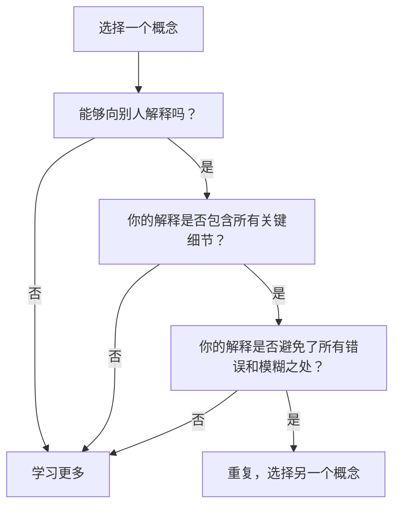

                 

## 1. 背景介绍

在计算机科学领域，掌握和理解复杂概念是一项持续的挑战。理查德·费曼（Richard Feynman），一位伟大的物理学家，提出了费曼提问法（Feynman Technique），帮助我们更好地理解和记忆复杂的主题。本文将探讨如何在计算机科学领域应用费曼提问法，以提升我们的思考力和对复杂概念的掌握。

## 2. 核心概念与联系

费曼提问法的核心是回答三个问题：

1. **能够向别人解释吗？** 如果你能够用简单易懂的方式向别人解释一个概念，说明你已经理解并掌握了这个概念。
2. **你的解释是否包含所有关键细节？** 确保你的解释涵盖了所有重要的细节，没有遗漏任何关键信息。
3. **你的解释是否避免了所有错误和模糊之处？** 确保你的解释是准确无误的，没有任何错误或模糊之处。

下面是费曼提问法的 Mermaid 流程图：



## 3. 核心算法原理 & 具体操作步骤

### 3.1 算法原理概述

费曼提问法的原理是通过教别人来学习和理解。当我们试图解释一个概念时，我们会发现自己的理解有多么薄弱。通过不断地解释和修正，我们可以加深对概念的理解。

### 3.2 算法步骤详解

1. 选择一个复杂的概念。
2. 尝试用简单易懂的方式解释这个概念。
3. 检查你的解释是否包含所有关键细节。
4. 确保你的解释是准确无误的，没有任何错误或模糊之处。
5. 重复这个过程，直到你能够完美地解释这个概念为止。
6. 选择另一个概念，重复整个过程。

### 3.3 算法优缺点

**优点：**

- 有助于加深对复杂概念的理解。
- 可以帮助我们发现自己理解中的漏洞和错误。
- 可以提高我们的沟通能力。

**缺点：**

- 需要花费大量时间和精力。
- 可能会导致过度简化复杂概念，从而遗漏关键细节。

### 3.4 算法应用领域

费曼提问法可以应用于任何需要理解复杂概念的领域，在计算机科学领域，它可以用于学习算法、数据结构、编程语言等。

## 4. 数学模型和公式 & 详细讲解 & 举例说明

### 4.1 数学模型构建

费曼提问法的数学模型可以表示为：

$$U(c) = f(I(c), E(c), R(c))$$

其中，$U(c)$表示对概念$c$的理解，$I(c)$表示对概念$c$的解释，$E(c)$表示解释是否包含所有关键细节，$R(c)$表示解释是否避免了所有错误和模糊之处。

### 4.2 公式推导过程

费曼提问法的目的是最大化对概念的理解$U(c)$. 通过改进解释$I(c)$, 并确保解释包含所有关键细节$E(c)$和避免所有错误和模糊之处$R(c)$, 我们可以提高对概念的理解。

### 4.3 案例分析与讲解

例如，假设我们想要理解二叉搜索树（Binary Search Tree，BST）。我们可以尝试解释它，并检查我们的解释是否包含所有关键细节（例如，左子树的值小于根节点的值，右子树的值大于根节点的值），并确保我们的解释是准确无误的。

## 5. 项目实践：代码实例和详细解释说明

### 5.1 开发环境搭建

为了实践费曼提问法，我们需要一个简单的开发环境。我们将使用Python作为编程语言，并使用Jupyter Notebook作为开发环境。

### 5.2 源代码详细实现

以下是一个简单的二叉搜索树实现，我们将使用费曼提问法来理解和改进它：

```python
class Node:
    def __init__(self, key):
        self.left = None
        self.right = None
        self.val = key

def insert(root, key):
    if root is None:
        return Node(key)
    else:
        if root.val < key:
            root.right = insert(root.right, key)
        else:
            root.left = insert(root.left, key)
    return root
```

### 5.3 代码解读与分析

我们可以尝试解释这个代码，并检查我们的解释是否包含所有关键细节（例如，插入操作如何保持二叉搜索树的性质），并确保我们的解释是准确无误的。

### 5.4 运行结果展示

通过运行这个代码，我们可以插入一些值，并检查二叉搜索树是否保持了其性质。

## 6. 实际应用场景

费曼提问法可以应用于任何需要理解复杂概念的场景。例如，在学习新的编程语言时，我们可以尝试解释语言的特性，并检查我们的解释是否包含所有关键细节和没有错误。

### 6.4 未来应用展望

随着计算机科学领域的不断发展，新的概念和技术不断涌现。费曼提问法可以帮助我们理解和掌握这些新概念，从而提高我们的竞争力。

## 7. 工具和资源推荐

### 7.1 学习资源推荐

- [费曼提问法](https://www.farnamstreetblog.com/2016/02/feynman-technique/) - Farnam Street Blog
- [费曼提问法：如何更好地学习](https://www.lesswrong.com/posts/7Q89zZ9596XZ94j72/feynman-technique-how-to-learn-better) - LessWrong

### 7.2 开发工具推荐

- [Jupyter Notebook](https://jupyter.org/) - 一个交互式计算环境，支持Python和其他编程语言。
- [Visual Studio Code](https://code.visualstudio.com/) - 一个强大的代码编辑器，支持Python和其他编程语言。

### 7.3 相关论文推荐

- [The Feynman Technique: The Art of Learning](https://www.researchgate.net/publication/261953458_The_Feynman_Technique_The_Art_of_Learning) - Scott H. Young

## 8. 总结：未来发展趋势与挑战

### 8.1 研究成果总结

费曼提问法是一种有效的学习和理解复杂概念的方法。它可以帮助我们发现自己理解中的漏洞和错误，从而加深对概念的理解。

### 8.2 未来发展趋势

随着计算机科学领域的不断发展，新的概念和技术不断涌现。费曼提问法可以帮助我们理解和掌握这些新概念，从而提高我们的竞争力。

### 8.3 面临的挑战

费曼提问法需要花费大量时间和精力。如何在有限的时间内有效地应用费曼提问法是一个挑战。

### 8.4 研究展望

未来的研究可以探讨如何将费曼提问法与其他学习方法结合，从而提高学习效率。此外，研究可以探讨如何将费曼提问法应用于特定的学习领域，从而提高学习效果。

## 9. 附录：常见问题与解答

**Q：费曼提问法需要花费大量时间吗？**

**A：**是的，费曼提问法需要花费大量时间。但是，它可以帮助我们更好地理解和掌握复杂概念，从长远来看，它可以节省我们的时间和精力。

**Q：费曼提问法适合所有学习领域吗？**

**A：**费曼提问法可以应用于任何需要理解复杂概念的学习领域。但是，它可能不适合需要大量记忆的学习领域，因为它侧重于理解而不是记忆。

**Q：如何在有限的时间内有效地应用费曼提问法？**

**A：**一个有效的方法是将费曼提问法与其他学习方法结合，例如，先阅读相关文献，然后使用费曼提问法来理解和改进自己的理解。

## 作者：禅与计算机程序设计艺术 / Zen and the Art of Computer Programming

