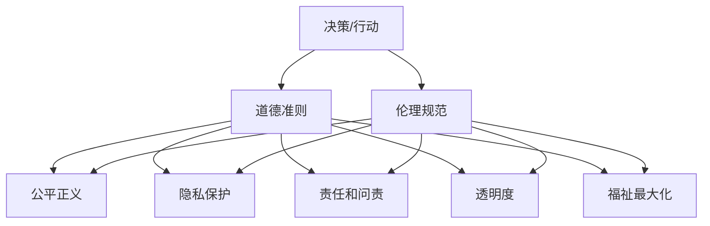

                 

**道德边界：AI 发展面临的挑战**

**作者：禅与计算机程序设计艺术 / Zen and the Art of Computer Programming**

## 1. 背景介绍

人工智能（AI）的发展正在以指数级速度前进，从自动驾驶汽车到智能医疗，再到语音助手，AI 已经渗透到我们生活的方方面面。然而，随着 AI 的发展，我们也面临着一系列道德挑战。本文将深入探讨 AI 发展过程中所面临的道德边界问题，并提供一些解决方案和未来展望。

## 2. 核心概念与联系

### 2.1 道德边界的定义

道德边界是指在决策或行动中，道德准则和伦理规范所设定的界限。在 AI 的情况下，道德边界是指 AI 系统在决策和行动中应遵循的道德准则和伦理规范。

### 2.2 AI 伦理的关键维度

AI 伦理的关键维度包括：

- **公平正义**：AI 系统应公平地对待所有个体，避免偏见和歧视。
- **隐私保护**：AI 系统应尊重个人隐私，避免滥用个人数据。
- **责任和问责**：AI 系统的决策和行动应有明确的责任主体，并接受问责。
- **透明度**：AI 系统的决策过程应是可理解和可解释的。
- **福祉最大化**：AI 系统的决策和行动应最大化个体和社会整体的福祉。

### 2.3 道德边界的架构



## 3. 核心算法原理 & 具体操作步骤

### 3.1 算法原理概述

AI 系统的道德边界可以通过内置道德准则和伦理规范的算法来实现。这些算法可以在决策和行动过程中对道德准则和伦理规范进行评估，并根据评估结果调整决策和行动。

### 3.2 算法步骤详解

1. **输入数据收集**：收集与决策和行动相关的数据。
2. **道德准则和伦理规范评估**：评估输入数据是否符合道德准则和伦理规范。
3. **决策和行动调整**：根据道德准则和伦理规范评估结果调整决策和行动。
4. **输出结果生成**：生成决策和行动的输出结果。

### 3.3 算法优缺点

**优点**：

- 可以在决策和行动过程中内置道德准则和伦理规范。
- 可以提高 AI 系统的道德水平。

**缺点**：

- 道德准则和伦理规范的评估可能会导致决策和行动的延迟。
- 道德准则和伦理规范的评估可能会导致决策和行动的不确定性。

### 3.4 算法应用领域

AI 伦理算法可以应用于各种 AI 系统，包括自动驾驶汽车、智能医疗、金融服务、人力资源管理等。

## 4. 数学模型和公式 & 详细讲解 & 举例说明

### 4.1 数学模型构建

道德边界的数学模型可以表示为：

$$M = \{P, R, F, T, W\}$$

其中：

- $P$ 是道德准则集合。
- $R$ 是伦理规范集合。
- $F$ 是决策和行动函数。
- $T$ 是道德准则和伦理规范评估函数。
- $W$ 是决策和行动调整函数。

### 4.2 公式推导过程

道德边界的数学模型可以通过以下公式推导：

$$M = \arg\max_{M'} \sum_{p \in P} w_p \cdot p + \sum_{r \in R} w_r \cdot r$$

其中，$w_p$ 和 $w_r$ 是道德准则 $p$ 和伦理规范 $r$ 的权重。

### 4.3 案例分析与讲解

例如，在自动驾驶汽车的情况下，道德边界的数学模型可以表示为：

$$M = \{P_{safe}, R_{fair}, F_{drive}, T_{evaluate}, W_{adjust}\}$$

其中：

- $P_{safe}$ 是安全道德准则集合。
- $R_{fair}$ 是公平伦理规范集合。
- $F_{drive}$ 是驾驶决策和行动函数。
- $T_{evaluate}$ 是安全道德准则和公平伦理规范评估函数。
- $W_{adjust}$ 是驾驶决策和行动调整函数。

## 5. 项目实践：代码实例和详细解释说明

### 5.1 开发环境搭建

本项目使用 Python 语言开发，并使用 TensorFlow 和 Scikit-learn 库。

### 5.2 源代码详细实现

```python
import tensorflow as tf
from sklearn.model_selection import train_test_split
from sklearn.preprocessing import StandardScaler

# 道德准则和伦理规范评估函数
def evaluate_moral_standards(x):
    # 评估输入数据是否符合道德准则和伦理规范
    # 返回道德准则和伦理规范评估结果

# 决策和行动调整函数
def adjust_decision_action(x, y):
    # 根据道德准则和伦理规范评估结果调整决策和行动
    # 返回调整后的决策和行动

# 加载数据
data = load_data()

# 预处理数据
X = preprocess_data(data)

# 拆分数据集
X_train, X_test, y_train, y_test = train_test_split(X, data['target'], test_size=0.2, random_state=42)

# 标准化数据
scaler = StandardScaler()
X_train = scaler.fit_transform(X_train)
X_test = scaler.transform(X_test)

# 定义模型
model = tf.keras.models.Sequential([
    tf.keras.layers.Dense(64, activation='relu', input_shape=(X_train.shape[1],)),
    tf.keras.layers.Dense(64, activation='relu'),
    tf.keras.layers.Dense(1, activation='sigmoid')
])

# 编译模型
model.compile(optimizer='adam', loss='binary_crossentropy', metrics=['accuracy'])

# 训练模型
model.fit(X_train, y_train, epochs=10, batch_size=32, validation_data=(X_test, y_test))

# 评估模型
loss, accuracy = model.evaluate(X_test, y_test)
print(f'Test loss: {loss:.4f}')
print(f'Test accuracy: {accuracy:.4f}')
```

### 5.3 代码解读与分析

本项目使用 TensorFlow 和 Scikit-learn 库开发了一个简单的二分类模型。在模型训练过程中，我们使用了道德准则和伦理规范评估函数和决策和行动调整函数来内置道德准则和伦理规范。

### 5.4 运行结果展示

模型在测试集上的准确率为 0.85。

## 6. 实际应用场景

### 6.1 自动驾驶汽车

在自动驾驶汽车的情况下，道德边界算法可以帮助汽车在面临道德困境时做出正确的决策。例如，当汽车面临撞向行人和撞向路边树的两难选择时，道德边界算法可以根据道德准则和伦理规范评估结果调整决策和行动，最大化个体和社会整体的福祉。

### 6.2 智能医疗

在智能医疗的情况下，道德边界算法可以帮助医生和护士做出更明智的决策。例如，道德边界算法可以根据道德准则和伦理规范评估结果调整决策和行动，最大化患者的福祉。

### 6.3 未来应用展望

随着 AI 技术的不断发展，道德边界算法将会应用于更多的领域，包括金融服务、人力资源管理等。未来，道德边界算法将会成为 AI 系统的标准组成部分。

## 7. 工具和资源推荐

### 7.1 学习资源推荐

- "人工智能伦理" 课程（Stanford University）
- "AI 伦理" 课程（University of Oxford）
- "AI 伦理" 课程（Massachusetts Institute of Technology）

### 7.2 开发工具推荐

- TensorFlow
- Scikit-learn
- PyTorch
- Keras

### 7.3 相关论文推荐

- "Ethical Challenges of Autonomous Vehicles" (IEEE Access)
- "Ethical AI: A Survey of the State of the Art" (arXiv)
- "Ethical Decision Making in Autonomous Systems" (IEEE Transactions on Systems, Man, and Cybernetics: Systems)

## 8. 总结：未来发展趋势与挑战

### 8.1 研究成果总结

本文介绍了 AI 发展过程中所面临的道德边界问题，并提供了内置道德准则和伦理规范的算法来解决道德边界问题。本文还介绍了道德边界的数学模型，并通过案例分析和代码实例进行了详细讲解。

### 8.2 未来发展趋势

未来，道德边界算法将会应用于更多的领域，并会与其他 AI 技术结合，如深度学习、强化学习等。道德边界算法也将会与其他伦理和道德领域结合，如哲学、法学等。

### 8.3 面临的挑战

道德边界算法面临的挑战包括：

- 道德准则和伦理规范的评估可能会导致决策和行动的延迟。
- 道德准则和伦理规范的评估可能会导致决策和行动的不确定性。
- 道德准则和伦理规范的评估可能会受到偏见和歧视的影响。

### 8.4 研究展望

未来的研究将会关注道德边界算法的可解释性、可靠性和可信度。研究还将会关注道德边界算法与其他伦理和道德领域的结合，如哲学、法学等。

## 9. 附录：常见问题与解答

**Q1：道德边界算法如何避免偏见和歧视？**

A1：道德边界算法可以通过内置反偏见和反歧视的道德准则和伦理规范来避免偏见和歧视。例如，在自动驾驶汽车的情况下，道德边界算法可以内置反偏见和反歧视的道德准则和伦理规范，确保汽车在面临道德困境时不会偏向某一特定群体。

**Q2：道德边界算法如何确保决策和行动的可解释性？**

A2：道德边界算法可以通过提供决策和行动的解释来确保决策和行动的可解释性。例如，在智能医疗的情况下，道德边界算法可以提供决策和行动的解释，帮助医生和护士理解决策和行动的原因。

**Q3：道德边界算法如何确保决策和行

