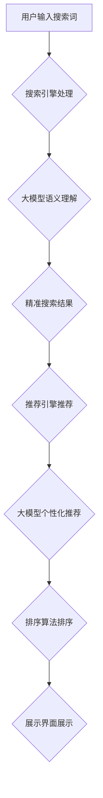

                 

## AI 大模型在搜索推荐系统中的融合技术：电商平台的算法本质探索

> 关键词：大模型、搜索推荐、电商平台、算法融合、自然语言处理、深度学习、推荐系统

## 1. 背景介绍

在当今数据爆炸的时代，电商平台面临着海量商品和用户需求的挑战。如何精准推荐用户感兴趣的商品，提升用户体验和转化率，成为电商平台的核心竞争力。传统的搜索推荐系统主要依赖于基于规则和基于内容的算法，但这些方法难以捕捉用户行为的复杂性和商品属性的多样性。近年来，大模型技术在自然语言处理、计算机视觉等领域取得了突破性进展，为搜索推荐系统的优化提供了新的思路。

大模型，指的是参数规模庞大、训练数据海量的人工智能模型。其强大的学习能力和泛化能力使其能够更好地理解用户需求和商品特征，从而实现更精准的推荐。将大模型与搜索推荐系统融合，可以有效提升推荐系统的准确性、个性化程度和用户体验。

## 2. 核心概念与联系

### 2.1 搜索推荐系统

搜索推荐系统是电商平台的核心功能之一，旨在帮助用户快速找到所需商品。它通常由以下几个模块组成：

* **搜索引擎:** 处理用户搜索词，并返回相关商品列表。
* **推荐引擎:** 基于用户行为、商品属性等信息，推荐用户可能感兴趣的商品。
* **排序算法:** 对搜索结果和推荐结果进行排序，展示最相关的商品。
* **展示界面:** 将搜索结果和推荐结果以用户友好的方式展示。

### 2.2 大模型

大模型是指参数规模庞大、训练数据海量的人工智能模型。其强大的学习能力和泛化能力使其能够更好地理解用户需求和商品特征。常见的代表性大模型包括：

* **BERT:** 基于Transformer架构的预训练语言模型，擅长理解自然语言文本。
* **GPT-3:** 基于Transformer架构的文本生成模型，能够生成高质量的文本内容。
* **DALL-E 2:** 基于Transformer架构的图像生成模型，能够根据文本描述生成逼真的图像。

### 2.3 融合技术

将大模型与搜索推荐系统融合，可以提升推荐系统的准确性、个性化程度和用户体验。常见的融合技术包括：

* **大模型增强搜索:** 使用大模型对用户搜索词进行语义理解，并生成更精准的搜索结果。
* **大模型驱动推荐:** 使用大模型学习用户行为和商品特征，并生成个性化的商品推荐。
* **大模型辅助排序:** 使用大模型对搜索结果和推荐结果进行排序，提升排序效果。

**Mermaid 流程图**



## 3. 核心算法原理 & 具体操作步骤

### 3.1 算法原理概述

大模型在搜索推荐系统中的融合主要基于以下核心算法原理：

* **深度学习:** 大模型通常基于深度学习架构，例如Transformer，能够学习用户行为和商品特征之间的复杂关系。
* **预训练与微调:** 大模型通常先进行预训练，然后根据特定任务进行微调，例如搜索推荐。
* **嵌入式表示:** 将用户、商品等实体转换为向量表示，方便模型进行计算和学习。
* **注意力机制:** 允许模型关注输入序列中的重要部分，提高模型的理解能力。

### 3.2 算法步骤详解

将大模型与搜索推荐系统融合的具体操作步骤如下：

1. **数据预处理:** 收集用户行为数据、商品属性数据等，并进行清洗、转换、编码等预处理操作。
2. **大模型预训练:** 使用预训练模型，例如BERT，在海量文本数据上进行预训练，学习语言表示能力。
3. **模型微调:** 根据搜索推荐任务，对预训练模型进行微调，例如使用用户行为数据训练推荐模型。
4. **特征提取:** 使用大模型提取用户、商品等实体的嵌入式表示。
5. **模型融合:** 将大模型生成的嵌入式表示与传统搜索推荐算法结合，例如使用大模型生成的商品嵌入式表示作为传统推荐算法的输入。
6. **结果评估:** 使用指标，例如点击率、转化率等，评估融合模型的性能。

### 3.3 算法优缺点

**优点:**

* **提升推荐准确性:** 大模型能够更好地理解用户需求和商品特征，从而生成更精准的推荐。
* **增强个性化程度:** 大模型可以学习用户的个性化偏好，生成更个性化的推荐。
* **提升用户体验:** 更精准、更个性化的推荐可以提升用户体验，提高用户粘性。

**缺点:**

* **计算资源消耗大:** 大模型训练和推理需要大量的计算资源。
* **数据依赖性强:** 大模型的性能依赖于训练数据的质量和数量。
* **可解释性差:** 大模型的决策过程难以解释，难以进行调试和优化。

### 3.4 算法应用领域

大模型在搜索推荐系统中的融合技术应用于多个领域，例如：

* **电商平台:** 推荐商品、个性化营销、搜索结果优化。
* **社交媒体:** 推荐好友、推荐内容、个性化广告。
* **新闻平台:** 推荐新闻、个性化订阅、搜索结果优化。
* **教育平台:** 推荐学习资源、个性化学习路径、搜索结果优化。

## 4. 数学模型和公式 & 详细讲解 & 举例说明

### 4.1 数学模型构建

大模型在搜索推荐系统中的融合通常基于以下数学模型：

* **用户-商品交互矩阵:** 使用矩阵表示用户和商品之间的交互关系，例如用户点击、购买等行为。
* **嵌入式表示模型:** 将用户、商品等实体转换为向量表示，方便模型进行计算和学习。
* **推荐模型:** 使用机器学习算法，例如深度神经网络，学习用户-商品交互矩阵，并预测用户对商品的兴趣。

### 4.2 公式推导过程

例如，使用协同过滤算法进行推荐，其核心公式如下：

$$
r_{ui} = \frac{\sum_{j \in N(u)} \frac{s_{uj} \cdot s_{ij}}{\sum_{k \in N(u)} s_{uk}^2}}{\sum_{j \in N(u)} \frac{s_{uj}^2}{\sum_{k \in N(u)} s_{uk}^2}}
$$

其中：

* $r_{ui}$ 表示用户 $u$ 对商品 $i$ 的评分。
* $s_{uj}$ 表示用户 $u$ 对商品 $j$ 的评分。
* $N(u)$ 表示与用户 $u$ 有交互关系的商品集合。

### 4.3 案例分析与讲解

例如，假设用户 $A$ 和用户 $B$ 都购买了商品 $X$ 和商品 $Y$，并且对商品 $X$ 的评分都较高。根据协同过滤算法，可以推测用户 $A$ 和用户 $B$ 可能对商品 $Z$ 也感兴趣，因为商品 $Z$ 与商品 $X$ 和商品 $Y$ 有相似性。

## 5. 项目实践：代码实例和详细解释说明

### 5.1 开发环境搭建

* **操作系统:** Ubuntu 20.04
* **编程语言:** Python 3.8
* **深度学习框架:** TensorFlow 2.0
* **其他工具:** Git, Jupyter Notebook

### 5.2 源代码详细实现

```python
import tensorflow as tf

# 定义用户-商品交互矩阵
user_item_matrix = tf.constant([
    [1, 0, 1, 0],
    [0, 1, 1, 1],
    [1, 1, 0, 1],
    [0, 1, 0, 0]
])

# 定义嵌入式表示模型
user_embedding = tf.keras.layers.Embedding(input_dim=4, output_dim=16)
item_embedding = tf.keras.layers.Embedding(input_dim=4, output_dim=16)

# 定义推荐模型
def recommend_model(user_id, item_id):
    user_embedding_vector = user_embedding(tf.constant([user_id]))
    item_embedding_vector = item_embedding(tf.constant([item_id]))
    similarity = tf.reduce_sum(user_embedding_vector * item_embedding_vector)
    return similarity

# 使用模型进行推荐
user_id = 0
item_id = 3
similarity = recommend_model(user_id, item_id)
print(f"用户 {user_id} 对商品 {item_id} 的相似度: {similarity}")
```

### 5.3 代码解读与分析

* 代码首先定义了用户-商品交互矩阵，表示用户对商品的评分。
* 然后定义了嵌入式表示模型，将用户和商品转换为向量表示。
* 接着定义了推荐模型，使用用户和商品的嵌入式表示计算相似度。
* 最后使用模型进行推荐，并输出用户对商品的相似度。

### 5.4 运行结果展示

运行代码后，会输出用户对商品的相似度。例如，如果用户 $0$ 对商品 $3$ 的相似度为 $0.8$，则表示用户 $0$ 可能对商品 $3$ 感兴趣。

## 6. 实际应用场景

### 6.1 电商平台商品推荐

大模型在电商平台商品推荐场景中的应用非常广泛，例如：

* **个性化商品推荐:** 根据用户的浏览历史、购买记录、收藏列表等信息，推荐用户可能感兴趣的商品。
* **新品推荐:** 推荐平台上最新的商品，吸引用户关注。
* **关联推荐:** 根据用户购买的商品，推荐与之相关的商品。
* **跨界推荐:** 根据用户的兴趣爱好，推荐跨界领域的商品。

### 6.2 搜索结果优化

大模型可以帮助提升搜索结果的准确性和相关性，例如：

* **语义理解:** 大模型可以理解用户搜索词的语义，并返回更相关的搜索结果。
* **结果排序:** 大模型可以根据用户搜索词和用户行为等信息，对搜索结果进行排序，展示最相关的结果。
* **搜索建议:** 大模型可以根据用户输入的搜索词，提供搜索建议，帮助用户更快速地找到所需信息。

### 6.3 内容推荐

大模型可以用于推荐新闻、视频、文章等内容，例如：

* **个性化内容推荐:** 根据用户的阅读历史、观看记录、点赞等信息，推荐用户可能感兴趣的内容。
* **热点内容推荐:** 推荐平台上最新的热点内容，吸引用户关注。
* **内容分类:** 大模型可以根据内容的主题和内容类型，进行分类，方便用户查找。

### 6.4 未来应用展望

大模型在搜索推荐系统中的融合技术还存在着巨大的发展潜力，未来可能应用于以下领域：

* **多模态推荐:** 将文本、图像、音频等多模态数据融合，进行更精准的推荐。
* **实时推荐:** 基于用户的实时行为，进行实时推荐，提升用户体验。
* **个性化广告:** 基于用户的兴趣爱好和行为特征，进行个性化广告推荐。

## 7. 工具和资源推荐

### 7.1 学习资源推荐

* **书籍:**
    * 《深度学习》 - Ian Goodfellow, Yoshua Bengio, Aaron Courville
    * 《自然语言处理》 - Jurafsky, Martin
* **在线课程:**
    * Coursera: 深度学习 Specialization
    * Udacity: 自然语言处理 Nanodegree
* **博客:**
    * The Gradient
    * Towards Data Science

### 7.2 开发工具推荐

* **深度学习框架:** TensorFlow, PyTorch
* **自然语言处理库:** NLTK, spaCy
* **数据处理工具:** Pandas, NumPy

### 7.3 相关论文推荐

* BERT: Pre-training of Deep Bidirectional Transformers for Language Understanding
* GPT-3: Language Models are Few-Shot Learners
* DALL-E 2: Hierarchical Text-Conditional Image Generation with CLIP Latents

## 8. 总结：未来发展趋势与挑战

### 8.1 研究成果总结

大模型在搜索推荐系统中的融合技术取得了显著的成果，提升了推荐系统的准确性、个性化程度和用户体验。

### 8.2 未来发展趋势

未来，大模型在搜索推荐系统中的融合技术将朝着以下方向发展：

* **模型规模更大:** 参数规模更大的大模型将能够学习更复杂的知识和关系，提升推荐效果。
* **多模态融合:** 将文本、图像、音频等多模态数据融合，进行更精准的推荐。
* **实时推荐:** 基于用户的实时行为，进行实时推荐，提升用户体验。
* **可解释性增强:** 研究大模型的决策过程，提高模型的可解释性。

### 8.3 面临的挑战

大模型在搜索推荐系统中的融合技术也面临着一些挑战：

* **计算资源消耗大:** 训练和推理大模型需要大量的计算资源，成本较高。
* **数据依赖性强:** 大模型的性能依赖于训练数据的质量和数量，数据获取和处理难度较大。
* **可解释性差:** 大模型的决策过程难以解释，难以进行调试和优化。

### 8.4 研究展望

未来，需要进一步研究大模型的训练方法、模型架构、数据处理方法等，以解决大模型在搜索推荐系统中的融合技术面临的挑战，并推动该技术的进一步发展。

## 9. 附录：常见问题与解答

**Q1: 大模型的训练需要多少数据？**

A1: 大模型的训练需要海量数据，通常需要数十亿甚至数千亿个数据点。

**Q2: 如何评估大模型的性能？**

A2: 大模型的性能通常使用指标，例如准确率、召回率、F1-score等进行评估。

**Q3: 如何解释大模型的决策过程？**

A3: 研究大模型的决策过程是一个活跃的研究方向，目前还没有完美的解决方案。一些方法包括：

* **注意力机制分析:** 分析大模型在处理输入数据时，哪些部分受到关注。
* **特征重要性分析:** 分析哪些特征对大模型的决策结果影响最大。
* **模型可视化:** 使用可视化工具，展示大模型的内部结构和决策过程。


作者：禅与计算机程序设计艺术 / Zen and the Art of Computer Programming<end_of_turn>

