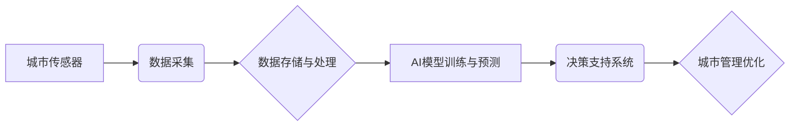

                 

## AI与人类计算：打造可持续发展的城市

> 关键词：人工智能、城市计算、可持续发展、数据驱动、优化算法、机器学习、深度学习、城市规划、智能交通、环境监测

## 1. 背景介绍

全球人口持续增长和城市化进程加速，城市面临着日益严峻的挑战，包括资源短缺、环境污染、交通拥堵、社会不公等。传统城市规划和管理模式难以有效应对这些挑战，迫切需要新的理念和技术来构建更加可持续、宜居的城市。

人工智能（AI）作为一门新兴技术，正在深刻地改变着城市发展模式。AI能够通过学习和分析海量数据，识别城市运行中的复杂模式和趋势，并提供数据驱动的决策支持，从而帮助城市优化资源配置、提升服务效率、降低环境影响，最终实现可持续发展目标。

## 2. 核心概念与联系

**2.1 城市计算**

城市计算是指利用计算技术对城市数据进行收集、分析、处理和应用，以提升城市管理效率、优化城市运行和服务，最终实现城市可持续发展。

**2.2 人工智能**

人工智能是指模拟人类智能行为的计算机系统，包括学习、推理、决策、感知和语言理解等能力。

**2.3 AI与城市计算的融合**

AI与城市计算的融合，将赋予城市更强大的智能化能力。AI可以帮助城市计算系统更好地理解城市运行的复杂性，并提供更精准、更有效的决策支持。

**2.4 架构图**



## 3. 核心算法原理 & 具体操作步骤

**3.1 算法原理概述**

在AI与城市计算的融合中，常用的算法包括机器学习、深度学习、强化学习等。这些算法能够帮助城市计算系统从海量数据中学习城市运行规律，并预测未来趋势，从而为城市管理决策提供支持。

**3.2 算法步骤详解**

以机器学习为例，其基本步骤包括：

1. 数据收集：收集城市运行相关的各种数据，例如交通流量、能源消耗、环境监测数据等。
2. 数据预处理：对收集到的数据进行清洗、转换和特征工程，使其适合机器学习算法的训练。
3. 模型选择：根据具体应用场景选择合适的机器学习算法，例如回归算法、分类算法、聚类算法等。
4. 模型训练：利用训练数据对选定的机器学习模型进行训练，使其能够学习城市运行的规律。
5. 模型评估：利用测试数据对训练好的模型进行评估，并根据评估结果进行模型调优。
6. 模型部署：将训练好的模型部署到实际应用场景中，用于预测城市运行趋势或提供决策支持。

**3.3 算法优缺点**

**优点：**

* 数据驱动：基于海量数据进行分析和预测，能够提供更精准、更有效的决策支持。
* 自动化：能够自动学习和优化城市运行模式，提高效率和降低成本。
* 可扩展性：能够根据城市规模和需求进行扩展和升级。

**缺点：**

* 数据依赖：算法的性能取决于数据的质量和数量。
* 黑盒效应：一些复杂的机器学习算法难以解释其决策过程，导致缺乏透明度。
* 伦理风险：AI算法可能存在偏见或歧视，需要进行伦理审查和监管。

**3.4 算法应用领域**

* 智能交通：预测交通流量、优化交通信号灯控制、辅助驾驶决策。
* 环境监测：监测空气质量、水质、噪音等环境指标，预警环境污染风险。
* 城市规划：分析城市人口分布、土地利用、基础设施需求等，优化城市规划方案。
* 公共服务：优化公共资源配置、预测服务需求、提高服务效率。

## 4. 数学模型和公式 & 详细讲解 & 举例说明

**4.1 数学模型构建**

在AI与城市计算的融合中，常用的数学模型包括线性回归模型、逻辑回归模型、支持向量机模型、神经网络模型等。这些模型能够将城市运行数据映射到相应的预测结果或决策变量。

**4.2 公式推导过程**

以线性回归模型为例，其目标是找到一条直线，使得预测值与实际值之间的误差最小。

假设城市交通流量 $y$ 与时间 $x$ 的关系可以用线性回归模型表示：

$$y = \beta_0 + \beta_1 x + \epsilon$$

其中：

* $y$ 是交通流量
* $x$ 是时间
* $\beta_0$ 是截距
* $\beta_1$ 是斜率
* $\epsilon$ 是误差项

模型参数 $\beta_0$ 和 $\beta_1$ 可以通过最小二乘法进行估计：

$$\hat{\beta_1} = \frac{\sum_{i=1}^{n}(x_i - \bar{x})(y_i - \bar{y})}{\sum_{i=1}^{n}(x_i - \bar{x})^2}$$

$$\hat{\beta_0} = \bar{y} - \hat{\beta_1}\bar{x}$$

**4.3 案例分析与讲解**

利用线性回归模型，可以预测城市交通流量在不同时间段的趋势，从而为交通管理决策提供支持。例如，可以预测高峰时段的交通流量，并根据预测结果调整交通信号灯控制策略，以缓解交通拥堵。

## 5. 项目实践：代码实例和详细解释说明

**5.1 开发环境搭建**

* 操作系统：Ubuntu 20.04 LTS
* Python 版本：3.8.10
* 必要的库：pandas、numpy、scikit-learn、matplotlib

**5.2 源代码详细实现**

```python
import pandas as pd
from sklearn.linear_model import LinearRegression
from sklearn.model_selection import train_test_split
import matplotlib.pyplot as plt

# 加载交通流量数据
data = pd.read_csv('traffic_data.csv')

# 将时间作为特征，交通流量作为目标变量
X = data[['time']]
y = data['traffic']

# 将数据划分为训练集和测试集
X_train, X_test, y_train, y_test = train_test_split(X, y, test_size=0.2, random_state=42)

# 创建线性回归模型
model = LinearRegression()

# 训练模型
model.fit(X_train, y_train)

# 预测测试集数据
y_pred = model.predict(X_test)

# 绘制预测结果与实际值的对比图
plt.scatter(X_test, y_test, color='blue', label='实际值')
plt.plot(X_test, y_pred, color='red', label='预测值')
plt.xlabel('时间')
plt.ylabel('交通流量')
plt.legend()
plt.show()

# 打印模型参数
print('截距:', model.intercept_)
print('斜率:', model.coef_)
```

**5.3 代码解读与分析**

* 代码首先加载交通流量数据，并将时间作为特征，交通流量作为目标变量。
* 然后将数据划分为训练集和测试集，用于训练和评估模型。
* 创建线性回归模型，并使用训练集数据进行模型训练。
* 利用训练好的模型预测测试集数据，并绘制预测结果与实际值的对比图。
* 最后打印模型参数，例如截距和斜率。

**5.4 运行结果展示**

运行代码后，会生成一个对比图，展示预测结果与实际值的差异。

## 6. 实际应用场景

**6.1 智能交通**

AI可以用于优化交通信号灯控制、预测交通流量、辅助驾驶决策等，从而缓解交通拥堵，提高交通效率。

**6.2 环境监测**

AI可以用于监测空气质量、水质、噪音等环境指标，预警环境污染风险，帮助城市制定环境保护政策。

**6.3 城市规划**

AI可以分析城市人口分布、土地利用、基础设施需求等，为城市规划提供数据支持，帮助城市建设更加合理、高效。

**6.4 公共服务**

AI可以用于优化公共资源配置、预测服务需求、提高服务效率，例如优化公交线路规划、预测医院就诊需求等。

**6.5 未来应用展望**

随着AI技术的不断发展，其在城市计算领域的应用将更加广泛和深入。例如，AI可以用于预测城市灾害风险、优化城市能源管理、促进城市可持续发展等。

## 7. 工具和资源推荐

**7.1 学习资源推荐**

* **在线课程:** Coursera、edX、Udacity 等平台提供丰富的AI与城市计算相关课程。
* **书籍:** 《深度学习》、《机器学习实战》、《城市计算》等书籍可以帮助读者深入了解相关知识。
* **开源项目:** TensorFlow、PyTorch、OpenCV 等开源项目可以帮助读者实践AI算法。

**7.2 开发工具推荐**

* **Python:** Python 是AI开发最常用的编程语言，拥有丰富的AI库和工具。
* **Jupyter Notebook:** Jupyter Notebook 是一个交互式编程环境，方便进行AI算法开发和调试。
* **云计算平台:** AWS、Azure、GCP 等云计算平台提供强大的计算资源和AI服务。

**7.3 相关论文推荐**

* **AI for Smart Cities: A Survey**
* **Deep Learning for Urban Traffic Flow Prediction**
* **Urban Computing: Concepts, Methodologies, Tools, and Applications**

## 8. 总结：未来发展趋势与挑战

**8.1 研究成果总结**

AI与城市计算的融合取得了显著成果，在智能交通、环境监测、城市规划、公共服务等领域取得了应用突破。

**8.2 未来发展趋势**

* **边缘计算:** 将AI算法部署到城市边缘节点，实现更快速、更低延迟的决策支持。
* **联邦学习:** 在保护数据隐私的前提下，利用多个城市数据进行联合训练，提升模型性能。
* **多模态融合:** 将不同类型的数据，例如图像、文本、传感器数据等进行融合，构建更全面的城市模型。

**8.3 面临的挑战**

* **数据质量:** AI算法的性能取决于数据的质量，城市数据往往存在不完整、不准确、格式不统一等问题。
* **算法解释性:** 一些复杂的AI算法难以解释其决策过程，导致缺乏透明度和可信度。
* **伦理风险:** AI算法可能存在偏见或歧视，需要进行伦理审查和监管。

**8.4 研究展望**

未来，需要加强城市数据治理，提升数据质量和共享机制；研究更可解释、更安全的AI算法；制定相应的伦理规范和监管机制，确保AI技术在城市计算领域的健康发展。

## 9. 附录：常见问题与解答

**9.1 如何获取城市数据？**

城市数据可以从政府开放数据平台、传感器网络、商业数据提供商等渠道获取。

**9.2 如何评估AI模型的性能？**

常用的评估指标包括准确率、召回率、F1-score、AUC等。

**9.3 如何解决AI算法的偏见问题？**

可以通过数据预处理、算法设计、模型评估等方式来解决AI算法的偏见问题。

作者：禅与计算机程序设计艺术 / Zen and the Art of Computer Programming


<end_of_turn>

