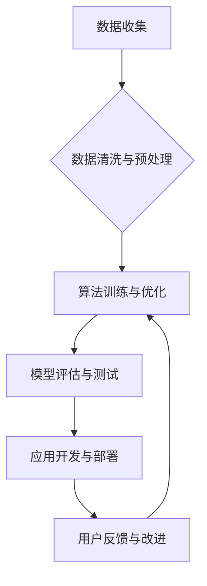

                 

## AI创业的社会影响：Lepton AI的责任担当

> 关键词：人工智能、创业、社会影响、伦理责任、透明度、可解释性、公平性、Lepton AI

## 1. 背景介绍

人工智能（AI）技术近年来发展迅猛，其应用领域不断拓展，从医疗保健、金融服务到交通运输，AI正在深刻地改变着我们的生活。与此同时，AI创业也蓬勃发展，涌现出众多致力于利用AI技术解决实际问题的初创公司。Lepton AI便是其中一家，致力于利用AI技术推动社会进步，其发展也引发了人们对AI创业社会影响的思考。

AI创业的快速发展带来了巨大的机遇，但也带来了新的挑战和风险。一方面，AI技术可以帮助企业提高效率、降低成本、创造新的价值，推动经济增长和社会发展。另一方面，AI技术也可能带来一些负面影响，例如：

* **就业市场冲击:** AI自动化可能会导致部分工作岗位被取代，引发社会失业问题。
* **数据隐私和安全问题:** AI算法依赖大量数据训练，数据泄露和滥用可能侵犯个人隐私和安全。
* **算法偏见和歧视:** AI算法可能存在偏见，导致对特定群体产生歧视，加剧社会不平等。
* **责任和问责问题:** 当AI系统出现错误或造成损害时，责任和问责问题难以界定。

## 2. 核心概念与联系

Lepton AI的核心价值观是“以技术为驱动，以人为本”，其使命是利用AI技术解决社会问题，创造更美好的未来。Lepton AI的业务模式主要围绕以下几个核心概念：

* **数据驱动:** Lepton AI高度重视数据收集、清洗和分析，利用海量数据训练和优化AI算法。
* **算法创新:** Lepton AI不断研发和改进AI算法，提升算法的准确性、效率和鲁棒性。
* **应用落地:** Lepton AI将AI技术应用于各个领域，例如医疗诊断、精准农业、智能交通等，解决实际问题。
* **社会责任:** Lepton AI致力于将AI技术用于公益事业，促进社会公平正义。

Lepton AI的业务流程可以概括为以下步骤：



## 3. 核心算法原理 & 具体操作步骤

### 3.1  算法原理概述

Lepton AI的核心算法是基于深度学习的卷积神经网络（CNN），它能够自动学习图像特征，并进行图像识别、分类和分割等任务。CNN的结构灵感来源于生物神经网络，它由多个卷积层、池化层和全连接层组成。

* **卷积层:** 卷积层使用卷积核对输入图像进行卷积运算，提取图像局部特征。
* **池化层:** 池化层对卷积层的输出进行降维，减少计算量，提高算法鲁棒性。
* **全连接层:** 全连接层将池化层的输出进行分类或回归。

### 3.2  算法步骤详解

Lepton AI的CNN算法训练步骤如下：

1. **数据准备:** 收集并预处理图像数据，包括图像裁剪、归一化等操作。
2. **模型搭建:** 使用深度学习框架（例如TensorFlow或PyTorch）搭建CNN模型结构。
3. **模型训练:** 将预处理后的图像数据输入模型进行训练，调整模型参数，使模型输出与真实标签尽可能接近。
4. **模型评估:** 使用测试数据集评估模型的性能，例如准确率、召回率、F1-score等。
5. **模型调优:** 根据评估结果，调整模型参数或结构，进一步提高模型性能。

### 3.3  算法优缺点

**优点:**

* **高准确率:** CNN算法能够学习图像特征，实现高准确率的图像识别、分类和分割。
* **鲁棒性强:** CNN算法对图像噪声和变形具有较强的鲁棒性。
* **可扩展性强:** CNN算法可以应用于不同规模的图像数据。

**缺点:**

* **计算量大:** CNN算法训练需要大量的计算资源。
* **参数量大:** CNN模型参数量较大，需要大量数据进行训练。
* **可解释性差:** CNN算法的决策过程难以解释，难以理解模型是如何做出预测的。

### 3.4  算法应用领域

Lepton AI的CNN算法应用于多个领域，例如：

* **医疗诊断:** 辅助医生进行疾病诊断，例如癌症检测、眼底疾病识别等。
* **精准农业:** 分析农业图像数据，识别作物病虫害、预测产量等。
* **智能交通:** 识别交通标志、车辆类型、行人行为等，提高交通安全和效率。

## 4. 数学模型和公式 & 详细讲解 & 举例说明

### 4.1  数学模型构建

CNN算法的核心是卷积操作，其数学模型可以表示为：

$$
y(i,j) = \sum_{m=0}^{M-1} \sum_{n=0}^{N-1} x(i+m,j+n) * w(m,n) + b
$$

其中：

* $y(i,j)$ 是卷积输出的像素值。
* $x(i+m,j+n)$ 是输入图像的像素值。
* $w(m,n)$ 是卷积核的权重值。
* $b$ 是偏置项。

### 4.2  公式推导过程

卷积操作本质上是将卷积核滑动在输入图像上，每个位置进行加权求和。卷积核的权重值通过训练过程学习得到，它决定了卷积操作的特征提取能力。

### 4.3  案例分析与讲解

例如，在图像识别任务中，CNN算法可以学习到不同物体特征的卷积核，例如边缘、纹理、形状等。当输入图像包含某个物体时，相应的卷积核会提取该物体的特征，并将其作为后续处理的输入。

## 5. 项目实践：代码实例和详细解释说明

### 5.1  开发环境搭建

Lepton AI的开发环境基于Python语言，使用深度学习框架TensorFlow或PyTorch进行开发。需要安装Python、TensorFlow或PyTorch、NumPy、Pandas等相关库。

### 5.2  源代码详细实现

以下是一个简单的CNN模型代码示例，使用TensorFlow框架实现：

```python
import tensorflow as tf

# 定义模型结构
model = tf.keras.models.Sequential([
    tf.keras.layers.Conv2D(32, (3, 3), activation='relu', input_shape=(28, 28, 1)),
    tf.keras.layers.MaxPooling2D((2, 2)),
    tf.keras.layers.Conv2D(64, (3, 3), activation='relu'),
    tf.keras.layers.MaxPooling2D((2, 2)),
    tf.keras.layers.Flatten(),
    tf.keras.layers.Dense(10, activation='softmax')
])

# 编译模型
model.compile(optimizer='adam',
              loss='sparse_categorical_crossentropy',
              metrics=['accuracy'])

# 训练模型
model.fit(x_train, y_train, epochs=5)

# 评估模型
loss, accuracy = model.evaluate(x_test, y_test)
print('Test loss:', loss)
print('Test accuracy:', accuracy)
```

### 5.3  代码解读与分析

这段代码定义了一个简单的CNN模型，包含两个卷积层、两个池化层、一个全连接层和一个softmax输出层。模型使用Adam优化器、交叉熵损失函数和准确率作为评估指标。

### 5.4  运行结果展示

训练完成后，模型可以用于预测新的图像数据。

## 6. 实际应用场景

Lepton AI的AI技术应用于多个实际场景，例如：

* **医疗诊断:** Lepton AI开发了一款AI辅助诊断系统，可以帮助医生识别肺部结核、皮肤癌等疾病。
* **精准农业:** Lepton AI开发了一款AI农业监测系统，可以帮助农民识别作物病虫害、预测产量等。
* **智能交通:** Lepton AI开发了一款AI交通管理系统，可以帮助优化交通流量、提高交通安全。

### 6.4  未来应用展望

Lepton AI将继续探索AI技术的应用，例如：

* **个性化教育:** 利用AI技术提供个性化的学习方案，提高教育效率。
* **智能客服:** 利用AI技术开发智能客服机器人，提高客户服务效率。
* **自动驾驶:** 利用AI技术开发自动驾驶系统，提高交通安全和效率。

## 7. 工具和资源推荐

### 7.1  学习资源推荐

* **在线课程:** Coursera、edX、Udacity等平台提供丰富的AI课程。
* **书籍:** 《深度学习》、《机器学习实战》等书籍是学习AI的基础教材。
* **博客和论坛:** AI相关的博客和论坛可以获取最新的AI技术资讯和讨论。

### 7.2  开发工具推荐

* **深度学习框架:** TensorFlow、PyTorch、Keras等框架是开发AI模型的常用工具。
* **数据处理工具:** Pandas、NumPy等工具可以帮助处理和分析数据。
* **云计算平台:** AWS、Google Cloud、Azure等云计算平台提供强大的计算资源和AI服务。

### 7.3  相关论文推荐

* **《ImageNet Classification with Deep Convolutional Neural Networks》:** 
介绍了AlexNet模型，标志着深度学习在图像识别领域的突破。
* **《Deep Residual Learning for Image Recognition》:** 
提出了ResNet模型，解决了深度网络训练的梯度消失问题。
* **《Attention Is All You Need》:** 
提出了Transformer模型，在自然语言处理领域取得了突破性进展。

## 8. 总结：未来发展趋势与挑战

### 8.1  研究成果总结

Lepton AI在AI技术研究和应用方面取得了显著成果，其核心算法和应用场景不断发展，为社会进步做出了贡献。

### 8.2  未来发展趋势

未来，Lepton AI将继续致力于以下几个方面：

* **算法创新:** 探索更先进的AI算法，提高算法的准确率、效率和鲁棒性。
* **应用拓展:** 将AI技术应用于更多领域，解决更多社会问题。
* **开源贡献:** 积极参与开源社区，推动AI技术的普及和发展。

### 8.3  面临的挑战

Lepton AI也面临着一些挑战，例如：

* **数据获取和隐私保护:** AI算法依赖大量数据训练，如何获取高质量数据并保护用户隐私是一个重要挑战。
* **算法可解释性和公平性:** AI算法的决策过程难以解释，如何确保算法公平公正是一个需要解决的问题。
* **伦理责任:** AI技术的发展需要考虑其伦理影响，如何确保AI技术被用于善的方面是一个重要的议题。

### 8.4  研究展望

Lepton AI将继续关注这些挑战，并积极探索解决方案，推动AI技术安全、可持续地发展，为人类社会创造更多价值。

## 9. 附录：常见问题与解答

**Q1: Lepton AI的AI技术是否安全可靠？**

A1: Lepton AI高度重视AI技术的安全性与可靠性，其算法和系统经过严格测试和验证，并采取多种措施确保数据安全和隐私保护。

**Q2: Lepton AI的AI技术是否具有公平性？**

A2: Lepton AI致力于开发公平公正的AI算法，并积极探索解决算法偏见和歧视的问题。

**Q3: Lepton AI的AI技术是否易于使用？**

A3: Lepton AI提供易于使用的API和工具，方便开发者和用户使用其AI技术。


作者：禅与计算机程序设计艺术 / Zen and the Art of Computer Programming 
<end_of_turn>

