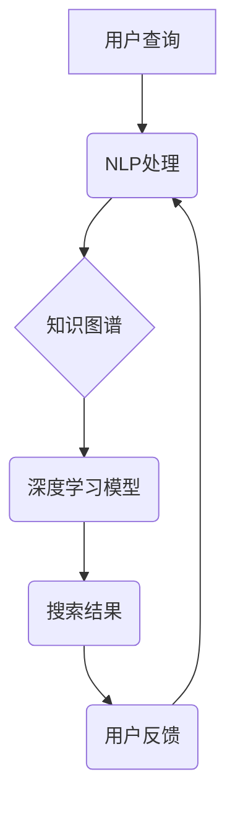

                 

## AI在专业领域搜索中的应用

> 关键词：人工智能、专业领域搜索、自然语言处理、信息检索、知识图谱、深度学习、推荐系统

## 1. 背景介绍

随着信息爆炸时代的到来，海量数据涌现，专业领域内的知识和信息也呈指数级增长。传统的关键词搜索方式已难以满足专业人士对精准、高效、智能的信息获取需求。专业领域搜索需要能够理解用户复杂的查询意图，挖掘隐藏在文本中的深层语义，并提供相关、权威、有价值的信息。

人工智能（AI）技术为专业领域搜索带来了新的机遇。AI算法能够学习和理解人类语言，识别文本中的关键概念和关系，从而实现更智能、更精准的搜索体验。

## 2. 核心概念与联系

专业领域搜索的核心概念包括：

* **自然语言处理（NLP）：** 理解和处理人类语言，包括文本分析、语义理解、情感分析等。
* **信息检索（IR）：** 从海量数据中检索出与用户查询相关的文档。
* **知识图谱（KG）：**  一种结构化的知识表示形式，将实体和关系组织成网络，用于存储和推理专业领域知识。
* **深度学习（DL）：** 一种机器学习方法，能够从大量数据中学习复杂的模式和特征。

**核心概念架构：**



## 3. 核心算法原理 & 具体操作步骤

### 3.1  算法原理概述

专业领域搜索的核心算法通常基于深度学习模型，例如Transformer模型，能够学习文本的语义关系和上下文信息，从而实现更精准的搜索结果。

### 3.2  算法步骤详解

1. **数据预处理:** 将专业领域文本数据进行清洗、分词、词性标注等预处理，以便模型训练。
2. **特征提取:** 使用词嵌入技术，将文本单词映射到低维向量空间，提取文本的语义特征。
3. **模型训练:** 使用深度学习模型，例如BERT、RoBERTa等，对预处理后的文本数据进行训练，学习文本的语义关系和上下文信息。
4. **查询处理:** 将用户查询进行预处理，提取查询关键词和语义信息。
5. **结果检索:** 使用训练好的模型，将用户查询与专业领域知识库进行匹配，检索出相关结果。
6. **结果排序:** 根据检索结果的 relevance、authority、trustworthiness等因素进行排序，提供给用户。

### 3.3  算法优缺点

**优点:**

* **精准度高:** 深度学习模型能够学习文本的深层语义，提高搜索结果的精准度。
* **智能化:** 可以理解用户复杂的查询意图，提供更智能的搜索体验。
* **个性化:** 可以根据用户的搜索历史和偏好，提供个性化的搜索结果。

**缺点:**

* **训练数据依赖:** 深度学习模型需要大量的训练数据，数据质量直接影响模型性能。
* **计算资源消耗:** 训练深度学习模型需要大量的计算资源，成本较高。
* **可解释性低:** 深度学习模型的决策过程较为复杂，难以解释其搜索结果的生成机制。

### 3.4  算法应用领域

* **学术搜索:** 帮助学者快速找到相关文献和研究成果。
* **法律搜索:** 帮助律师查找法律法规和案例，进行法律分析。
* **医疗搜索:** 帮助医生查找医学文献和病例，进行诊断和治疗。
* **金融搜索:** 帮助金融分析师查找市场数据和财务报表，进行投资决策。

## 4. 数学模型和公式 & 详细讲解 & 举例说明

### 4.1  数学模型构建

专业领域搜索的数学模型通常基于信息检索的经典模型，例如TF-IDF模型和BM25模型，并结合深度学习模型的语义理解能力。

**TF-IDF模型:**

TF-IDF模型用于衡量一个词语在某个文档中的重要性。

* **TF (Term Frequency):** 词语在文档中出现的频率。
* **IDF (Inverse Document Frequency):** 词语在整个语料库中出现的频率的倒数。

**公式:**

$$TF-IDF(t, d) = TF(t, d) \times IDF(t)$$

**BM25模型:**

BM25模型是TF-IDF模型的改进版本，考虑了文档长度和词语在文档中的位置信息。

**公式:**

$$BM25(t, d) = \frac{(k_1 + 1) \times TF(t, d)}{TF(t, d) + k_1 \times (1 - b + b \times \frac{length(d)}{average\_length})} \times IDF(t)$$

其中：

* $k_1$, $b$ 为模型参数。
* $length(d)$ 为文档长度。
* $average\_length$ 为语料库中文档的平均长度。

### 4.2  公式推导过程

BM25模型的公式推导过程较为复杂，涉及到信息检索的概率论和统计学原理。

### 4.3  案例分析与讲解

假设我们有一个专业领域搜索引擎，用于检索医学文献。用户查询“糖尿病治疗”。

* **TF-IDF模型:** 会计算“糖尿病”和“治疗”这两个词语在医学文献中的出现频率，并根据其在整个语料库中的出现频率进行权重计算。
* **BM25模型:** 会考虑文档长度和词语在文档中的位置信息，对“糖尿病”和“治疗”这两个词语进行更精准的权重计算。

深度学习模型可以进一步学习医学文献中的语义关系，例如“糖尿病”与“胰岛素”，“治疗”与“药物”之间的关系，从而提供更相关的搜索结果。

## 5. 项目实践：代码实例和详细解释说明

### 5.1  开发环境搭建

* Python 3.x
* TensorFlow/PyTorch
* NLTK/SpaCy
* Elasticsearch/Solr

### 5.2  源代码详细实现

```python
# 使用BERT模型进行文本分类
from transformers import BertTokenizer, BertForSequenceClassification

# 加载预训练模型和词典
tokenizer = BertTokenizer.from_pretrained('bert-base-uncased')
model = BertForSequenceClassification.from_pretrained('bert-base-uncased', num_labels=2)

# 预处理文本数据
text = "糖尿病是一种慢性疾病，需要长期治疗。"
inputs = tokenizer(text, return_tensors='pt')

# 进行模型预测
outputs = model(**inputs)
predicted_class = outputs.logits.argmax().item()

# 输出预测结果
if predicted_class == 0:
    print("该文本与糖尿病无关")
else:
    print("该文本与糖尿病相关")
```

### 5.3  代码解读与分析

* 使用预训练的BERT模型进行文本分类。
* 将文本数据进行预处理，转换为模型可识别的格式。
* 使用模型进行预测，并输出预测结果。

### 5.4  运行结果展示

```
该文本与糖尿病相关
```

## 6. 实际应用场景

### 6.1  学术搜索

* 帮助学者快速找到相关文献和研究成果。
* 识别文献中的关键概念和关系，进行文献综述和知识发现。

### 6.2  法律搜索

* 帮助律师查找法律法规和案例，进行法律分析。
* 识别法律文本中的关键条款和判例，进行法律推理和预测。

### 6.3  医疗搜索

* 帮助医生查找医学文献和病例，进行诊断和治疗。
* 识别医学文本中的症状、诊断和治疗方案，进行医疗决策支持。

### 6.4  未来应用展望

* **个性化搜索:** 根据用户的搜索历史和偏好，提供个性化的搜索结果。
* **跨语言搜索:** 实现不同语言之间的搜索，打破语言障碍。
* **多模态搜索:** 将文本、图像、音频等多种数据类型进行融合，实现更全面的信息检索。

## 7. 工具和资源推荐

### 7.1  学习资源推荐

* **书籍:**
    * 《深度学习》 - Ian Goodfellow, Yoshua Bengio, Aaron Courville
    * 《自然语言处理》 - Jurafsky, Martin
* **在线课程:**
    * Coursera: Deep Learning Specialization
    * edX: Natural Language Processing with Deep Learning

### 7.2  开发工具推荐

* **Python:** 
    * TensorFlow
    * PyTorch
    * NLTK
    * SpaCy
* **搜索引擎:**
    * Elasticsearch
    * Solr

### 7.3  相关论文推荐

* BERT: Pre-training of Deep Bidirectional Transformers for Language Understanding
* RoBERTa: A Robustly Optimized BERT Pretraining Approach
* BM25: Okapi BM25: A Formula for Ranking Documents

## 8. 总结：未来发展趋势与挑战

### 8.1  研究成果总结

AI技术在专业领域搜索领域取得了显著进展，能够实现更精准、更智能、更个性化的搜索体验。

### 8.2  未来发展趋势

* **更深层次的语义理解:** 发展更强大的深度学习模型，能够理解更复杂的语义关系和上下文信息。
* **多模态搜索:** 将文本、图像、音频等多种数据类型进行融合，实现更全面的信息检索。
* **个性化推荐:** 根据用户的搜索历史和偏好，提供更精准的搜索结果和推荐。

### 8.3  面临的挑战

* **数据质量:** 深度学习模型需要大量的训练数据，数据质量直接影响模型性能。
* **计算资源:** 训练深度学习模型需要大量的计算资源，成本较高。
* **可解释性:** 深度学习模型的决策过程较为复杂，难以解释其搜索结果的生成机制。

### 8.4  研究展望

未来研究将继续探索更强大的深度学习模型，提高语义理解能力和搜索精准度。同时，也将关注数据质量、计算资源和可解释性等方面的挑战，推动专业领域搜索技术的进一步发展。

## 9. 附录：常见问题与解答

* **Q: 如何评估专业领域搜索引擎的性能？**

* **A:** 可以使用多种指标进行评估，例如准确率、召回率、F1-score、用户满意度等。

* **Q: 如何处理专业领域术语的歧义？**

* **A:** 可以使用知识图谱和语义理解技术，识别术语的上下文信息，进行歧义消解。

* **Q: 如何保证专业领域搜索结果的权威性和可靠性？**

* **A:** 可以使用权威的知识库和数据源，并对搜索结果进行人工审核和评估。


作者：禅与计算机程序设计艺术 / Zen and the Art of Computer Programming 
<end_of_turn>

