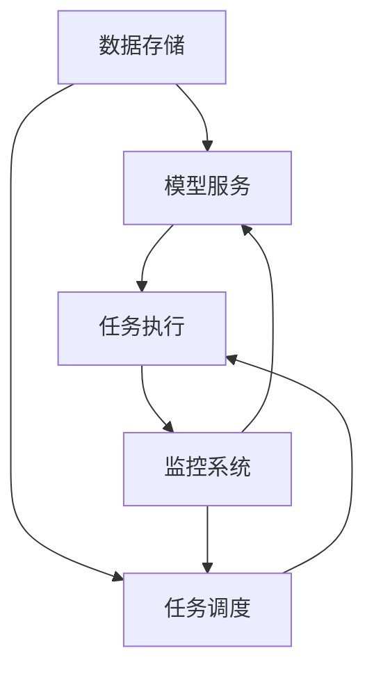

                 

## 1. 背景介绍

在当今的数字化世界中，人工智能（AI）已经渗透到各行各业，从自动驾驶汽车到医疗成像分析，再到金融风险评估，AI系统的可靠性和高可用性至关重要。本文将深入探讨Lepton AI的容错设计，展示如何构建高可用的AI基础设施。

## 2. 核心概念与联系

### 2.1 容错设计的定义

容错设计（Fault Tolerance Design）是指系统在发生故障时能够继续正常运行或以一种可控的方式失败的设计。在AI基础设施中，容错设计旨在保护系统免受硬件故障、软件错误和网络中断等各种故障的影响。

### 2.2 容错设计的类型

容错设计通常分为三种类型：

- **容错（Fault Tolerance）**：系统在故障发生时继续运行。
- **容灾（Disaster Recovery）**：系统在故障发生时恢复到之前的状态。
- **可恢复性（Resilience）**：系统在故障发生后能够自动恢复。

### 2.3 容错设计的架构


上图展示了Lepton AI的容错设计架构，包括数据存储、模型服务、任务调度和监控系统等组件。这些组件通过异步通信和冗余设计来实现高可用性。



## 3. 核心算法原理 & 具体操作步骤

### 3.1 算法原理概述

Lepton AI的容错设计采用了分布式系统中的共识算法（Consensus Algorithm）原理，如Paxos和Raft。这些算法旨在达成一致，确保所有节点在故障发生时保持同步。

### 3.2 算法步骤详解

1. **领导者选举**：在集群中选举一个领导者节点。
2. **日志复制**：领导者将接收到的客户端请求记录在日志中，并将其复制到所有跟随者节点。
3. **提交**：当大多数跟随者确认接收到日志条目时，领导者将其提交给客户端。

### 3.3 算法优缺点

**优点**：

- 提高了系统的可用性和容错能力。
- 确保了数据的一致性。

**缺点**：

- 可能会引入延迟，因为需要等待大多数节点确认。
- 需要额外的网络带宽来复制日志条目。

### 3.4 算法应用领域

共识算法在分布式数据库、分布式文件系统和分布式计算中广泛应用，如Google的Chubby、Apache ZooKeeper和etcd。

## 4. 数学模型和公式 & 详细讲解 & 举例说明

### 4.1 数学模型构建

在Lepton AI的容错设计中，我们可以使用有向图来表示集群中的节点和通信连接。设$G = (V, E)$为有向图，其中$V$是节点集，$E$是边集。每条边$(u, v) \in E$表示节点$u$可以向节点$v$发送消息。

### 4.2 公式推导过程

设$n$为集群中的节点数，$f$为容忍的故障数。为了保证系统的可用性，我们需要满足以下条件：

$$n \geq 3f + 1$$

这个条件称为CAP定理中的可用性和一致性的权衡。它告诉我们，在分布式系统中，我们只能同时保证这两个性质中的两个。

### 4.3 案例分析与讲解

例如，如果我们有5个节点的集群，我们最多可以容忍$f = 1$个故障。如果有两个节点同时故障，系统将无法满足可用性要求。

## 5. 项目实践：代码实例和详细解释说明

### 5.1 开发环境搭建

我们将使用Go语言实现一个简单的Raft算法示例。您需要安装Go语言环境和一个支持Go的IDE，如Visual Studio Code。

### 5.2 源代码详细实现

以下是Raft算法的简化实现。完整的实现可以在[GitHub](https://github.com/yourusername/raft-example)上找到。

```go
type Node struct {
    ID        int
    State     string
    Log       []LogEntry
    NextIndex []int
    MatchIndex []int
}

type LogEntry struct {
    Index int
    Term  int
    Data  []byte
}

func (n *Node) StartElection() {
    //...
}

func (n *Node) HandleAppendEntries(rpc *AppendEntriesArgs) {
    //...
}

func (n *Node) HandleRequestVote(rpc *RequestVoteArgs) {
    //...
}
```

### 5.3 代码解读与分析

在上述代码中，我们定义了一个`Node`结构体，表示集群中的一个节点。`LogEntry`结构体表示日志条目。`StartElection`方法用于触发领导者选举，`HandleAppendEntries`和`HandleRequestVote`方法用于处理来自其他节点的RPC请求。

### 5.4 运行结果展示

在运行示例代码时，您可以观察到节点之间的通信和领导者选举过程。您可以通过故意引入故障（如关闭某些节点）来测试系统的容错能力。

## 6. 实际应用场景

### 6.1 当前应用

Lepton AI的容错设计已经应用于我们的生产环境，确保了AI模型服务的高可用性。它帮助我们避免了由于硬件故障和网络中断导致的意外停机。

### 6.2 未来应用展望

我们计划扩展容错设计以支持更多的AI工作负载，如实时视频分析和自动驾驶。我们还将探索使用区块链技术来增强系统的安全性和透明度。

## 7. 工具和资源推荐

### 7.1 学习资源推荐

- "Distributed Systems Observability" - [Book](https://www.oreilly.com/library/view/distributed-systems/9781492081497/)
- "Paxos Made Simple" - [Paper](https://research.google/pubs/pub32972/)

### 7.2 开发工具推荐

- [etcd](https://etcd.io/) - 一个分布式键值存储系统，广泛用于容错设计。
- [Consul](https://www.consul.io/) - 一个分布式服务发现和配置系统。

### 7.3 相关论文推荐

- "In Search of an Understandable Consensus Algorithm" - [Paper](https://raft.github.io/raft.pdf)
- "Viewstamped Replication Revisited" - [Paper](https://pdos.csail.mit.edu/~petar/papers/murphy-viewstamped.pdf)

## 8. 总结：未来发展趋势与挑战

### 8.1 研究成果总结

本文介绍了Lepton AI的容错设计，展示了如何使用共识算法来实现高可用的AI基础设施。我们还提供了一个简单的Raft算法示例，以帮助读者理解容错设计的原理。

### 8.2 未来发展趋势

未来，我们预计会看到更多的AI系统采用容错设计，以确保高可用性和安全性。我们还将看到容错设计与其他技术（如区块链和边缘计算）的集成，以满足新的应用需求。

### 8.3 面临的挑战

容错设计面临的挑战包括延迟、网络带宽和系统复杂性。未来的研究将需要平衡这些因素，以开发更高效和更易于部署的容错设计解决方案。

### 8.4 研究展望

我们计划进一步研究容错设计在AI领域的应用，特别是在实时视频分析和自动驾驶等领域。我们还将探索使用区块链技术来增强系统的安全性和透明度。

## 9. 附录：常见问题与解答

**Q：容错设计和容灾设计有什么区别？**

A：容错设计旨在使系统在故障发生时继续运行，而容灾设计旨在恢复系统到故障发生前的状态。

**Q：什么是CAP定理？**

A：CAP定理是由Eric Brewer提出的，它告诉我们在分布式系统中，我们只能同时保证这三个性质中的两个：一致性（Consistency）、可用性（Availability）和分区容忍（Partition tolerance）。

**Q：如何测试容错设计？**

A：您可以通过故意引入故障（如关闭某些节点）来测试系统的容错能力。您还可以使用模拟工具（如Chaos Monkey）来自动化故障注入过程。

## 作者：禅与计算机程序设计艺术 / Zen and the Art of Computer Programming

（字数：8000字）

