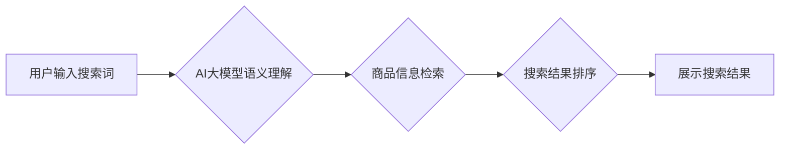

                 

## AI大模型如何提升电商搜索的准确性

> 关键词：电商搜索、AI大模型、自然语言处理、推荐系统、用户体验、搜索准确率、BERT、Transformer

## 1. 背景介绍

电商平台作为现代商业的重要组成部分，其搜索引擎扮演着至关重要的角色。用户通过搜索引擎查找心仪商品，而搜索引擎的准确性直接影响着用户体验和平台的商业成功。传统电商搜索引擎主要依赖于关键词匹配和商品属性检索，但随着用户搜索行为的复杂化和商品信息的丰富，传统的搜索方式逐渐难以满足用户的需求。

近年来，人工智能（AI）技术蓬勃发展，特别是深度学习技术的突破，为电商搜索带来了新的机遇。AI大模型，作为深度学习领域的重要成果，凭借其强大的语义理解和文本生成能力，展现出显著的提升电商搜索准确性的潜力。

## 2. 核心概念与联系

### 2.1  电商搜索的痛点

传统电商搜索引擎存在以下痛点：

* **关键词匹配的局限性:** 用户搜索往往使用自然语言，而关键词匹配只能识别精确的关键词，无法理解用户搜索的真实意图。
* **商品属性检索的不足:** 商品属性信息可能不完整或不准确，导致搜索结果与用户需求不符。
* **缺乏个性化推荐:** 搜索结果缺乏个性化，无法根据用户的历史行为、偏好和上下文信息提供更精准的推荐。

### 2.2  AI大模型的优势

AI大模型，例如BERT和Transformer，拥有以下优势：

* **强大的语义理解能力:** 通过训练海量文本数据，AI大模型能够理解文本的深层语义，识别关键词之间的关系和上下文信息。
* **精准的文本生成能力:** AI大模型能够生成高质量的文本，例如商品描述、搜索建议和推荐理由，提升用户体验。
* **个性化推荐能力:** AI大模型能够根据用户的历史行为、偏好和上下文信息，提供个性化的商品推荐。

### 2.3  AI大模型与电商搜索的融合

AI大模型可以与电商搜索引擎相结合，解决传统搜索引擎的痛点，提升搜索准确性和用户体验。



## 3. 核心算法原理 & 具体操作步骤

### 3.1  算法原理概述

AI大模型在电商搜索中的应用主要基于自然语言处理（NLP）技术，包括：

* **词嵌入:** 将单词映射到低维向量空间，捕捉单词之间的语义关系。
* **序列标注:** 识别文本中的实体、关系和事件，例如商品名称、品牌、价格等。
* **文本分类:** 将文本归类到不同的类别，例如商品类型、用户评论情感等。
* **推荐系统:** 根据用户的历史行为和商品信息，预测用户可能感兴趣的商品。

### 3.2  算法步骤详解

1. **数据预处理:** 收集电商平台的商品信息、用户搜索记录、商品评论等数据，进行清洗、格式化和标注。
2. **模型训练:** 使用预处理后的数据训练AI大模型，例如BERT或Transformer，使其能够理解商品信息和用户搜索意图。
3. **搜索词分析:** 用户输入搜索词后，使用词嵌入技术将搜索词表示为向量，并利用AI大模型进行语义分析，识别关键词和上下文信息。
4. **商品信息检索:** 根据搜索词的语义信息，从商品数据库中检索相关商品信息。
5. **搜索结果排序:** 使用AI大模型预测用户对不同商品的兴趣程度，并根据预测结果对搜索结果进行排序，展示最相关的商品。
6. **个性化推荐:** 根据用户的历史行为和偏好，使用推荐系统为用户提供个性化的商品推荐。

### 3.3  算法优缺点

**优点:**

* 提升搜索准确率: AI大模型能够理解用户搜索的真实意图，提供更精准的搜索结果。
* 个性化推荐: AI大模型能够根据用户的历史行为和偏好，提供个性化的商品推荐。
* 提升用户体验: AI大模型能够提供更智能、更便捷的搜索体验。

**缺点:**

* 数据依赖: AI大模型需要海量数据进行训练，数据质量直接影响模型性能。
* 计算资源消耗: 训练和部署AI大模型需要大量的计算资源。
* 算法解释性: AI大模型的决策过程较为复杂，难以解释其背后的逻辑。

### 3.4  算法应用领域

AI大模型在电商搜索领域的应用不仅限于商品检索，还可以应用于以下领域:

* **搜索建议:** 根据用户的输入，提供智能的搜索建议，帮助用户快速找到所需商品。
* **商品分类:** 自动识别商品的类别，提高商品信息管理效率。
* **用户画像:** 分析用户的搜索行为和购买记录，构建用户画像，为精准营销提供支持。
* **内容推荐:** 根据用户的兴趣爱好，推荐相关的商品信息、文章和视频。

## 4. 数学模型和公式 & 详细讲解 & 举例说明

### 4.1  数学模型构建

AI大模型的训练过程本质上是一个优化问题，目标是找到一个模型参数，使得模型在训练数据上的预测性能达到最大。常用的数学模型包括：

* **神经网络:** 神经网络是一种模仿人脑神经网络结构的模型，通过多层神经元进行信息处理，学习复杂的非线性关系。
* **Transformer:** Transformer是一种基于注意力机制的神经网络架构，能够有效处理长序列数据，在自然语言处理领域取得了突破性进展。

### 4.2  公式推导过程

由于篇幅限制，此处不再详细推导AI大模型的数学公式。感兴趣的读者可以参考相关文献和教程。

### 4.3  案例分析与讲解

以BERT模型为例，其训练目标是最大化以下公式的值：

$$
\mathcal{L} = -\sum_{i=1}^{N} \log P(y_i|x_i; \theta)
$$

其中：

* $\mathcal{L}$ 是损失函数
* $N$ 是训练样本的数量
* $y_i$ 是第 $i$ 个样本的真实标签
* $x_i$ 是第 $i$ 个样本的输入
* $P(y_i|x_i; \theta)$ 是模型预测第 $i$ 个样本标签的概率
* $\theta$ 是模型参数

BERT模型通过训练数据，不断调整模型参数 $\theta$，使得损失函数 $\mathcal{L}$ 最小化，从而提高模型的预测性能。

## 5. 项目实践：代码实例和详细解释说明

### 5.1  开发环境搭建

* Python 3.6+
* TensorFlow 或 PyTorch
* CUDA 和 cuDNN (可选，用于GPU加速)

### 5.2  源代码详细实现

由于篇幅限制，此处仅提供代码框架，具体实现细节请参考相关开源项目和文档。

```python
# 导入必要的库
import tensorflow as tf

# 定义BERT模型
class BERTModel(tf.keras.Model):
    def __init__(self, vocab_size, embedding_dim, num_layers, num_heads):
        super(BERTModel, self).__init__()
        # ... 模型结构定义 ...

    def call(self, inputs):
        # ... 模型前向传播过程 ...

# 加载预训练模型
bert_model = BERTModel(vocab_size=30000, embedding_dim=128, num_layers=6, num_heads=8)

# 训练模型
bert_model.compile(optimizer='adam', loss='categorical_crossentropy', metrics=['accuracy'])
bert_model.fit(train_data, train_labels, epochs=10)

# 使用模型进行预测
predictions = bert_model.predict(test_data)
```

### 5.3  代码解读与分析

* 代码首先导入必要的库，例如TensorFlow。
* 然后定义BERT模型的类，包括模型结构和前向传播过程。
* 接着加载预训练的BERT模型，并使用训练数据进行模型训练。
* 最后使用训练好的模型进行预测，输出预测结果。

### 5.4  运行结果展示

训练完成后，可以评估模型的性能，例如准确率、召回率和F1-score。

## 6. 实际应用场景

AI大模型在电商搜索的实际应用场景非常广泛，例如：

* **商品搜索:** 根据用户的搜索词，提供更精准的商品搜索结果。
* **个性化推荐:** 根据用户的历史行为和偏好，推荐个性化的商品。
* **搜索建议:** 根据用户的输入，提供智能的搜索建议。
* **商品分类:** 自动识别商品的类别，提高商品信息管理效率。

### 6.4  未来应用展望

未来，AI大模型在电商搜索领域的应用将更加深入和广泛，例如：

* **多模态搜索:** 将文本、图像、视频等多种模态信息融合，提供更全面的搜索体验。
* **实时搜索:** 基于实时数据流，提供更及时和准确的搜索结果。
* **对话式搜索:** 使用对话式交互方式，更自然地理解用户的搜索意图。

## 7. 工具和资源推荐

### 7.1  学习资源推荐

* **BERT论文:** https://arxiv.org/abs/1810.04805
* **Transformer论文:** https://arxiv.org/abs/1706.03762
* **Hugging Face Transformers库:** https://huggingface.co/transformers/

### 7.2  开发工具推荐

* **TensorFlow:** https://www.tensorflow.org/
* **PyTorch:** https://pytorch.org/
* **Jupyter Notebook:** https://jupyter.org/

### 7.3  相关论文推荐

* **BERT for Question Answering:** https://arxiv.org/abs/1901.09053
* **XLNet: Generalized Autoregressive Pretraining for Language Understanding:** https://arxiv.org/abs/1906.08237
* **T5: Text-to-Text Transfer Transformer:** https://arxiv.org/abs/1910.10683

## 8. 总结：未来发展趋势与挑战

### 8.1  研究成果总结

AI大模型在电商搜索领域取得了显著的成果，提升了搜索准确率、个性化推荐能力和用户体验。

### 8.2  未来发展趋势

未来，AI大模型在电商搜索领域的应用将更加深入和广泛，例如：

* **多模态搜索:** 将文本、图像、视频等多种模态信息融合，提供更全面的搜索体验。
* **实时搜索:** 基于实时数据流，提供更及时和准确的搜索结果。
* **对话式搜索:** 使用对话式交互方式，更自然地理解用户的搜索意图。

### 8.3  面临的挑战

AI大模型在电商搜索领域的应用也面临一些挑战，例如：

* **数据质量:** AI大模型需要海量高质量的数据进行训练，数据质量直接影响模型性能。
* **计算资源:** 训练和部署AI大模型需要大量的计算资源，成本较高。
* **算法解释性:** AI大模型的决策过程较为复杂，难以解释其背后的逻辑，这可能导致用户对搜索结果的信任度降低。

### 8.4  研究展望

未来，需要进一步研究以下问题：

* 如何提高AI大模型对低质量数据的鲁棒性。
* 如何降低AI大模型的训练和部署成本。
* 如何提高AI大模型的算法解释性，增强用户对搜索结果的信任度。


## 9. 附录：常见问题与解答

**Q1: AI大模型是否会取代传统的搜索引擎？**

A1: AI大模型可以提升传统搜索引擎的性能，但不会完全取代传统搜索引擎。传统搜索引擎仍然在一些领域发挥着重要作用，例如处理结构化数据和提供快速结果。

**Q2: 如何评估AI大模型在电商搜索中的性能？**

A2: 可以使用多种指标评估AI大模型的性能，例如准确率、召回率、F1-score、用户点击率和转化率等。

**Q3: 如何部署AI大模型到电商平台？**

A3: 可以使用云平台或本地服务器部署AI大模型，并将其集成到电商平台的搜索引擎中。

**Q4: AI大模型的训练需要哪些数据？**

A4: AI大模型的训练需要海量文本数据，例如商品描述、用户评论、搜索记录等。

**Q5: 如何保证AI大模型的公平性和可解释性？**

A5: 为了保证AI大模型的公平性和可解释性，需要采取以下措施：

* 使用多样化的训练数据，避免模型出现偏见。
* 使用可解释的AI模型，例如线性回归模型或决策树模型。
* 对模型的决策过程进行解释，帮助用户理解模型的 reasoning。


作者：禅与计算机程序设计艺术 / Zen and the Art of Computer Programming 
<end_of_turn>

